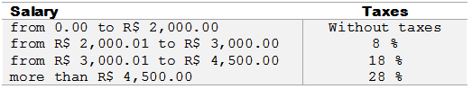

# C++语言基础

:::note

C++ 教学讲义，从零入坑C++写算法,  阅读这个文档之前你需要有C语言的基础，这里会介绍算法题里面会用到的C++小技巧

:::

## 基础

### C++与C的兼容性问题

C++是完全兼容C的，你在cpp里面写C的代码完全没有任何问题；

### 头文件

与C语言一样，C++也有常用的头文件，这里我们经常使用C++的万能头文件 `#include <bits/stdc++.h>` 下面我们对比一下C++和C基础代码；

```c++
// C++基础模板
#include <bits/stdc++.h>
using namespace std;
int main()
{
		return 0;
}

// C基础代码
#include <stdio.h>

int main()
{
  	return 0;
}
```

### 输入与输出

C++的输入使用 `cin` 可以同时输入多个数，输出使用 `cout` .  与 `scanf` 不同的是，`cin` 不需要制定类型就可以直接输入；

```c++
#include <bits/stdc++.h>
using namespace std;

int main()
{
  	int a;
  	double b;
  	cin >> a >> b; // C++ 的读入
  	scanf("%d%lf", &a, &b);
  	cout << a << b; // C++ 的输出
  	printf("%d%lf", a, b); // C 的输出
}
```

如果输出的时候需要换行需要加上 `<< endl` C++在输出的时候就会在末尾添加一个换行；

#### 练习1

使用C++的输入和输出，输入两个数，在第一行中输出他们相加的结果，在第二行输出他们相乘的结果

输入样例

```
1 2
```

输出样例

```
3
2
```

代码：

```c++
#include <bits/stdc++.h>
using namespace std;

int main()
{
  int a, b;
  cin >> a >> b;
  cout << a + b << endl << a * b;
  return 0;
}
```

#### 练习2

一辆汽车每行驶 12 公里需要消耗 1 升汽油，现在告诉你该汽车的行驶速度 S（km/h）和行驶时间 T(h)，请你计算该车在行驶过程中一共消耗了多少升汽油

**输入格式**

输入共两行，第一行包含一个整数 T，表示行驶时间（h）第二行包含一个整数 S，表示行驶速度（km/h）

**输出格式**

输出行驶期间的总油耗 (直接使用cout输出即可)

**输入样例**

```
10
85
```

**输出样例**

```
70.8333
```

**代码**

```
#include <bits/stdc++.h>
using namespace std;

int main()
{
	double a, b;
	cin >> a >> b;
	cout << a * b / 12;
}
```

### printf与判断条件

在算法题里面经常会让你保留几位小数，或者保留几位数，这个时候我们就不能用 `cout` 了，用 `printf` 会更方便，下面我们来看几个例子:

```c++
double a = 1.2;
double b = 4;
int c = 3;
printf("%.2f %.3f\n", a, b); // a 保留两位小数输出， b保留3位小数输出
printf("%02d", c); // 保留两位输出c，不足的位数用0补位
```

输出

```
1.20 4.000
03
```

#### 练习1

**题目描述**

读取一个保留两位小数的浮点数值，表示一个公民的工资。在公民缴纳个人所得税时，不同收入部分需要缴税的税率也是不同的。请根据下表确定该公民需要缴纳的个人所得税是多少。



**输入格式**

共一行，包含一个浮点数。

**输出格式**

如果公民需要缴税，则输出所需缴纳的税额。输出格式为 R$ X，其中 X 为个税的金额，保留两位小数。

如果公民不需要缴税，则输出 Isento。

输入样例1:

```
3002.00
```


输出样例1:

```
R$ 80.36
```

代码

```python
#include <bits/stdc++.h>

using namespace std;

int main()
{
	double a;
	cin >> a;
	if(a <= 2000) cout << "Isento";
	else if(a > 2000 and a <= 3000) printf("R$ %.2f", a * 0.08);
	else if(a > 3000 and a <= 4500) printf("%.2f", a * 0.18);
	else printf("R$ %.2f", a * 0.28);
}
```

### 数组

C++普通的数据和C语言的数组是完全一样的，下面我们通过一小段代码来回顾一下；

```c++
#include <bits/stdc++.h>

int main()
{
  int a[20]; // 创建一个长度为20的数组
  a[0] = 1; // 数组赋值
  a[1] = 2; // 数组赋值
  memset(a, 0, sizeof(a)); // 将 a 中的元素初始化为0，固定语法记住就好
  // 循环输出前10个
  for(int i = 0;i < 10;i ++)
    cout << a[i];
  int b[20][20]; // 创建一个二维数组
  b[0][1] = 1; // 二维数组赋值
  memset(b, 0, sizeof(b)); // 二维数组赋值
  
}
```

:::note

算法题中常用的数组创建方式

:::

在写算法题的时候我们为了方便经常根据题目给的数据范围来开一个比较大的数组，比如题目告诉我们最多只有100个数，那我们就开一个 `int a[110]`  就可以了。为什么要写110嘞，这是为了避免边界问题我们应该习惯性多开10个

```c++
#include <bits/stdc++.h>

const int N = 110;
int a[N]; // 开在main函数外面，这些写更不容易爆内存

int main()
{...}
```

**练习题**

[练习1： 小鱼的数字游戏](https://www.luogu.com.cn/problem/P1427)

```c++
#include <bits/stdc++.h>

using namespace std;

const int N = 101;
int a[N], idx; // 初始化

int main()
{
    // freopen("1.txt","r",stdin);
    while(1)
    {
        int n;
        cin >> n;
        if(n == 0) break;
        a[idx++] = n;
    }
    for(int i = idx - 1;i >= 0;i --) cout << a[i] << ' ';
    return 0;
}
```

[练习2：小鱼比可爱](https://www.luogu.com.cn/problem/P1428)

```
#include <bits/stdc++.h>
using namespace std;

const int N = 101;
int a[101], b[101];

int main()
{
    // freopen("1.txt","r",stdin);
    int n;
    cin >> n;
    for(int i = 0;i < n;i ++) cin >> a[i];
    for(int i = 0;i < n;i ++)
    {
        int cnt = 0;
        for(int j = 0;j < i;j ++)
            if(a[j] < a[i]) cnt++;
        cout << cnt << ' ';
    }
}
```

[练习3：【深基5.例3】冰雹猜想](https://www.luogu.com.cn/problem/P5727)

```c++
#include <bits/stdc++.h>
using namespace std;

const int N = 11000;
long long a[N];
int idx;

int main()
{
  long long n;
  cin >> n;
  while(n != 1)
  {
    a[idx++] = n;
    if(n % 2 == 0) n /= 2;
    else n = n * 3 + 1;
  }
  cout << 1 << ' ';
  for(int i = idx - 1;i >= 0;i --) cout << a[i] << ' ';
  return 0;
}
```

:::info

思考：为什么N取11000，取更大行不行？

答：（下次更新）

:::

[练习4：【深基5.例5】旗鼓相当的对手](https://www.luogu.com.cn/problem/P5728)

`用数组来计数`

```c++
#include <bits/stdc++.h>
using namespace std;

const int N = 460;
int num[N];

int main()
{
	int n;
	cin >> n;
	while(n --)
	{
		int a, b, c;
		cin >> a >> b >> c;
		num[a+b+c] ++;
	}
	int cnt = 0;
	for(int i = 0;i <= 460;i ++)
		if(num[i] > 1) cnt += num[i];
	cout << num[i];
}
```

### 循环

很多算法题就是基于循环来进行的，让我们先复习一下循环的基础用法

``` 
# 1. 正向循环
for(int i = 0;i < n;i ++) ...
# 2. 逆向循环
for(int i = n - 1;i >= 0;i --) ...
# 3. while 循环
while(n --) ...
# 4. 双重for循环
for(int i = 0;i < n;i ++)
	for(int j = 0;j < n;j ++)
		.....
```

下面我们来写几道练习题：

[练习1：【深基4.例2】找最小值](https://www.luogu.com.cn/problem/P5718)

```c++
#include <bits/stdc++.h>
using namespace std;

int main()
{
	int n;
	cin >> n;
	int mina = 0x3f3f3f3f; // 无穷大
	while(n --)
  {
    int x;
    cin >> x;
    mina = min(x, mina);
  }
  cout << mina;
}
```

[练习2：【深基4.例3】分类平均](https://www.luogu.com.cn/problem/P5719)

```c++
#include <bits/stdc++.h>
using namespace std;

int main()
{
    int n, k;
    int cnt1 = 0, cnt2 = 0;
    double sum1 = 0, sum2 = 0;
    cin >> n >> k;
    for (int i = 1; i <= n; i++)
    {
        if (i % k == 0)
        {
            sum1 += i;
            cnt1++;
        }
        else
        {
            sum2 += i;
            cnt2++;
        }
    }
    printf("%.1f %.1f", sum1 / cnt1, sum2 / cnt2);
}
```

[ 练习3： AHOI2018初中组\]报名签到](https://www.luogu.com.cn/problem/P4445)

温馨提示：仔细读题

```c++
#include <bits/stdc++.h>
using namespace std;

const int N = 1e5 + 10;
int a[N];

int main()
{
    freopen("1.txt", "r", stdin);
    int n;
    cin >> n;
    for(int i = 0;i < n ;i ++) cin >> a[i];
    long long cnt = 0;
    for(int i = 0;i < n - 1;i ++)
    {
        // 选距离较大的
        if(a[i] > a[i + 1]) cnt += a[i];
        else cnt += a[i + 1];
    }
    cout << cnt;

}
```

[练习5：【深基4.习9】打分](https://www.luogu.com.cn/problem/P5726)

```c++

#include <bits/stdc++.h>
#include <cmath>
using namespace std;

int main()
{
    //freopen("1.txt","r",stdin);
    int n;
    cin >> n;
    double sum = 0;
    int mina = 11, maxa = 0;
    for(int i = 0;i < n;i ++)
    {
      int x;
      cin >> x;
      mina = min(x, mina);
      maxa = max(x, maxa);
      sum += x;
    }
    // cout << (sum - mina - maxa) / (n - 2);
    printf("%.2f", (sum - mina - maxa) / (n - 2));
    return 0;
}
```

[练习6：人口增长问题](https://www.luogu.com.cn/problem/B2063)

```c++
#include <bits/stdc++.h>
using namespace std;

int main()
{
		double a;
    int b;
    cin >> a >> b;
    while(b --) a *= 1.001;
    printf("%.4f", a);
}
```

### 字符串 String

在C语言里面我们是没有String这个类型的，C++里面提供了String这个类型，我们可以用它进行便捷的字符串操作，下面我们来看看字符串的一些基本操作

```c++
string a = "Hello World" // 声明一个字符串
cout << a; // 输出字符串
printf("%s", a.c_str()); // 用printf输出字符串
cin >> a; // 读入字符串
cout << a.back(); // 输出字符串的最后一个字符
cout << a[0]; // 输出字符串的第一个字符
cout << a.size(); // 输出字符串的长度
string b = "aaa";
a += b; // 两个字符串拼接
a.push_back('a'); // 在a的尾部添加一个字符
cout << a.substr(1,3); // 从第1开始之后长度为3个字符串 （多自己实验几下看看）
```

[练习1：【深基6.例1】自动修正](https://www.luogu.com.cn/problem/P5733)

```c++
#include <bits/stdc++.h>
using namespace std;

int main()
{
		string s;
		cin >> s;
  	for(int i = 0;i < s.size();i ++)
    {
      	if(s[i] >= 'a' and s[i] <= 'z')
          	printf("%c", s[i] + 'A' - 'a');
      	else
          	cout << s[i];
    }
}
```

[练习2：小书童——凯撒密码](https://www.luogu.com.cn/problem/P1914)

```c++
#include <bits/stdc++.h>
using namespace std;	

int main()
{
  	int n;
  	string s;
  	cin >> n >> s;
  	for(int i = 0;i < s.size();i ++)
      	printf("%c", 'a' + (s[i] + n - 'a') % 26);
}
```

[练习3：口算练习题](https://www.luogu.com.cn/problem/P1957)

前置知识：

```
string a = "111";
int b = 111;
// 字符串转int string to int
stoi(a);
// int转字符串
to_string(a);
```

代码：

```c++
#include <bits/stdc++.h>
using namespace std;


int cal(string op, string num1, string num2)
{
    int res;
    cout << num1;
    if(op == "a")
    {
        cout << "+";
        res = stoi(num1) + stoi(num2);
    }else if(op == "b")
    {
        cout << "-";
        res = stoi(num1) - stoi(num2);
    }else if(op == "c")
    {
        cout << "*";
        res = stoi(num1) * stoi(num2);
    }
    cout << num2 << "=" << res << endl;
    cout << num1.size() + num2.size() + to_string(res).size() + 2 << endl;
}

int main()
{
    freopen("1.txt","r",stdin);
    string op, num1, num2, op2;
    int n;
    cin >> n;
    while(n --)
    {
        cin >> op >> num1;
        int flag = 1;
        if(op == "a" or op == "b" or op == "c")
        {
            op2 = op; // 记录一下当前的算术
            cin >> num2;
            cal(op, num1, num2);
        }else{
            num2 = num1;
            num1 = op;
            cal(op2, num1, num2);
        }
    }    
}
```


[练习4：【深基2.例6】字母转换](https://www.luogu.com.cn/problem/P5704)

代码：

```c++
#include <bits/stdc++.h>
using namespace std;

int main()
{
  	char a;
  	cin >> a;
  	printf("%c", a + 'A' - 'a');
}
```

### Vector 数组

Vector是C++ 提供的好的一个变长数组，我们能很方便的使用Vector实现一个变长数组，下面我们看一些例子进行学习：

```c++
// 创建一个内部元素为int类型的vector
// <>中写的类型表示vector里面每个元素的类型，除了int还可以写char、string、double等等
vector<int> a;

vector<string> b;
vector<char> c;

// 向vector里面添加一个元素
a.push_back(1);
b.push_back("aaaa");
c.push_back('a');

// 获取vector里面的元素
cout << a[0]; // 获取第一个元素（和普通数组一样）
cout << a.back(); // 获取a的最后一个元素
cout << a.size(); // 获取a的大小

// 删除元素
a.pop_back(); // 删除最后一个元素（发现没有vector可以当栈来用）
a.erase(a.begin()+0); // 删除在0号位置上的元素, a.begin()是一个指针，指向a的第一个元素

// 一些其他的高级操作
reverse(a.begin(), a.end()); // 翻转vector
sort(a.begin(), a.end()); // 对vector排序，从小到大

// 遍历vector (和遍历数组是一样的)
for(int i = 0;i < a.size();i ++)
		cout << a[i];
```

:::tip

很多题目都是既可以用数组写也可以用vector写的，为了练习vector的用法我们同意用vector写

:::

[练习1：【深基15.例1】询问学号](https://www.luogu.com.cn/problem/P3156)

```c++
#include <bits/stdc++.h>
using namespace std;

int main()
{
  	int n, m;
  	cin >> n >> m;
  	vector<int> v;
  	for(int i = 0;i < n;i ++)
    {
      	int x;
      	cin >> x;
      	v.push_back(x);
    }
  	while(m --)
    {
      	int x;
      	cin >> x;
      	cout << v[x-1] << endl;
    }
  	return 0;
}
```

[练习2：约瑟夫问题](https://www.luogu.com.cn/problem/P1996)

:::tip

用erase删除元素，循环的终止条件是vector为空

使用取余来完成索引的循环

有点难，仔细思考思考，多用cout去查看中间的变化情况

:::

```c++
#include <bits/stdc++.h>
using namespace std;

int main()
{
  	int n, m;
  	vector<int> v;
  	cin >> n >> m;
	for(int i = 1;i <= n;i ++)
      	v.push_back(i);
  	int i = 0, t = 0;
  	while(v.size())
    {
      	// 用取余计算i在v中的索引；
      	t %= v.size();
      	if(i % m == m - 1)
      	{
      	    cout << v[t] << ' ';
      	    v.erase(v.begin() + t);
      	}else{
      	    t++;
      	}
        i++;
    }
}
```

[ 练习3：NOIP2006 普及组 明明的随机数](https://www.luogu.com.cn/problem/P1059)

```c++
#include <bits/stdc++.h>
using namespace std;

int main()
{
    freopen("1.txt","r",stdin);
    int n;
    cin >> n;
    vector<int> v;
    for(int i = 0;i < n;i ++)
    {
        int x;
        cin >> x;
        v.push_back(x);
    }
    sort(v.begin(), v.end());
    vector<int> res;
    for(int i = 0;i < n;i ++)
    {
        if(!i || v[i] != v[i-1])
            res.push_back(v[i]);
    }
    cout << res.size() << endl;
    for(int i = 0;i < res.size();i ++)
        cout << res[i] << ' ';
}

```

[练习4  ：COCI2006-2007#1 Modulo](https://www.luogu.com.cn/problem/P4325)

```c++
#include <bits/stdc++.h>
using namespace std;

int main()
{
    // freopen("1.txt","r",stdin);
    vector<int> a;
    for(int i = 0;i < 10;i ++)
    {
        int x;
        cin >> x;
        a.push_back(x%42);
    }
    sort(a.begin(), a.end());
    int sum = 0;
    for(int i = 0;i < 10;i ++)
    {
        if(!i || a[i] != a[i-1])
            sum ++;
    }
    cout << sum;
}
```

## STL

C++的STL的一个非常强的库，库里面有多个数据结构的思想，比如栈，队列，哈希表等，下面让我们一块学习一下STL吧

### 栈

STL里面有内置栈的思想，使用方式和vector非常像：

```c++
stack<int> stk; // 初始化一个栈
stk.push(1); // 添加一个栈元素
stk.top(); // 获取栈顶元素
stk.pop(); // 弹出栈顶元素
stk.empty(); // 返回栈是否为空
```

[练习1：【模板】栈](https://www.luogu.com.cn/problem/B3614)

注意一下这题的数据氛围特别大，要用 `unsigned long long int` 才行

```c++
#include <bits/stdc++.h>
using namespace std;

int main()
{
    freopen("1.txt","r",stdin);
    int n;
    cin >> n;
    
    for(int i = 0;i < n;i ++)
    {
        int m;
        cin >> m;
        stack<unsigned long long int> stk;
        while(m --)
        {
            string op;
            cin >> op;
            if(op == "push")
            {
                unsigned long long x;
                cin >> x;
                stk.push(x);
            }
            else if(op == "query")
            {
                if(stk.empty()) cout << "Anguei!" << endl;
                else cout << stk.top() << endl;
            }
            else if(op == "size")
            {
                cout << stk.size() << endl;
            }
            else if(op == "pop")
            {
                if(stk.empty()) cout << "Empty" << endl;
                else stk.pop();
            }
        }
    }
}
```

[练习2：表达式括号匹配](https://www.luogu.com.cn/problem/P1739)

```c++
#include <bits/stdc++.h>
using namespace std;

int main()
{
    freopen("1.txt","r",stdin);
    string s;
    stack<char> stk;
    cin >> s;
    for(int i = 0;i < s.size();i ++)
    {
        if(s[i] == '(') stk.push('(');
        else if(s[i] == ')')
        {
            if(stk.empty())
            {
                cout << "NO";
                return 0;
            }else{
                stk.pop();
            }
        }
    }
    if(stk.empty())
        cout << "YES";
    else cout << "NO";
}
```

### 队列

STL里面有内置的队列，使用方式和stack非常像：

```c++
queue<int> q; // 初始化一个队列
q.push(1); // 添加一个队列元素
q.front(); // 获取队头元素
q.back(); // 获取队尾元素
q.pop(); // 弹出队头元素
q.empty(); // 返回队列是否为空
```

[练习1：ATM队列](https://www.acwing.com/problem/content/3324/)

:::tip

测试样例通过了即可，主要是熟悉一下队列的用法，下面的例子在acwing上会超时

:::

```c++
#include <bits/stdc++.h>
using namespace std;

// 用结构体来存储id和还需要取的钱
struct p
{
    int id;
    int x;
};

typedef struct p P;

int main()
{
    int t;
    cin >> t;
    for(int i = 0;i < t;i ++)
    {
        queue<P> q;
        printf("Case #%d: ", i + 1);
        int n, x;
        cin >> n >> x;
        for(int i = 1;i <= n;i ++)
        {
            int x;
            cin >> x;
            // C++ 可以直接用{ } 创建结构体
            q.push({i, x});
        }
        while(q.size())
        {
            P t = q.front(); // 取出队头元素
            if(t.x <= x) printf("%d ", t.id);
            else q.push({t.id, t.x - x});
            q.pop();
        }
        printf("\n");
    }
    return 0;
}
```

### pair

pair是STL里面一个容器，这个的主要作用就是有时候我们需要一次存储两个元素，就可以用pair来存储。下面看一些代码例子就明白了。

:::tip

当我们需要将两个变量绑定在一块（比如一个人他有两个属性），但是我们又懒得写一个结构体的时候，就可以用一个pair来写；

:::

```c++
// 创建一个pair类型的变量
// <int,int> 指定了两个元素分别是什么类型
pair<int, int> a; 
// pair初始化
a = {1, 2}; // 方法1
// 方法2
a.first = 1;
a.second = 2;
// 访问a里面的元素
cout << a.first; // 访问第一个元素
cout << a.second; // 访问第二个元素
```

[练习1：ATM队列](https://www.acwing.com/problem/content/3324/)

:::tip

我们把上面的ATM队列用pair改写一下

:::

```c++
#include <bits/stdc++.h>
using namespace std;

int main()
{
    int t;
    cin >> t;
    for(int i = 0;i < t;i ++)
    {
        queue<pair<int,int>> q;
        printf("Case #%d: ", i + 1);
        int n, x;
        cin >> n >> x;
        for(int j = 1;j <= n;j ++)
        {
            int a;
            cin >> a;
            q.push({j, a});
        }
        while(q.size())
        {
            pair<int,int> pp = q.front(); // 取出队头元素
            if(pp.second <= x) printf("%d ", pp.first);
            else q.push({pp.first, pp.second - x});
            q.pop();
        }
        printf("\n");
    }
    return 0;
}
```


