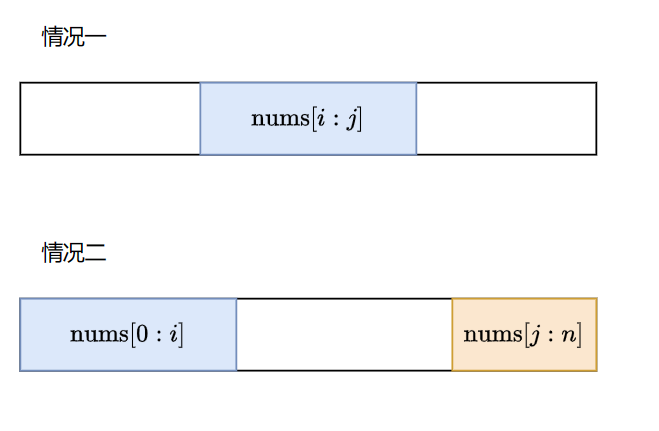
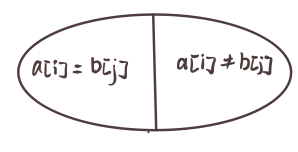
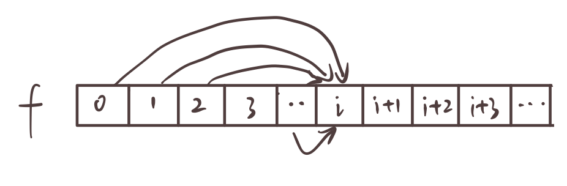
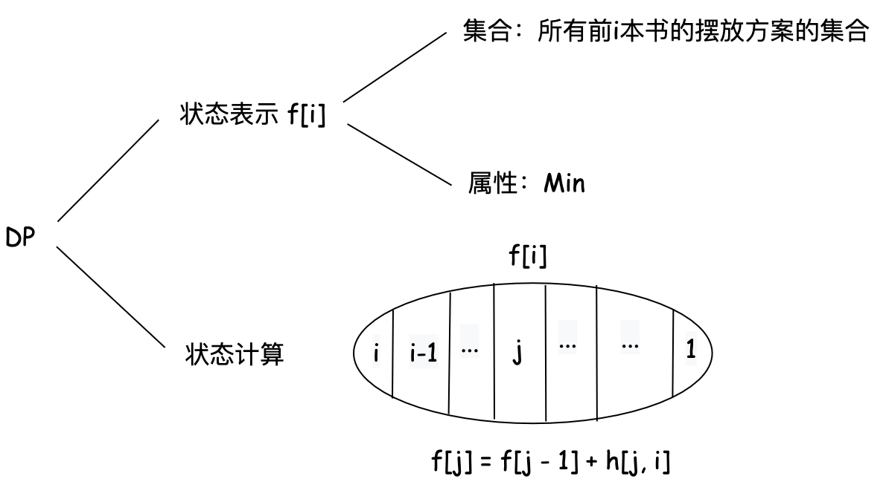

# Leetcode DP 专题

:::tip
友情提升，所有的题目都是超链接，可以直接点击进入 LeetCode 对应的题目页面。
:::


## 1. 入门 DP

### 1.1 爬楼梯

#### [70. 爬楼梯](https://leetcode.cn/problems/climbing-stairs/)

非常经典的爬楼梯问题，可以使用动态规划解决。

```cpp
class Solution {
public:
    int climbStairs(int n) {
        int a = 1, b = 1, c;
        while (-- n)
        {
            c = a + b;
            a = b;
            b = c;
        }
        return b;
    }
};
```

#### [746. 使用最小花费爬楼梯](https://leetcode.cn/problems/min-cost-climbing-stairs/)

在爬楼梯的基础上，增加了花费的限制。

- f[i] 的含义：爬到第 i 级楼梯的最小花费
- DP 属性：Min
- 状态转移方程：f[i] = min(f[i - 1] + cost[i - 1], f[i - 2] + cost[i - 2])

```cpp
class Solution {
public:
    int minCostClimbingStairs(vector<int>& cost) {
        int n = cost.size();
        vector<int> f(n + 1);

        f[0] = 0;
        f[1] = 0;

        for (int i = 2;i <= n;i ++)
        {
            f[i] = min(f[i - 1] + cost[i - 1], f[i - 2] + cost[i - 2]);
        }
        return f[n];
    }
};
```

#### [377. 组合总和 Ⅳ](https://leetcode.cn/problems/combination-sum-iv/)

- f[i] 的含义：和为 i 的方案数
- DP 属性：Count
- 状态转移方程：f[i] = sum(f[i - nums[j]])

```cpp
class Solution {
public:
    int combinationSum4(vector<int>& nums, int m) {
        vector<unsigned> f(m + 1);
        f[0] = 1;
        for (int i = 0;i <= m;i ++)
        {
            for (auto j: nums)
            {
                if (i >= j)
                    f[i] += f[i - j];
            }
        }
        return f[m];
    }
};
```

#### [2466. 统计构造好字符串的方案数](https://leetcode.cn/problems/count-ways-to-build-good-strings/)

这题不要被题目吓到，其实就是一个爬楼梯问题。

- f[i] 的含义：长度为 i 的字符串的方案数
- DP 属性：Count
- 状态转移方程：f[i] = f[i - one] + f[i - zero]

```cpp
class Solution {
public:
    int countGoodStrings(int low, int high, int zero, int one) {
        vector<int> f(high + 1);
        const int M = 1e9 + 7;

        f[0] = 1;
        int ans = 0;
        for (int i = 1;i <= high;i ++)
        {
            if (i >= one) f[i] = (f[i] + f[i - one]) % M;
            if (i >= zero) f[i] = (f[i] + f[i - zero]) % M;
            if (i >= low) ans = (ans + f[i]) % M;
        }
        return ans;
    }
};
```

#### [2266. 统计打字方案数](https://leetcode.cn/problems/count-number-of-texts/)

这题也是一个爬楼梯问题。每一个子串都可以用爬楼问题求解出来一个方案数，最后所有的子串的方案数相乘即可。和上面那个组合总和问题类似。

- f[i] 的含义：长度为 i 的字符串的方案数
- DP 属性：Count
- 状态转移方程：f[i] = sum(f[i - j])

```cpp
class Solution {
public:
    int countTexts(string pressedKeys) {
        typedef unsigned long long ULL;
        const int MOD = 1e9 + 7;
        int a[10] = {0, 0, 3, 3, 3, 3, 3, 4, 3, 4};

        int n = pressedKeys.size();
        int ans = 1;
        int l = 0, r = 0;
        for (int i = 1;i <= n;i ++)
        {
            if (i == n || pressedKeys[i] != pressedKeys[i - 1])
            {
                r = i - 1;
                int m = r - l + 1;
                if (m > 1) 
                {
                    vector<ULL> f(m + 1);
                    f[0] = 1, f[1] = 1;
                    for (int i = 2;i <= m;i ++)
                    {
                        for (int j = 1;j <= a[pressedKeys[l] - '0'];j ++)
                        {
                            if (i >= j)
                                f[i] = (f[i] + f[i - j]) % MOD;
                        }
                    }
                    ans = (ans * f[m]) % MOD;
                }
                l = i;
            }
        }
        return ans;
    }
};
```

#### [1.2 打家劫舍](https://leetcode.cn/problems/house-robber/)

- f[i] 的含义：偷窃第 i 个房子的最大收益
- DP 属性：Max
- 状态转移方程：f[i] = max(f[i - 1], f[i - 2] + nums[i])

```cpp
class Solution {
public:

    int rob(vector<int>& nums) 
    {
        int n = nums.size();
        vector<int> f(n + 1);

        if (!n) return 0;
        f[0] = nums[0];
        if (n < 2)
            return f[0];
        f[1] = max(nums[0], nums[1]);

        for (int i = 2;i < n; i++)
        {
            f[i] = max(f[i - 1], f[i - 2] + nums[i]);
        }
        return f[n - 1];
    }
};
```

### [740. 删除并获得点数](https://leetcode.cn/problems/delete-and-earn/description/)

- f[i][0] 的含义：不选择第 i 个数的最大收益， f[i][1] 的含义：选择第 i 个数的最大收益
- DP 属性：Max
- 状态转移方程：f[i][0] = max(f[i - 1][0], f[i - 1][1]), f[i][1] = f[i - 1][0] + i * cnt[i]

```cpp
const int N = 1e4 + 10;
int cnt[N];
int f[N][2];

class Solution {
public:
    int deleteAndEarn(vector<int>& nums) {
        memset(cnt, 0, sizeof(cnt));
        memset(f, 0, sizeof(f));

        for (int i = 0;i < nums.size();i ++) cnt[nums[i]] ++;

        int res = 0;
        for (int i = 1;i < N;i ++)
        {
            f[i][0] = max(f[i - 1][0], f[i - 1][1]);
            f[i][1] = f[i - 1][0] + i * cnt[i];
            res = max(res, f[i][1]);
        }

        return res;
    }
};
```

### [2320. 统计放置房子的方式数](https://leetcode.cn/problems/count-number-of-ways-to-place-houses/description/)

这题俩侧的房子可以分开看，最后排列组合（方案数相乘）即可。

- f[i] 的含义：在 0 - i 的位置放置房子的方案数
- DP 属性：Count
- 状态转移方程：f[i] = f[i - 1] + f[i - 2]

因为房子不能相邻，所以在 i 位置放置房子的方案数等于 i - 2 位置放置房子的方案数加上 i - 1 位置放置房子的方案数，其实就是一个爬楼梯问题换了个皮。

```cpp
class Solution {
public:
    int countHousePlacements(int n) {
        const int MOD = 1e9 + 7;
        vector<unsigned long long> f(n + 1);
        f[0] = 1;
        f[1] = 2;
        for (int i = 2;i <= n;i ++)
            f[i] = (f[i - 1] + f[i - 2]) % MOD;
        return f[n] * f[n] % MOD;
    }
};
```

### [打家劫舍 II](https://leetcode.cn/problems/house-robber-ii/)

这题和上面的打家劫舍问题类似，只不过这次是一个环形的房子，所以我们可以分成两种情况来讨论：

- 偷第一个房子，不偷最后一个房子
- 不偷第一个房子，偷最后一个房子

俩种情况取最大值即可。

- f[i] 的含义：偷窃第 i 个房子的最大收益
- g[i] 的含义：不偷窃第 i 个房子的最大收益
- DP 属性：Max
- 状态转移方程：f[i] = g[i - 1] + nums[i - 1], g[i] = max(f[i - 1], g[i - 1])


```cpp
class Solution {
public:
    int rob(vector<int>& nums) {
        int n = nums.size();
        // f[i] 表示偷窃第 i 个房子的最大收益
        // g[i] 表示不偷窃第 i 个房子的最大收益
        vector<int> f(n + 1), g(n + 1);
        if (!n) return 0;
        if (n == 1) return nums[0];

        // 不偷第一个房子
        for (int i = 2; i <= n;i ++)
        {
            f[i] = g[i - 1] + nums[i - 1];
            g[i] = max(f[i - 1], g[i - 1]);
        }

        int res = max(g[n], f[n]);

        f[1] = nums[0];
        g[1] = INT_MIN;

        // 偷第一个房子
        for (int i = 2; i <= n;i ++)
        {
            f[i] = g[i - 1] + nums[i - 1];
            g[i] = max(f[i - 1], g[i - 1]);
        }
        return max(res, g[n]);
    }
};
```

## 1.3 最大子数组和（最大子段和）

#### [53. 最大子序和](https://leetcode-cn.com/problems/maximum-subarray/)

- f[i] 的含义：以 i 结尾的最大子数组和
- DP 属性：Max
- 状态转移方程：f[i] = max(f[i - 1] + nums[i], nums[i])

```cpp
class Solution {
public:
    int maxSubArray(vector<int>& nums) {
        int res = nums[0], f = nums[0];
        for (int i = 1; i < nums.size();i ++)
        {
            f = max(f, 0) + nums[i];
            res = max(res, f);
        }
        return res;
    }
};
```

#### [2606. 找到最大开销的子字符串](https://leetcode.cn/problems/find-the-substring-with-maximum-cost/description/)

这题和上面的最大子数组和问题基本一样，只不过这次的数组是一个字符串，而且每个元素都有一个权值。

- f[i] 的含义：以 i 结尾的最大子数组和
- DP 属性：Max
- 状态转移方程：f[i] = max(f[i - 1] + s[i] 的 value, s[i] 的 value)

```cpp
class Solution {
public:
    int maximumCostSubstring(string s, string chars, vector<int>& vals) {
        unordered_map<char, int> hash;
        for (int i = 0;i < chars.size();i ++) hash[chars[i]] = i;

        s = ' ' + s;
        int res = 0, f = INT_MIN;
        for (int i = 1;i < s.size();i ++)
        {
            int value = s[i] - 'a' + 1;
            if (hash.count(s[i]))
                value = vals[hash[s[i]]];
            f = max(f, 0) + value;
            res = max(res, f);
        }
        return res;
    }
};
```


#### [1749. 任意子数组和的绝对值的最大值](https://leetcode.cn/problems/maximum-absolute-sum-of-any-subarray/description/)

这题是思路感觉和打家劫舍2有点像，都是需要求俩种情况的最大值。

- pm 是 positive max，表示以 i 结尾的最大子数组和，nm 是 negative min，表示以 i 结尾的最小子数组和
- ps 是 positive sum，表示以 i 结尾的正数和，ns 是 negative sum，表示以 i 结尾的负数和

连续和肯定要么是正数和，要么是负数和，所以我们可以分别求出以 i 结尾的最大子数组和和最小子数组和，然后取最大值即可。


```cpp
class Solution {
public:
    int maxAbsoluteSum(vector<int>& nums) {
        int pm = 0, nm = 0;
        int ps = 0, ns = 0;

        for (auto a: nums)
        {
            ps += a;
            pm = max(pm, ps);
            ps = max(0, ps);
            ns += a;
            nm = min(nm, ns);
            ns = min(0, ns);
        }
        return max(pm, -nm);
    }
};
```

#### [1191. K 次串联后最大子数组之和](https://leetcode.cn/problems/k-concatenation-maximum-sum/description/)

```
typedef long long LL;

const int MOD = 1e9 + 7;

class Solution {
public:
    int kConcatenationMaxSum(vector<int>& arr, int k) {
        LL mx = 0, l = 0, r = 0, sum = 0, s = 0;
        for (int i = 0; i < arr.size(); i ++ ) {
            sum += arr[i];
            l = max(l, sum);
            s = max(s, 0ll) + arr[i];
            mx = max(mx, s);
            if (i + 1 == arr.size()) r = s;
        }

        if (k == 1) return mx % MOD;
        if (sum < 0) return max(mx, l + r) % MOD;
        return max(sum * (LL)(k - 2) + l + r, mx) % MOD;
    }
};

```

#### [918. 环形子数组的最大和](https://leetcode.cn/problems/maximum-sum-circular-subarray/description/)

:::tip

该题题解来自于 [LeetCode 官方题解](https://leetcode.cn/problems/maximum-sum-circular-subarray/solutions/2350660/huan-xing-zi-shu-zu-de-zui-da-he-by-leet-elou/)。

:::

本题为「53. 最大子数组和」的进阶版, 建议读者先完成该题之后, 再尝试解决本题。 

求解普通数组的最大子数组和是求解环形数组的最大子数组和问题的子集。设数组长度为 $n$, 下标从 0 开始, 在环形情况中，答案可能包括以下两种情况：

1. 构成最大子数组和的子数组为 $\operatorname{nums}[i: j]$, 包括 $n u m s[i]$到 nums $[j-1]$ 共 $j-i$ 个元素, 其中 $0 \leq i<j \leq n$ 。
2. 构成最大子数组和的子数组为 $n u m s[0: i]$ 和 $n u m s[j: n]$ , 其中 $0<i<j<n$ 。

  

第一种情况可以通过「53. 最大子数组和」的方法求解，第二种情况可以通过求出最小子数组和，然后用总和减去最小子数组和求出最大子数组和。

```cpp
class Solution {
public:
    int maxSubarraySumCircular(vector<int>& nums) {
        int n = nums.size();
        int pre_max = nums[0], max_res = nums[0];
        int pre_min = nums[0], min_res = nums[0];
        int sum = nums[0];

        for (int i = 1;i < n; i++)
        {
            pre_max = max(pre_max + nums[i], nums[i]);
            max_res = max(max_res, pre_max);

            pre_min = min(pre_min + nums[i], nums[i]);
            min_res = min(min_res, pre_min);
            sum += nums[i];
        }
        if (max_res < 0)
            return max_res;
        else
            return max(max_res, sum - min_res);
    }
};
```

#### [2321.拼接数组的最大分数](https://leetcode.cn/problems/maximum-score-of-spliced-array/description/)

这题难就难在如何把这个问题转化成一个最大子数组和问题。根据题目的要求我们可以知道，需要让最后的数组累加和最大，也就是将两个数组 nums1 和 nums2 的其中一段做互换的累加和最大。

假设 sum1 是 nums1 的累加和，sum2 是 nums2 的累加和。如果我们想要交换后的 sum1 最大，那么我们需要找到一个子区间，假设这个区间是 [i, j]，`sum1 - sum1[i:j] + sum2[i:j]` 是最大的，且大于 `sum2 - sum2[i:j] + sum1[i:j]`。

也就是说我们需要找到最大的 `sum2[i:j] - sum1[i:j]`，这个问题就转化成了找到一个区间使得区间和最大的问题。这个思路是不是非常巧妙呢？当然了由于最大的可能是 sum1 也有可能是 sum2，所以我们需要分别求出这俩种情况的最大值最后取最大值即可。


```cpp
typedef long long LL;

class Solution {
public:
    int maximumsSplicedArray(vector<int>& nums1, vector<int>& nums2) {
        LL sum1 = accumulate(nums1.begin(), nums1.end(), 0);
        LL sum2 = accumulate(nums2.begin(), nums2.end(), 0);

        LL max_diff_1 = nums2[0] - nums1[0], f1 = nums2[0] - nums1[0];
        LL max_diff_2 = nums1[0] - nums2[0], f2 = nums1[0] - nums2[0];
        int n = nums1.size();

        for (int i = 1;i < n;i ++)
        {
            LL a = nums2[i] - nums1[i], b = nums1[i] - nums2[i];
            f1 = max(f1, (LL)0) + a;
            f2 = max(f2, (LL)0) + b;
            max_diff_1 = max(max_diff_1, f1);
            max_diff_2 = max(max_diff_2, f2);
        }

        return max(sum1 + max_diff_1, sum2 + max_diff_2);
    }
};
```

#### [152. 乘积最大子数组](https://leetcode.cn/problems/maximum-product-subarray/description/)

这题一看还以为可以直接套用最大子数组和的思路，但是其实不行的。因为乘积有正负号的影响，所以我们需要维护俩个数组，一个是最大乘积数组，一个是最小乘积数组，而且转移方程还挺复杂的。

对于 max_f[i]，我们可以有三种选择：

1. max_f[i - 1] * nums[i]: 说明前面的最大乘积数组乘以当前的数是最大的
2. min_f[i - 1] * nums[i]: 说明前面的最小乘积数组乘以当前的数是最大的
3. nums[i]: 说明当前的数是最大的

对于 min_f[i]，我们也是类似的：

1. max_f[i - 1] * nums[i]: 说明前面的最大乘积数组乘以当前的数是最小的
2. min_f[i - 1] * nums[i]: 说明前面的最小乘积数组乘以当前的数是最小的
3. nums[i]: 说明当前的数是最小的

```cpp
class Solution {
public:
    int maxProduct(vector<int>& nums) {
        int n = nums.size();
        vector<int> max_f(n), min_f(n);
        int res = nums[0];
        max_f[0] = nums[0], min_f[0] = nums[0];
        for (int i = 1;i < n;i ++)
        {
            max_f[i] = max(max_f[i - 1] * nums[i], max(nums[i], min_f[i - 1] * nums[i]));
            min_f[i] = min(min_f[i - 1] * nums[i], min(nums[i], max_f[i - 1] * nums[i]));
            res = max(res, max_f[i]);
        }
        return res;
    }
};
```

## 网格 DP

对于一些二维 DP（例如背包、最长公共子序列），如果把 DP 矩阵画出来，其实状态转移可以视作在网格图上的移动。

### 2.1 基础网格 DP

#### [LCR 166.珠宝的最高价值](https://leetcode.cn/problems/li-wu-de-zui-da-jie-zhi-lcof/
description/)

这题就非常简单了，就是一个二维 DP 的问题，每次只能向下或者向右移动，求最大值即可。

```cpp
class Solution {
public:
    int jewelleryValue(vector<vector<int>>& frame) {
        int m = frame.size(), n = frame[0].size();
        vector<vector<int>> f(m + 1, vector<int>(n + 1));
        
        for (int i = 1;i <= m;i ++)
        {
            for (int j = 1;j <= n;j ++)
            {
                f[i][j] = max(f[i - 1][j], f[i][j - 1]) + frame[i - 1][j - 1];
            }
        }
        return f[m][n];
    }
};
```

#### [62.不同路径](https://leetcode.cn/problems/unique-paths/description/)

这题的代码和上面的题目基本一样，只不过支持 DP 的属性是 Count。

```cpp
class Solution {
public:
    int uniquePaths(int m, int n) {
        vector<vector<int> > f(m + 1, vector<int>(n + 1, 1));

        for (int i = 1;i < m;i ++)
            for (int j = 1;j < n;j ++)
                f[i][j] = f[i - 1][j] + f[i][j - 1];
        return f[m - 1][n - 1];
    }
};
```

#### [63.不同路径 II](https://leetcode-cn.com/problems/unique-paths-ii/description/)

这题在上一题的基础上增加了障碍物，我们需要在 DP 的过程中判断当前位置是否是障碍物，如果是的话就直接跳过。

```cpp
class Solution {
public:
    int uniquePathsWithObstacles(vector<vector<int>>& o) {
        int m = o.size(), n = o[0].size();
    
        vector<vector<int> > f(m, vector<int>(n, 0));

        f[0][0] = !o[0][0];
        for (int i = 0;i < m;i ++)
        {
            for (int j = 0;j < n;j ++)
            {
                if (o[i][j]) continue;
                if (i && !o[i - 1][j]) f[i][j] += f[i - 1][j];
                if (j && !o[i][j - 1]) f[i][j] += f[i][j - 1];
            }
        }
        
        return f[m - 1][n - 1];
    }
};
```

#### [64.最小路径和](https://leetcode-cn.com/problems/minimum-path-sum/description/)

这题和上面的题目基本一样，只不过这次 DP 的属性是 Min。不过需要注意初始化的时候，第一行和第一列的初始化。

```cpp
class Solution {
public:
    int minPathSum(vector<vector<int>>& grid) {
        int m = grid.size(), n = grid[0].size();
        vector<vector<int> > f(m + 1, vector<int>(n + 1));

        f[0][0] = grid[0][0];
        for (int i = 1;i < m;i ++) f[i][0] = f[i - 1][0] + grid[i][0];
        for (int j = 1;j < n;j ++) f[0][j] = f[0][j - 1] + grid[0][j];
        for (int i = 1;i < m;i ++)
            for (int j = 1;j < n;j ++)
                f[i][j] = min(f[i - 1][j], f[i][j - 1]) + grid[i][j];
        return f[m - 1][n - 1];
    }
};
```

#### [120.三角形最小路径和](https://leetcode-cn.com/problems/triangle/description/)

这题和上面的题目基本一样，只不过换成了三角形，注意好边界条件即可。

```cpp
class Solution {
public:
    int minimumTotal(vector<vector<int>>& t) {
        int m = t.size();
        vector<vector<int> > f(m, vector<int>(m, INT_MAX));
        f[0][0] = t[0][0];
        for (int i = 1;i < m;i ++) f[i][0] = f[i - 1][0] + t[i][0];
        
        for (int i = 1;i < m;i ++)
        {
            for (int j = 1;j <= i;j ++)
            {
                f[i][j] = min(f[i - 1][j - 1], f[i - 1][j]) + t[i][j];
            }   
        }

        int res = INT_MAX;
        for (int i = 0;i < m;i ++)
            res = min(res, f[m - 1][i]);
    
        return res;
    }
};
```

#### [931.下降路径最小和](https://leetcode-cn.com/problems/minimum-falling-path-sum/description/)

和上一题雷同，注意边界条件即可；

```cpp
class Solution {
public:
    int minFallingPathSum(vector<vector<int>>& matrix) {
        int m = matrix.size(), n = matrix[0].size();
        vector<vector<int> > f(m + 1, vector<int>(n + 1));

        for (int i = 0;i < n;i ++) f[0][i] = matrix[0][i];
        for (int i = 1;i < m;i ++)
        {
            for (int j = 0;j < n;j ++)
            {
                int a = f[i - 1][j];
                if (j) a = min(f[i - 1][j - 1], a);
                if (j < n - 1) a = min(f[i - 1][j + 1], a);
                f[i][j] = a + matrix[i][j];
            }
        }
        int res = INT_MAX;
        for (int i = 0;i < n;i ++)
            res = min(res, f[m - 1][i]);
        return res;
    }
};
```

### 2.2 进阶

#### [1594.矩阵的最大非负积](https://leetcode.cn/problems/maximum-non-negative-product-in-a-matrix/description/)

当需要处理负数的时候，我们可以维护俩个 DP 数组，一个是最大值，一个是最小值，这样就可以处理负数的情况了。这样的策略我们在上面的乘积最大子数组中也有提到。

```cpp
class Solution {
public:
    int maxProductPath(vector<vector<int>>& grid) 
    {
        typedef long long LL;
        const int MOD = 1e9 + 7;
        int m = grid.size(), n = grid[0].size();
        vector<vector<LL> > maxgt(m, vector<LL>(n));
        vector<vector<LL> > minlt(m, vector<LL>(n));

        maxgt[0][0] = minlt[0][0] = grid[0][0];
        for (int i = 1;i < n;i ++)
            maxgt[0][i] = minlt[0][i] = maxgt[0][i - 1] * grid[0][i];
        for (int i = 1;i < m;i ++)
            maxgt[i][0] = minlt[i][0] = maxgt[i - 1][0] * grid[i][0];
        
        for (int i = 1;i < m;i ++)
        {
            for (int j = 1;j < n;j ++)
            {
                if (grid[i][j] >= 0)
                {
                    maxgt[i][j] = max(maxgt[i][j - 1], maxgt[i - 1][j]) * grid[i][j];
                    minlt[i][j] = min(minlt[i][j - 1], minlt[i - 1][j]) * grid[i][j];
                } else 
                {
                    maxgt[i][j] = min(minlt[i][j - 1], minlt[i - 1][j]) * grid[i][j];
                    minlt[i][j] = max(maxgt[i][j - 1], maxgt[i - 1][j]) * grid[i][j];
                }
            }
        }

        if (maxgt[m - 1][n - 1] < 0) return -1;
        return maxgt[m - 1][n - 1] % MOD;
    }
};
```

#### [2435.矩阵中和能被K整除的路径](https://leetcode.cn/problems/paths-in-matrix-whose-sum-is-divisible-by-k/description/)

f[i][j][v] 表示从 (0, 0) 到 (i, j) 的路径和模 k 为 v 的方案数。

考虑到是从左上角转移过来的，所以我们可以直接枚举上一个状态的 v，然后转移即可。

f[i][j][(v + grid[i][j]) % k] = f[i - 1][j][v] + f[i][j - 1][v];

这里我为了少一些边界判断，所以我直接把 f 的大小设置为 m + 1 和 n + 1，而且在遍历的时候每次计算 f[i+1][j+1][v] 的时候，这样就可以少一些边界判断。

需要注意的是初始化的时候，我们写的是 f[1][0][0] = 1 或者 f[0][1][0] = 1，因为的 f 是从 1 开始的，所以我们需要初始化 f[1][0][0] 而不是 f[0][0][0]。

```cpp
class Solution {
public:
    int numberOfPaths(vector<vector<int>>& grid, int k) {
        const int MOD = 1e9 + 7;
        int m = grid.size(), n = grid[0].size(), f[m + 1][n + 1][51];
        memset(f, 0, sizeof(f));

        f[1][0][0] = 1;
        for (int i = 0;i < m;i ++)
        {
            for (int j = 0;j < n;j ++)
            {
                for (int v = 0; v < k; v ++)
                    f[i + 1][j + 1][(v + grid[i][j]) % k] = (f[i + 1][j][v] + f[i][j + 1][v]) % MOD;
            }
        }

        return f[m][n][0];
    }
};
```

#### [174.地下城游戏](https://leetcode.cn/problems/dungeon-game/)

:::tip

该题题解来自于 [LeetCode 官方题解 174.地下城游戏](https://leetcode.cn/problems/dungeon-game/solutions/326171/di-xia-cheng-you-xi-by-leetcode-solution/)

:::

这道题的题目一看上去就像是一个 DP 的题目，但是只要你仔细思考就会发现，如果你从左上角开始走，那么我们需要同时记录两个值。第一个是「从出发点到当前点的路径和」，第二个是「从出发点到当前点所需的最小初始值」。而这两个值的重要程度相同。

于是我们考虑从右下往左上进行动态规划。令 f[i][j] 表示从 (i, j) 到终点所需的最小初始值。换句话说，当我们到达坐标 (i,j) 的时候，我们至少需要 f[i][j] 的血量才能走到终点。

这样一来，我们就无需担心路径和的问题，只需要关注最小初始值。我们可以从右下角开始，然后逐步向左上角推导出 f[0][0] 即可。

f[i][j] 是从 f[i+1][j] 和 f[i][j+1] 中选择一个最小值，然后减去 dungeon[i][j]，但是如果减去 dungeon[i][j] 之后的值小于等于 0，那么我们就需要设置为 1。因为我们至少需要 1 的血量。

边界条件是，当 i = m - 1 或者 j = n - 1 的时候，我们需要特殊处理一下，因为这个时候我们无法选择 f[i+1][j] 或者 f[i][j+1]，因此代码实现中给无效值赋值为极大值。

```cpp
class Solution {
public:
    int calculateMinimumHP(vector<vector<int>>& dungeon) {
        int m = dungeon.size(), n = dungeon[0].size();
        vector<vector<int> > f(m + 1, vector<int>(n + 1, INT_MAX));
        f[m - 1][n] = f[m][n - 1] = 1;
        for (int i = m - 1;i >= 0;i --)
        {
            for (int j = n - 1;j >= 0;j --)
            {
                int mini = min(f[i + 1][j], f[i][j + 1]);
                f[i][j] = max(mini - dungeon[i][j], 1);
            }
        }
        return f[0][0];
    }
};
```

#### [741. 摘樱桃](https://leetcode.cn/problems/cherry-pickup/description/)

由于正向和反向的路可以被视为等价的，所以我们不妨把这个问题转化成有俩个人同时从 （0, 0）出发，同时走到（n - 1, n - 1），求俩个人摘到的樱桃数和的最大值。

我们用 k 表示走了多少步，第一个人的坐标是 (x1,y1), 第二个人的坐标是 (x2,y2)，当 x1 == x2 的时候，这个时候 y1 和 y2 也是相等的。

定义 $f[k]\left[x_1\right]\left[x_2\right]$ 表示两个人（设为 A 和 B）从 $(0, 0)$ 和 $\left(0, 0\right)$ 同时出发, 分别到达 (x1, k - x2) 和 (x2, k - x1) 摘到的樱桃个数之和的最大值。

1. 都走右边：f[k][x1][x2]
2. 一个人走右边，一个人走下边：f[k][x1][x2 - 1]
3. 一个人走下边，一个人走右边：f[k][x1 - 1][x2]
4. 都走下边：f[k][x1 - 1][x2 - 1]

最后的答案就是 f[2 * n - 2][n - 1][n - 1]。

```cpp
class Solution {
public:
    int cherryPickup(vector<vector<int>>& grid) {
        int n = grid.size();
        vector<vector<vector<int>>> f(n * 2 - 1, vector<vector<int>>(n, vector<int>(n, INT_MIN)));
        f[0][0][0] = grid[0][0];
        for (int k = 1;k < n * 2 - 1;k ++)
        {
            for (int x1 = max(k - n + 1, 0);x1 <= min(k, n - 1); x1++)
            {
                int y1 = k - x1;
                // 走到了障碍物
                if (grid[x1][y1] == -1) continue;
                for (int x2 = x1; x2 <= min(k, n - 1); x2 ++)
                {
                    int y2 = k - x2;
                    // 走到了障碍物
                    if (grid[x2][y2] == -1) continue;
                    int res = f[k - 1][x1][x2];
                    if (x1)
                        res = max(res, f[k - 1][x1 - 1][x2]);
                    if (x2)
                        res = max(res, f[k - 1][x1][x2 - 1]);
                    if (x1 && x2)
                        res = max(res, f[k - 1][x1 - 1][x2 - 1]);
                    res += grid[x1][y1];
                    // 避免俩个人摘到同一个樱桃
                    if (x1 != x2)
                        res += grid[x2][y2];
                    
                    f[k][x1][x2] = res;
                }
            }
        }
        return max(f[2 * n - 2][n - 1][n - 1], 0);
    }
};
```

## 3. 背包 问题

### 3.1 0-1 背包问题

物品只能取一次

#### [2915. 和为目标值的最长子序列的长度](https://leetcode.cn/problems/length-of-the-longest-subsequence-that-sums-to-target/)

恰好装满型 0-1 背包，这题属于模板题，如果问题是恰好装满型的话，我们可以把问题转化成一个背包问题，然后求出最大的长度即可。

和普通的 0-1 背包问题对比的话，我们就是外层循环 nums， 内层循环 target，然后求出最大的长度即可。

f[i] 的含义是和为 i 的最长子序列的长度。

它的状态转移方程是：f[i] = max(f[i], f[i - x] + 1)


```cpp
class Solution {
public:
    int lengthOfLongestSubsequence(vector<int>& nums, int target) {
        vector<int> f(target + 1, INT_MIN);
        f[0] = 0;
        int s = 0; // 记录前缀和
        for (int x: nums)
        {
            s = min(s + x, target); // 防止 s 超过 target
            for (int j = s;j >= x;j --)
            {
                f[j] = max(f[j], f[j - x] + 1);
            }
        }
        
        return f[target] > 0 ? f[target] : -1;
    }
};
```

#### [416. 分割等和子集](https://leetcode.cn/problems/partition-equal-subset-sum/description/)

这题其实本质上和上一题一样，只不过这次的 target 是 sum / 2，题目可以转化为是否存在一个子集的合等于 sum / 2。

这里 f 的含义是，是否有一个子集的和等于 i。当然了你也可以用和上题一样的 f 含义。区别是初始化不同和转移方程不同。

```cpp
class Solution {
public:
    bool canPartition(vector<int>& nums) {
        int sum = 0;
        for (int x: nums) sum += x;
        if (sum % 2) return false;

        vector<int> f(sum / 2 + 1);
        f[0] = 1;
        for (int x: nums)
        {
            for (int j = sum / 2;j >= x;j --)
            {
                f[j] = min(f[j] + f[j - x], 1);
            }
        }
        return f[sum / 2] > 0;
    }
};
```

#### [494. 目标和](https://leetcode.cn/problems/target-sum/description/)

这题涉及到负数，所以我们需要维护一个偏移量，然后把问题转化成一个 0-1 背包问题。所谓每个数可以取正号或者负号，其实就是一共 2n 个数，然后求和为 target 的方案数。

这里 f[i][j] 的含义是 nums 的前 i 个数，和为 j 的方案数。它的状态可以从 f[i - 1][j - x] 或者 f[i - 1][j + x] 转移过来。

```cpp
class Solution {
public:
    int findTargetSumWays(vector<int>& a, int S) {
        int n = a.size(), Offset = 1000;

        vector<vector<int>> f(n + 1, vector<int>(2010));

        f[0][Offset] = 1;
        for (int i = 1;i <= n;i ++)
        {
            for (int j = -1000;j <= 1000;j ++)
            {
                if (j - a[i - 1] >= -1000)
                    f[i][j + Offset] += f[i - 1][j - a[i - 1] + Offset];
                if (j + a[i - 1] <= 1000)
                    f[i][j + Offset] += f[i - 1][j + a[i - 1] + Offset];
            }
        }
        return f[n][S + Offset];
    }
};
```

#### [2787. 将一个数字表示成幂的和的方案数](https://leetcode.cn/problems/ways-to-express-an-integer-as-sum-of-powers/description/)

和上面的题目基本都是一模一样的，唯一的区别就是 a 需要自己计算一下。

这里 f 的含义是，将 i 表示成幂的和的方案数，属性是 Count。

```cpp
class Solution {
public:
    int numberOfWays(int n, int x) {
        typedef unsigned long long ULL;
        const int MOD = 1e9 + 7;
        vector<ULL> a;
        int m = 1;
        while (pow(m, x) <= n)
        {
            a.push_back(pow(m, x));
            m ++;
        }

        vector<ULL> f(n + 1);
        f[0] = (ULL)1;
        for (int i = 1;i <= a.size();i ++)
        {
            for (int j = n;j >= a[i - 1];j --)
            {
                f[j] += f[j - a[i - 1]];
            }
        }

        return f[n] % MOD;
    }
};
```

#### [474. 一和零](https://leetcode.cn/problems/ones-and-zeroes/description/)

这道题和经典的背包问题非常相似，但是和经典的背包问题只有一种容量不同，这道题有两种容量，即选取的字符串子集中的 0 和 1 的数量上限。

本来我们应该是用一个三维数组来表示状态，但是我们可以倒序遍历，这样就可以用一个二维数组来表示状态。

f[i][j] 表示在容量为 i 和 j 的情况下，最多可以放多少个字符串。属性是 Count

```cpp
class Solution {
public:

    int findMaxForm(vector<string>& strs, int m, int n) {
        vector<vector<int>> f(m + 1, vector<int>(n + 1));

        for (auto str: strs)
        {
            int a = 0, b = 0;
            for (char c: str)
                if (c == '0') a ++;
                else b ++;
            
            for (int i = m;i >= a;i --)
                for (int j = n;j >= b;j --)
                    f[i][j] = max(f[i][j], f[i-a][j-b] + 1);
        }
        return f[m][n];
    }
};
```

#### [1774. 最接近目标价格的甜点成本](https://leetcode.cn/problems/closest-dessert-cost/description/)

这题真的挺难的，我们可以把这个问题转化成一个 0-1 背包问题，我们可以把 toppingCosts 中的每个元素看成是一个物品，然后我们可以选择这个物品或者不选择这个物品。

首先我们先判断一下 baseCosts 中的元素是否大于 target，如果大于 target 的话，那么我们就直接返回这个元素。

然后我们初始化一个 f 数组，f[i] 表示是否可以用 toppingCosts 中的元素组成 i。然后我们遍历 toppingCosts 中的元素，然后更新 f 数组。这个算是 f 的初始化。

然后我们遍历 baseCosts 中的元素，然后我们可以选择 toppingCosts 中的元素，然后更新 f 数组。 注意由于每个配料可以选择 2 次，所以我们需要遍历 2 次。

最后我们遍历一下 f 数组，然后找到最接近 target 的值。

动态规划是用于求解 0-target 之内可能的和的问题, 也就算是求解一个 0-1 背包问题。而且因为这题有可能结果大于 target 所以我们需要记录下来大于 target 的最小值。

```cpp
class Solution {
public:
    int closestCost(vector<int>& baseCosts, vector<int>& toppingCosts, int target) {
        int x = *min_element(baseCosts.begin(), baseCosts.end());
        if (x >= target)
            return x;

        vector<bool> f(target + 1, false);
        int res = 2 * target - x;

        for (auto &b: baseCosts)
        {
            if (b <= target)
                f[b] = true;
            else
                res = min(res, b);
        }

        for (auto &t : toppingCosts)
        {
            for (int c = 0; c < 2; c++)
            {
                for (int i = target;i >= 0;i --)
                {
                    if (f[i] && i + t > target)
                        res = min(res, i + t);
                    if (i - t > 0)
                        f[i] = f[i] | f[i - t];
                }
            }
        }

        for (int i = 0;i <= res - target;i ++)
        {
            if (f[target - i])
                return target - i;
        }
        return res;
    }
};
```


### 3.2 完全背包问题

#### [322. 零钱兑换](https://leetcode.cn/problems/coin-change/)

就是一个完全背包的模板，直接套用即可。属性是 Min

```cpp
class Solution {
public:
    int coinChange(vector<int>& coins, int m) {
        vector<int> f(m + 1, 1e8);
        f[0] = 0;
        for (auto c: coins)
        {
            for (int j = c; j <= m;j ++)
                f[j] = min(f[j], f[j - c] + 1);
        }
        if (f[m] == 1e8) return -1;
        return f[m];
    }
};
```

#### [518. 零钱兑换 II](https://leetcode.cn/problems/coin-change-ii/description/)

这题和上面的题目基本一样，只不过这次 DP 的属性是 Count。

```cpp
class Solution {
public:
    int change(int amount, vector<int>& coins) {
        vector<int> f(amount + 1);

        f[0] = 1;
        for (int coin: coins)
        {
            for (int i = coin;i <= amount;i ++)
                f[i] += f[i - coin];
        }
        return f[amount];
    }
};
```

### 3.3 多重背包

多重背包问题是 0-1 背包问题的一个变种，和 0-1 背包问题不同的是，每种物品有多个。

这个感觉面试应该很少考，大家记住最基础的模板就够了。优化方案的思路是将多重背包问题看做01背包问题来解决。 我们现在假设有4个物品i，我们将物品i进行分组，分组的目的是让分组之后的组别可以任意组合成1-4之间的任意个数的物品i。这里有一个已经存在的定理就是如果想让分组之后的可以组合成1-n中的任何数，只需要按照2的倍数进行分类即可。

先分组，再写一个01背包的模板即可。

```cpp
#include <iostream>
using namespace std;

const int N = 25000,M = 2010;

int n,m;
int v[N],w[N];
int f[N];

int main()
{
    cin >> n >>m;
    int cnt = 0;
    for(int i = 1;i<=n;i++)
    {
        int a, b ,s;
        cin >> a >> b >> s;
        int k = 1;
        while(k <= s)
        {
            cnt ++;
            v[cnt] = a * k;
            w[cnt] = b * k;
            s -= k;
            k *= 2;
        }
        if(s > 0)
        {
            cnt ++;
            v[cnt] = a * s;
            w[cnt] = b * s;
        }
    }
    n = cnt;
    for(int i=1;i<=n;i++)
        for(int j=m;j>=v[i];j--)
            f[j] =  max(f[j],f[j-v[i]] + w[i]);
    cout <<  f[m];
}
```


### 3.4 分组背包

分组背包问题，物品有若干组，每一组物品是互斥的，每组物品只能选一个。

这个问题没有什么要去优化的地方，主要就是状态计算那你注意一下就可以，选择所有情况下空间最大的情况就可以了

枚举的顺序是：

1. 枚举组
2. 枚举容量，从大到小枚举
3. 枚举组内的物品

类似的题目基本都是模板题

#### [1155. 掷骰子等于目标和的方法数](https://leetcode.cn/problems/number-of-dice-rolls-with-target-sum/)

这题需要特别注意一个地方，普通的分组背包问题是每组物品可以选也可以不选，但是这题是每组物品必须选一个。

f[i, j] 是不能从 f[i-1, j] 转移过来的，因为这样就不是每组物品必须选一个了。所以在第二轮循环中，我们每次都把 f[j] 给初始化为 0，然后再进行转移。

```cpp
class Solution {
public:
    int numRollsToTarget(int n, int k, int target) {
        const int MOD = 1e9 + 7;

        vector<int> f(target + 1);

        f[0] = 1;
        for (int i = 1;i <= n;i ++)
        {
            for (int j = target; j >= 0;j --)
            {
                f[j] = 0;
                for (int u = 1;u <= j && u <= k;u ++)
                {
                    f[j] = (f[j] + f[j - u]) % MOD;
                }
            }
        }
        return f[target];
    }
};
```

#### [1981. 最小化目标值与所选元素的差](https://leetcode.cn/problems/minimize-the-difference-between-target-and-chosen-elements/description/)

这题和上面的题目基本一样，只不过这次 DP 的属性是 Count。分组背包的时候我们可以求出来所有的可能的和，然后再去找最接近 target 的值。

需要注意的是，我们首先需要计算一下 `max_sum` ，这个值是所有组中最大的值的和，如果 target 大于等于 `max_sum` 的话，那么我们直接返回 target - `max_sum`。


```cpp
class Solution {
public:
    int minimizeTheDifference(vector<vector<int>>& mat, int target) {
        int res = INT_MIN;
        int m = mat.size(), n = mat[0].size();

        int max_sum = 0;
        for (auto x: mat)
        {
            int max_a = 0;
            for (int y: x)
                max_a = max(y, max_a);
            max_sum += max_a;
        }

        if (target >= max_sum) return target - max_sum;
        
        vector<int> f(max_sum + 1, 0);

        f[0] = 1;
        for (int i = 1; i <= m;i ++)
        {
            for (int j = max_sum;j >= 0;j --)
            {
                f[j] = 0;
                for (int u: mat[i - 1])
                {
                    if (j >= u) {
                        f[j] |= f[j - u];
                    }
                }
            }
        }

        for (int i = 0;i <= max(target, max_sum - target);i ++)
        {
            if (target - i >= 0 && f[target - i]) return i;
            if (target + i <= max_sum && f[target + i]) return i;
        }
        return 0;
    }
};
```

## 4. 线性 DP

### 4.1 最长公共子序列

一般定义 $f[i][j]$ 表示对 $(s[: i], t[: j])$ 的求解结果。

如何对状态进行划分，这道题将集合划分为两个集合会更加的方便理解。

  

对于 `a[i] == b[j]` 的情况，`f[i][j] = f[i-1][j-1] + 1`

对于 `a[i] != b[j]` 的情况, `f[i][j] = max(f[i-1][j],f[i][j-1])` 对于第二种情况 `f[i-1][j]` 表示不选 `a[i]` 选 `b[j]` 的情况，`f[i][j-1]` 表示选 `a[i]` 不选 `b[j]` 的情况。`a[i]` 和 `b[i]` 都不选的情况囊括在了这两种情况当中，状态转移方程见代码。

```cpp
class Solution {
public:
    int longestCommonSubsequence(string text1, string text2) {
        int n = text1.size(), m = text2.size();
        vector<vector<int> > f(n + 1, vector<int>(m + 1));

        for (int i = 1;i <= n;i ++)
        {
            for (int j = 1;j <= m;j ++)
            {
                if (text1[i - 1] == text2[j - 1])
                    f[i][j] = f[i - 1][j - 1] + 1;
                else
                    f[i][j] = max(f[i - 1][j], f[i][j - 1]);
            }
        }
        return f[n][m];
    }
};
```

#### [583. 两个字符串的删除操作](https://leetcode.cn/problems/delete-operation-for-two-strings/)

和上题一毛一样，秒了

```cpp
class Solution {
public:
    int minDistance(string text1, string text2) {
        int n = text1.size(), m = text2.size();
        vector<vector<int> > f(n + 1, vector<int>(m + 1));

        for (int i = 1;i <= n;i ++)
        {
            for (int j = 1;j <= m;j ++)
            {
                if (text1[i - 1] == text2[j - 1])
                    f[i][j] = f[i - 1][j - 1] + 1;
                else
                    f[i][j] = max(f[i - 1][j], f[i][j - 1]);
            }
        }
        return n + m - 2 * f[n][m];
    }
};
```

#### [712. 两个字符串的最小ASCII删除和](https://leetcode.cn/problems/minimum-ascii-delete-sum-for-two-strings/description/)

换汤不换药

```cpp
class Solution {
public:
    int minimumDeleteSum(string s1, string s2) {
        int n = s1.size(), m = s2.size();

        vector<vector<int> > f(n + 1, vector<int>(m + 1));

        for (int i = 1; i <= n;i ++)
        {
            for (int j = 1;j <= m;j ++)
            {
                if (s1[i - 1] == s2[j - 1])
                    f[i][j] = f[i-1][j-1] + (int)s1[i - 1];
                else
                    f[i][j] = max(f[i-1][j], f[i][j-1]);
            }
        }

        int sum = 0;
        for (char c: s1) sum += (int)c;
        for (char c: s2) sum += (int)c;
        return sum - 2 * f[n][m];
    }
};
```

#### [72. 编辑距离](https://leetcode-cn.com/problems/edit-distance/)

状态表示: $f[i, j]$ 表示将 word 1 的前 $i$ 个字符变成 word2 的前 $j$ 个字符, 最少需要进行多少次操作。状态转移，一共有四种情况（假定word的下标从1开始）：

1. 将 $w o r d 1[i]$ 删除或在 $word 2[j]$ 后面添加 $word 1[i]$, 则其操作次数等于 $f[i-1, j]+1$;
2. 将 $word 2[j]$ 删除或在 $word11[i]$ 后面添加 $w \operatorname{or} d 2[j]$, 则其操作次数等于 $f[i, j-1]+1$;
3. 如果 $word1[i]=\operatorname{word} 2[j]$, 则其操作次数等于 $f[i-1, j-1]$;
4. 如果 $word1[i] \neq word 2[j]$, 则其操作次数等于 $f[i-1, j-1]+1$;

时间复杂度分析：状态数 $O\left(n^2\right)$, 状态转移复杂度是 $O(1)$, 所以总时间复杂度是 $O\left(n^2\right)$ 。


```cpp
class Solution {
public:
    int minDistance(string text1, string text2) {
        int n = text1.size(), m = text2.size();
        vector<vector<int> > f(n + 1, vector<int>(m + 1));

        for (int i = 1; i <= n; i ++ ) f[i][0] = i;
        for (int j = 1; j <= m; j ++ ) f[0][j] = j;

        for (int i = 1;i <= n;i ++)
        {
            for (int j = 1;j <= m;j ++)
            {
                f[i][j] = f[i - 1][j - 1] + 
                    (text1[i - 1] != text2[j - 1]);
                f[i][j] = min(f[i][j], f[i - 1][j] + 1);
                f[i][j] = min(f[i][j], f[i][j - 1] + 1);
            }
        }
        return f[n][m];
    }
};
```

#### [97. 交错字符串](https://leetcode.cn/problems/interleaving-string/description/)

状态表示: $f[i][j]$ 表示 $s1$ 的前 $i$ 个字符和 $s2$ 的前 $j$ 个字符是否可以交错组成 $s3$ 的前 $i+j$ 个字符。

状态转移: 如果 $s3[i+j]$ 匹配 $s1[i]$, 则问题就转化成了 $f[i-1][j]$; 如果 $s3[i+j]$ 匹配 $s2[j]$, 则问题就转化成了 $f[i][j-1]$ 。两种情况只要有一种为真, 则 $f[i][j]$ 就为真。

```cpp
class Solution {
public:
    bool isInterleave(string s1, string s2, string s3) {
        int n = s1.size(), m = s2.size();
        if (s3.size() != n + m) return false;

        vector<vector<bool>> f(n + 1, vector<bool>(m + 1));
        s1 = ' ' + s1, s2 = ' ' + s2, s3 = ' ' + s3;
        for (int i = 0; i <= n; i ++ )
        {
            for (int j = 0; j <= m; j ++ )
            {
                if (!i && !j) f[i][j] = true;
                else
                {
                    if (i && s1[i] == s3[i + j]) f[i][j] = f[i - 1][j];
                    if (j && s2[j] == s3[i + j]) f[i][j] = f[i][j] || f[i][j - 1];
                }
            }
        }

        return f[n][m];
    }
};
```

### 4.2 最长递增子序列（LIS）

#### [300. 最长递增子序列](https://leetcode.cn/problems/longest-increasing-subsequence/description/)

状态表示：集合就是所有以i个数结尾的上升子序列，属性是集合里面每一个上升子序列长度的最大值。

接下来考虑一下要如何进行进行状态计算，首先我们先想一下如何进行集合划分，对于第i个数，那么将会有i-1个情况。如下图所示：

  

你的的上一个数值可能来自于0-i-1中的任何一个，那么就需要在0-i-1中去找到一个最大值。因此状态转移方程可以表示如下：

$$
f[i] = max(f[j]+1) \ j =0,1,...,j-1
$$

```cpp
class Solution {
public:
    int lengthOfLIS(vector<int>& nums) {
        int n = nums.size();

        vector<int> f(n + 1);
        for (int i = 1;i <= n;i ++)
        {
            f[i] = 1;
            for (int j = 1;j < i;j ++)
            {
                if (nums[i - 1] > nums[j - 1])
                    f[i] = max(f[i], f[j] + 1);
            }
        }
        return *max_element(f.begin(), f.end());
    }
};
```

#### [673. 最长递增子序列的个数](https://leetcode.cn/problems/number-of-longest-increasing-subsequence/description/)

由于需要记录下来最长的长度，所以我们需要维护一个 g 数组，g[i] 表示以 i 结尾的最长递增子序列的长度。

```cpp
class Solution {
public:
    int findNumberOfLIS(vector<int>& nums) {
        int n = nums.size();

        vector<int> f(n + 1), g(n + 1);
        int maxl = 0, cnt = 0;

        for (int i = 1;i <= n;i ++)
        {
            f[i] = g[i] = 1;
            for (int j = 1;j < i;j ++)
            {
                if (nums[i - 1] > nums[j - 1])
                {
                    if (f[i] < f[j] + 1)
                    {
                        f[i] = f[j] + 1;
                        g[i] = g[j];
                    } else if (f[i] == f[j] + 1)
                    {
                        g[i] += g[j];
                    }
                }   
            }

            if (maxl < f[i]) maxl = f[i], cnt = g[i];
            else if (maxl == f[i]) cnt += g[i];
        }
        return cnt;
    }
};
```


## 5. 状态机 DP

一般定义 $f[i][j]$ 表示前缀 $a[: i]$ 在状态 $j$ 下的最优值。一般 $j$ 都很小。代表题目是「买卖股票」系列。

### [121.买卖股票的最佳时机](https://leetcode.cn/problems/best-time-to-buy-and-sell-stock/description/)

状态表示：$f[i][j]$ 表示前i天在状态j下的最优值。状态转移方程：$f[i][0] = max(f[i-1][0],f[i-1][1]+prices[i])$，$f[i][1] = max(f[i-1][1],-prices[i])$。

0 表示不持有股票，1 表示持有股票。

```cpp
class Solution {

public:
    int maxProfit(vector<int>& prices) {
        int n = prices.size();
        vector<vector<int>> f(n + 1, vector<int>(2));

        f[0][0] = 0, f[0][1] = -1e9;
        for (int i = 1;i <= n;i ++)
        {
            f[i][0] = max(f[i - 1][0], f[i - 1][1] + prices[i - 1]);
            f[i][1] = max(f[i - 1][1], -prices[i - 1]);
        }
        return f[n][0];
    }
};
```

### [122. 买卖股票的最佳时机 II](https://leetcode-cn.com/problems/best-time-to-buy-and-sell-stock-ii/)

这题其实就是一个贪心的问题，只要今天的价格比昨天的价格高，那么就可以买入，然后卖出。但是我们也可以用状态机 DP 来解决这个问题。

```cpp
class Solution {

public:
    int maxProfit(vector<int>& prices) {
        int n = prices.size();
        vector<vector<int>> f(n + 1, vector<int>(2));

        f[0][0] = 0, f[0][1] = -1e9;
        for (int i = 1;i <= n;i ++)
        {
            // 今天不持有股票的情况，可能是昨天不持有股票，或者昨天持有股票，今天卖出
            f[i][0] = max(f[i - 1][0], f[i - 1][1] + prices[i - 1]);
            // 今天持有股票的情况，可能是昨天持有股票，或者昨天不持有股票，今天买入
            f[i][1] = max(f[i - 1][1], f[i - 1][0] - prices[i - 1]);
        }
        return f[n][0];
    }
};
```

### [123. 买卖股票的最佳时机 III](https://leetcode.cn/problems/best-time-to-buy-and-sell-stock-iii/description/)

先从前往后扫描, 并计算出只买卖一次且第 $i$ 天卖出的最大收益, 最大收益等于第 $i$ 天股票的价格减去前 $i-1$ 天股票价格的最小值。
扫描过程中用 $f[i]$ 记录前 $i$ 天中买卖一次的最大收益（不一定在第 $i$ 天卖）。

然后枚举第二次交易, 从后往前扫描, 并计算只买卖一次且第 $i$ 天买入的最大收益，最大收益等于第 $i$ 天之后股票价格的最大值减去 第 $i$ 天的价格, 然后加上 $f[i-1]$, 就是第二次交易在 $i$ 天买入，两次交易的总收益的最大值。

枚举过程中维护总收益的最大值即可。

```cpp
class Solution {
public:
    int maxProfit(vector<int>& prices) {
        int n = prices.size();

        vector<int> f(n, 0);
        int minv = INT_MAX;
        for (int i = 0; i < n; i ++ )
        {
            if (i) f[i] = f[i - 1];
            if (prices[i] > minv)
                f[i] = max(f[i], prices[i] - minv);
            minv = min(minv, prices[i]);
        }
        int res = f[n - 1];
        int maxv = INT_MIN;
        for (int i = n - 1; i > 0; i -- )
        {
            if (prices[i] < maxv)
                res = max(res, maxv - prices[i] + f[i - 1]);
            maxv = max(maxv, prices[i]);
        }
        return res;
    }
};
```

## 6. 划分型 DP


### 6.1 判定能否划分

一般定义 $f[i]$ 表示长为 $i$ 的前缀 $a[: i]$ 能否划分。

枚举最后一个子数组的左端点 $L$, 从 $f[L]$ 转移到 $f[i]$, 并考虑 $a[L: j]$ 是否满足要求。

#### [2369. 检查数组是否存在有效划分](https://leetcode.cn/problems/check-if-there-is-a-valid-partition-for-the-array/description/)

f[i] 可能从 f[i - 2] 转移过来，也可能从 f[i - 3] 转移过来。转移的条件题目已经给出了。

```cpp
class Solution {
public:
    bool validPartition(vector<int>& nums) {
        int n = nums.size();
        vector<int> f(n + 1);

        f[0] = 1;

        for (int i = 1;i <= n;i ++)
        {
            if (i >= 2)
            {
                if (nums[i - 2] == nums[i - 1])
                    f[i] = f[i - 2];
            } 
            if (i >= 3)
            {
                if (nums[i - 3] == nums[i - 2] && nums[i - 2] == nums[i - 1])
                    f[i] = f[i] || f[i - 3];
                else if (nums[i - 3] + 1 == nums[i - 2] && nums[i - 2] + 1 == nums[i - 1])
                    f[i] = f[i] || f[i - 3];
            }
        }
        return f[n];
    }
};
```

#### [139. 单词拆分](https://leetcode-cn.com/problems/word-break/)

这题需要结合字符串 hash 去解，为了更加方便的计算字符串 hash，我们最好给 dp 的过程改成从后往前。

```cpp
class Solution {
public:
    bool wordBreak(string s, vector<string>& w) {
        typedef unsigned long long ULL;
        const int P = 131;

        unordered_set<ULL> S;

        // 把所有的字符串 hash 存储到 S 中
        for (auto i: w)
        {
            ULL h = 0;
            for (char c: i) h += h * P + c;
            S.insert(h);
        }

        int n = s.size();
        vector<int> f(n + 1);

        f[n] = 1; // 注意这里是从后往前的，所以这里是 1

        for (int i = n - 1;i >= 0;i --)
        {
            ULL h = 0;
            for (int j = i;j < n;j ++)
            {
                h += h * P + s[j];
                if (S.count(h) && f[j + 1])
                {
                    f[i] = 1;
                    break;
                }
            }
        }
        return f[0];
    }
};
```


### 6.2 计算划分个数

计算最少（最多）可以划分出的子数组个数、划分方案数等。

一般定义 $f[i]$ 表示长为 $i$ 的前缀 $a[: i]$ 能否划分。

枚举最后一个子数组的左端点 $L$, 从 $f[L]$ 转移到 $f[i]$, 并考虑 $a[L: j]$ 对最优值的影响。

#### [132. 分割回文串 II](https://leetcode.cn/problems/palindrome-partitioning-ii/description/)


要解这一题我们首先先要判断一个子串是不是回文串，这个我们可以用一个二维数组来表示。这一部其实是一个预处理的过程，这个预处理也是用动态规划来解决的。

设 $g(i, j)$ 表示 $s[i . . j]$ 是否为回文串, 那么有状态转移方程:

$$
g(i, j) = \begin{cases}
g(i+1, j-1) & s[i] = s[j] \\
\text{false} & s[i] \neq s[j]
\end{cases}
$$

下面我们来看一下状态转移方程，设 $f(i)$ 表示 $s[1 . . i]$ 的最少分割次数, 那么我们就可以枚举 0 到 i 之间的每一个位置 j, 如果 $s[j + 1 . . i]$ 是回文串的话, 那么 $f(i) = \min(f(i), f(j) + 1)$。

如果 $s[j + 1 . . i]$ 是回文串的话，那么 $f(i) = \min(f(i), f(j) + 1)$。因为 $s[j + 1 . . i]$ 是回文串，所以 $s[1 . . i]$ 的最少分割次数就是 $s[1 . . j]$ 的最少分割次数加上 $s[j + 1 . . i]$ 这个回文串。

状态转移方程如下：

$$
f(i) = \min(f(i), f(j) + 1) \quad \text{if} \quad g(j + 1, i) = \text{true}
$$

```cpp
class Solution {
public:
    int minCut(string s) {
        int n = s.size();
        s = ' ' + s;
        vector<vector<int> > g(n + 1, vector<int>(n + 1));
        vector<int> f(n + 1, INT_MAX);

        for (int j = 1;j <= n;j ++)
            for (int i = 1;i <= n;i ++)
                if (i == j) g[i][j] = 1;
                else if (s[i] == s[j])
                    if (i + 1 > j - 1 || g[i + 1][j - 1])
                        g[i][j] = 1;
        
        for (int i = 1;i <= n;i ++)
        {
            if (g[1][i]) f[i] = 0; // 问的是前 i 个字符的最少分割次数
            else
            {
                for (int j = 1;j < i;j ++)
                    if (g[j + 1][i])
                        f[i] = min(f[i], f[j] + 1);
            }
        }
        return f[n];
    }
};
```


#### [2707. 字符串中的额外字符](https://leetcode.cn/problems/extra-characters-in-a-string/description/)

状态表示 $f[i]$ 表示前 $i$ 个字符的最少分割次数。

初始化 $f[0] = 0$，然后我们枚举 $f[i]$ 的所有可能的情况，如果 $s[j + 1 . . i]$ 在字典中，那么 $f[i] = \min(f[i], f[j])$。

```cpp
class Solution {
public:
    int minExtraChar(string s, vector<string>& dictionary) {
        int n = s.size();
        vector<int> f(n + 1, INT_MAX);

        unordered_map<string, int> mp;
        for (auto s: dictionary)
            mp[s]++;

        f[0] = 0;
        for (int i = 1;i <= n;i ++)
        {
            f[i] = f[i - 1] + 1;
            for (int j = i - 1; j >= 0;j --)
            {
                if (mp.count(s.substr(j, i - j)))
                    f[i] = min(f[i], f[j]);
            }
        }
        return f[n];
    }
};
```

#### [91. 解码方法](https://leetcode.cn/problems/decode-ways/description/)

这题是一个比较经典的划分类 DP 了，我们可以定义 $f[i]$ 表示前 $i$ 个字符的解码方法的个数。

$f[i]$ 可以从 $f[i - 1]$ 转移过来，也可以从 $f[i - 2]$ 转移过来。但是需要注意的是，从 $f[i - 2]$ 转移过来的时候，需要判断一下 $s[i - 1]$ 和 $s[i - 2]$ 是否可以组成一个合法的数字。

```cpp
class Solution {
public:
    int numDecodings(string s) {
        int n = s.size();
        s = ' ' + s;
        vector<int> f(n + 1);

        f[0] = 1;
        for (int i = 1;i <= n;i ++)
        {
            if (s[i] != '0') 
                f[i] = f[i - 1];

            if (i > 1 && s[i - 1] != '0' && ((s[i - 1] - '0') * 10 + (s[i] - '0') <= 26)) 
                f[i] += f[i - 2];
        }
        return f[n];
    }
};
```

#### [639. 解码方法 II](https://leetcode.cn/problems/decode-ways-ii/description/)

本题是「91. 解码方法」的进阶题目。算是比较复杂，但是仔细想一想也不是不能写的dp。下面的题解来自于 Leetcode 官方。

对于给定的字符串 $s$, 设它的长度为 $n$, 其中的字符从左到右依次为 $s[1], s[2], \cdots, s[n]$ 。我们可以使用动态规划的方法计算出字符串 $s$ 的解码方法数。

具体地, 设 $f_i$ 表示字符串 $s$ 的前 $i$ 个字符 $s[1 . . i]$ 的解码方法数。在进行状态转移时, 我们可以考虑最后一次解码使用了 $s$ 中的哪些字符, 那么会有下面的两种情况:

- 第一种情况是我们使用了一个字符, 即 $s[i]$ 进行解码, 那么:
    - 如果 $s[i]$ 为 $*$, 那么它对应着 $[1,9]$ 中的任意一种编码, 有 9 种方案。因此状态转移方程为:
$$
f_i=9 \times f_{i-1}
$$
    - 如果 $s[i]$ 为 0 , 那么它无法被解码。因此状态转移方程为:
$$
f_i=0
$$
    - 对于其它的情况, $s[i] \in[1,9]$, 分别对应一种编码。因此状态转移方程为:
$$
f_i=f_{i-1}
$$

- 第二种情况是我们使用了两个字符, 即 $s[i-1]$ 和 $s[i]$ 进行编码。与第一种情况类似, 我们需要进行分类讨论:

    - 如果 $s[i-1]$ 和 $s[i]$ 均为 $*$, 那么它们对应着 $[11,19]$ 以及 $[21,26]$ 中的任意一种编码, 有 15 种方案。因此状态转移方程为:
$$
f_i=15 \times f_{i-2}
$$

    - 如果仅有 $s[i-1]$ 为 $*$, 那么当 $s[i] \in[0,6]$ 时, $s[i-1]$ 可以选择 1 和 2 ; 当 $s[i] \in[7,9]$时, $s[i-1]$ 只能选择 1 。因此状态转移方程为:
$$
f_i= \begin{cases}2 \times f_{i-2}, & s[i-1] \in[1,6] \\ f_{i-2}, & s[i-1] \in[7,9]\end{cases}
$$
    - 如果仅有 $s[i]$ 为 $*$, 那么当 $s[i-1]$ 为 1 时, $s[i]$ 可以在 $[1,9]$ 中进行选择; 当 $s[i-1]$为 2 时, $s[i]$ 可以在 $[1,6]$ 中进行选择; 对于其余情况, 它们无法被解码。因此状态转移方程为:
$$
f_i= \begin{cases}9 \times f_{i-2}, & s[i]=1 \\ 6 \times f_{i-2}, & s[i]=2 \\ 0, & \text { otherwise }\end{cases}
$$
    - 如果 $s[i-1]$ 和 $s[i]$ 均不为 $*$, 那么只有 $s[i-1]$ 不为 0 并且 $s[i-1]$ 和 $s[i]$ 组成的数字小于等于 26 时, 它们才能被解码。因此状态转移方程为:
$$
f_i= \begin{cases}f_{i-2}, & s[i-1] \neq 0 \wedge \overline{s[i-1] s[i]} \leq 26 \\ 0, & \text { otherwise }\end{cases}
$$
将上面的两种状态转移方程在对应的条件满足时进行累加, 即可得到 $f_i$ 的值。在动态规划完成后,最终的答案即为 $f_n$ 。


```cpp
class Solution {
public:
    int numDecodings(string s) {
        typedef unsigned long long ULL;
        const int MOD = 1e9 + 7;

        int n = s.size();
        s = ' ' + s;
        vector<ULL> f(n + 1);
        f[0] = 1;
        for (int i = 1;i <= n;i ++)
        {
            if (s[i] == '*')
                f[i] = (9 * f[i - 1]) % MOD;
            else if (s[i] != '0')
                f[i] = f[i - 1];
                
            if (i > 1)
            {
                if (s[i] == '*' && s[i - 1] == '*')
                    f[i] = (f[i] + f[i - 2] * 15) % MOD;
                else if (s[i - 1] == '*')
                {
                    if (s[i] <= '6')
                        f[i] = (f[i] + f[i - 2] * 2) % MOD;
                    else
                        f[i] = (f[i] + f[i - 2]) % MOD;
                }
                else if (s[i] == '*')
                {
                    if(s[i - 1] == '1')
                        f[i] = (f[i] + f[i - 2] * 9) % MOD;
                    else if (s[i - 1] == '2')
                        f[i] = (f[i] + f[i - 2] * 6) % MOD;
                } else if (s[i - 1] != '0'){
                    if (((s[i - 1] - '0') * 10 + (s[i] - '0')) <= 26)
                        f[i] = (f[i - 2] + f[i]) % MOD;
                }
            }
        }
        return f[n];
    }
};
```

#### [LCR 165. 解密数字](https://leetcode.cn/problems/ba-shu-zi-fan-yi-cheng-zi-fu-chuan-lcof/description/)

这题和解码方法是一样的，只不过这里的数字是从 0 开始的。而且没有复杂的判断，秒了。

```cpp
class Solution {
public:
    int crackNumber(int ciphertext) {
        vector<int> a;
        while (ciphertext)
        {
            a.push_back(ciphertext % 10);
            ciphertext /= 10;
        }

        int n = a.size();

        a.push_back(0);
        reverse(a.begin(), a.end());
        
        vector<int> f(n + 1);
        f[0] = 1;

        for (int i = 1;i <= n;i ++)
        {
            f[i] += f[i - 1];

            if (i > 1 && a[i - 1] != 0 && a[i - 1] * 10 + a[i] < 26)
            {
                f[i] += f[i - 2];
            }
        }
        return f[n];
    }
};
```

#### [1105. 填充书架](https://leetcode.cn/problems/filling-bookcase-shelves/description/)

  

f[i] 的表示是前 i 本书的最小高度和。那么 f[i] 可以被划分成两个部分，前 j - 1 本书的最小高度和和第 j 到 i 本书的最小高度和。状态转移方程如下：

$$
f[i] = \min(f[j - 1] + h) \quad \text{if} \quad w_1 + w_2 + \cdots + w_j \leq L
$$


```cpp
class Solution {
public:
    int minHeightShelves(vector<vector<int>>& books, int shelfWidth) {
        int n = books.size();
        vector<int> f(n + 1, 1e8);

        f[0] = 0;

        for (int i = 1;i <= n;i ++)
        {
            int s = 0, h = 0;
            for (int j = i;j >= 1;j --)
            {
                s += books[j - 1][0];
                if (s > shelfWidth) break;

                h = max(h, books[j - 1][1]);
                f[i] = min(f[j - 1] + h, f[i]);
            }
        }
        
        return f[n];
    }
};
```

### 6.3 约束划分个数

将数组分成 (恰好/至多) $k$ 个连续子数组, 计算与这些子数组有关的最优值。

一般定义 $f[i][j]$ 表示将长为 $j$ 的前缀 $a[: j]$ 分成 $i$ 个连续子数组所得到的最优解。

枚举最后一个子数组的左端点 $L$, 从 $f[i-1][L]$ 转移到 $f[i][j]$, 并考虑 $a[L: j]$ 对最优解的影响。

#### [410. 分割数组的最大值](https://leetcode-cn.com/problems/split-array-largest-sum/)


- 状态表示：f[i, j]
    - nums[0...i] 划分 j 次最小分割子数组的最大和
    - 属性：Max
- 状态计算
    - f[i][j] = min(f[i][j], max(f[k][j - 1], sum[i] - sum[k])) for k in [0, i)
    - f[i][j] 可以从 f[k][j - 1] 转移过来，表示前 k 个数分成 j - 1 个子数组，最大和为 f[k][j - 1]，那么剩下的 i - k 个数分成一个子数组，最大和为 sum[i] - sum[k]。sum 是前缀和数组。
- 初始化
    - f[0][0] = 0

```cpp
class Solution {
public:
    int splitArray(vector<int>& nums, int m) {
        typedef unsigned long long ULL;
        int n = nums.size();
        vector<vector<ULL>> f(n + 1, vector<ULL>(m + 1, INT_MAX));
        vector<ULL> sum(n + 1);

        for (int i = 0;i < n;i ++)
        {
            sum[i + 1] = nums[i] + sum[i];
        }

        f[0][0] = 0;
        for (int i = 1;i <= n;i ++)
        {
            for (int j = 1;j <= m;j ++)
            {
                for (int k = 0; k < i;k ++)
                {
                    f[i][j] = min(f[i][j], max(f[k][j - 1], sum[i] - sum[k]));
                }
            }
        }
        return f[n][m];
    }
};
```

#### [1043. 分隔数组以得到最大和](https://leetcode.cn/problems/partition-array-for-maximum-sum/)

非常标准的线性 DP

- 状态表示 f[i]
    - f[i] 表示前 i 个数的所有操作方案
    - 属性：Max
- 状态计算
    - 最后一段的长度最大为 k， 状态可以有 k 种转移
    - f[i] = max(f[i], f[i - j] + (i - j + 1) * max(nums[i - j + 1...i])), for j in [1, k]


```cpp
class Solution {
public:
    int maxSumAfterPartitioning(vector<int>& arr, int k) {
        int n = arr.size();;

        vector<int> f(n + 1);

        for (int i = 1;i <= n;i ++)
        {
            for (int j = 1, v = 0;j <= k && j <= i;j ++)
            {
                v = max(v, arr[i - j]);
                f[i] = max(f[i], f[i - j] + v * j);
            }
        }
        return f[n];
    }
};
```


#### [813. 最大平均值和的分组](https://leetcode.cn/problems/largest-sum-of-averages/)

- 状态表示 f[i][j]
    - f[i][j] 表示前 i 个数分成 j 个子数组的最大平均值和
    - 属性：Max
- 状态计算
    - f[i][j] = max(f[i][j], f[k][j - 1] + (sum[i] - sum[k]) / (i - k)), for k in [0, i)
    - f[i][j] 可以从 f[k][j - 1] 转移过来，表示前 k 个数分成 j - 1 个子数组，最大平均值和为 f[k][j - 1]，那么剩下的 i - k 个数分成一个子数组，最大平均值和为 (sum[i] - sum[k]) / (i - k)。sum 是前缀和数组。

```cpp
class Solution {
public:
    double largestSumOfAverages(vector<int>& A, int m) {
        int n = A.size();
        vector<int> s(n + 1);
        for (int i = 1; i <= n; i ++ ) s[i] = s[i - 1] + A[i - 1];
        vector<vector<double>> f(n + 1, vector<double>(m + 1, -1e9));
        f[0][0] = 0;
        for (int i = 1; i <= n; i ++ )
            for (int j = 1; j <= m; j ++ )
                for (int k = 0; k < i; k ++ )
                    f[i][j] = max(f[i][j], f[k][j - 1] + (s[i] - s[k]) / (double)(i - k));
        return f[n][m];
    }
};
```


:::note

1043 和 813 很类似，为什么 813 要用二维的状态表示，而 1043 只用了一维的状态表示呢？

因为 1043 只需要计算前 i 个数的最大值，而 813 需要计算前 i 个数分成 j 个子数组的最大平均值和。这两者的区别在于 813 需要考虑分组的问题，而 1043 只需要考虑最大值的问题。

:::


### 6.4 不相交区间

#### [2830. 销售利润最大化](https://leetcode.cn/problems/maximize-the-profit-as-the-salesman/description/)

- 状态表示 f[i]
    - f[i] 表示前 i 个区间的最大利润
    - 属性：Max
- 状态计算
    - f[i] = max(f[i], f[j] + profit[i]), for j in [0, i) and end[j] <= start[i]
    - f[i] 可以从 f[j] 转移过来，表示前 j 个区间的最大利润，那么加上第 i 个区间的利润 profit[i]，如果 end[j] <= start[i]。

```cpp
class Solution {
public:
    int maximizeTheProfit(int n, vector<vector<int>>& offers) 
    {
        vector<vector<pair<int, int>>> groups(n);
        for (auto &offer: offers)
            groups[offer[1]].emplace_back(offer[0], offer[2]);
        
        vector<int> f(n + 1);
        for (int end = 0; end < n; end ++)
        {
            f[end + 1] = f[end];
            for (auto &[start, gold]: groups[end])
                f[end + 1] = max(f[end + 1], f[start] + gold);
        }
        return f[n];
    }
};
```


