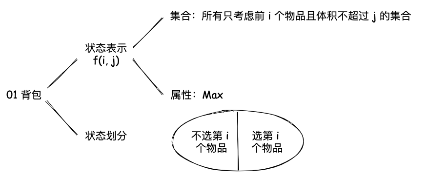
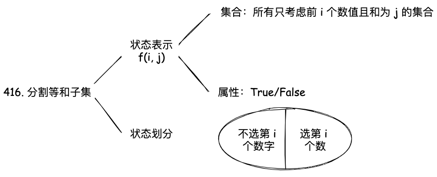
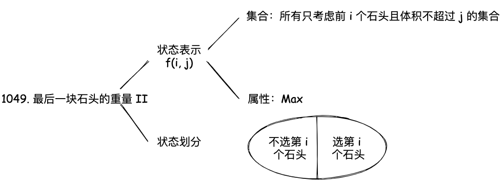
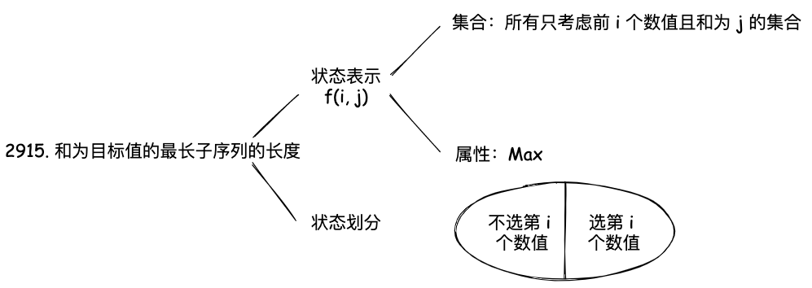
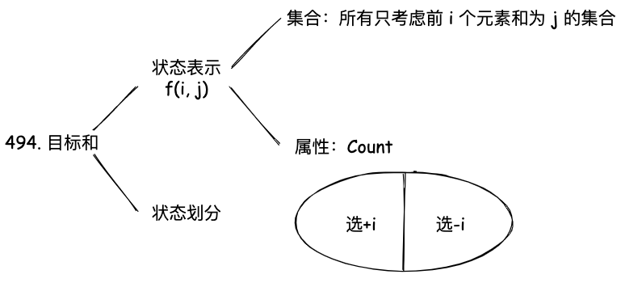
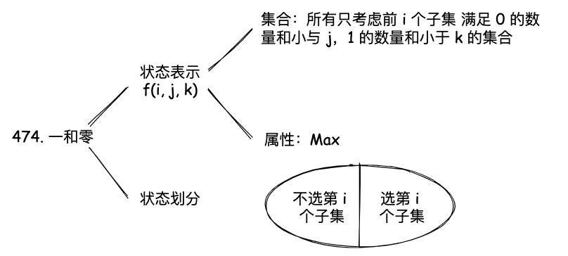
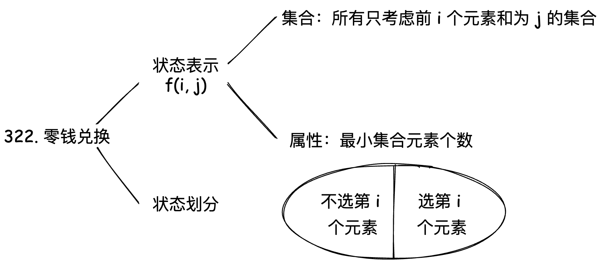
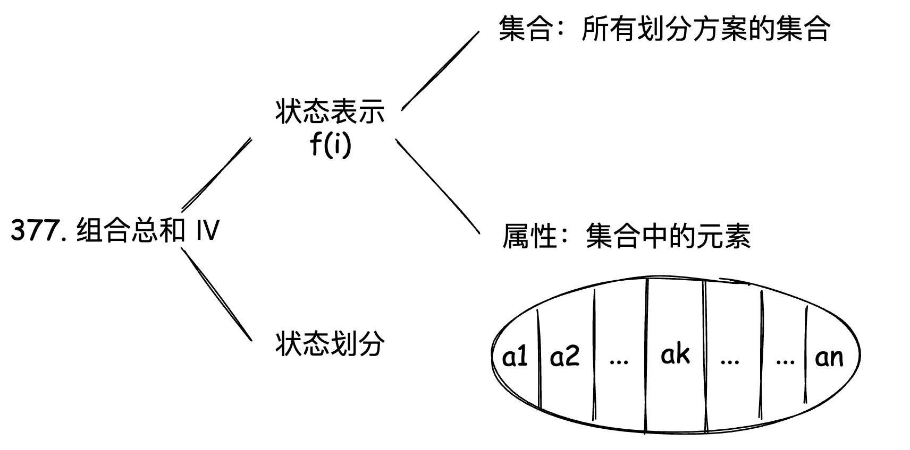

# 备战秋招篇-DP 专题

## 1. 01 背包问题

对于面试的话，其实掌握 01 背包和完全背包，就够用了，最多可以再来一个多重背包。

### 1.1 朴素动态规划

有 N 件物品和一个容量为 V 的背包。第 i 件物品的体积是 v[i]，价值是 w[i]。求解将哪些物品装入背包可使价值总和最大。

  

01 背包问题的状态表示是 `f(i, j)`，表示前 i 个物品，背包容量为 j 时的最大价值。它的属性是 Max， 也就是求最大值。对于 `f(i, j)`，可以将其分为两种情况，这样的分法是不重不漏的：

- 第 i 个物品不放入背包，那么 `f(i, j) = f(i - 1, j)`
- 第 i 个物品放入背包，那么 `f(i, j) = f(i - 1, j - v[i]) + w[i]`

所以，状态转移方程是：

$$
\text{f}(\text i, \text j) = \max(\text f(\text i - 1, \text j), \text f(\text i - 1, \text j - \text v[\text i]) + \text w[\text i])
$$

这里给一个简单的模板代码：

```cpp
int dp[N + 1][V + 1];
int v[N + 1], w[N + 1];

// 省略输入部分

memset(dp, 0, sizeof(dp));
for (int i = 1; i <= N; i++) {
    for (int j = 0; j <= V; j++) {
        dp[i][j] = dp[i - 1][j];
        if (j >= v[i]) {
            dp[i][j] = max(dp[i][j], dp[i - 1][j - v[i]] + w[i]);
        }
    }
}
```


### 1.2 优化空间复杂度

在朴素动态规划的基础上，可以发现，`f(i, j)` 只和 `f(i - 1, j)` 和 `f(i - 1, j - v[i])` 有关，也是说在 i 这个纬度上，只和 i - 1 有关，所以我们可以使用滚动数组的方式，将二维数组优化为一维数组。

但是这里需要注意一个问题，就是如果还是按照朴素版本的遍历方法，那么会出现 `f(j)` 会被 `f(j - v[i])` 更新，但是 j 是大于 j - v[i] 的，计算 j 的时候，j - v[i] 已经被更新过了，也就是说已经不是上一轮的值了，所以这里需要从大到小遍历。

接下来我们看看代码怎么写：

```cpp
int dp[V + 1]; // 一维数组
int v[N + 1], w[N + 1];

// 省略输入部分
memset(dp, 0, sizeof(dp));
for (int i = 1; i <= N; i++) {
    for (int j = V; j >= v[i]; j--) {
        dp[j] = max(dp[j], dp[j - v[i]] + w[i]);
    }
}
```

### [416. 分割等和子集](https://leetcode.cn/problems/partition-equal-subset-sum/description/)

给你一个 只包含正整数 的 非空 数组 nums 。请你判断是否可以将这个数组分割成两个子集，使得两个子集的元素和相等。

这题是 01 背包问题的变种，我们可以将这个问题转化为背包问题，背包的容量为 sum / 2，每个物品的体积和价值都是 nums[i]，最后看看是否能够**刚刚好装满背包**。

这个问题的状态表示是 `f(i, j)`，表示前 i 个物品，背包容量为 j 时，是否可以刚刚好装满背包。它的属性是 True/False，也就是求是否存在解。

  

状态转移方程是：

$$
\text{f}(\text i, \text j) = \text{f}(\text i - 1, \text j) \text{ or } \text{f}(\text i - 1, \text j - \text{nums}[\text i])
$$

$\text{f}(\text i - 1, \text j - \text{nums}[\text i])$ 表示的是第 i 个物品放入背包，第 i 个物品如果可以恰好放入背包，那么 $\text{f}(\text i - 1, \text j - \text{nums}[\text i])$ 也应该是 True。

代码如下：

```cpp
class Solution {
public:
    bool canPartition(vector<int>& nums) {
        
        int sum = 0;
        int n = nums.size();
        for (auto a: nums) sum += a;
        if (sum % 2) return false;

        vector<int> dp(sum / 2 + 1);
        dp[0] = 1;
        for (int i = 0;i < n;i ++)
        {
            for (int j = sum / 2;j >= nums[i];j --)
            {
                dp[j] = max(dp[j], dp[j - nums[i]]);
            }
        }
        return dp[sum / 2] > 0;
    }
};
```

注意由于这里的状态表示是是否能够刚刚好装满背包，所以我们需要考虑下初始化的问题，当背包容量为 0 的时候，是可以刚刚好装满的，所以 `dp(0) = 1` 。

### [1049. 最后一块石头的重量 II](https://leetcode.cn/problems/last-stone-weight-ii/description/)

有一堆石头，用整数数组 stones 表示。其中 stones[i] 表示第 i 块石头的重量。

每一回合，从中选出任意两块石头，然后将它们一起粉碎。假设石头的重量分别为 x 和 y，且 x <= y。那么粉碎的可能结果如下：

- 如果 x == y，那么两块石头都会被完全粉碎；
- 如果 x != y，那么重量为 x 的石头将会完全粉碎，而重量为 y 的石头新重量为 y-x。

最后，最多只会剩下一块石头。返回此石头最小的可能重量 。如果没有石头剩下，就返回 0。

这题如果没见过真的很难想到是动态规划，所以动规还是要多写多见（Doge)


  

首先我们先看看他的状态表示是什么，这里我们可以用一个背包问题来表示，我们可以将这个问题转化为背包问题，背包的容量为 sum / 2，每个物品的体积和价值都是 stones[i]，最后看看最多能装多少。可以看到转化后就是一个标注的 01 背包问题。

:::tip

为什么是看最多能装多少，而不是刚刚好装满呢？因为这里是求最后一块石头的最小重量，所以我们需要尽可能的装满背包，所以这里是求最多能装多少，装的最多也就是消掉最多。

:::

在最后我们还需要思考一下答案是什么，`dp[sum / 2]` 表示最多能装多少，也可以理解为把石头分为两堆，使得其中一堆的重量尽可能接近总重量的一半。另一堆的重量就是总重量减去这一堆的重量，也就是 `sum - dp[sum / 2]`。用较大的减去较小的，就是最后一块石头的最小重量。最终答案就是 `sum - 2 * dp[sum / 2]`。

下面我们来看看代码：

```cpp
class Solution {
public:
    int lastStoneWeightII(vector<int>& stones) {
        int n = stones.size();
        int sum = 0;
        for (auto a: stones) sum += a;
        int target = sum / 2;
        vector<int> dp(target + 1);
        for (int i = 0;i < n;i ++)
        {
            for (int j = target;j >= stones[i];j --)
                dp[j] = max(dp[j], dp[j - stones[i]] + stones[i]);
        }
        return sum - dp[target] - dp[target];
    }
};
```

### [2915. 和为目标值的最长子序列的长度](https://leetcode.cn/problems/length-of-the-longest-subsequence-that-sums-to-target/description/)


给你一个下标从 0 开始的整数数组 nums 和一个整数 target 。

返回和为 target 的 nums 子序列中，子序列 长度的最大值 。如果不存在和为 target 的子序列，返回 -1 。

子序列 指的是从原数组中删除一些或者不删除任何元素后，剩余元素保持原来的顺序构成的数组。

这题和上面的题目[416. 分割等和子集](https://leetcode-cn.com/problems/partition-equal-subset-sum/)很像，但是这里是求最长的子序列，所以我们需要记录的是长度，而不是是否存在解。

状态表示是 `f(i, j)`，表示前 i 个物品，和为 j 时的最长子序列长度。它的属性是 Max，也就是求最大值。不过这里的最大值是长度，而不是价值。注意 01 背包接这类恰好装满的问题，我们需要考虑初始化的问题，当背包容量为 0 的时候，是可以刚刚好装满的，序列长度为 0，所以 `dp[0] = 0`。而且这里还需要考虑 `j-nums[i]` 是否在数组内，如果不在数组内，那么 `dp[j] = INT_MIN`, 为什么要是 INT_MIN 呢？因为这里是求最大值，如果不在数组内，那么就是不合法的，所以应该是负无穷。如果设置的比较小，因为每次 `dp[j] = max(dp[j], dp[j - nums[i]] + 1)`，万一被加到大于 0，那么就会出现错误。

:::note

这类恰好装满的问题，经常需要考虑初始化的问题，但并不是说其他的 01 背包问题就不需要初始化，比如朴素的 01 背包问题，我们也需要初始化，只不过初始化的值是 0。

:::

  


状态转移方程是：

$$
\text{f}(\text i, \text j) = max(\text{f}(\text i - 1, \text j), \text{f}(\text i - 1, \text j - \text{nums}[\text i]) + 1)
$$

代码如下：

```cpp
class Solution {
public:
    int lengthOfLongestSubsequence(vector<int>& nums, int target) {
        int n = nums.size();
        vector<int> dp(target + 1, INT_MIN);
        dp[0] = 0;
        for (int i = 0;i < n;i ++)
        {
            for (int j = target;j >= nums[i];j --)
                dp[j] = max(dp[j], dp[j - nums[i]] + 1);
        }
        return dp[target] > 0 ? dp[target] : -1;
    }
};
```

### [494. 目标和](https://leetcode.cn/problems/target-sum/description/)

给你一个非负整数数组 `nums` 和一个整数 `target` 。

向数组中的每个整数前添加 `'+'` 或 `'-'` ，然后串联起所有整数，可以构造一个 **表达式** ：

-   例如，`nums = [2, 1]` ，可以在 `2` 之前添加 `'+'` ，在 `1` 之前添加 `'-'` ，然后串联起来得到表达式 `"+2-1"` 。

返回可以通过上述方法构造的、运算结果等于 `target` 的不同 **表达式** 的数目。

这题在普通求目标和的基础上，给每个数添加了正负号，并且需要记录方案数，我们可以看到这里的本质还是求和为 target 的方案数。

  

状态表示是 `f(i, j)`，表示前 i 个物品，和为 j 时的方案数。它的属性是 Sum，也就是求和。在状态划分的时候，对于 `f(i, j)`，可以将其分为两种情况，也就是 i 取 `+nums[i]` 和 `-nums[i]`。因为这题里面是每个元素都要取的，这点和普通的 01 背包问题不一样。所以 `f(i, j)` 就可以由 `f(i - 1, j - nums[i])` 和 `f(i - 1, j + nums[i])` 转移过来。最终可以得到状态转移方程是：

$$
\text{f}(\text i, \text j) = \text{f}(\text i - 1, \text j - \text{nums}[\text i]) + \text{f}(\text i - 1, \text j + \text{nums}[\text i])
$$

这里需要注意由于 i 状态依赖于 i - 1 的状态, 但是是需要用到 `j - nums[i]` 和 `j + nums[i]` 的状态，所以这里我们就没办法使用滚动数组的方式来优化空间复杂度了，因为无论是从小到大还是从大到小，都会出现 `j - nums[i]` 和 `j + nums[i]` 的状态被更新的问题。

代码如下：

```cpp
class Solution {
public:
    int findTargetSumWays(vector<int>& nums, int target) {
        int n = nums.size();
        int sum = 0;

        for (int i: nums) sum += i;

        if (abs(target) > sum) return 0;

        int offset = sum;
        vector<vector<int>> dp(n + 1, vector<int>(2 * sum + 1));

        dp[0][offset] = 1;
        for (int i = 1;i <= n;i ++)
        {
            for (int j = -sum;j <= sum;j ++)
            {
                if (j - nums[i - 1] >= -sum)
                    dp[i][j + offset] += dp[i - 1][j - nums[i - 1] + offset];
                if (j + nums[i - 1] <= sum)
                    dp[i][j + offset] += dp[i - 1][j + nums[i - 1] + offset];
            }
        }
        return dp[n][target + offset];
    }
};
```

这个题目里面还有一个小技巧，因为 target 的值可能是负数，所以我们需要有一个偏移量 offset，这样就可以将负数转化为正数，这样就可以使用数组来表示了。

### [474. 一和零](https://leetcode.cn/problems/ones-and-zeroes/description/)

给你一个二进制字符串数组 strs 和两个整数 m 和 n 。

请你找出并返回 strs 的最大子集的长度，该子集中 最多 有 m 个 0 和 n 个 1 。

如果 x 的所有元素也是 y 的元素，集合 x 是集合 y 的 子集 。

这题也是 01 背包 的一个变种，这题里面物品的体积有俩个维度，一个是 0 的个数，一个是 1 的个数，然后求的是最大的子集长度。

  

状态表示是 `f(i, j, k)`，表示前 i 个物品，0 的个数为 j，1 的个数为 k 时的最大子集长度。它的属性是 Max，这里的最大值是长度，而不是价值，对应的我们的状态表示里面对应的也是长度。状态转移方程是：

$$
\text{f}(\text i, \text j, \text k) = \max(\text{f}(\text i - 1, \text j, \text k), \text{f}(\text i - 1, \text j - \text{zeros}[\text i], \text k - \text{ones}[\text i]) + 1)
$$

代码如下：

```cpp
class Solution {
public:
    int findMaxForm(vector<string>& strs, int m, int n) {
        int len = strs.size();

        vector<int> zero_count(len, 0);
        vector<int> one_count(len, 0);
        for (int i = 0;i < len;i ++)
        {
            auto s = strs[i];
            for (char c: s)
            { 
                if (c == '0') zero_count[i] ++;
                else if (c == '1') one_count[i] ++;
            }
        }

        vector<vector<int>> dp(m + 1, vector<int>(n + 1));
        for (int i = 1;i <= len;i ++)
        {
            int one_num = one_count[i - 1];
            int zero_num = zero_count[i - 1];
            for (int j = m;j >= zero_num;j --)
            {
                for (int k = n;k >= one_num;k --)
                {
                    dp[j][k] = max(dp[j][k], dp[j - zero_num][k - one_num] + 1);
                }
            }
        }
        return dp[m][n];
    }
};
```

### 小结

通过这几道题目可以发现，01 背包的问题的变种基本都是 `判断是否可以刚刚好装满` 的问题。

比如，[416. 分割等和子集](https://leetcode.cn/problems/partition-equal-subset-sum/description/) 其实就是求是否存在元素和刚刚好是 `sum/2`, [1049. 最后一块石头的重量 II](https://leetcode.cn/problems/last-stone-weight-ii/description/) 也是如出一辙。在 `是否刚刚好能装满的问题` 上还可以进一步变种，比如记录方案数 （[2915. 和为目标值的最长子序列的长度](https://leetcode.cn/problems/length-of-the-longest-subsequence-that-sums-to-target/description/)）。在记录状态数的基础上，还可以进一步变种，比如 [494. 目标和](https://leetcode.cn/problems/target-sum/description/)，这里在记录方案数的基础上，还需要记录正负号。

万变不离其宗，遇到这类问题的解题目思路还是一样的，首先判断是不是 01 背包的问题，然后去想状态表示，然后再去想状态转移方程。最后再去考虑初始化的问题。

## 2. 完全背包问题

完全背包问题和 01 背包问题的区别在于，每个物品可以取无限次。

完全背包的状态表示和 01 背包一样，也是 `f(i, j)`，表示前 i 个物品，背包容量为 j 时的最大价值。它的属性是 Max，也就是求最大值。对于 `f(i, j)`，可以将其分为两种情况：

- 第 i 个物品不放入背包，那么 `f(i, j) = f(i - 1, j)`
- 第 i 个物品放入背包，那么 `f(i, j) = f(i, j - v[i]) + w[i]`

为什么第 i 个物品放入背包的时候，是 `f(i, j - v[i])` 而不是 `f(i - 1, j - v[i])` 呢？因为这里是完全背包问题，每个物品可以取无限次，所以还是取第 i 个物品，只是容量变为了 `j - v[i]`。

这里由于 `f(i, j - v[i])` 不在依赖于 i - 1，所以我们在把它优化成一维数组的时候，可以从小到大遍历。

模板代码如下：

```cpp
int dp[V + 1]; // 一维数组
int v[N + 1], w[N + 1];
// 省略输入部分
memset(dp, 0, sizeof(dp));
for (int i = 1; i <= N; i++) {
    for (int j = v[i]; j <= V; j++) {
        dp[j] = max(dp[j], dp[j - v[i]] + w[i]);
    }
}
```

### [518. 零钱兑换 II](https://leetcode-cn.com/problems/coin-change-2/)

给你一个整数数组 `coins` 表示不同面额的硬币，另给一个整数 `amount` 表示总金额。

请你计算并返回可以凑成总金额的硬币组合数。如果任何硬币组合都无法凑出总金额，返回 `0` 。

假设每一种面额的硬币有无限个。 

题目数据保证结果符合 32 位带符号整数。

这题就是一个板子题，完全背包问题，每个硬币可以取无限次。但是这里的测试用力比较坑，虽然保证了有解的时候结果符合 32 位带符号整数，但是当没有解的时候，结果可能会超过 32 位带符号整数，所以我们需要做俩次动态规划，第一次是求是否有解，第二次是求解的个数。

```cpp
class Solution {
public:
    int change(int amount, vector<int>& coins) {
        vector<int> dp(amount + 1), valid(amount + 1);

        dp[0] = 1;
        valid[0] = 1;
        for (int coin: coins)
        {
            for (int i = coin;i <= amount;i ++)
                valid[i] |= valid[i - coin];
        }
        if(!valid[amount]) return 0;

        for (int coin: coins)
        {
            for (int i = coin;i <= amount;i ++)
                dp[i] += dp[i - coin];
        }
        return dp[amount];
    }
};
```

### [322. 零钱兑换](https://leetcode.cn/problems/coin-change/description/)

给你一个整数数组 `coins` ，表示不同面额的硬币；以及一个整数 `amount` ，表示总金额。

计算并返回可以凑成总金额所需的 **最少的硬币个数** 。如果没有任何一种硬币组合能组成总金额，返回 `-1` 。

你可以认为每种硬币的数量是无限的。

  

这题我们需要求的是和为 j 且硬币个数最少的方案数，所以我们需要初始化为 `INT_MAX`，这样在状态转移的时候，可以取最小值。状态表示 `f(i, j)` 还是表示前 i 个物品，和为 j 时的最少硬币个数。它的属性最小集合的大小，所以状态转移方程是：

$$
\text{f}(\text i, \text j) = \min(\text{f}(\text i - 1, \text j), \text{f}(\text i, \text j - \text{coins}[\text i]) + 1)
$$

代码如下：

```cpp
class Solution {
public:
    int coinChange(vector<int>& coins, int amount) {
        int n = coins.size();

        vector<int> dp(amount + 1, INT_MAX - 1);
        dp[0] = 0;
        for (int coin: coins)
        {
            for(int i = coin;i <= amount;i ++)
                dp[i] = min(dp[i - coin] + 1, dp[i]);
        }
        return dp[amount] < INT_MAX - 1 ? dp[amount] : -1;
    }
};
```

#### [279. 完全平方数](https://leetcode.cn/problems/perfect-squares/description/)

给你一个整数 `n` ，返回和为 `n` 的完全平方数的最少数量。

**完全平方数** 是一个整数，其值等于另一个整数的平方；换句话说，其值等于一个整数自乘的积。例如，`1`、`4`、`9` 和 `16` 都是完全平方数，而 `3` 和 `11` 不是。

这题的思路和 [322. 零钱兑换](https://leetcode-cn.com/problems/coin-change/description/) 是一样的，只不过这里的硬币是完全平方数。我们可以先把完全平方数都找出来，然后再用完全背包的思路来做，比较简单这里就直接放代码了。

```cpp
class Solution {
public:
    int numSquares(int n) {
        vector<int> nums;
        int i = 0;
        while (i * i <= n)
        {
            nums.push_back(i * i);
            i ++;
        }

        int m = nums.size();
        vector<int> dp(n + 1, INT_MAX - 1);
        dp[0] = 0;

        for (int i = 0;i < m;i ++)
        {
            for (int j = nums[i]; j <= n;j ++)
                dp[j] = min(dp[j], dp[j - nums[i]] + 1);
        }

        return dp[n];
    }
};
```

### 小结

完全背包和 01 背包的区别在于，每个物品可以取无限次。题目的类型相比较 01 背包问题要少一些，思路相对来说比较简单一些。最常见的一类题目就是组合数的问题，比如 [518. 零钱兑换 II](https://leetcode-cn.com/problems/coin-change-2/)，[322. 零钱兑换](https://leetcode-cn.com/problems/coin-change/description/)，[279. 完全平方数](https://leetcode-cn.com/problems/perfect-squares/description/) 等他们本质上都是求组合数。

## 3. 多重背包问题

多重背包问题和 01 背包问题的区别在于，每个物品可以取多次。多重背包问题可以转换为 0/1 背包问题，我们只需要将每个物品的多次选择视为多个不同的物品，然后使用标准的 0/1 背包算法来解决就可以了。

假设有 3 个物品，分别为：

- 物品 1：重量 2，价值 3，可以放入背包最多 3 次。
- 物品 2：重量 3，价值 4，可以放入背包最多 2 次。
- 物品 3：重量 4，价值 5，可以放入背包最多 1 次。

并且有一个背包，容量为 8。我们可以将物品 1 拆分成 3 个物品，物品 2 拆分成 2 个物品，物品 3 拆分成 1 个物品，这样就可以转化为 0/1 背包问题。

- 物品 1 拆解为 3 个物品：（重量 2，价值 3）、（重量 2，价值 3）、（重量 2，价值 3）
- 物品 2 拆解为 2 个物品：（重量 3，价值 4）、（重量 3，价值 4）
- 物品 3 拆解为 1 个物品：（重量 4，价值 5）

这样就可以转化为 0/1 背包问题，然后使用标准的 0/1 背包算法来解决。

纯的多重背包，Leetcode 上没有，但是有用多重背包来解排列的问题，这个题目我们在下一个小结中再介绍。

## 4. 看起来像背包问题的排列问题

有一类题目，看起来像背包问题，但是实际上是排列问题。这类题目的特点是，每个物品可以取多次，但是取的顺序是有关系的，比如排列问题。

为什么背包不能解决排列问题呢？因为背包问题是求组合数，不能区分顺序，而排列问题是求排列数，需要区分顺序。

### [377. 组合总和 Ⅳ](https://leetcode.cn/problems/combination-sum-iv/description/)

给你一个由 **不同** 整数组成的数组 `nums` ，和一个目标整数 `target` 。请你从 `nums` 中找出并返回总和为 `target` 的元素组合的个数。

这题一看起来你可能以为是一个完全背包问题，但是实陵上是一个排列问题。这里的状态表示是 `f(i)`，表示所有划分方案的集合。它的属性是集合中的元素数量。对于 `f(i)` 我们可以将其以 `nums[j]` 为结尾的所有方案的集合的和，状态转移方程是：

$$
\text{f}(\text i) = \sum_{\text j = 0}^{\text n} \text{f}(\text i - \text{nums}[\text j])
$$

  

代码如下：

```cpp
class Solution {
public:
    int combinationSum4(vector<int>& nums, int target) {
        vector<unsigned> dp(target + 1);

        dp[0] = 1;
        for (int j = 0;j <= target;j ++)
            for (int num: nums)
            {
                if (j - num >= 0)
                    dp[j] += dp[j - num];
            }
        return dp[target];
    }
};
```

### [139.单词拆分](https://leetcode.cn/problems/word-break/description/)

给定一个**非空**字符串 *s* 和一个包含**非空**单词的列表 *wordDict*，判定 *s* 是否可以被空格拆分为一个或多个在字典中出现的单词。

这题其实和上面的题目是一样的，只不过这里的状态表示是 `f(i)`，表示前 i 个字符是否可以被拆分。它的属性是 True/False。对于 `f(i)` 我们同样可以将其以 `wordDict[j]` 为结尾的所有方案的集合的和。这题还有一个技巧，就是我们需要反复的比较 `wordDict[j]` 和 `s[i - wordDict[j].size(), i]` 是否相等，这里我们可以先使用一个哈希表来存储 `wordDict`，然后在遍历的时候从 n-1 到 0 遍历，这样在内层循环的时候，我们可以初始化一个空字符串 `ss`，每次循环的时候，我们就可以直接在这个字符串后面加上 `s[j]` ，这样直接查询哈希表是否存在这个字符串就可以了。


```cpp
class Solution {
public:
    bool wordBreak(string s, vector<string>& wordDict) {
        int n = s.length();
        unordered_set<string> h;
        for (auto item: wordDict) h.insert(item);
        vector<int> dp(n + 1);

        dp[n] = 1;
        for (int i = n - 1;i >= 0;i --)
        {
            string ss = "";
            for (int j = i;j < n;j ++)
            {
                ss += s[j];
                // 如果 ss 在哈希表中，且 dp[j + 1] 为 True
                // 也就是 s[j + 1, n] 也可以被拆分
                // 那么 s[i, n] 也可以被拆分 => dp[i] = 1
                if (dp[j + 1] && h.count(ss))
                {
                    dp[i] = 1;
                    break;
                }
            }
        }
        return dp[0];
    }
};
```

## 5. 经典线性 DP

### 5.1 什么是线性 DP

线性 DP 是一种动态规划方法，其中每个状态的值仅依赖于前一个状态的值，而不依赖于更前面的状态。这种方法通过递推关系逐步计算出最终结果，通常用于解决具有线性结构的问题，如最长递增子序列、斐波那契数列等。

下面我们来看看一些经典的线性 DP 问题。

### 5.2 最长公共子序列（LCS）

一般来说，求两个字符串的最长公共子序列，我们可以使用动态规划来解决。这个问题的状态表示是 `f(i, j)`，表示 `text1[0, i]` 和 `text2[0, j]` 的最长公共子序列的长度。它的属性是 Max，也就是求最大值。对于 `f(i, j)`，我们可以将其分为两种情况：

- `text1[i] == text2[j]`，那么 `f(i, j) = f(i - 1, j - 1) + 1`
- `text1[i] != text2[j]`，那么 `f(i, j) = max(f(i - 1, j), f(i, j - 1))`

这个问题的状态转移方程是：

$$
\text{f}(\text i, \text j) = \begin{cases} \text{f}(\text i - 1, \text j - 1) + 1 & \text{if } \text{text1}[\text i] == \text{text2}[\text j] \\ \max(\text{f}(\text i - 1, \text j), \text{f}(\text i, \text j - 1)) & \text{if } \text{text1}[\text i] \neq \text{text2}[\text j] \end{cases}
$$


这里看起来和背包问题一样由于每次状态只依赖于前一个状态，但是这里并不能使用滚动数组来优化空间复杂度，因为我们需要用到 `f(i - 1, j - 1)` 和 `f(i, j - 1)` 的状态，所以我们还是需要使用二维数组来存储状态。


#### [1143. 最长公共子序列](https://leetcode.cn/problems/longest-common-subsequence/)

给定两个字符串 `text1` 和 `text2`，返回这两个字符串的最长公共子序列的长度。

这题就是最长子序列的模板题，下面是代码：

```cpp
class Solution {
public:
    int longestCommonSubsequence(string text1, string text2) {
        int n = text1.size();
        int m = text2.size();
        text1 = " " + text1;
        text2 = " " + text2;
        vector<vector<int>> dp(n + 1, vector<int>(m + 1));

        for (int i = 1;i <= n;i ++)
        {
            for (int j = 1;j <= m;j ++)
            {
                if (text1[i] == text2[j])
                    dp[i][j] = dp[i - 1][j - 1] + 1;
                else 
                    dp[i][j] = max(dp[i - 1][j], dp[i][j - 1]);
            }
        }
        return dp[n][m];
    }
};
```

#### [583. 两个字符串的删除操作](https://leetcode-cn.com/problems/delete-operation-for-two-strings/description/)

给定两个单词 `word1` 和 `word2`，找到使得 `word1` 和 `word2` 相同所需的最小步数，每步可以删除任意一个字符串中的一个字符。

这题和上面的题目基本是一样的，但是我们需要多考虑一些情况，这题里面有可能 word1 和 word2 是一样的情况，这个时候我们就不需要删除了，直接返回 0，如果 word1 和 word2 每个字符都不一样，那么我们就需要删除所有的字符，所以返回 `n + m`。要怎么才能兼顾考虑这俩种情况呢？我们可以先求出最长公共子序列的长度，然后用 `n + m - 2 * lcs` 就可以了。

为什么是 `n + m - 2 * lcs` 呢？因为我们需要删除的字符数是 `n - lcs` 和 `m - lcs`，所以总共需要删除的字符数是 `n + m - 2 * lcs`。

```cpp
class Solution {
public:
    int minDistance(string word1, string word2) {
        int n = word1.size();
        int m = word2.size();

        word1 = " " + word1;
        word2 = " " + word2;

        vector<vector<int>> dp(n + 1, vector<int>(m + 1));

        for (int i = 1; i <= n; i ++)
        {
            for (int j = 1; j <= m;j ++)
            {
                if (word1[i] == word2[j])
                    dp[i][j] = dp[i - 1][j - 1] + 1;
                else
                    dp[i][j] = max(dp[i - 1][j], dp[i][ j - 1]);
            }
        }
        return n + m - 2 * dp[n][m];
    }
};
```

类似的题目还有 [712. 两个字符串的最小 ASCII 删除和](https://leetcode-cn.com/problems/minimum-ascii-delete-sum-for-two-strings/description/)，这题和上面的题目基本一样，只不过我们需要求的是删除字符的 ASCII 码的和。

### [72. 编辑距离](https://leetcode-cn.com/problems/edit-distance/description/)

给你两个单词 `word1` 和 `word2`，请你计算出将 `word1` 转换成 `word2` 所使用的最少操作数。

你可以对一个单词进行如下三种操作：

- 插入一个字符
- 删除一个字符
- 替换一个字符

这题比较经典，我们可以使用动态规划来解决。这个问题的状态表示是 `f(i, j)`，表示 `word1[0, i]` 和 `word2[0, j]` 的最小操作数。它的属性是 Min，也就是求最小值。对于 `f(i, j)`，我们可以将其分为俩种情况：

- `word1[i] == word2[j]`，那么 `f(i, j) = f(i - 1, j - 1)`
- `word1[i] != word2[j]`，那么 `f(i, j) = min(f(i - 1, j), f(i, j - 1), f(i - 1, j - 1)) + 1`

- `f(i - 1, j)` 表示删除 `word1[i]`
- `f(i, j - 1)` 表示插入 `word2[j]`
- `f(i - 1, j - 1)` 表示替换 `word1[i]` 为 `word2[j]`

为什么这个问题可以分解到只考虑“最后一位字符”的操作？

想象一下，`A[1..i]` 要变成 `B[1..j]`，最终达成匹配的那一刻有且只有两种情况：

1. A[i] 与 B[j] 已经是相同的字符，此时不需要对 A[i] 或 B[j] 再进行任何修改，那么最终的编辑次数就等于将 A[1..i-1] 变成 B[1..j-1] 的编辑次数 f[i-1][j-1]
2. A[i] 与 B[j] 不同或者不匹配，需要通过一次“操作”来让最终的状态达成一致

重点是，任何一个将 A[1..i] 变为 B[1..j] 的最优编辑方案的“最后一步”一定涉及到 A[i] 和/或 B[j]。为什么？因为当你完成了整个转换，A 和 B 最终对齐匹配，其中最后一个字符位置的关系，是最直观、最底层的分界。

让我们从最后一步入手，把所有的可能性细分：

1. 情况 1：增加操作
假设最后一步是“在 A 的末尾增加一个字符”，以使得 A[1..i] 变成了 B[1..j]。如果最后一步是增加，那么增加的一定是 B[j]，因为你最终想匹配到 B 的末尾。这时，在增加 B[j] 之前，你的 A[1..i] 应该已经与 B[1..j-1]匹配了。所以此时的编辑距离是：f[i][j] = f[i][j-1] + 1（先把 A[1..i] 变成 B[1..j-1]，然后再增加一个字符 B[j]，总步数 = 前面步骤数 + 1）
2. 情况 2：删除操作
假设最后一步是从 A 中删除掉它的最后一个字符 A[i]，这样才能与 B[1..j]匹配。
如果要删除 A[i]，那么在删除之前 A[1..i-1] 一定已经与 B[1..j] 匹配了。
所以 f[i][j] = f[i-1][j] + 1。
3. 情况 3：替换操作
假设最后一步是对 A[i] 进行替换，使它变成 B[j]。
那么在替换前，A[1..i-1] 与 B[1..j-1] 已经匹配完成。然后再将 A[i] 改成 B[j]，
所以 f[i][j] = f[i-1][j-1] + 1。（如果 A[i] != B[j]）
4. 情况 4：什么都不做
如果最后一个字符已经匹配（A[i] == B[j]），那么根本不需要对最后一位进行增删改操作。
此时 f[i][j] = f[i-1][j-1]。（+0 操作，因为已经匹配好了）

通过这四种情况，我们将“最后一步操作”这个问题进行完整划分。增、删、改、或无需操作，这四种情况不重不漏地覆盖了所有可能的编辑方式。

关键点在于, 无论你的最优解原本是在哪个位置动手操作的，因为操作的独立性和可交换性（不影响最终编辑距离），你总能将最后一步安排在 A[i] 和 B[j] 的位置。这样，我们就可以放心地只考虑对 A[i]、B[j] 末尾字符的操作。

每次处理最后那个待匹配字符”的流程。就像搭积木一样：要让前 i 个积木搭成与另一堆前 j 块一样的造型，你不是最后再去动中间的积木，因为如果中间没对齐，你早就应该前面阶段就把它对齐了。从整体到局部，再从局部到最后一块，所有中间步骤加上合理的重排，都可以抽象为在解决 f[i][j] 时，对最后一块拼上、拆下或者改一下。

前面都分析清楚了之后，我们就可以写出状态转移方程了：

$$
\text{f}(\text i, \text j) = \begin{cases} \text{f}(\text i - 1, \text j - 1) & \text{if } \text{word1}[\text i] == \text{word2}[\text j] \\ \min(\text{f}(\text i - 1, \text j), \text{f}(\text i, \text j - 1), \text{f}(\text i - 1, \text j - 1)) + 1 & \text{if } \text{word1}[\text i] \neq \text{word2}[\text j] \end{cases}
$$

此外我们还需要考虑初始化的问题，当 `i = 0` 或者 `j = 0` 的时候，我们需要初始化 `f(i, j)` 的值，这个时候 `f(i, j)` 的值就是 `i` 或者 `j`。因为当 `i = 0` 的时候，`word1[0, 0]` 为空字符串，所以我们需要删除 `j` 个字符，所以 `f(0, j) = j`。同理，当 `j = 0` 的时候，`f(i, 0) = i`。

代码如下：

```cpp
class Solution {
public:
    int minDistance(string word1, string word2) {
        int n = word1.size();
        int m = word2.size();

        word1 = " " + word1;
        word2 = " " + word2;

        vector<vector<int>> dp(n + 1, vector<int>(m + 1));

        for (int i = 0;i <= n;i ++)
            dp[i][0] = i;
        for (int i = 0;i <= m;i ++)
            dp[0][i] = i;

        for (int i = 1;i <= n;i ++)
        {
            for (int j = 1;j <= m;j ++)
            {
                if (word1[i] == word2[j])
                    dp[i][j] = dp[i - 1][j - 1];
                else
                    dp[i][j] = min(dp[i - 1][j], min(dp[i][j - 1], dp[i - 1][j - 1])) + 1;
            }
        }
        return dp[n][m];
    }
};
```


