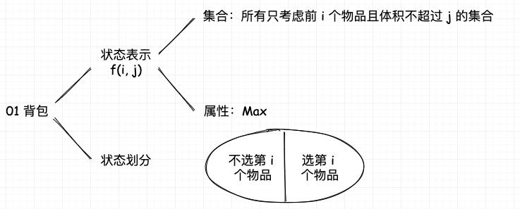
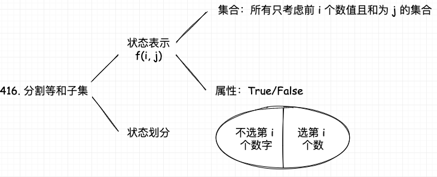
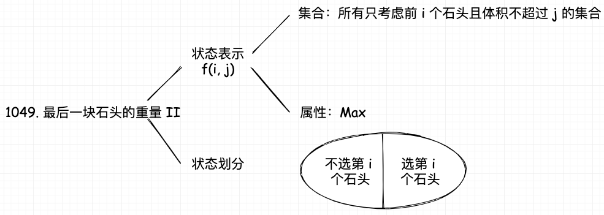
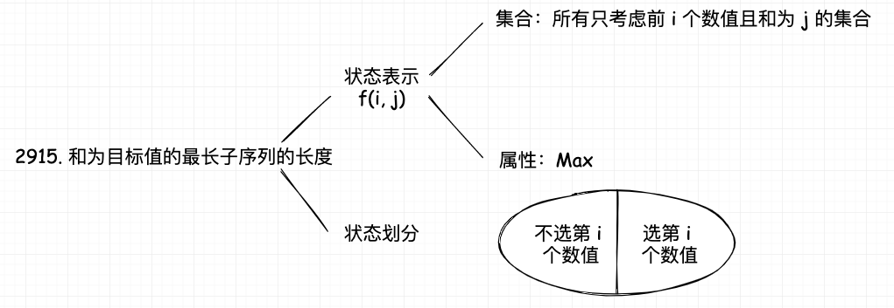

# 备战秋招篇-DP 专题

## 1. 01 背包问题

对于面试的话，其实掌握 01 背包和完全背包，就够用了，最多可以再来一个多重背包。

### 1.1 朴素动态规划

有 N 件物品和一个容量为 V 的背包。第 i 件物品的体积是 v[i]，价值是 w[i]。求解将哪些物品装入背包可使价值总和最大。

  

01 背包问题的状态表示是 `f(i, j)`，表示前 i 个物品，背包容量为 j 时的最大价值。它的属性是 Max， 也就是求最大值。对于 `f(i, j)`，可以将其分为两种情况，这样的分法是不重不漏的：

- 第 i 个物品不放入背包，那么 `f(i, j) = f(i - 1, j)`
- 第 i 个物品放入背包，那么 `f(i, j) = f(i - 1, j - v[i]) + w[i]`

所以，状态转移方程是：

$$
\text{f}(\text i, \text j) = \max(\text f(\text i - 1, \text j), \text f(\text i - 1, \text j - \text v[\text i]) + \text w[\text i])
$$

这里给一个简单的模板代码：

```cpp
int dp[N + 1][V + 1];
int v[N + 1], w[N + 1];

// 省略输入部分

memset(dp, 0, sizeof(dp));
for (int i = 1; i <= N; i++) {
    for (int j = 0; j <= V; j++) {
        dp[i][j] = dp[i - 1][j];
        if (j >= v[i]) {
            dp[i][j] = max(dp[i][j], dp[i - 1][j - v[i]] + w[i]);
        }
    }
}
```


### 1.2 优化空间复杂度

在朴素动态规划的基础上，可以发现，`f(i, j)` 只和 `f(i - 1, j)` 和 `f(i - 1, j - v[i])` 有关，也是说在 i 这个纬度上，只和 i - 1 有关，所以我们可以使用滚动数组的方式，将二维数组优化为一维数组。

但是这里需要注意一个问题，就是如果还是按照朴素版本的遍历方法，那么会出现 `f(j)` 会被 `f(j - v[i])` 更新，但是 j 是大于 j - v[i] 的，计算 j 的时候，j - v[i] 已经被更新过了，也就是说已经不是上一轮的值了，所以这里需要从大到小遍历。

接下来我们看看代码怎么写：

```cpp
int dp[V + 1]; // 一维数组
int v[N + 1], w[N + 1];

// 省略输入部分
memset(dp, 0, sizeof(dp));
for (int i = 1; i <= N; i++) {
    for (int j = V; j >= v[i]; j--) {
        dp[j] = max(dp[j], dp[j - v[i]] + w[i]);
    }
}
```

### [416. 分割等和子集](https://leetcode.cn/problems/partition-equal-subset-sum/description/)

给你一个 只包含正整数 的 非空 数组 nums 。请你判断是否可以将这个数组分割成两个子集，使得两个子集的元素和相等。

这题是 01 背包问题的变种，我们可以将这个问题转化为背包问题，背包的容量为 sum / 2，每个物品的体积和价值都是 nums[i]，最后看看是否能够**刚刚好装满背包**。

这个问题的状态表示是 `f(i, j)`，表示前 i 个物品，背包容量为 j 时，是否可以刚刚好装满背包。它的属性是 True/False，也就是求是否存在解。



状态转移方程是：

$$
\text{f}(\text i, \text j) = \text{f}(\text i - 1, \text j) \text{ or } \text{f}(\text i - 1, \text j - \text{nums}[\text i])
$$

$\text{f}(\text i - 1, \text j - \text{nums}[\text i])$ 表示的是第 i 个物品放入背包，第 i 个物品如果可以恰好放入背包，那么 $\text{f}(\text i - 1, \text j - \text{nums}[\text i])$ 也应该是 True。

代码如下：

```cpp
class Solution {
public:
    bool canPartition(vector<int>& nums) {
        
        int sum = 0;
        int n = nums.size();
        for (auto a: nums) sum += a;
        if (sum % 2) return false;

        vector<int> dp(sum / 2 + 1);
        dp[0] = 1;
        for (int i = 0;i < n;i ++)
        {
            for (int j = sum / 2;j >= nums[i];j --)
            {
                dp[j] = max(dp[j], dp[j - nums[i]]);
            }
        }
        return dp[sum / 2] > 0;
    }
};
```

注意由于这里的状态表示是是否能够刚刚好装满背包，所以我们需要考虑下初始化的问题，当背包容量为 0 的时候，是可以刚刚好装满的，所以 `dp(0) = 1` 。

### [1049. 最后一块石头的重量 II](https://leetcode.cn/problems/last-stone-weight-ii/description/)

有一堆石头，用整数数组 stones 表示。其中 stones[i] 表示第 i 块石头的重量。

每一回合，从中选出任意两块石头，然后将它们一起粉碎。假设石头的重量分别为 x 和 y，且 x <= y。那么粉碎的可能结果如下：

- 如果 x == y，那么两块石头都会被完全粉碎；
- 如果 x != y，那么重量为 x 的石头将会完全粉碎，而重量为 y 的石头新重量为 y-x。

最后，最多只会剩下一块石头。返回此石头最小的可能重量 。如果没有石头剩下，就返回 0。

这题如果没见过真的很难想到是动态规划，所以动规还是要多写多见（Doge)

  

首先我们先看看他的状态表示是什么，这里我们可以用一个背包问题来表示，我们可以将这个问题转化为背包问题，背包的容量为 sum / 2，每个物品的体积和价值都是 stones[i]，最后看看最多能装多少。可以看到转化后就是一个标注的 01 背包问题。

:::tip

为什么是看最多能装多少，而不是刚刚好装满呢？因为这里是求最后一块石头的最小重量，所以我们需要尽可能的装满背包，所以这里是求最多能装多少，装的最多也就是消掉最多。

:::

在最后我们还需要思考一下答案是什么，`dp[sum / 2]` 表示最多能装多少，也可以理解为把石头分为两堆，使得其中一堆的重量尽可能接近总重量的一半。另一堆的重量就是总重量减去这一堆的重量，也就是 `sum - dp[sum / 2]`。用较大的减去较小的，就是最后一块石头的最小重量。最终答案就是 `sum - 2 * dp[sum / 2]`。

下面我们来看看代码：

```cpp
class Solution {
public:
    int lastStoneWeightII(vector<int>& stones) {
        int n = stones.size();
        int sum = 0;
        for (auto a: stones) sum += a;
        int target = sum / 2;
        vector<int> dp(target + 1);
        for (int i = 0;i < n;i ++)
        {
            for (int j = target;j >= stones[i];j --)
                dp[j] = max(dp[j], dp[j - stones[i]] + stones[i]);
        }
        return sum - dp[target] - dp[target];
    }
};
```

### [2915. 和为目标值的最长子序列的长度](https://leetcode.cn/problems/length-of-the-longest-subsequence-that-sums-to-target/description/)


给你一个下标从 0 开始的整数数组 nums 和一个整数 target 。

返回和为 target 的 nums 子序列中，子序列 长度的最大值 。如果不存在和为 target 的子序列，返回 -1 。

子序列 指的是从原数组中删除一些或者不删除任何元素后，剩余元素保持原来的顺序构成的数组。

这题和上面的题目[416. 分割等和子集](https://leetcode-cn.com/problems/partition-equal-subset-sum/)很像，但是这里是求最长的子序列，所以我们需要记录的是长度，而不是是否存在解。

状态表示是 `f(i, j)`，表示前 i 个物品，和为 j 时的最长子序列长度。它的属性是 Max，也就是求最大值。不过这里的最大值是长度，而不是价值。注意 01 背包接这类恰好装满的问题，我们需要考虑初始化的问题，当背包容量为 0 的时候，是可以刚刚好装满的，序列长度为 0，所以 `dp[0] = 0`。而且这里还需要考虑 `j-nums[i]` 是否在数组内，如果不在数组内，那么 `dp[j] = INT_MIN`, 为什么要是 INT_MIN 呢？因为这里是求最大值，如果不在数组内，那么就是不合法的，所以应该是负无穷。如果设置的比较小，因为每次 `dp[j] = max(dp[j], dp[j - nums[i]] + 1)`，万一被加到大于 0，那么就会出现错误。

:::note

这类恰好装满的问题，经常需要考虑初始化的问题，但并不是说其他的 01 背包问题就不需要初始化，比如朴素的 01 背包问题，我们也需要初始化，只不过初始化的值是 0。

:::

  

状态转移方程是：

$$
\text{f}(\text i, \text j) = max(\text{f}(\text i - 1, \text j), \text{f}(\text i - 1, \text j - \text{nums}[\text i]) + 1)
$$

代码如下：

```cpp
class Solution {
public:
    int lengthOfLongestSubsequence(vector<int>& nums, int target) {
        int n = nums.size();
        vector<int> dp(target + 1, INT_MIN);
        dp[0] = 0;
        for (int i = 0;i < n;i ++)
        {
            for (int j = target;j >= nums[i];j --)
                dp[j] = max(dp[j], dp[j - nums[i]] + 1);
        }
        return dp[target] > 0 ? dp[target] : -1;
    }
};
```


