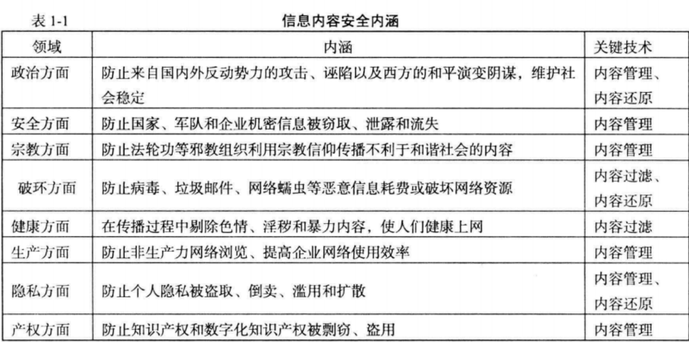

# 内容安全好好复习

## 第一章

### 信息安全内容

:::tip
了解信息内容安全的威胁，掌握信息内容安全的基本概念，熟悉或掌握信息内容的获取，识别和管控基本知识和相关操作技术的学科
:::

#### 信息内容安全要求

内容是安全的，政治上是健康的，法律上是合法的，道德上是符合规范的

#### 信息安全内容的研究内容

信息安全内容的威胁，信息内容安全的法律保障，信息内容的获取，信息内容的分析和识别

#### *信息内容安全的内涵（应用领域）

  

#### 信息内容安全威胁

1. 威胁国家安全：信息的传播产生恶劣影响，例如伊朗政府切断其互联网与世界其他网络联系，直接导致数百万伊朗民众无法登录邮箱和社交网站
2. 威胁公共安全：主要是网络谣言和对集体行动进行动员组织的信息，例如2011年 谣盐 事件
3. 威胁文化安全：身价过亿的的网红歌手，进行涉黄标签产生不良影响

### 网络犯罪分为哪两类？我国网络犯罪有什么新动向？

主要分为两类：
1. 以网络或网络上的计算机为目标的犯罪
2. 以网络作为工具的犯罪

新动向
1. 利用互联网传播小黄片
2. 利用互联网侵犯公共财务
3. 利用互联网侵犯人生权利和民主权利

## 第二章

### 信息检索，信息交互与信息浏览

1. **信息检索**是信息的需求者主动的在网上搜索需要的信息
2. **信息推荐**是网络信息服务平台获取信息后，通过固定的频道推送给用户内容
3. **信息交互**是双向的信息交流，在信息交互的过程中，信息获取个体可以通过交流所获得的信息满足认知上和情感上的信息需求

### 搜索引擎的分类

1. 目录式搜索引擎：以人工的或半自动的方式收集信息，在通过人工方式访问多个Web站点后，对其进行描述，然后根据其内容和性质将其归为一个预先设定好的类别；
2. 通用搜索引擎：通过搜索引擎按照信息采集、建立索引和提供服务的一般流程运行，采用网络爬虫以某种策略对万维网遍历爬取，然后对Web文档进行建立索引等预处理工作，最后对用于的检索返回结果；
3. 元搜索引擎：调用其他搜索引擎的引擎，通过一个统一的界面，帮助用户在多个搜索引擎中选择和利用合适的搜索引擎来进行检索；

### *排级算法

#### PageRank算法

##### 算法流程

网页首先根据链接关系构建起Web网，每个页面设置相同的PageRank值，通过若干轮的计算会得到每个页面最终的PageRank值。每一轮的计算当中网页的PageRank值都会更新。

PageRank值更新的过程：每个页面将当前页面的PageRank值，平均分配到本页面相连的页面上。每个链接都会获得相应的权值，最后页面将入链的权值求和作为新的PageRank值。这样每一个页面就都更新了PageRank值，也就完成了一轮PageRank更新。

##### 算法优缺点

优点：
1. 直接高效：利用一个迭代公式进行计算，	效率高
2. 主题集中：PageRank算法的操作针对某一个主题，可以较好的返回与之重要的消息

缺点：
1. 完全忽视网页的内容
2. 影响因子与网页获取数量缺乏科学性

#### HITS算法

##### 算法流程

每个网页的权值用两个指标来表示：权威值和枢纽值，一个权威值高的网页会被很多网页指向。网页的权威值等于指向它的网页的枢纽值之和。一个网页的枢纽值等于它指向网页的所有权威值的和。HITS的算法流程可表示如下：

1. 初始化：每个节点的权威值和枢纽值都初始化为1
2. 更新节点的权威值（权威值=指向它的网页的枢纽值之和）
3. 更新节点的枢纽值（枢纽值=它指向的网页的权威值之和）
4. 规范化权威值和枢纽值
5. 重复步骤2-4直到最终收敛

##### 算法优缺点
优点
1. 搜索的时候考虑了页面内容，挖掘科学性大大增大
2. 知识范围增大

缺点
1. 实时性差，挖掘效率和实时性低
2. 主题漂移，由知识范围增大的特性决定

#### 算法对比

1. HITS是输入一个查询的关键词，而后才根据关键词构造的网页集合，因此它的搜索结果是和查询内容有关系的。而PageRank是把所有的网页构成的集合当做是一个大的网络
2. PageRank比HITS算法更高效
3. HITS算法中涉及到的网页的数量更少

### 搜索引擎和垃圾信息的关系

#### 什么是垃圾信息

大量的无用的信息、有害信息，以及对人类社会的各个方面带来危害的信息。

#### 搜索引擎优化师

为了让广大的网络用户能够看到自己的页面，网站管理者和网页制作者就想方设法让其站点和页面变得有名，以期用户在进行相关内容查询时，目标网页排在结果集的最前面。

:::tip
*为什么垃圾信息和搜索引擎的斗争像一场军备竞赛？

在与垃圾信息制造者的斗争中，搜索引擎排名算法的有效期越来越短，一旦垃圾信息制造者们掌握了某种排名算法特点，就会有大量新型的带“免疫”功能的垃圾信息出现在互联上。这个博弈的过程就像一个军备竞争一样
:::

### 数据挖掘

#### 什么是数据挖掘_

通过从数据库中抽取隐含的、未知的、具有潜在使用价值信息的过程

#### 网路数据挖掘（Web数据挖掘）

##### 概念_

从大量非结构化、异构的Web信息资源中发现兴趣性的知识，包括概念、模式、规则、规律、约束及可视化等形式的非平凡过程。

##### Web挖掘的流程

①资源发现: 在线或离线检索Web的过程，例如用爬虫在线收集Web页面。

②信息选择与预处理: 对检索到的Web资源的任何变换都属于此过程。包括:词干提取、高低频词的过滤、汉语词的切分等。

③综合过程: 自动发现Web站点的共有模式。

④分析过程: 对挖掘到的模式进行验证和可视化处理。

##### Web文本挖掘与多媒体挖掘

Web文本挖掘：从网络中大量的文本中发现隐含的模式，例如通过分析和探究 Web日志记录中的规律，可以识别电子商务的潜在客户，提高对最终用户的服务质量，并改进Web服务器系统的性能。

Web 多媒体挖掘需要提取的特征一般包括图像或视频的文件名URL 、类型、键值表、颜色向量等。然后可以对这些特征进行挖掘工作。比例设计和构造天文多媒体数据立方体；可以对数据进行分类和预测分析以促进天文学的研究

### 信息推荐系统

#### *信息推荐和信息检索的区别

信息推荐是根据用户的信息在特定平台上给用户推荐特定内容，信息检索是信息的需求者主动在网上收集信息

#### 什么是信息推荐

信息推荐的非形式化定义：利用电子商务网站向客户提供商品信息和建议，帮助用户决定应购买什么产品，模拟销售人员帮助客户完成购买过程。

信息推荐的形式化定义：设 $C$ 是所有用户 (user) 的集合, $S$ 是所有可以推荐给用户的商品对象的集合。实际上, $C$ 和 $S$ 集合的规模通常很大, 例如上百万的顾客和上亿的商品。设效用函数 $u()$ 可以计算对象 $s$ 对用户 $c$ 的推荐度 (如提供商的可靠性 vendor reliability ) 和产品的可得性（product availability ), 即 $u: C \times S \rightarrow R, R$ 是一定范围内的全序的非负实数, 信息推荐要研究的问题 就是找到推荐度 $R$ 最大的那些对象 $s^{*}$, 如下式:

$$
\forall c \in C, s^{*}=\arg \max _{s \in S} u(c, s)
$$

`可能会让你解释这个公式`

#### 信息推荐的分类_

1. 基于内容的推荐：根据用户选择的对象，推荐其他类似属性的对象作为推荐.
2. 基于协同过滤推荐：找到与用户相似的其他用户，推荐其他用户认可的内容
3. 基于组合推荐： 将不同的推荐方法进行融合

## 第四章

### 对互联网信息过滤的4种方法

1. 基于分级标注的过滤：用户或管理员通过浏览器的安全设置选项实现网页内容过滤
2. 基于URL过滤：设置网页黑白名单
3. 基于关键字的过滤：对出现关键字的网页进行过滤
4. 基于内容分析的过滤：通过语义分析、机器学习等技术分析用户浏览的网页内容来判断是否需要过滤

### 网络不良图像的识别

1. 皮肤的裸露程度
2. 从敏感部位来判断
3. 从猥亵的人体姿态来判断

### 肤色检测

#### 颜色空间

##### RGB颜色空间

用红绿蓝三基色不同比例混合来表示所有的颜色。不符合人类对颜色相似性的主观判断，如亮度、色调和饱和度等颜色属性。 

##### YCbCr颜色空间

Y表示亮度，两个色差分量Cb和Cr表示色度，其中Cb为蓝色分量和一个参考值之差。Cr为红色分量和一个参考值之差。

##### HSV颜色空间

HSV颜色空间是面向色调的由颜色心里三属性表示的颜色空间，H表示色彩信息，S为饱和度，表示所选颜色的纯度和该颜色最大纯度之间的比率。V为色彩的明亮程度，越接近白色明度越高，越接近灰色或黑色，明度越低。

#### 肤色模型建模

##### 肤色区域模型

:::tip
公式理解就好，如果考试的时候给你公式，你要会用能够计算才行
:::

根据图片的RGB数值或者YCbCr数值来进行判断：

最简单的肤色检测器是把在 RGB 空间中符合下式的像素认为是皮肤像素:

$$
1<R / G<f
$$

RGB颜色空间进行肤色检测不需要转换颜色空间，运算简单，系统开销小，正检率很高但是误检率也很高。

在YCbCr颜色空间上进行肤色检测的优点是亮度与色度分离，受到亮度的影响较小，易实现聚类算法

**优缺点：** 方法简单容易实现，正检率高但是误检率也高，原因是该方法只给出了肤色在颜色空间中的分布范围，没有更进一步的去找出肤色在颜色空间中的分布。有很多和肤色颜色接近的区域就会被误检。

##### 高斯分布模型

高斯分布模型又分为单高斯分布模型和高斯混合模型，单高斯模型是高斯混合模型的一种特殊情形。

单高斯混合模型用正态分布来模拟皮肤颜色的概率密度分布，通常是丢弃强度分量，在两维色度平面上进行高斯密度函数估计，其联合概率密度函数如下：

$$
p(x \mid \text { skin })=\frac{1}{2 \pi|\Sigma|^{1 / 2}} \exp \left[-\frac{1}{2}(x-\mu)^{T} \Sigma^{-1}(x-\mu)\right]
(4-7)
$$

其中 $x$ 是像素颜色向量, $\mu$ 和 $\Sigma$ 是高斯分布参数, $\mu$ 为均值向量, $\Sigma$ 为协方差矩阵, 可 以用最大似然估计法得到, 如下式所示:

$$
\begin{aligned}
&\mu=\frac{1}{N} \sum_{i=1}^{N} X_{i} \\
&\Sigma=\frac{1}{N-1} \sum_{i=1}^{N}\left(x_{i}-\mu\right)\left(x_{i}-\mu\right)^{T}
\end{aligned}
(4-8)
$$

其中 $N$ 为样本总数。单高斯模型有两种方法衡量 $x$ 属于肤色的可能性, 法一是通过公式 (4-7) 得到像素 $x$ 属于肤色的概率 $p(x \mid s k i n)$, 法二是通过公式 (4-9) 计算像素 $x$ 与均值 $\mu$ 的 马氏距离 $d(x)$ 得到像素与肤色的接近程度。

$$
d(x)=(x-\mu)^{T} \Sigma^{-1}(x-\mu) \quad (4-9)
$$

高斯混合模型是多个单高斯密度函数的加权和, 其混合概率密度函数如下式所示:

$$
p(x, \mu, \Sigma)=\sum_{i=1}^{M} \omega_{i} \frac{1}{(2 \pi)^{n / 2}\left|\Sigma_{i}\right|^{1 / 2}} \exp \left[-\frac{1}{2}\left(x-\mu_{i}\right)^{T} \Sigma_{i}^{-1}\left(x-\mu_{i}\right)\right]
\quad (4-10)
$$

其中 $x$ 为 $n$ 维像素颜色向量, 混合概率密度函数 $p(x, \mu, \Sigma)$ 由 $M$ 个单高斯密度函数线性加 权组成, $\mu_{i}$ 为均值向量, $\Sigma_{i}$ 为协方差矩阵, $\omega_{i}$ 为权重, 代表各高斯密度函数对混合模型的 贡献大小, 有 $\omega_{i}>0$ 且 $\sum_{i=1}^{M} \omega_{i}=1$ 。对于高斯混合模型的参数 $\lambda=\left(\omega_{i}, \mu_{i}, \Sigma_{i}\right), i=1,2 \cdots M$, 可 以用标准的期望最大化 $\mathrm{EM}$ 算法计算得到 ${ }^{[7]}$ 。高斯混合模型通过计算其 $p(x, \mu, \Sigma)$ 是否大于阈值来判断是否为皮肤像素。

##### 统计直方图模型

统计直方图模型是一种非参数模型。通过肤色样本的直方图统计构造肤色概率图SPM，( Skin Probability Map ) 进行皮肤检测, 利用 SPM 检测肤色像素主要有两种方法: 规则化查 找表和贝叶斯分类器。

规则化查找表直接利用 SPM 作为肤色概率查找表。输人像素的颜色向量经过与 SPM 相 同的颜色空间变换和量化后, 所得到的向量作为查表的索引, 查表得到的值是该输人像素属 于肤色的概率, 即将大于式 (4-11) 的像素认为是肤色。

$$
p_{\text {skin }}(x)=\frac{\operatorname{count}(x)}{\text { Norm }}
$$

其中 $\operatorname{count}(x)$ 表示皮肤颜色直方图中颜色空间 $\mathrm{x}$ 中的像素个数, 规则化参数 Norm 是皮肤 直方图中的像素总数目。

上述直方图统计量 $p_{s k i n}(x)$ 实际上只是估计条件概率 $p(x \mid s k i n)$, 对肤色检测更合适的量 度应该是 $p(\operatorname{skin} \mid x)$, 由贝叶斯公式可得

$$
p(\operatorname{skin} \mid x)=\frac{p(x \mid \text { skin }) p(\text { skin })}{p(x \mid \text { skin }) p(\text { skin })+p(x \mid-\text { skin }) p(-\text { skin })}
$$

其中 $p(x \mid$ skin $)$ 和 $p(x \mid-s k i n)$ 可由颜色直方图计算得到, $p($ skin $)$ 和 $p(-s k i n)$ 是皮肤直方图 中肤色和非肤色像素数目比例。当 $p(\sin \mid x)$ 大于一个阈值时, 则有颜色 $x$ 的像素被判定为皮肤像素。

SPM 方法的思想很直观, 检测速度很快, 但需要大量的存储空间, 特别是维数和量化级 较多的直方图需要更多的统计样本, 因此更适合于具有大量的训练和测试图像数据。为了减 少存储需求和避免训练数据不足, 通常采用粒度较大的颜色空间量化。高斯肤色模型的参数 化所需的存储空间相对很小, 能够内揷和归纳不完整的训练数据, 因此能适应容量较小的训 练和测试数据集, 但速度较慢, 并需要考察所选颜色空间中肤色分布的形态, 高斯混合模型 的高斯密度函数个数的选定通常在 $2 \sim 16$ 之间, 个数多了会有过度训练之嫌, 个数少了又恐 怕估计不准, 容易造成高误检率。

### 纹理分析

#### Gabor滤波法

用不同尺度和方向滤波器的设计来反映图像空间局部方向的特征。有选择地利用频域信息而不是整个图像的频域信息

#### 简单灰度统计法

首先手机皮肤区域的灰度同济，作为皮肤纹理特征的经验值，当进行皮肤纹理提取的时候将检测区域像素同经验值比较来判断皮肤纹理

#### 灰度共生矩阵法

#### 

## 第五章

