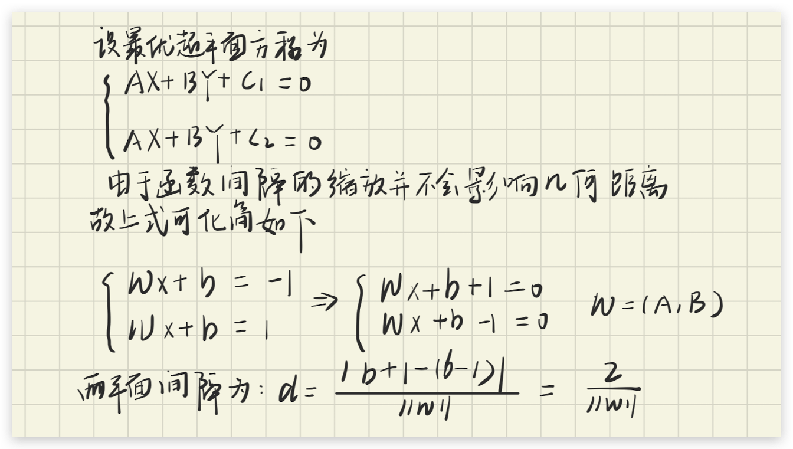
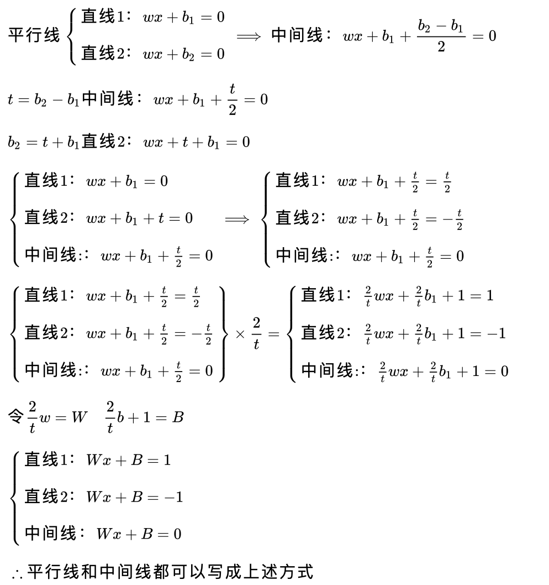
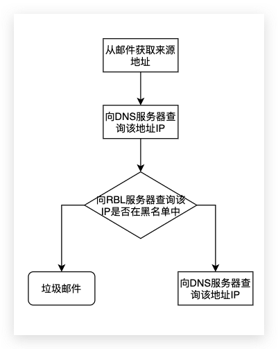
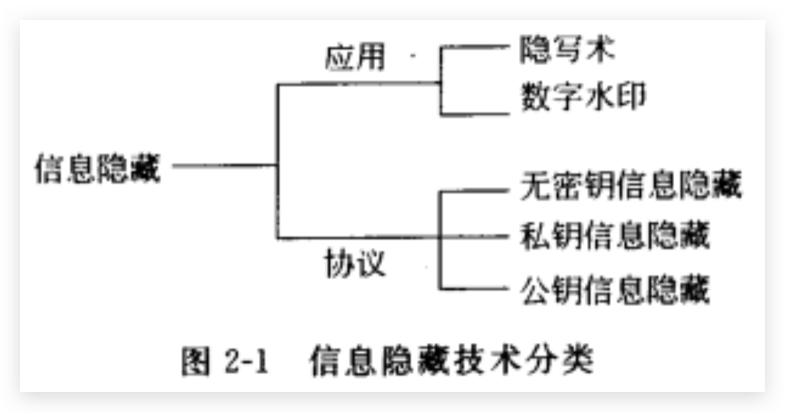
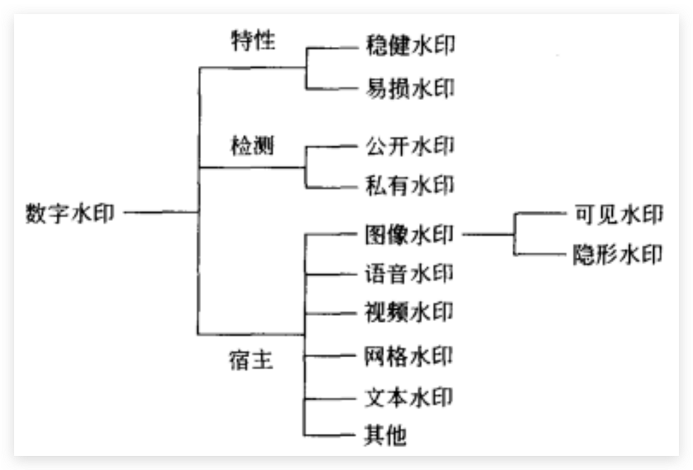
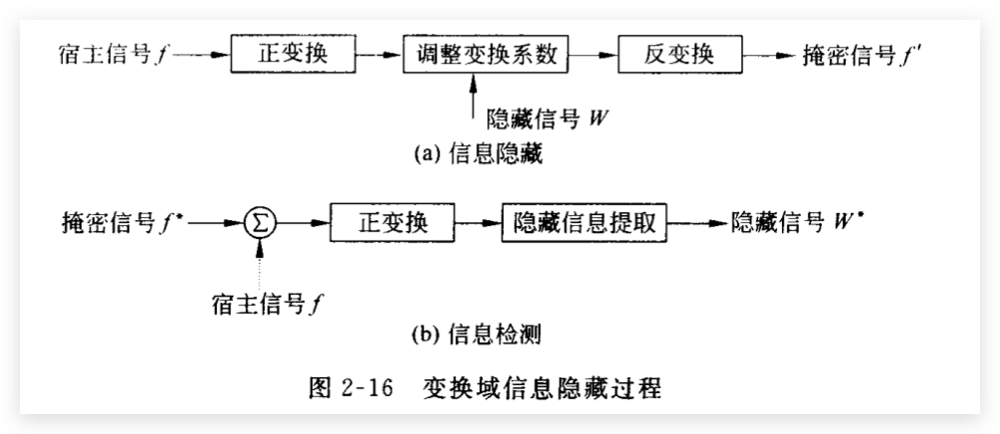

# 内容安全好好复习

## 第一章

### 信息安全内容

:::tip
了解信息内容安全的威胁，掌握信息内容安全的基本概念，熟悉或掌握信息内容的获取，识别和管控基本知识和相关操作技术的学科
:::

#### 信息内容安全要求

内容是安全的，政治上是健康的，法律上是合法的，道德上是符合规范的

#### 信息安全内容的研究内容

信息安全内容的威胁，信息内容安全的法律保障，信息内容的获取，信息内容的分析和识别

#### *信息内容安全的内涵（应用领域）

  

#### 信息内容安全威胁

1. 威胁国家安全：信息的传播产生恶劣影响，例如伊朗政府切断其互联网与世界其他网络联系，直接导致数百万伊朗民众无法登录邮箱和社交网站
2. 威胁公共安全：主要是网络谣言和对集体行动进行动员组织的信息，例如2011年 谣盐 事件
3. 威胁文化安全：身价过亿的的网红歌手，进行涉黄标签产生不良影响

### 网络犯罪分为哪两类？我国网络犯罪有什么新动向？

主要分为两类：
1. 以网络或网络上的计算机为目标的犯罪
2. 以网络作为工具的犯罪

新动向
1. 利用互联网传播小黄片
2. 利用互联网侵犯公共财务
3. 利用互联网侵犯人生权利和民主权利

## 第二章

### 信息检索，信息交互与信息浏览

1. **信息检索**是信息的需求者主动的在网上搜索需要的信息
2. **信息推荐**是网络信息服务平台获取信息后，通过固定的频道推送给用户内容
3. **信息交互**是双向的信息交流，在信息交互的过程中，信息获取个体可以通过交流所获得的信息满足认知上和情感上的信息需求

### 搜索引擎的分类

1. 目录式搜索引擎：以人工的或半自动的方式收集信息，在通过人工方式访问多个Web站点后，对其进行描述，然后根据其内容和性质将其归为一个预先设定好的类别；
2. 通用搜索引擎：通过搜索引擎按照信息采集、建立索引和提供服务的一般流程运行，采用网络爬虫以某种策略对万维网遍历爬取，然后对Web文档进行建立索引等预处理工作，最后对用于的检索返回结果；
3. 元搜索引擎：调用其他搜索引擎的引擎，通过一个统一的界面，帮助用户在多个搜索引擎中选择和利用合适的搜索引擎来进行检索；

### *排级算法

#### PageRank算法

##### 算法流程

网页首先根据链接关系构建起Web网，每个页面设置相同的PageRank值，通过若干轮的计算会得到每个页面最终的PageRank值。每一轮的计算当中网页的PageRank值都会更新。

PageRank值更新的过程：每个页面将当前页面的PageRank值，平均分配到本页面相连的页面上。每个链接都会获得相应的权值，最后页面将入链的权值求和作为新的PageRank值。这样每一个页面就都更新了PageRank值，也就完成了一轮PageRank更新。

##### 算法优缺点

优点：
1. 直接高效：利用一个迭代公式进行计算，	效率高
2. 主题集中：PageRank算法的操作针对某一个主题，可以较好的返回与之重要的消息

缺点：
1. 完全忽视网页的内容
2. 影响因子与网页获取数量缺乏科学性

#### HITS算法

##### 算法流程

每个网页的权值用两个指标来表示：权威值和枢纽值，一个权威值高的网页会被很多网页指向。网页的权威值等于指向它的网页的枢纽值之和。一个网页的枢纽值等于它指向网页的所有权威值的和。HITS的算法流程可表示如下：

1. 初始化：每个节点的权威值和枢纽值都初始化为1
2. 更新节点的权威值（权威值=指向它的网页的枢纽值之和）
3. 更新节点的枢纽值（枢纽值=它指向的网页的权威值之和）
4. 规范化权威值和枢纽值
5. 重复步骤2-4直到最终收敛

##### 算法优缺点
优点
1. 搜索的时候考虑了页面内容，挖掘科学性大大增大
2. 知识范围增大

缺点
1. 实时性差，挖掘效率和实时性低
2. 主题漂移，由知识范围增大的特性决定

#### 算法对比

1. HITS是输入一个查询的关键词，而后才根据关键词构造的网页集合，因此它的搜索结果是和查询内容有关系的。而PageRank是把所有的网页构成的集合当做是一个大的网络
2. PageRank比HITS算法更高效
3. HITS算法中涉及到的网页的数量更少

### 搜索引擎和垃圾信息的关系

#### 什么是垃圾信息

大量的无用的信息、有害信息，以及对人类社会的各个方面带来危害的信息。

#### 搜索引擎优化师

为了让广大的网络用户能够看到自己的页面，网站管理者和网页制作者就想方设法让其站点和页面变得有名，以期用户在进行相关内容查询时，目标网页排在结果集的最前面。

:::tip
*为什么垃圾信息和搜索引擎的斗争像一场军备竞赛？

在与垃圾信息制造者的斗争中，搜索引擎排名算法的有效期越来越短，一旦垃圾信息制造者们掌握了某种排名算法特点，就会有大量新型的带“免疫”功能的垃圾信息出现在互联上。这个博弈的过程就像一个军备竞争一样
:::

### 数据挖掘

#### 什么是数据挖掘_

通过从数据库中抽取隐含的、未知的、具有潜在使用价值信息的过程

#### 网路数据挖掘（Web数据挖掘）

##### 概念_

从大量非结构化、异构的Web信息资源中发现兴趣性的知识，包括概念、模式、规则、规律、约束及可视化等形式的非平凡过程。

##### Web挖掘的流程

①资源发现: 在线或离线检索Web的过程，例如用爬虫在线收集Web页面。

②信息选择与预处理: 对检索到的Web资源的任何变换都属于此过程。包括:词干提取、高低频词的过滤、汉语词的切分等。

③综合过程: 自动发现Web站点的共有模式。

④分析过程: 对挖掘到的模式进行验证和可视化处理。

##### Web文本挖掘与多媒体挖掘

Web文本挖掘：从网络中大量的文本中发现隐含的模式，例如通过分析和探究 Web日志记录中的规律，可以识别电子商务的潜在客户，提高对最终用户的服务质量，并改进Web服务器系统的性能。

Web 多媒体挖掘需要提取的特征一般包括图像或视频的文件名URL 、类型、键值表、颜色向量等。然后可以对这些特征进行挖掘工作。比例设计和构造天文多媒体数据立方体；可以对数据进行分类和预测分析以促进天文学的研究

### 信息推荐系统

#### *信息推荐和信息检索的区别

信息推荐是根据用户的信息在特定平台上给用户推荐特定内容，信息检索是信息的需求者主动在网上收集信息

#### 什么是信息推荐

信息推荐的非形式化定义：利用电子商务网站向客户提供商品信息和建议，帮助用户决定应购买什么产品，模拟销售人员帮助客户完成购买过程。 

信息推荐的形式化定义：设 $C$ 是所有用户 (user) 的集合, $S$ 是所有可以推荐给用户的商品对象的集合。实际上, $C$ 和 $S$ 集合的规模通常很大, 例如上百万的顾客和上亿的商品。设效用函数 $u()$ 可以计算对象 $s$ 对用户 $c$ 的推荐度 (如提供商的可靠性 vendor reliability ) 和产品的可得性（product availability ), 即 $u: C \times S \rightarrow R, R$ 是一定范围内的全序的非负实数, 信息推荐要研究的问题 就是找到推荐度 $R$ 最大的那些对象 $s^{*}$, 如下式:

$$
\forall c \in C, s^{*}=\arg \max _{s \in S} u(c, s)
$$

`可能会让你解释这个公式`

#### 信息推荐的分类_

1. 基于内容的推荐：根据用户选择的对象，推荐其他类似属性的对象作为推荐.
2. 基于协同过滤推荐：找到与用户相似的其他用户，推荐其他用户认可的内容
3. 基于组合推荐： 将不同的推荐方法进行融合

## 第四章

### 对互联网信息过滤的4种方法

1. 基于分级标注的过滤：用户或管理员通过浏览器的安全设置选项实现网页内容过滤
2. 基于URL过滤：设置网页黑白名单
3. 基于关键字的过滤：对出现关键字的网页进行过滤
4. 基于内容分析的过滤：通过语义分析、机器学习等技术分析用户浏览的网页内容来判断是否需要过滤

### 网络不良图像的识别

1. 皮肤的裸露程度
2. 从敏感部位来判断
3. 从猥亵的人体姿态来判断

### 肤色检测

#### 颜色空间

##### RGB颜色空间

用红绿蓝三基色不同比例混合来表示所有的颜色。不符合人类对颜色相似性的主观判断，如亮度、色调和饱和度等颜色属性。 

##### YCbCr颜色空间

Y表示亮度，两个色差分量Cb和Cr表示色度，其中Cb为蓝色分量和一个参考值之差。Cr为红色分量和一个参考值之差。

##### HSV颜色空间

HSV颜色空间是面向色调的由颜色心里三属性表示的颜色空间，H表示色彩信息，S为饱和度，表示所选颜色的纯度和该颜色最大纯度之间的比率。V为色彩的明亮程度，越接近白色明度越高，越接近灰色或黑色，明度越低。

#### 肤色模型建模

##### 肤色区域模型

:::tip
公式理解就好，如果考试的时候给你公式，你要会用能够计算才行
:::

根据图片的RGB数值或者YCbCr数值来进行判断：

最简单的肤色检测器是把在 RGB 空间中符合下式的像素认为是皮肤像素:

$$
1<R / G<f
$$

RGB颜色空间进行肤色检测不需要转换颜色空间，运算简单，系统开销小，正检率很高但是误检率也很高。

在YCbCr颜色空间上进行肤色检测的优点是亮度与色度分离，受到亮度的影响较小，易实现聚类算法

**优缺点：** 方法简单容易实现，正检率高但是误检率也高，原因是该方法只给出了肤色在颜色空间中的分布范围，没有更进一步的去找出肤色在颜色空间中的分布。有很多和肤色颜色接近的区域就会被误检。

##### 高斯分布模型

高斯分布模型又分为单高斯分布模型和高斯混合模型，单高斯模型是高斯混合模型的一种特殊情形。

单高斯混合模型用正态分布来模拟皮肤颜色的概率密度分布，通常是丢弃强度分量，在两维色度平面上进行高斯密度函数估计，其联合概率密度函数如下：

$$
p(x \mid \text { skin })=\frac{1}{2 \pi|\Sigma|^{1 / 2}} \exp \left[-\frac{1}{2}(x-\mu)^{T} \Sigma^{-1}(x-\mu)\right]
(4-7)
$$

其中 $x$ 是像素颜色向量, $\mu$ 和 $\Sigma$ 是高斯分布参数, $\mu$ 为均值向量, $\Sigma$ 为协方差矩阵, 可 以用最大似然估计法得到, 如下式所示:

$$
\begin{aligned}
&\mu=\frac{1}{N} \sum_{i=1}^{N} X_{i} \\
&\Sigma=\frac{1}{N-1} \sum_{i=1}^{N}\left(x_{i}-\mu\right)\left(x_{i}-\mu\right)^{T}
\end{aligned}
(4-8)
$$

其中 $N$ 为样本总数。单高斯模型有两种方法衡量 $x$ 属于肤色的可能性, 法一是通过公式 (4-7) 得到像素 $x$ 属于肤色的概率 $p(x \mid s k i n)$, 法二是通过公式 (4-9) 计算像素 $x$ 与均值 $\mu$ 的 马氏距离 $d(x)$ 得到像素与肤色的接近程度。

$$
d(x)=(x-\mu)^{T} \Sigma^{-1}(x-\mu) \quad (4-9)
$$

高斯混合模型是多个单高斯密度函数的加权和, 其混合概率密度函数如下式所示:

$$
p(x, \mu, \Sigma)=\sum_{i=1}^{M} \omega_{i} \frac{1}{(2 \pi)^{n / 2}\left|\Sigma_{i}\right|^{1 / 2}} \exp \left[-\frac{1}{2}\left(x-\mu_{i}\right)^{T} \Sigma_{i}^{-1}\left(x-\mu_{i}\right)\right]
\quad (4-10)
$$

其中 $x$ 为 $n$ 维像素颜色向量, 混合概率密度函数 $p(x, \mu, \Sigma)$ 由 $M$ 个单高斯密度函数线性加 权组成, $\mu_{i}$ 为均值向量, $\Sigma_{i}$ 为协方差矩阵, $\omega_{i}$ 为权重, 代表各高斯密度函数对混合模型的 贡献大小, 有 $\omega_{i}>0$ 且 $\sum_{i=1}^{M} \omega_{i}=1$ 。对于高斯混合模型的参数 $\lambda=\left(\omega_{i}, \mu_{i}, \Sigma_{i}\right), i=1,2 \cdots M$, 可 以用标准的期望最大化 $\mathrm{EM}$ 算法计算得到 ${ }^{[7]}$ 。高斯混合模型通过计算其 $p(x, \mu, \Sigma)$ 是否大于阈值来判断是否为皮肤像素。

##### 统计直方图模型

统计直方图模型是一种非参数模型。通过肤色样本的直方图统计构造肤色概率图SPM，( Skin Probability Map ) 进行皮肤检测, 利用 SPM 检测肤色像素主要有两种方法: 规则化查 找表和贝叶斯分类器。

规则化查找表直接利用 SPM 作为肤色概率查找表。输人像素的颜色向量经过与 SPM 相 同的颜色空间变换和量化后, 所得到的向量作为查表的索引, 查表得到的值是该输人像素属 于肤色的概率, 即将大于式 (4-11) 的像素认为是肤色。

$$
p_{\text {skin }}(x)=\frac{\operatorname{count}(x)}{\text { Norm }}
$$

其中 $\operatorname{count}(x)$ 表示皮肤颜色直方图中颜色空间 $\mathrm{x}$ 中的像素个数, 规则化参数 Norm 是皮肤 直方图中的像素总数目。

上述直方图统计量 $p_{s k i n}(x)$ 实际上只是估计条件概率 $p(x \mid s k i n)$, 对肤色检测更合适的量 度应该是 $p(\operatorname{skin} \mid x)$, 由贝叶斯公式可得

$$
p(\operatorname{skin} \mid x)=\frac{p(x \mid \text { skin }) p(\text { skin })}{p(x \mid \text { skin }) p(\text { skin })+p(x \mid-\text { skin }) p(-\text { skin })}
$$

其中 $p(x \mid$ skin $)$ 和 $p(x \mid-s k i n)$ 可由颜色直方图计算得到, $p($ skin $)$ 和 $p(-s k i n)$ 是皮肤直方图 中肤色和非肤色像素数目比例。当 $p(\sin \mid x)$ 大于一个阈值时, 则有颜色 $x$ 的像素被判定为皮肤像素。

SPM 方法的思想很直观, 检测速度很快, 但需要大量的存储空间, 特别是维数和量化级 较多的直方图需要更多的统计样本, 因此更适合于具有大量的训练和测试图像数据。为了减 少存储需求和避免训练数据不足, 通常采用粒度较大的颜色空间量化。高斯肤色模型的参数 化所需的存储空间相对很小, 能够内揷和归纳不完整的训练数据, 因此能适应容量较小的训 练和测试数据集, 但速度较慢, 并需要考察所选颜色空间中肤色分布的形态, 高斯混合模型 的高斯密度函数个数的选定通常在 $2 \sim 16$ 之间, 个数多了会有过度训练之嫌, 个数少了又恐 怕估计不准, 容易造成高误检率。

### 纹理分析

#### Gabor滤波法

用不同尺度和方向滤波器的设计来反映图像空间局部方向的特征。有选择地利用频域信息而不是整个图像的频域信息

#### 简单灰度统计法

首先手机皮肤区域的灰度同济，作为皮肤纹理特征的经验值，当进行皮肤纹理提取的时候将检测区域像素同经验值比较来判断皮肤纹理

#### *灰度共生矩阵法

`死记的地方很少，公式啥的会用就行`

纹理是由灰度分布在空间位置上反复交替变化而形成的，因而在图像空间中相隔一定距离的两像素间会存在一定的灰度关系，这种关系被称为是图像中灰度的空间相关特性。灰度共生矩阵是对图像上保持一定距离的两像素分别具有某灰度的状况进行统计得到的，描述了成对像素的灰度组合分布，可以看成是两个灰度组合的联合直方图。

灰度共生矩阵反映了纹理关于方向、相邻间隔、变化幅度的综合信息，既能反应纹理的粗糙程度也可以反映纹理的方向性。

若将图像的灰度级定义为 $\mathrm{L}$ 级, 那么灰度共生矩阵为 $L \times L$ 矩阵, 可以表示为 $M_{(\alpha, \Delta y)}(h, k)$, 其中位于 $(h, k)$ 的元素 $m_{h k}$ 的值表示一个灰度为 $h$ 而另外一个灰度为 $k$ 的两个 相距为 $(\Delta x, \Delta y)$ 的像素对出现的次数。

设 $\mathrm{S}$ 为目标区域 $\mathrm{R}$ 中具有特定空间联系的像素对集合, 那么共生矩阵 $\mathrm{M}$ 可以定义为:

$$
M_{(*, \Delta y)}(h, k)=\frac{\operatorname{num}\left\{\left[\left(x_{1}, y_{1}\right),\left(x_{2}, y_{2}\right)\right] \in S \mid f\left(x_{1}, y_{1}\right)=h \& f\left(x_{2}, y_{2}\right)=k\right\}}{\operatorname{num}(S)}
$$

上式等号右边的分子是具有某种空间关系、灰度值分别为 $\mathrm{h}$ 和 $\mathrm{k}$ 的像素对的个数, 分母 为像素对的总和个数, 这样得到的 $\mathrm{M}$ 是归一化的。由于灰度共生矩阵的计算量很大, 为简便 起见, 一股采用下面四个最常用特征来提取图像的纹理特征:

(1)角二阶矩： $A S M=\sum_{h} \sum_{k}\left(m_{h k}\right)^{2}$

(2)熵：$ENT = -\sum_k\sum_km_{hk}log(m_{hk})$

(3)对比度: $C O N=\sum_{h} \sum_{k}|h-k| m_{\text {Hk }}$

(4)相关性: $C O R=\left[\sum_{h} \sum_{k} h k m_{h t}-u_{x} u_{y}\right] / \sigma_{x} \sigma_{y}$

其中 $u_{x}, u_{y}$ 和 $\sigma_{x}, \sigma_{y}$ 分别为 $m_{x}$ 和 $m_{y}$ 的均值和标准差, $m_{x}=\sum_{k} m_{h k}$ 是矩阵 $\mathrm{M}$ 每行元素的和, $m_{v}=\sum m_{h k}$ 是每列元素的和。

### 不良图像识别

#### SVM算法

##### 超平面

超平面：能够将两组数据分开的平面叫做超平面

最优超平面：能够将两组数据分开，且两组数据距离超平面距离最远的超平面叫做最优超平面

**为什么最优分类面分类间隔为 2 / || W ||?**

  

**支持向量机的函数间隔为何等于1 ?**

  

##### 核函数

##### 基于SVM的不良图片识别

不良图像识别问题是一个两类分类问题，其判别函数为：

$$
f(x)=\operatorname{sgn}\left(\sum_{i=1}^{n} \alpha_{i} y_{i} K\left(x, x_{i}\right)+b\right)
$$

其中sgn是信号函数，x是图像的类别，$x_i$是预测的类别。$K(\cdot)$是核函数（一般选取径向基函数），$\alpha_i$是b是可学习参数，使用f(x)便可以对不良图片进行识别。（公式不用背）

## 第五章

### 垃圾邮件概述

#### 什么是垃圾邮件

1. 收件人事先没有提出要求或者同意接收的广告、电子刊物、各种形式的宣传品等宣传性的电子邮件
2. 收件人无法拒收的
3. 隐藏发件人身份、地址、标题等信息的电子邮件
4. 含有虚假的信息源、发件人、路由等信息的电子邮件;电子邮件
5. 含有病毒、恶意代码、色情、反动等不良信息或有害信息的邮件

#### 垃圾邮件产生的原因

1. **SMTP协议自身存在缺陷**：SMTP协议建立在双方信任的基础上，因此SMTP协议并没有要求身份验证，任何人都可以使用服务器发送邮件。且SMTP协议没有对发件人地址和回复地址做校验，这就导致了垃圾邮件发送者大量发送匿名或者冒名的邮件。
2. 商业上的原因：垃圾邮件一直都是最经济有效的广告方式，经常被用来做商业推广

#### 垃圾邮件的危害

1. 占用网络带宽,浪费网络资源，干扰邮件系统的正常运行。
2. 浪费用户的浏览时间和上网费用。
3. 对网络安全形成威胁：黑客们利用电子邮件系统发送数以万计的垃圾邮件风暴攻击目标，使之瘫痪、拒绝服务。

### 垃圾邮件过滤技术

#### 根据过滤技术实施的位置不同

##### 客户端的邮件过滤

客户端邮件过滤由邮件收发用户来自定义过滤条件进行过滤

优点：用户自定义过滤条件，量身订造的邮件过滤器，拦截率更高、误判率更低。

##### 服务器端的邮件过滤

服务器端的邮件过滤由邮件服务器执行，邮件服务器对通过其发送和接收的邮件按照预先设定好的条件来进行分类过滤操作,对垃圾邮件进行截获。

优点：网络带宽占用更小,开支更小。

#### 根据过滤对象处理对象不同

##### 基于黑名单的过滤技术

① 用户黑名单：由用户自定义黑名单

优点：快速准确地过滤掉垃圾邮件，而且可以把经常错误过滤为垃圾邮件的用户邮件快速分辨出来，减少误判率

缺点：用户添加的范围往往不够广

2. 网络黑名单：RBL实时黑名单

  

优点：可以实时的更新IP进行拦截

缺点：当更新的列表组件加大时，会出现误识别的情况

#### 具有关键字的过滤技术

创建一些简单或复杂的与垃圾邮件关联的单词表来识别和处理垃圾邮件。

优点: 简单直接地进行过滤

缺点: 容易出现误判。为了保证有效，管理员必须经常维护更新关键字库，攻击者还可以通过同音、拆字等方法绕过

## 信息隐藏-第二章

### 信息加密和信息隐藏的区别

信息加密是通过密钥控制信息的使用权；

信息隐藏的主要目的并不是限制对信息的访问,而是确保宿主信息中隐藏的秘密信息不被改变或消除,从而在必要时提供有效的证明信息。

### 信息隐写技术的基本要求

信息隐藏技术可分为隐写术和数字水印两个主要分支。 隐写术的研究重点是如何实现信息伪装；而数字水印则需要着重考虑稳健性的要求，以对抗各种可能的攻击。依据隐藏协议，信息隐藏还可分为无密钥信息隐藏、私钥信息隐藏、 公钥信息隐藏。

#### 信息隐藏

  

对隐写术的要求：

1. 不可感知和不可检测性
2. 秘密性: 嵌入过程(嵌入方法)是秘密的,嵌入的信息难以检测
3. 足够大的信息容量
4. 算法计算复杂性低, 容易实现, 在某些应用场合(如语音和视频中的信息隐藏)中﹐甚至要求算法的实现满足实时性的要求

#### 数字水印

  

**数字水印根据特性可以分为稳健水印和易损水印：**

对于稳健水印的基本要求：

1. 不可感知性
2. 稳健性。即隐藏水印的媒体信号经过一些常见的改变（如数据压缩、低通滤波﹑图像增强）后,水印仍具有较好的可检测性
3. 水印用来作为所有权证明时,应能给判断提供惟一性的证据。
4. 秘密性。
5. 算法计算复杂性低。

对易损水印最重要的要求包括:

1. 不可感知性
2. 半易损特性。即对某些特定的攻击(如恶意篡改﹑裁剪等)比较敏感,且能够检测受篡改的区域。而对一些可能遭遇的常见信号处理过程(如数据压缩、噪声干扰、一定程度的低通滤波等),具有一定的稳健性。
3. 算法计算的复杂性低。

### 信息隐藏的基本方法

信息嵌入的基本公式：

I. J. Cox 提出了 3 种常用的信息嵌入公式（式1，式2和式3）:

$$
\begin{gathered}
v_{i}^{\prime}=v_{i}+\alpha x_{i} \\
v_{i}^{\prime}=v_{i}\left(1+\alpha x_{i}\right) \\
v_{i}^{\prime}=v_{i}+\alpha\left|v_{i}\right| x_{i}
\end{gathered}
$$

当隐藏信息是由“0”、“”构成的二进制序列时,上式可以修正为:

$$
v_{i}^{\prime}= \begin{cases}v_{i}+\alpha, & \text { 隐藏“1” } \\ v_{i}-\alpha, & \text { 隐藏“0” }\end{cases}
$$

或

$$
v_{i}^{\prime}= \begin{cases}v_{i}(1+\alpha), & \text { 隐藏“1” } \\ v_{i}(1-\alpha), & \text { 隐藏“0” }\end{cases}
$$

其中 $v_{i}$ 和 $v_{i}^{\prime}$ 分别表示原始宿主信号和隐藏信息后的掩密信号 (或从中提取的特征) 的值, $x_{i}$ 为待嵌人信号分量, $0 \leqslant i<K, \alpha$ 为拉伸因子。 $\alpha$ 越大, 嵌人的信号幅度越大, **稳健性越好 而不可感知性变差; 反之, 不可感知性好而稳健性下降**。因此, $\alpha$ 的选择必须考虑宿主信 号的特征和听视觉系统的特性, 其选择原则是: 在满足不可感知性的前提下, 尽可能选择较大的值。

在式1中隐藏信号和宿主信号无关，当$v_i$的变化范围比较大的时候式2和式3被用的更多一些。但是在常用的正交变换下，宿主信号的能量被集中到少数变换系数上而大部分系数的值都比较小，这时，如果需要利用较多的系数来隐藏数据，式1会更合适。

如果要实现盲检测需要使用式1和式3，式2无法实现

### 虚警概率与漏警概率

概念很玄乎其实还是很好理解的两个概念

- 虚警概率：错判图片中有水印的概率
- 漏警概率：漏判有水印的图片的概率

下面是书上的解释：

在应用伪随机序列作为水印的情况下, 水印检测方法通常采用如下假设检验：

$$
\begin{array}{ll}
\boldsymbol{H}_{0}: \boldsymbol{E}=\boldsymbol{F}^{*}-\boldsymbol{F}=\boldsymbol{N} & \text { (无水印) } \\
\boldsymbol{H}_{1}: \boldsymbol{E}=\boldsymbol{F}^{*}-\boldsymbol{F}=\boldsymbol{W}^{*}+\boldsymbol{N} & \text { (有水印) }
\end{array}
$$

其中, $\boldsymbol{F}^{*}$ 和 $\boldsymbol{F}$ 分别代表待测掩密信号和原始宿主信号中用来隐藏水印的像素或特征值; $\boldsymbol{N}$ 为由于掩密信号遭受攻击而引起失真的等效噪声; $\boldsymbol{W}^{*}$ 为从 $\boldsymbol{F}^{*}$ 中提取的待测水印序 列, $\boldsymbol{W}^{*}=\left\{x_{i}^{*}\right\}$ :

$$
x_{i}^{*}=\left(v_{i}^{*}-v_{i}\right) / \alpha \text { 或 } x_{i}^{*}=\left(v_{i}^{*}-v_{i}\right) / \alpha \cdot v_{i}
\tag{1}
$$

其中 $v_{i}^{*}$ 为 $\boldsymbol{F}^{*}$ 中对应 $v_{i}$ 的值。由于 $\boldsymbol{F}^{*}$ 可能存在失真, 从中所检测到的水印也将在一定 程度上与原始水印有所不同。因此,水印的检测通常需要 3 个步骤: (1)计算检测的水印 与原始水印的相关; (2)门限化所得到的计算结果; (3)做出水印是否存在的决策。
为了确定 $\boldsymbol{F}^{*}$ 中是否含有水印, 需要计算 $\boldsymbol{W}^{*}$ 与 $\boldsymbol{W}$ 的相似度:

$$
\rho\left(\boldsymbol{W}^{*}, \boldsymbol{W}\right)=\sum_{i=0}^{K-1} x_{i}^{*} \cdot x_{i} / \sqrt{\sum_{i=0}^{K-1}\left(x_{i}^{*}\right)^{2}}
$$

水印存在与否的判定标准为：若 $\rho\left(\boldsymbol{W}^{*}, \boldsymbol{W}\right)>T$, 可以判定被测图像中有水印 $\boldsymbol{W}$ 存在; 否 则, 没有水印 $\boldsymbol{W} 。 T$ 为一门限, 其选择要同时考虑虚警概率和漏警概率。 $T$ **减小漏敬概率降低而虚警概率提高**; $T$ 增大, **虚警概率降低而漏警概率提高**。

### 保真度标准

#### 客观保真度

##### 均方误差MSE

设原始宿主图像和掩密图像表示为 $f(x, y)$ 和 $f^{\prime}(x, y), 0 \leqslant x \leqslant M-1,0 \leqslant y \leqslant N-1$, 则掩密图像相对于原始宿主图像造成的均方误差 MSE 定义为:

$$
\mathrm{MSE}=\frac{1}{\mathrm{MN}} \sum_{x=0}^{M-1} \sum_{y=0}^{N-1}\left|f^{\prime}(x, y)-f(x, y)\right|^{2}
$$

##### 信噪比SNR

数据嵌人原始宿主图像也可以看为引人了一定的噪声 (误差)

$$
f^{\prime}(x, y)=f(x, y)+e(x, y)
$$

因此, 可以定义原始图像和掩密图像的信噪比 SNR 为:

$$
\mathrm{SNR}=\sum_{x=0}^{M-1} \sum_{y=0}^{N-1} f^{\prime 2}(x, y) / \sum_{x=0}^{M-1} \sum_{y=0}^{N-1} e^{2}(x, y)
$$

在图像处理中, 峰值信噪比 PSNR 更为常见

$$
\operatorname{PSNR}=10 \cdot \log \frac{255^{2}}{\mathrm{MSE}}
$$

#### 主观保真度

主观保真度主要由人来完成；

### 空域信息隐藏方法

#### 基于替换LSB的空域信息隐藏方法

LSB算法基本步骤：

1. 将原始载体图像的空域像素值由十进制转换成二进制；
2. 用二进制秘密信息中的每一比特信息替换与之相对应的载体数据的最低有效位；
3. 将得到的含秘密信息的二进制数据转换为十进制像素值，从而获得含秘密信息的图像。

优点：
1. **具有很大的信息隐藏容量**。根据对掩密图像保真度的不同要求, 基于替换 LSB 隐藏方法的隐藏信息量可以达到 $1 \sim 3$ 比特/像素 (bits/pixel)。这样的信息隐藏容量是他隐藏算法难以比拟的, 可以满足许多应用场合的要求。
2. **计算简单**。在空域中替换载体像素的 L.SB, 计算十分简单。即使采用随机间隔法以提嵩秘密性, 其计算量也比变换域的信息隐藏方法明显要小。这是替换 LSB 方法的 $\cdots$ 个显著优点。
3. **掩密图像失真较小**。在每像素隐藏 $1 \mathrm{~b}$ 时, 掩密图像可以保证很高的视觉质量。 即使达到 2 比特/像素 (bits/pixel)的隐藏量, 掩密图像仍可保证较高的保真度。
4. **隐藏数据的稳健性较差**。从替换LSB 方法的原理可以看到, 在采用密钥对载体像素的选择进行控制的情况下,要检测和破译隐藏信息有一定的难度。然而,由于最低有 效位的数据最有可能在常见的信号处理过程 (如数据压缩和低通滤波) 中被丢掉, 因而稳健性差。对隐藏数据的破坏性攻击也比较容易。由于嵌人过程可以选择的替换位面有限,通过在 LSB 再次嵌人随机的二进制序列就有可能破坏隐藏数据。对抗的方法是减少 隐藏数据量 (从而减少载体像素集合)或应用纠错编码。这些方法只适用于噪声 (包括对掩密图像进行处理所引起的等效噪声)很弱的应用场合。

#### Patchwork算法

另一种典型的空域信息隐藏方法是 Bender 等提出的直接扩展频谱信息隐藏算法 Patchwork。Patchwork 算法只是试图回答是否有水印存在的问题, 因而实际隐藏的只是 1 bit 的信息。算法步骤如下:

1. 用一个密钥 $K$ 初始化一个伪随机数发生器;
2. 根据随机数发生器的输出, 随机选取 $n$ 个像素对, 其灰度值表示为 $\left(a_{i}, b_{i}\right)$;
3. 令 $a_{i}^{\prime}=a_{i}+1, b_{i}^{\prime}=b_{i}-1$, 完成水印信息的嵌人。
检测时,假设检验被用来证实隐藏信息的存在。令

$$
S=\sum_{i=1}^{n}\left(a_{i}-b_{i}\right)
$$

如果 $S \approx 2 n$, 判定隐藏信息存在。

Patchwork的虚警概率和漏警概率可以通过设置一个门限T来控制，0≤T≤2n。

Patchwork的主要缺点是稳健性不好。例如，将掩密图像平移一个像素，将无法检测 到水印。

### 变换域信息隐藏方法

  

#### 系数的选择

用于隐藏信息的变换系数的选择, 直接影响隐藏信息的稳健性和检测方法。可以有 如下几种选择的方法。
1. **选择某些感觉上最重要的系数**，这种方法的理由是感觉上重要的分量是信号的 主要成分, 携带较多的信号能量, 在掩密信号有一定失真的情况下, 仍能保留主要成分, 作为隐藏信息载体, 有利于提高隐藏信息的稳健性。这种方法的典型例子是 $\operatorname{Cox}$ 等提出的 NEC 水印模式。
2. **依据宿主信号的尺寸**，选择某些位于固定频带的系数。Langelaar 等把水印嵌人频域的高频系数中。这种做法的考虑与空域的替换 LSB 的方法类似: 高频系数的改变 对感觉效果影响较小, 因而不可感知性容易得到满足。然而, 由于信号的高频分量容易在 常规的信号处理过程 (如数据压缩、低通滤波等) 中丢失, 改变高频系数的做法很难满足稳健性的要求。这种选择目前已基本不为人们所采用。为了在不可感知性和稳健性中取得折中, 另一种典型的系数选择方法是选择中频系数。
3. **频域跳频 (frequency hopping)**，这种方法是采用一个密钥来控制变换系数的选择, 通常选择的系数并不连续。其优点是保证隐藏信息的变换系数位置的秘密性, 从而提高对抗恶意攻击的能力。

### 信息隐藏的应用

① 保密通信 ② 所有权认定和版权保护 ③ 多媒体数据认证和数据完整性保护 ④ 隐含标注

### 信息隐藏还存在的问题

1. 一些必要的基础理论和基本方法尚未得到充分研究 比如：稳健性评价标准和信息隐藏容量等等
2. 如何在信息隐藏中应用HAS/HVS的特性尚不系统。
3. 提高隐藏信息容量﹑稳健性和抗攻击性能仍然是一项富于挑战性的工作。

## 信息隐藏-第八章

### 数组水印

#### 有意义数字水印的困难

1. 有意义水印的数据量通常远不止1b,而在不可感知性的限制下，隐藏的水印数据量与水印稳健性构成一对矛盾。
2. 有意义水印给检测器带来了更高的要求。随机序列的检测是一种统计检测，而有意义水印则是一种精确检测。例如，对于由文字构成的水印，任何1b的检测错误将导 致至少1个字符的错误。

#### 稳健水印的要求

1. 抗信号处理的稳健性：对于图像载体，指水印对抗图像压缩、低通滤波 (Gaussian滤波、中值滤波等)、图像增强（包括锐化、对比度变换、噪声消除等）等处理
2. 抗编辑与裁剪：图像经过裁剪，视频经过编辑后还能保留水印
3. 噪声干扰：经过椒盐噪声、Gaussian加性噪声的处理后还能保留水印

#### 常见攻击对水印的影响

1. 改变水印信号各分量的幅度，破坏水印的存在
2. 破坏水印的结构，从而导致水印检测失效
3. 造成水印的二义性。例如多重水印等。

