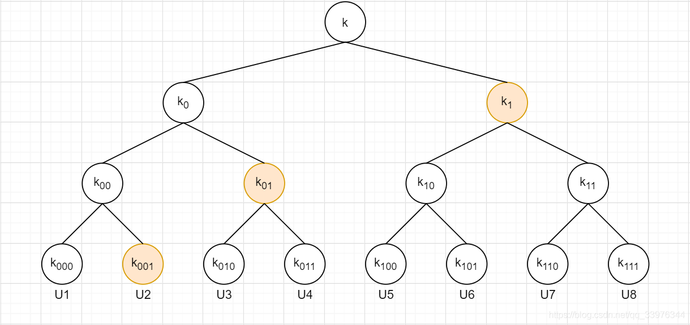
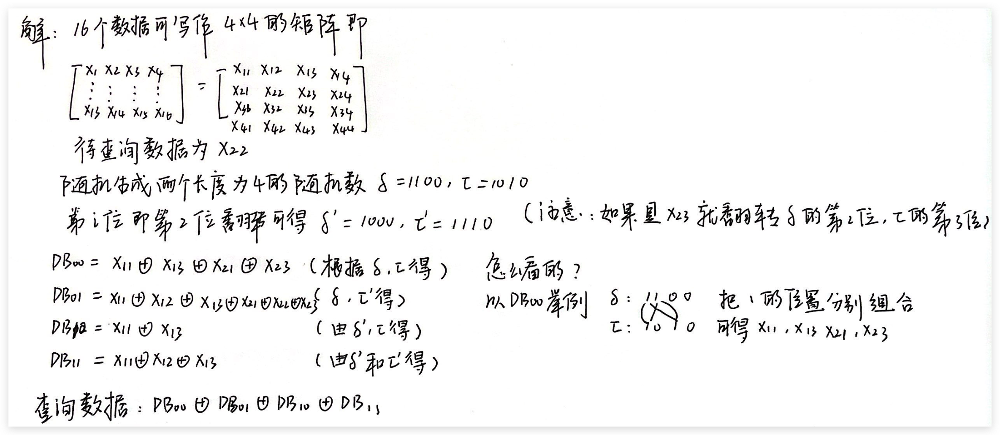
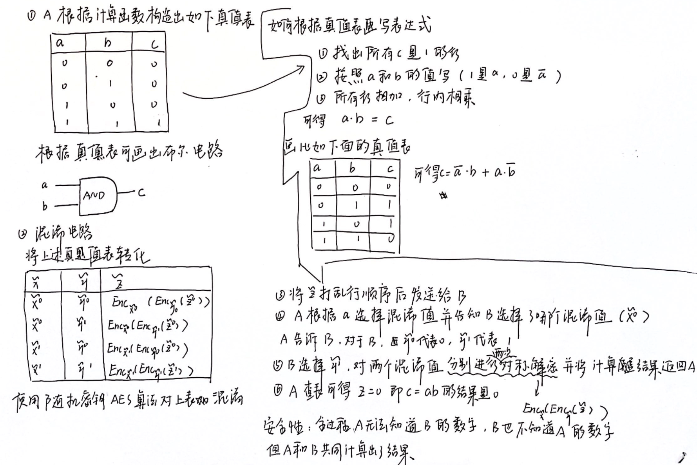
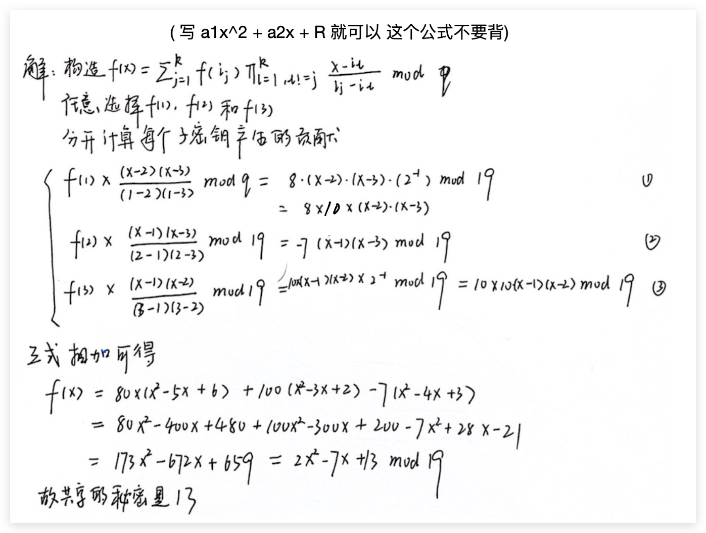

# 隐私保护好好复习

## 访问控制技术

### 自主访问控制模型

**基本思想：** 数据的所有者决定其数据能够被谁访问，同时能够决定这种授权能否被进一步传播

缺点：系统无法判断授权行为是来自于合法用户还是恶意代码

### 强制访问控制

**基本思想：** 为每一个主客体分配一个安全标记，依据主客体之间安全标记的支配关系来进行访问控制。访问控制由安全管理员统一管理

#### BLP模型

能够提供分级数据机密性。BLP模型将数据划分为多个安全等级，对于每一个用户的安全标记包括两个内容 <等级，范围}>（例如 <C,{中国科技}>）。同时规定用户不可创建写低与自己等级的文件（下写），用户不可访问高于自己等级文件（上读）。

#### Biba模型

Biba模型用完整性级别来防止数据从任何完整性级别流到较高的完整性级别中。安全标记是完整性等级和范畴组成的二元组 <完整性等级，范畴>。并且规定信息只能从高完整性的个体流向低完整性的个体。

### 基于密码学的访问控制技术

#### 基于单发送者的广播加密访问控制

数据所有者:拥有完整用户密钥树和数据, 根据目标对象选择性用密钥树的加密密钥加密数据之后广播给所有用户。普通用户拥有与自己相关的密钥树中的部分密钥, 能够解密相应的数据。

  

比如上图的用户密钥树, 每个叶节点表示一个用户, 同时每个节点表示一个密钥, 每个用户拥有从叶子节点密钥一直追溯到根节点每个节点的密钥. 如果用$k_1$来加密数据, 只有用户集{U5, U6, U7, U8}的用户能够解密数据, 如果用$k_{01}$​来加密数据, 只有用户集{U3, U4}可以解密数据, 如果用$k_{001}$​加密数据, 只有{U2}可以解密数据。

#### 基于公钥广播加密的访问控制

① 参与方： 公钥服务器：负责维护一个密钥集合；数据所有者：负责将数据加密并采用基于公钥广播加密技术分发技术实现的对授权接收者的限制。

② 用户：数据的访问者数据文件的产生和加密存储，访问控制系统中的数据文件并按照规定步骤进行加密存储

## 密文检索

### 基于对称密文检索的基本方案

1. 数据所有者生成用于加密数据和索引的密钥；
2. 数据所有者根据数据内容建立索引，并将机密后的索引和数据本身上传到服务器；
3. 算法所有者根据检索条件生成搜索凭证，然后将其发送给服务器；
4. 服务器将接收到的搜索凭证和本地存储的密文索引作为输入，并根据协议进行计算，最后输出满足条件的密文；

### 基于非对称密文检索的基本方案

① 数据检索者生成公钥PK和私钥SK

② 数据所有者根据内容建立索引，并将公钥加密后的索引和数据本身上传到服务器

③ 数据检索者将私钥和检索关键词作为输入，生成搜索凭证后发送给服务器

④ 服务器将公钥、接收到的陷门和本地存储的索引作为输入，进行协议所预设的计算，最后输出满足条件的搜索结果。

### PIR技术

PIR算法的目的是允许用户在不向服务器暴露查询意图的前提下，对服务器中的数据进行查询并取得指定内容。

#### 单轮交换的PIR问题

问题定义：有k个服务器（k >= 1）, 其存储的内容完全相同，均为n个比特的信息 X = {x1, x2, ..., xn} 且服务器之间不会相互通信，A希望从服务器中的数据进行查询，并得到xi，则查询过程如下：

1. A首先随机生成一个随机数 r，并根据 r 和 i 生成k个查询 {q1,q2,...,qk} 然后将其分别发送给k个服务器。
2. 各服务器分别返回相应的查询结果：{Ans(q1), Ans(q2), ..., Ans(qk)};
3. A 根据 r 和 {Ans(q1),...,Ans(qk)}计算得到正确的x；

如果在上述的过程中，任意服务器均不了解关于 i 的任何信息，则称这一交互是PIR的。

##### 设计时间复杂度低于O(n)的多服务器PIR算法

(1) 将数据 $X=\left\{x_{1}, \ldots, x_{2}\right\}$ 表示为一个 $\sqrt{n} \times \sqrt{n}$ 的矩阵，则待查询的数据 $x_{i}$ 可表示为 $x_{i_{1}, i_{2}}$ (其中 $i_{1} 、 i_{2}$ 是 $x_{i}$ 在矩阵中的坐标), 并将4个服务器分 别表示为 $\mathrm{DB}_{00} 、 \mathrm{DB}_{01} 、 \mathrm{DB}_{10} 、 \mathrm{DB}_{11}$ 。

(2) A生成两个长度为 $\sqrt{n}$ 的随机数 $\delta 、 \tau$, 并计算 $\delta_{1}=\delta \oplus i_{1}, \tau_{1}=\tau \oplus i_{2}$ 。

(3) A将 $\delta$ 和 $\tau$ 发送给 $\mathrm{DB}_{00}$, 将 $\delta$ 和 $\tau_{1}$ 发送给 $\mathrm{DB}_{01}$, 将 $\delta_{1}$ 和 $\tau$ 发送给 $\mathrm{DB}_{10}$, 将 $\delta_{1}$ 和 $\tau_{1}$ 发送给 $\mathrm{DB}_{11}$

(4) 服务器 $\mathrm{DB}_{00}$ 返回结果 $\oplus_{\delta\left(j_{1}\right)=1, \tau\left(j_{2}\right)=1} x_{j_{1}, j_{2}}$ ，服务器 $\mathrm{DB}_{01}$ 返回结果 $\oplus_{\delta\left(j_{1}\right)=1, \tau_{1}\left(j_{2}\right)=1} x_{j_{1}, j_{2}}$ ，服务器 $\mathrm{DB}_{10}$ 返回结果 $\oplus_{\delta_{1}\left(j_{1}\right)=1, \tau\left(j_{2}\right)=1} x_{j_{1}, j_{2}}$, 服务器 $\mathrm{DB}_{11}$ 返回结果 $\oplus_{\delta_{1}\left(j_{1}\right)=1, \tau_{1}\left(j_{2}\right)=1} x_{j_{1}, j_{2}}$。

(5) A将返回结果进行异或, 得到 $x_{i_{1}, i_{2}}$

正确性：现在考虑上述方案的正确性。由于 $x_{i_{1}, i_{2}}$ 满足 $\delta\left(i_{1}\right) \neq \delta_{1}\left(i_{1}\right)$ 且 $\tau\left(i_{2}\right) \neq \tau_{1}\left(i_{2}\right)$, 因此, $x_{i_{1}, i_{2}}$ 必然在服务器的返回结果中出现 1 次。对于其他任意的 $x_{i_{3}, i_{4}}$, 要么 $\delta\left(i_{3}\right)=\delta_{1}\left(i_{3}\right)$, 要 么 $\tau\left(i_{4}\right)=\tau_{1}\left(i_{4}\right)$,因此,它们都会出现偶数次,会在异或过程中被消除。

注：$\delta(i)$ 表示 $\delta$ 的第i位；

**测试题**

假设数据为 $X=\left(x_{1}, x_{2}, \ldots, x_{16}\right)$, 待查询数据为 $x_{6}$, 请在 4 个服务器条件下设计通信复杂度小于 $n$ 的隐私信息检索 $P I R$ 方案并给出正确性分析

  

## 比特承诺问题

### 基于对称算法的

**算法流程：** B首先生成一个随机数R发送给A，A将自己想承诺的比特信息b和R使用使用自己的密钥进行加密后得到 Rk(R, b) 将其发送给 B，当 A 要揭示承诺的时候 A 首先公布自己的承诺 b，然后将密钥发送给 B，B 使用密钥进行解密核验 A 的承诺；

**安全性分析：** 如果 B 不没有生成一个随机数发给A用于加密，那么 A 就可以秘密地尝试一系列密钥使得 R'k(b) 的结果为与b相反的结果，随机数 R 的存在增加了这一过程的难度

### 基于单向函数的

**算法流程：** A首先随机产生两个随机数 R1 和 R2 得到 M = R1||R2||b 然后用单向函数将承诺 M 和 R1、R2 进行计算得到 h = H(R1, R2, b),  然后将h和R1发送给 B。当 A 要揭秘的时候，A 公布 M, B 对比R1并计算h进行比对。

**安全性分析：** 如果B提前知道了R1和R2就可以提前的尝试一系列的数来爆破出b，R2的作用就是避免B做穷举攻击

### 基于Goldwasser-Micali概率的

① 设 $n=p q ， p$ 和 $q$ 都是素数， $m \in \overline{Q R}(n)=\{x \mid(x / p)=(x / q)=-$ $1\}$, 公开 $n$ 和 $m, n$ 的分解只有发送者知道。设 $X=Y=Z_{n}^{*}$ ， $f(b, x)=m^{b} x^{2} \bmod n$ 。

② 承诺阶段。发送者通过选择一个随机数 $x$ 加密 $b$ ，加密结果为 $y=f(b, x)$ 。

③ 打开阶段。当发送者想打开 $y$ 时，他揭示值 $b$ 和 $x$ ，接收者验证 $y=m^{b} x^{2} \bmod n$ 。

## 零知识证明

### 基于交互式Schnorr协议

① 为了保护零知识，A首先需要产生一个随机数 r，会映射到椭圆曲线rG上，记作R并将其发送给B

② Bob提出一个随机数 c 进行挑战

③ A 计算 z = r + a \* c，然后把 z 发送给B，B 检查 z\*G ?= R + c\* PK。如果相等则可以证明A有私钥SK。

**安全性：** 由于椭圆曲线上的离散对数问题，知道R和G的情况下通过R=r\* G解出 r 是不可能的，保证了 r 的私密性。

### 基于非交互式Schnorr协议

A有私钥Sk=a，公钥Pk=a*G.

A首先生成一个随机数r，然后获取r在G上的映射 R = r \* G, 接下来计算 c = Hash(PK, R)后计算 z = r + c * sk, 将 (R, z) 发送给B。B 检查 z\*G ?= R + (c * Pk) 如果相等则说明A有私钥Sk。

## 安全多方计算

### 混淆电路

假设A的值a=0，B的值b=1，设计基于混淆电路的安全协议计算c=ab，并分析其安全性。

  

### 不经意传输

#### 基于对称密钥的不经意传输

（1）B生成两对公钥和私钥，将两个公钥都发送给A

（2）A生成一个DES密钥，并选择一个公钥对自己的密钥进行加密，将加密后的密钥发送给B

（3）B分别用两个私钥对收到的密钥进行解密（一个是真的一个是假的，但B不知道哪个是真的）

（4）B分别使用两个DES密钥对自己的两份信息进行加密，然后将其发送给A

（5）A使用的密钥进行解密得到一份明文信息，另一份是不可读的乱码

方案是有机会进行作弊的，如果 B 在第（4）步中是对相同的信息进行加密的，那么 A 的旅游地点就肯定是已知的了。解决方法是要求在协议完成之后 B 需要把自己的私钥发给 A，A 可以使用私钥来验证自己是否被欺骗

#### 基于大数分解的不经意传输 $OT^2_{1}$

① B 随机选一数 $x$ ，将 $x^{2} \bmod n$ 发送给A。

② A (掌握 $\mathrm{n}=\mathrm{pq}$ 的分解) 计算 $x^{2} \bmod n$ 的四个平方根 $\pm x$ 和 $\pm y$ ，并将其中之一发送给 $\mathrm{B}$ 。由于 $\mathrm{A}$ 只知道 $x^{2} \bmod n$ ，并不知道四 个平方根中哪一个是B选的 $x$ ；

③ B 检查第二步收到的数是否与 $\pm x$ 在模 $n$ 下同余，如果是，则 $\mathrm{B}$ 没有得到任何新信息；否则 $\mathrm{B}$ 就掌握了 $x^{2} \bmod n$ 的两个不同的 平方根，从而能够分解 $n$ 。而A却不知究竟是哪种情况。

④ 显然， $\mathrm{B}$ 得到 $n$ 的 $1 / 2$ 。

### 逻辑门计算协议

#### 异或门 c=a+b

因 为 $c=a+b=\left(a_{1}+a_{2}\right)+\left(b_{1}+b_{2}\right)=\left(a_{1}+b_{1}\right)+\left(a_{2}+b_{2}\right)=$ $c_{1}+c_{2}$ ，所以 $\mathrm{P}_{1} 、 \mathrm{P}_{2}$ 根据自己掌握的秘密分量分别计算 $a_{1}+b_{1}$ 和 $a_{2}+b_{2}$ ，即为输出 $a+b$ 的 2 个分量 $c_{1}$ 和 $c_{2}$ ，其中的运算在 $\mathrm{GF}(2)$ 上 进行。

#### 与门 c=ab

设协议的双方 $\mathrm{P}_{1}$ 和 $\mathrm{P}_{2}$ 各自的输出为 $c_{1}$ 与 $c_{2}$ ， 满足:

$$
c_{1}+c_{2}=a b=\left(a_{1}+a_{2}\right)\left(b_{1}+b_{2}\right)=a_{1} b_{1}+a_{1} b_{2}+a_{2} b_{1}+a_{2} b_{2}
$$

其中 $c_{1}$ 可由 $\mathrm{P}_{1}$ 随机选取， $c_{2}$ 则等于 $c_{2}=c_{1}+a_{1} b_{1}+a_{1} b_{2}+a_{2} b_{1}+$ $a_{2} b_{2}$ ，可分为4种情况:

(1) 当 $a_{2}=0 ， b_{2}=0$ 时， $c_{2}=c_{1}+a_{1} b_{1}$

(2) 当 $a_{2}=0, b_{2}=1$ 时， $c_{2}=c_{1}+a_{1} b_{1}+a_{1}=c_{1}+a_{1}\left(b_{1}+1\right)$

(3) 当 $a_{2}=1 ， b_{2}=0$ 时， $c_{2}=c_{1}+a_{1} b_{1}+b_{1}=c_{1}+\left(a_{1}+1\right) b_{1}$

(4) 当 $a_{2}=1 ， b_{2}=1$ 时， $c_{2}=c_{1}+a_{1} b_{1}+a_{1}+b_{1}=c_{1}+\left(a_{1}+\right.$ 1) $\left(b_{1}+1\right)$

$c_{2}$ 的4个值由 $\mathrm{P}_{1}$ 为 $\mathrm{P}_{2}$ 准备，根据自己掌握的 $a_{2}$ 和 $b_{2}$ ，计算 $1+2 a_{2}+b_{2} \in\{1,2,3,4\}$ ，并由计算的结果选取 4 个值中的一个。因此 协议可使用 $O T_{1}^{4}$ 来实现，协议如下, 其中的运算在 $\mathrm{GF}(2)$ 上进行。

(1) 第一方 $\mathrm{P}_{1}$ 随机选择 $c_{1}=\{0,1\}$ 。

(2) 双方调用 $O T_{1}^{4}$ 协议，其中 $\mathrm{P}_{1}$ 作为发送者，其输入为 $\left(c_{1}+\right. \left.a_{1} b_{1}, c_{1}+a_{1}\left(b_{1}+1\right), c_{1}+\left(a_{1}+1\right) b_{1}, c_{1}+\left(a_{1}+1\right)\left(b_{1}+1\right)\right)$ ， $\mathrm{P}_{2}$ 作为接收者，其输入为 $1+2 a_{2}+b_{2} \in\{1,2,3,4\}$ 。

(3) $\mathrm{P}_{1}$ 输出 $c_{1}, \mathrm{P}_{2}$ 输出 $O T_{1}^{4}$ 的输出 $c_{2}$

## 同态加密

**基本思想：** 在不使用私钥解密的前提下，能否对密文数据进行任意的计算 ,且计算结果的解密值等于对应的明文计算的结果。

加密算法满足：E(x⊕y) = E(x) ⊙ E(y),称密码体制在明文上实现 ⊕ 同态，⊕ 称为明文之间的运算，⊙称密文之间的运算。

### 单同态

传统同态运算（单同态），要么是加法同态，要么是乘法同态，或者XOR同态，而且同态运算的次数是无限次的，只要数据不超过特定的范围。但单同态无法实现组合的加法和乘法。

### 部分同态

Somewhat同态（部分同态），可以同时做加法和乘法，但只能执行有限次的加法或乘法。

### 全同态

如果能同时执行无数次的加法和乘法的形成表达式上的计算， 这种同态称为全同态

### RSA的同态性

RSA密钥生成过程为：选取两个大质数p,q,计算`n=pq` 选择一个大于1小于`p(n)`的数e,满足e和`p(n)`互素

现在有两个明文m1和m2，根据RSA算法我们可以得到两个密文c1和c2为：

$c_1 = m_1^e \ mod \ n$，$c_2 = m_2^e \ mod \ n$ 然后我们可以计算得到 $c_3 = c_1c_2 = (m_1m_2)^e \ mod \ n$

解密可以得到 $n = m_1m_2$，所以RSA具有乘同态性

## 秘密分割

在shamir秘密分割门限分割中，设k=3，n=5，q=19，5个子密钥分别是8、7、10、0、11，从中任选3个，构造插值多项式并求秘密数据 S

  

