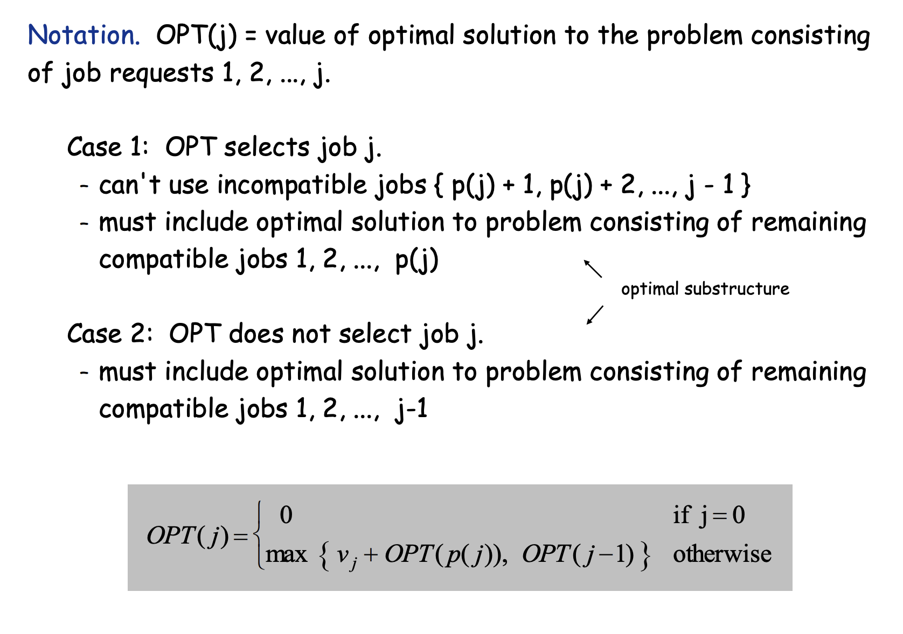
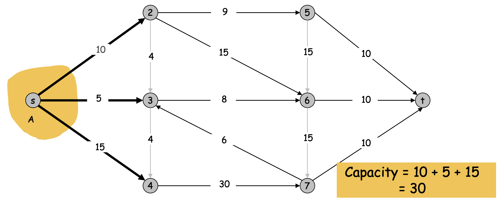
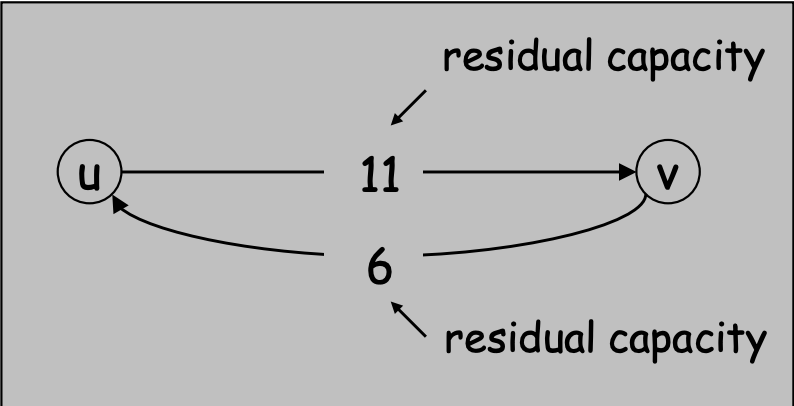
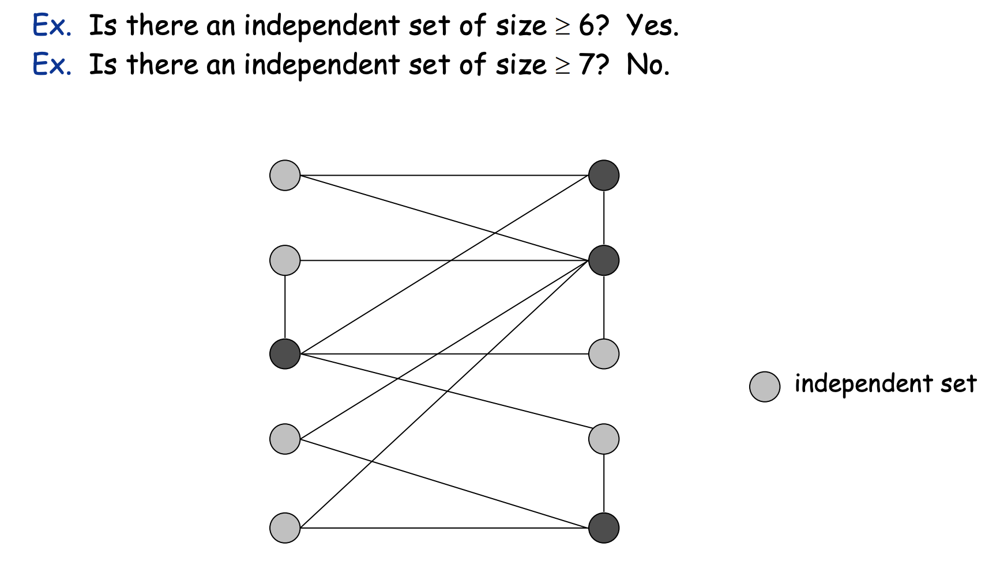
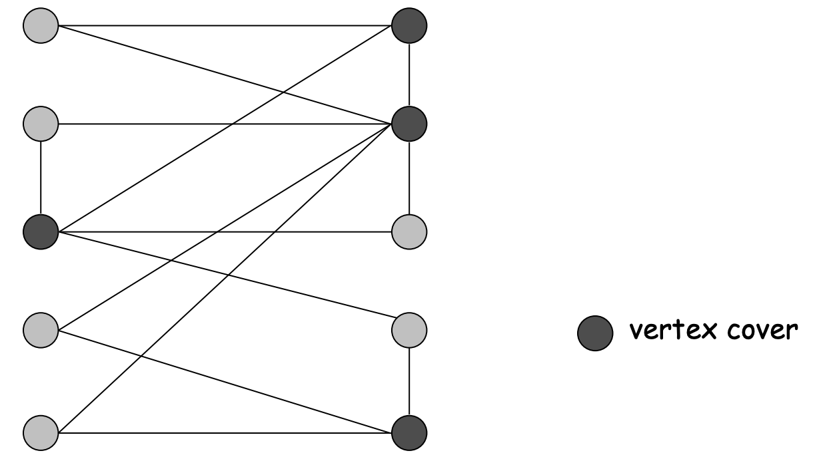

# 高级算法设计与分析

## 一、稳定匹配问题

稳定匹配问题是指在一个匹配问题中，如果不存在一个男生和一个女生，他们彼此喜欢对方胜过自己现在的伴侣，那么这个匹配就是稳定的。

但是，稳定匹配问题并不是所有的匹配问题都有解，而且即使有解，也不一定是唯一的。为了解决这个问题，Gale和Shapley提出了一个算法，可以在多项式时间内找到一个稳定匹配。这个算法就叫做Gale-Shapley算法（GS算法）。

### GS算法

GS算法的基本思想是，每个男生都会向他最喜欢的女生求婚，每个女生都会拒绝她最不喜欢的男生，直到每个女生都有了自己的伴侣。

下面是GS算法的伪代码：

```cpp
while (存在没有伴侣的男生m) {
    令w是m最喜欢的没有求婚过的女生
    if (w没有伴侣) {
        (m, w)成为一对
    } else {
        // w有伴侣m'
        if (w更喜欢m的求婚者m') {
            (m, w)成为一对
            m'变成没有伴侣
        } else {
            (m, w)不成为一对
        }
    }
}
```

如何证明这个算法得到的结果是稳定的呢？我们可以用反证法来证明。下面我们用反证法来证明GS算法得到的结果是稳定的。

问题陈述： 假设我们有一对稳定婚姻问题，使用GS算法求解后，没有稳定的匹配。

步骤 1：构造反例匹配

首先，我们假设GS算法的输出没有稳定的匹配。这意味着存在一对男性和女性，他们不是当前匹配的一对，但他们可以互相更喜欢对方而不满意目前的匹配。设想这对男性为M1和女性为W1。

情况1，M1 从来没有和 W1 求过婚：

如果 M1 从来没有和 W1 求过婚，那么 W1 一定是在 GS 算法的某一轮中拒绝了 > 1 的求婚。这意味着 W1 当前有一个伴侣 M2，且 W1 更喜欢 M2 而不是 M1。但是，这意味着 M2 也更喜欢 W1 而不是 W2，这就意味着 M2 和 W1 会在 GS 算法的某一轮中成为一对，这就与我们的假设矛盾了。

情况2，M1 曾经和 W1 求过婚：

如果 M1 曾经和 W1 求过婚，那么 W1 一定是在 GS 算法的某一轮中拒绝了 M1 的求婚。这意味着 W1 当前有一个伴侣 M2，且 W1 更喜欢 M2 而不是 M1。但是，这意味着 M2 也更喜欢 W1 而不是 W2，这就意味着 M2 和 W1 会在 GS 算法的某一轮中成为一对，这就与我们的假设矛盾了。

所以，我们可以得出结论，GS算法的输出是稳定的。

> 思考：对于一个匹配问题，可能会有多个稳定的匹配，那么GS算法得到的结果是不是唯一的呢？如果是的话，是哪一个呢？


定义：男生m是女生w的一个有效伴侣，如果存在一个稳定匹配，其中m和w是一对。

> Man-optimal assignment. 每个男孩的伴侣找到的都是自己最优的伴侣


假设男生A找到的伴侣B不是他的最优伴侣，而是C。这意味着在A的偏好列表中，C在B之前，并且A在C的偏好列表中也在B之前。否则，如果C在A的偏好列表中排在B之后，那么GS算法会先分配B给A，而不是C。

现在考虑女生B，她的当前伴侣是A，但是她的最优伴侣是男生C。这也意味着在B的偏好列表中，C在A之前，而且C在B的偏好列表中也在A之前。这与我们之前的假设相矛盾，因为GS算法确保了男生A的选择是有限的，他会在选择B之后选择C，因为C在A的偏好列表中排在B之前。

因此，根据反证法，我们的假设是错误的，男生A找到的伴侣B必须是他的最优伴侣。同样的逻辑可以应用于所有男生，证明GS算法中男生找到的伴侣都是他们的最优伴侣。

因此，我们可以得出结论：GS算法中男生找到的伴侣都是最优伴侣。


课上给的证明方法：

声明：GS匹配S*是男性最优的。
证明（反证法）：
- 假设某个男性与不是他最佳伴侣的人配对。男性按偏好递减的顺序提出求婚，因此某个男性被一个合法的伴侣拒绝。
- 让Y是第一个被拒绝的男性，A是第一个拒绝他的合法女性。
- 令S是一个稳定匹配，其中A和Y被配对。
- 当Y被拒绝时，A与她更喜欢的男性Z建立（或重申）婚约。
- 令B是S中Z的伴侣。
- 在Y被A拒绝时，Z没有被任何合法的伴侣拒绝。因此，Z更喜欢A而不是B。
- 但A更喜欢Z而不是Y，由于一个合法的伴侣。
- 因此，在S中A-Z是不稳定的。

### 匹配问题拓展

男孩女孩匹配问题的拓展：

1. 男孩和女孩的数量不一定相等
2. 男孩和女孩的偏好列表长度不一定相等
3. 一个男孩可能匹配多个女孩

这些问题有时候GS算法无法解决，比如对于第三个问题，GS算法无法解决，但是我们可以对GS算法进行拓展。比如一个男孩可以匹配三个女生的时候，我们可以把这个男孩复制两份，然后分别匹配三个女孩，这样就可以用GS算法解决了。

## 二、算法设计与分析基础

### 渐进分析

渐进分析中有五个重要的渐进符号：

1. 大O符号：O(f(n))表示一个函数的渐进上界
2. 大Ω符号：Ω(f(n))表示一个函数的渐进下界
3. 大Θ符号：Θ(f(n))表示一个函数的渐进紧密界
4. 小o符号：o(f(n))表示一个函数的渐进非紧密上界
5. 小ω符号：ω(f(n))表示一个函数的渐进非紧密下界

渐进分析的目的是找到一个函数，它可以描述算法的运行时间。这个函数的形式是：T(n) = O(f(n))，其中T(n)是算法的运行时间，f(n)是一个函数。

下面详细解释一下这五个符号：

举个例子，假设我们有一个函数 f(n) = 3n^2 + 2n + 1，那么O(f(n)) = O(n^2)。因为当n趋近于无穷大的时候，3n^2 + 2n + 1的增长速度和n^2的增长速度是一样的，所以我们可以说3n^2 + 2n + 1的渐进上界是n^2。

还需要注意，f(n) 可以属于 O(n^2)，同时也可以属于 O(n^3)，因为 O(n^2) 和 O(n^3) 都是 f(n) 的渐进上界。

但是他不属于 O(n)，因为 O(n) 不是 f(n) 的渐进上界。


### 三个算法设计思想

#### 1. 贪心算法

贪心算法的基本思想是，每一步都选择当前状态下最好的选择，最终得到的结果就是全局最优的结果。举一个例子，假设我们要找零钱，我们可以每次都选择面值最大的硬币，最终得到的结果就是最少的硬币数量。

贪心算法是一种局部最优的算法，它不一定能得到全局最优的结果。他的优点是简单、有效。缺点是可能得不到全局最优的结果。

「课堂例题」 时间间隔调度问题是一个经典的贪心算法问题。假设我们有一些任务，每个任务都有一个开始时间和结束时间，我们要找到一种调度方式，使得每个时间点都有最多的任务在执行。这个问题的解决方法是，每次都选择结束时间最早的任务，然后将这个任务从任务列表中删除，直到任务列表为空。

除了选择结束时间最早的任务，我们还可以选择开始时间最早的任务，这种方法也可以得到最优的结果。但是如果我们选择执行时间最短的任务，那么就不能得到最优的结果了。

**贪心算法的证明：**

为什么选择结束时间最早的任务可以得到最优的结果呢？我们可以用反证法来证明。

1. 假设我们选择的任务列表不是最优的
2. 假设 a1, a2, a3, ..., an 是贪心算法选择的任务列表
3. 假设b1, b2, b3, ..., bn 是最优的任务列表
4. 其中 a1=b1, a2=b2, a3=b3, ..., ak=bk，但是 ak+1 != bk+1
5. 由于 ak+1 != bk+1，所以 ak+1 的结束时间一定比 bk+1 的结束时间晚
6. 但是贪心算法每一步都选择结束时间最早的任务，所以 ak+1 的结束时间一定比 bk+1 的结束时间早
7. 这与 ak+1 的结束时间一定比 bk+1 的结束时间晚相矛盾
8. 所以假设不成立，贪心算法选择的任务列表是最优的

同样的也可以证明选择开始时间最早的任务的方法也可以得到最优的结果。

**时间分析：**

我们可以用贪心算法来解决时间间隔调度问题，但是我们还需要分析一下这个算法的时间复杂度。

我们可以将这个算法分成两个步骤，第一个步骤是对任务列表进行排序，第二个步骤是选择任务。第一个步骤的时间复杂度是O(nlogn)，第二个步骤的时间复杂度是O(n)，所以这个算法的时间复杂度是O(nlogn)。

「课堂例题」硬币找零问题是一个经典的贪心算法问题。假设我们有一些硬币，每个硬币的面值都是5的倍数，我们要找零钱，使得硬币的数量最少。这个问题的解决方法是，每次都选择面值最大的硬币，然后将这个硬币从硬币列表中删除，直到硬币列表为空。

和硬币找零类似的一个经典问题是邮票问题，这些邮票的面值是1,10,21,34,70,100,350,1225,1500。我们要找到一种方法来找到1400分的邮票，使得邮票的数量最少。

这个时候如果用贪心算法，那么我们得到的结果就是100,34,1,1,1,1,1。但其实最优结果是70,70。所以贪心算法并不是所有的问题都能得到最优的结果。

为什么硬币问题可以用贪心算法得到最优的结果，而邮票问题不能呢？这是因为硬币的面值是5的倍数，所以我们每次都可以选择面值最大的硬币，而邮票的面值不是5的倍数，所以我们不能每次都选择面值最大的邮票。

#### 2. 分治算法

分治算法的基本思想是，将一个大问题分解成若干个小问题，然后将这些小问题的解合并起来，得到大问题的解。举一个例子，假设我们要对一个数组进行排序，我们可以将这个数组分成两个子数组，然后分别对这两个子数组进行排序，最后将这两个子数组合并起来，得到一个有序的数组。这个算法就是归并排序。

两数相加问题可以用分治算法来解决。 假设我们有两个n位的二进制数，我们要计算这两个二进制数的和。这个问题的解决方法是，将这两个二进制数分成两半，然后分别计算这两个二进制数的前一半和后一半，最后将这两个结果合并起来，得到最终的结果。对于已经分成两半的二进制数，我们可以继续分成两半，直到分成的二进制数只有一位。 

#### 3. 动态规划

动态规划的基本思想是，将一个大问题分解成若干个小问题，然后将这些小问题的解合并起来，得到大问题的解。这个思想和分治算法的思想是一样的，但是动态规划和分治算法的区别在于，动态规划会将子问题的解保存起来，避免重复计算。举一个例子，假设我们要计算斐波那契数列的第n项，我们可以将这个问题分解成计算第n-1项和第n-2项，然后将这两个项的和作为第n项的值。但是如果我们使用分治算法，那么我们会重复计算第n-2项，因为第n-2项是第n-1项的子问题，而第n-1项又是第n项的子问题。

前面我们提到过时间间隔调度问题，如果给每个工作给定一个权重，我们要找到一种调度方式，使得规定时间内完成工作的权重最大。这个时候就不能用贪心的方法来解决这种问题了，我们可以用动态规划来解决这个问题。

动态规划的基本思想是，将一个大问题分解成若干个小问题，然后将这些小问题的解合并起来，得到大问题的解。这个思想和分治算法的思想是一样的，但是动态规划和分治算法的区别在于，动态规划会将子问题的解保存起来，避免重复计算。如果用动态规划来解决带权重的时间间隔调度问题，那么我们需要用一个数组来保存每个时间点的最优解，这样就可以避免重复计算。

下列代码是用动态规划来解决带权重的时间间隔调度问题的代码：

```cpp
// jobs是一个数组，每个元素是一个数组，包含三个元素，分别是开始时间、结束时间和权重

int maxWeight(vector<vector<int>> jobs) {
    // 找到最大的结束时间
    int maxEndTime = 0;
    for (int i = 0; i < jobs.size(); i++) {
        maxEndTime = max(maxEndTime, jobs[i][1]);
    }

    // 初始化dp数组
    vector<int> dp(maxEndTime + 1, 0);

    // 计算dp数组
    for (int i = 1; i <= maxEndTime; i++) {
        dp[i] = dp[i - 1];
        for (int j = 0; j < jobs.size(); j++) {
            if (jobs[j][1] == i) {
                dp[i] = max(dp[i], dp[jobs[j][0]] + jobs[j][2]);
            }
        }
    }

    return dp[maxEndTime];
}
```

上面代码的时间复杂度为O(n^2)，空间复杂度为O(n)。

对于每一个时间节点，都可以分为两种情况，一种是这个时间节点不做任务，另一种是这个时间节点做任务。如果这个时间节点不做任务，那么这个时间节点的最优解就是前一个时间节点的最优解。如果这个时间节点做任务，那么这个时间节点的最优解就是这个任务的权重加上这个任务开始时间前的最优解。所以这个时间节点的最优解就是这两种情况中的最大值。这样我们就可以得到一个递推公式，然后用这个递推公式来计算dp数组。

**数学表达：**



:::tip

*什么是设计动态规划算法最重要的步骤：

1. 构造子问题：将原问题分解成若干个子问题
2. 构建递归关系式：将子问题的解合并起来，得到原问题的解
3. 求解：计算子问题的解，然后计算原问题的解

在写作业或者考试的时候，如果遇到动态规划的问题，一定要按照这三个步骤来解决问题。就是按照这三个步骤来给分的。

:::


**背包问题：**

背包问题是一个经典的动态规划问题。假设我们有一个背包，背包的容量是C，我们有n个物品，每个物品的重量是w1, w2, w3, ..., wn，每个物品的价值是v1, v2, v3, ..., vn。我们要找到一种装法，使得背包中物品的总价值最大。

首先第一步是构造子问题，我们可以将这个问题分解成n个子问题，每个子问题是：在选了前i个物品的情况下，背包的容量是C，这种情况下背包中物品的总价值最大是多少。这个子问题的解记为f(i, C)。

第二步骤是构建递归关系式，我们可以得到这样一个递推公式, 包含3种情况：

$$
f(i, C) = \begin{cases}
0 & i = 0 \text{ or } C = 0 \\
f(i-1, C) & w_i > C \\
max(f(i-1, C), v_i + f(i-1, C-w_i)) & otherwise
\end{cases}
$$

这个公式的理解是，如果我们不选第i个物品，那么背包中物品的总价值就是前i-1个物品的总价值。如果我们选了第i个物品，那么背包中物品的总价值就是第i个物品的价值加上前i-1个物品在剩余容量为C-wi的背包中的总价值。

第三步骤是求解，我们可以用递归的方法来求解这个问题，也可以用迭代的方法来求解这个问题。用迭代的方式解决的思路是，我们先计算出f(0, 0), f(0, 1), f(0, 2), ..., f(0, C)，然后计算出f(1, 0), f(1, 1), f(1, 2), ..., f(1, C)，然后计算出f(2, 0), f(2, 1), f(2, 2), ..., f(2, C)，一直计算到f(n, 0), f(n, 1), f(n, 2), ..., f(n, C)。最后我们就可以得到f(n, C)。

下面是用迭代的方式来解决背包问题的代码：

```cpp
int knapsack(vector<int> w, vector<int> v, int C) {
    // 初始化dp数组
    vector<vector<int>> dp(w.size() + 1, vector<int>(C + 1, 0));

    // 计算dp数组
    for (int i = 1; i <= w.size(); i++) {
        for (int j = 0; j <= C; j++) {
            dp[i][j] = dp[i - 1][j];
            // 如果当前背包的容量可以放下第i个物品，
            // 那么我们就需要考虑一下是否放入第i个物品
            if (j >= w[i - 1]) {
                // 如果放入第i个物品，那么总价值是
                // v[i-1] + dp[i-1][j-w[i-1]]
                dp[i][j] = max(dp[i][j], v[i - 1] + dp[i - 1][j - w[i - 1]]);
            }
        }
    }
    // 返回最后一个格子的值
    return dp[w.size()][C];
}
```


**序列比对：**

序列比对（Sequence Alignment）是一个经典的动态规划问题。假设我们有两个序列，一个是A，一个是B，我们要找到A和B的最长公共子序列。这个问题的解决方法是，我们可以将A和B分别分成两个子序列，然后分别比较这两个子序列，最后将这两个子序列合并起来，得到A和B的最长公共子序列。

第一步是构造子问题，我们可以将这个问题分解成n*m个子问题，每个子问题是：在A的前i个字符和B的前j个字符的情况下，A和B的最长公共子序列的长度是多少。这个子问题的解记为f(i, j)。

第二步是构建递归关系式，我们可以得到这样一个递推公式, 包含3种情况：

$$
f(i, j) = \begin{cases}
0 & i = 0 \text{ or } j = 0 \\
f(i-1, j-1) + 1 & A[i] = B[j] \\
max(f(i-1, j), f(i, j-1)) & otherwise
\end{cases}
$$

第三步是求解，可以用迭代的方法来求解这个问题。

下面是用迭代的方式来解决序列比对问题的代码：

```cpp
#include <iostream>

using namespace std;

const int N = 1010;

char a[N],b[N];
int f[N][N];
int n,m;

int main()
{
    cin >> n >> m;
    scanf("%s%s",a+1,b+1);
    for(int i=1;i<=n;i++)
        for(int j=1;j<=m;j++)
        {
            if(a[i] == b[j]) f[i][j] = f[i-1][j-1]+1;
            else f[i][j] = max(f[i-1][j],f[i][j-1]);
        }
    cout << f[n][m];
}
```

## 三、最大流算法

最大流算法是一种用于解决网络流问题的算法，网络流问题是一类在网络中寻找最大流量的问题。网络通常由节点和连接这些节点的边组成，每条边都有一个容量，表示该边允许通过的最大流量。网络流问题的目标是找到从一个特定源节点到一个特定汇点节点的最大流量路径，同时满足边的容量约束。

最大流算法的核心思想是在网络中找到一条从源节点到汇点节点的路径，并在这条路径上推送流量，直到找不到增广路径为止。增广路径是一条从源节点到汇点节点的路径，沿途的边上还有剩余容量，即允许额外的流量通过。通过不断寻找增广路径并推送流量，最大流算法最终找到了网络中的最大流量。

以下是最大流算法的一般步骤：

1. 初始化流量：将网络中所有边的流量设置为0。

2. 寻找增广路径：使用某种搜索算法（如广度优先搜索或深度优先搜索）来寻找从源节点到汇点节点的增广路径。

3. 计算路径上的最小剩余容量：在增广路径上找到剩余容量最小的边，这个值将成为当前增广路径上的流量增量。

4. 推送流量：将流量增量推送到增广路径上，同时更新路径上的各边的流量。

5. 重复步骤2至4，直到找不到增广路径为止。

6. 计算最大流：最终，最大流算法会找到从源节点到汇点节点的最大流量，即网络中的最大流。

### Minimum Cut 问题

最小割问题是指在一个网络中，找到一个割，使得割的容量最小。割的容量是指割中所有边的容量之和。

最小割问题和最大流问题是等价的，也就是说，如果我们能够解决最大流问题，那么我们也能够解决最小割问题。这是因为，如果我们能够找到一个割，使得割的容量最小，那么这个割一定是最大流问题的最大流。反之，如果我们能够找到一个最大流，那么这个最大流一定是最小割问题的最小割。

下面是一个割的例子：


  


一个 Cut 的 capacity（容量） 指的是这个 Cut 中所有边的 capacity 之和。上图中的 Cut 的 capacity 是 10+5+15=30。

### Towards a Max Flow Algorithm 最大流算法

最大流算法的核心思想是在网络中找到一条从源节点到汇点节点的路径，并在这条路径上推送流量，直到找不到增广路径为止。增广路径是一条从源节点到汇点节点的路径，沿途的边上还有剩余容量，即允许额外的流量通过。通过不断寻找增广路径并推送流量，最大流算法最终找到了网络中的最大流量。

使用贪心算法来解决最大流问题，我们可以得到一个近似的解，但是这个解不一定是最优的。

### Residual Graph 算法

在最大流算法中，我们需要不断寻找增广路径，并在增广路径上推送流量。为了找到增广路径，我们需要在网络中进行搜索。但是如果我们每次都在原始网络中进行搜索，那么我们就需要不断地重复搜索，这样就会导致算法的时间复杂度很高。为了避免重复搜索，我们可以在搜索过程中，将搜索过的边删除，这样就不会重复搜索了。但是如果我们删除了搜索过的边，那么我们就无法得到最终的最大流了。为了解决这个问题，我们可以在搜索过的边上添加反向边，这样我们就可以在反向边上进行搜索，而不会影响原始网络。这个网络就是残余网络。

  

有了残余网络之后我们就可以解决最大流问题了，下面介绍Ford-Fulkerson算法，这是一个经典的最大流算法。

### Ford-Fulkerson 算法

Ford-Fulkerson算法是一个经典的最大流算法，它的核心思想是在网络中找到一条从源节点到汇点节点的路径，并在这条路径上推送流量，直到找不到增广路径为止。增广路径是一条从源节点到汇点节点的路径，沿途的边上还有剩余容量，即允许额外的流量通过。通过不断寻找增广路径并推送流量，Ford-Fulkerson算法最终找到了网络中的最大流量。

Ford-Fulkerson算法的步骤如下：

1. 初始化流量：将网络中所有边的流量设置为0。
2. 寻找增广路径：使用某种搜索算法（如广度优先搜索或深度优先搜索）来寻找从源节点到汇点节点的增广路径。
3. 计算路径上的最小剩余容量：在增广路径上找到剩余容量最小的边，这个值将成为当前增广路径上的流量增量。
4. 推送流量：将流量增量推送到增广路径上，同时更新路径上的各边的流量。
5. 重复步骤2至4，直到找不到增广路径为止。
6. 计算最大流：最终，Ford-Fulkerson算法会找到从源节点到汇点节点的最大流量，即网络中的最大流。


### 最大流最小割算法

最大流最小割定理：这个定理指出，在任何一个流网络中，从源点到汇点的最大流量等于任何一个割的最小容量。这个定理说明了最大流问题和最小割问题之间的对偶关系。

- 证明过程分为三个部分：
    - (i) 存在一个割(A, B)，使得流量v(f)等于割容量cap(A, B)。
    - (ii) 流量f是一个最大流。
    - (iii) 相对于f，不存在增广路径（augmenting path）。
- (i) ⇒ (ii) 这一部分是根据弱对偶性引理（weak duality lemma）的推论得到的。²[2]如果流量等于割容量，那么流量就是最大的，割就是最小的。
- (ii) ⇒ (iii) 这一部分是用反证法来证明的。假设存在一个增广路径，那么就可以沿着这条路径增加或减少流量，从而得到一个更大的流量，与f是最大流矛盾。
- (iii) ⇒ (i) 这一部分是利用残余图（residual graph）来构造一个割(A, B)。残余图是由原图中每条边和其反向边组成的，每条边上的残余容量（residual capacity）表示还能通过这条边的额外流量。如果f没有增广路径，那么就可以从源点s开始，在残余图中找到所有可达的顶点，记为集合A。由于没有增广路径，汇点t不在A中。那么(A, B)就是一个割，其中B = V - A。根据流量值引理（flow value lemma），流量v(f)等于从A到B连接的边上的流量之和，也就是割容量cap(A, B)。

### 选择增广路径

Choosing Good Augmenting Path是一种选择增广路径的方法，目的是提高Ford-Fulkerson算法求解最大流问题的效率。根据页面内容，这种方法有以下几个特点：

- 增广路径是指在残余图中从源点到汇点的一条路径，其上的每条边都有正的残余容量。
- 选择增广路径时，可以考虑路径上的瓶颈容量、路径的长度、或者其他指标，以尽可能地增加流量或者减少迭代次数。
- 有些选择方法可能导致指数级的迭代次数，甚至无法终止。有些选择方法可以保证多项式级的迭代次数，如Edmonds-Karp算法和Dinitz算法。
- 有些选择方法可以利用容量的规模或者整数性质，如容量缩放法。


#### Capacity Scaling 算法

容量缩放法是一种选择增广路径的方法，它利用了容量的规模和整数性质，可以在多项式时间内求解最大流问题。根据ppt内容，这种方法有以下几个特点：

- 容量缩放法维护一个缩放参数$\Delta$，初始值为最大容量C的最小2的幂次。
- 容量缩放法只考虑残余图中残余容量不小于$\Delta$的边，构成一个$\Delta$-残余图。
- 容量缩放法在每个$\Delta$-残余图中寻找增广路径，并沿着路径增加流量，直到没有增广路径为止。
- 容量缩放法每次将$\Delta$减半，直到$\Delta$小于1为止，此时得到的流量就是最大流。
- 容量缩放法的正确性基于整数不变性和增广路径定理，它的时间复杂度基于外层循环次数和内层循环次数。


### 思考题目

1. 如果有超过两个终端节点，那么最大流最小割定理是否成立？如果不成立，那么如何修改最大流最小割定理？

最大流最小割定理是一种重要的图论定理，它指出在一个网络流图中，最大流的值等于最小割的容量 . 该定理成立的前提是网络流图中只有两个终端节点，即源点和汇点。如果网络流图中有超过两个终端节点，那么最大流最小割定理不再成立 . 

在这种情况下，我们可以考虑使用多源汇最大流算法来解决问题。多源汇最大流算法是一种可以处理多个源点和汇点的算法 . 它可以将多个源点和汇点转化为一个超级源点和一个超级汇点，然后使用标准的最大流算法来求解。这样就可以将多个源点和汇点的问题转化为只有两个终端节点的问题，从而应用最大流最小割定理。

## NP 和计算不可行性

### 简单归约

1. 简单等价
2. 特殊情况到一般情况
3. 使用小部件编码等。

这些模式可以用于将一个问题转化为另一个问题，以便更容易地解决它。这些模式中的每一种都有其优点和缺点，可以根据具体情况选择使用。

#### 独立集问题

独立集问题是一个经典的NP完全问题，它的输入是一个无向图，输出是这个图中的一个独立集。独立集是指图中的一组顶点，其中任意两个顶点都不相邻。独立集问题的目标是找到一个最大的独立集。

  


#### 点覆盖问题

独立集问题可以用简单归约来解决，我们可以将顶点覆盖问题转化为独立集问题，然后使用独立集问题的算法来解决顶点覆盖问题。 点覆盖问题和独立集问题是对偶的问题，点覆盖问题的输入是一个无向图，输出是这个图中的一个点覆盖。点覆盖是指图中的一组顶点，其中任意一条边都至少有一个顶点在这组顶点中。




#### 集合覆盖问题

集合覆盖问题是一个组合优化问题，给定一个无向图G=(V,E)，要求找到一个顶点集合S，使得S包含了G中所有边的至少一个端点，并且S的大小尽可能小。这个问题是**NP完全**的，也就是说，没有已知的多项式时间算法可以解决它。

集合覆盖问题有许多实际应用，例如无线传感器网络中的目标覆盖、生物信息学中的基因组测序、软件工程中的寄存器分配等。

集合覆盖问题可以用不同的方法求解，例如贪心算法、动态规划、线性规划、近似算法、启发式算法等。

**如何用点覆盖问题归约集合覆盖问题：**

点覆盖问题是一个组合优化问题，给定一个无向图G=(V,E)，要求找到一个顶点集合S，使得S包含了G中所有边的至少一个端点，并且S的大小尽可能小。

集合覆盖问题是一个组合优化问题，给定一个无向图G=(V,E)，要求找到一个顶点集合S，使得S包含了G中所有边的至少一个端点，并且S的大小尽可能小。

为了将点覆盖问题归约为集合覆盖问题，我们可以使用以下方法：
- 对于给定的无向图G=(V,E)，构造一个新的无向图G'=(V',E')，其中V'是G中的每个边所对应的顶点的集合，E'是G中每个顶点所对应的边的集合。
- 对于G中的每个边e=(u,v)，在G'中添加一条边e'=(u',v')，其中u'和v'分别是e的两个端点所对应的顶点。
- 现在，我们可以观察到，如果存在一个大小为k的点覆盖S，那么我们可以选择G'中与S中顶点对应的边所构成的集合作为集合覆盖。这是因为对于G中的每条边e=(u,v)，至少有一个端点u或v在S中，所以在G'中对应的边e'=(u',v')至少有一个端点u'或v'在S中。
- 反过来，如果存在一个大小为k的集合覆盖S'，那么我们可以选择G中与S'中顶点对应的边所构成的集合作为点覆盖。这是因为对于G中的每条边e=(u,v)，至少有一个端点u或v在S'中，所以我们可以选择u或v作为点覆盖。

因此，我们可以看到点覆盖问题可以归约为集合覆盖问题。这意味着如果我们能够有效地解决集合覆盖问题，那么我们也能够有效地解决点覆盖问题。


### 自归约问题（必考）

自归约问题将搜索问题归约到决策问题。以独立集问题为例，我们可以将独立集问题转化为一个决策问题，即给定一个无向图G=(V,E)，一个整数k，和一个顶点集合S，判断S是否是G的一个独立集，这个问题可以用以下方法解决：

- 开始时，我们可以将决策问题应用于图G和整数k，以判断是否存在一个大小为k的独立集。如果算法返回"是"，那么我们已经找到了一个大小为k的独立集，问题解决。
- 如果算法返回"否"，那么我们可以继续迭代。我们可以将k减小为k-1，然后再次应用决策问题来检查是否存在大小为k-1的独立集。
- 我们不断重复这个过程，每次将k减小1，直到找到一个大小为k的独立集为止，或者当k减小到0时，我们可以停止搜索，此时问题无解。

同样自归约也可以用到点覆盖问题上：

决策问题：是否存在一个大小为k的点覆盖？
搜索问题：找到一个大小为k的点覆盖。

- 假设你有一个多项式时间算法来解决决策问题，即判断是否存在一个大小为k的点覆盖。
- 现在，要解决搜索问题，你可以采用二分搜索的方法，从1到n（n是图中的顶点数）进行搜索，来找到最小的k，使得存在一个大小为k的点覆盖。
- 对于每个k，使用决策问题的算法来检查是否存在大小为k的点覆盖。如果存在，继续搜索更小的k值，直到找到最小的满足条件的k为止。
- 最终，你会找到一个大小为k的点覆盖，这就是搜索问题的解。

。


:::tip
期末考试题：对于哈密尔顿圈问题，请证明如果存在一个多项式时间算法来判断一个图是否存在哈密尔顿圈，就存在一个多项式时间算法来找到一个哈密尔顿圈。

证明：我们可以用自归约来证明这个问题。首先，我们可以将哈密尔顿圈问题转化为一个决策问题，即给定一个无向图G=(V,E)，一个整数k，和一个顶点集合S，判断S是否是G的一个哈密尔顿圈，这个问题可以用以下方法解决：

- 首先，我们可以用一个循环来遍历G中的每条边，然后判断删除这条边后的G是否存在一个哈密尔顿圈。如果删除这条边后的G存在一个哈密尔顿圈，那么我们就可以将这条边从G中删除，然后继续遍历G中的下一条边。如果删除这条边后的G不存在一个哈密尔顿圈，那么我们就可以判断S不是G的一个哈密尔顿圈，然后结束算法。
- 如果我们遍历完了G中的所有边，那么
:::


### 决策问题

决策问题是一种特殊的搜索问题，它的目标是判断一个问题是否存在解。决策问题的解是"是"或者"否"，而搜索问题的解是一个具体的解。

多项式时间：多项式时间是指一个算法的运行时间是输入规模的多项式函数。例如，如果一个算法的运行时间是O(n^2)，那么它的运行时间是输入规模的平方。多项式时间算法是指运行时间是输入规模的多项式函数的算法。

素数判断问题就是一个决策问题，且可以在多项式时间内解决，$p(|s|)=O(|s|^8)$。

多项式时间内可以解决的决策问题称为P问题。

### NP 问题

NP问题是指可以在多项式时间内验证一个问题的解是否正确的问题。例如，素数判断问题就是一个NP问题，因为我们可以在多项式时间内验证一个数是否是素数。

P是NP的一个子集，这是因为P问题是可以在多项式时间内解决的NP问题。

如何证明一个问题是NP问题？

证明一个问题是NP问题的方法是，给出一个证明，证明这个问题的解可以在多项式时间内验证。例如，素数判断问题的证明是，给出一个证明，证明一个数是否是素数的解可以在多项式时间内验证。


### P,NP,EXP

EXP问题指的是可以在指数时间内解决的问题。例如，素数判断问题就是一个EXP问题，因为我们可以在指数时间内解决素数判断问题。

P属于NP，NP属于EXP，这是因为P问题是可以在多项式时间内解决的NP问题，NP问题是可以在多项式时间内验证的EXP问题。

### NP 完全问题

NP完全问题是指既是NP问题，又是NP难问题的问题。NP难问题是指可以在多项式时间内归约到NP问题的问题。NP完全问题是指既是NP问题，又是NP难问题的问题。

如何证明一个问题是NP完全问题？(Recipe to establish NP-completeness of a problem Y) 

Step1: Show that Y is in NP. (证明Y是NP问题)
Step2: Choose an NP-complete problem X. (选择一个NP完全问题X)
Step3: Show that X can be reduced to Y in polynomial time. (证明X可以在多项式时间内归约到Y)

这里注意是把X归约到Y，而不是把Y归约到X。


