# 分布式系统复习

## 第一章

### 1.1 分布式系统的构建原因

1. **提高性能**：分布式系统可以利用多台计算机的并行处理能力，提高系统的吞吐量和响应速度。
2. **提高可靠性**：分布式系统可以通过冗余和容错机制，提高系统的可用性和容错性，避免单点故障。
3. **提高可扩展性**：分布式系统可以通过动态添加或删除节点，提高系统的可扩展性和灵活性，适应不同的负载需求。
4. **提高安全性**：分布式系统可以通过加密和认证技术，提高系统的安全性和保密性，防止数据泄露和攻击。

### 1.2 分布式系统的定义、特征

**定义：** 由多个自治的处理单元通过计算机网络互连并协作完成共同的任务的系统。

**特征：** 

- 并发性：多个程序（进程，线程）并发执行，共享资源
- 无全局时钟：每个机器有各自的时间，难以精确同步，程序间的协调靠交换消息
- 故障独立性：一些进程出现故障，并不能保证其它进程都能知道

### 1.3 分布式系统举例

1. **WEB搜索：** Google 最大最复杂的分布式系统之一
2. **大型多人在线游戏：** 王者荣耀 / 魔兽
3. **区块链系统：**比特币，分布式账本、不可篡改

### 1.4 分布式系统的挑战

1. **异构性**：分布式系统中的不同组件可能使用不同的网络协议、硬件、操作系统、编程语言等，导致数据交换和协作困难。解决异构性的方法有使用**中间件、移动代码**、虚拟机等。
2. **开放性**：分布式系统是否可以扩充或以不同的方式重新实现，取决于其公开的接口和协议。例如，RPC和Restful是两种不同的远程调用抽象方式。
3. **安全性**：分布式系统需要保护其资源和服务不受未经授权的访问、篡改和干扰，涉及到机密性、完整性和可用性三个方面。例如，使用ACL、加密、校验和、签名、防止拒绝服务攻击等技术。
4. **可伸缩性**：分布式系统需要在规模扩展后，保持良好的性能和可用性，避免资源耗尽和性能瓶颈。设计可伸缩的分布式系统需要考虑控制物理资源的代价、控制性能损失、控制软件资源被耗尽、防止性能瓶颈等方面。例如，使用DNS、缓存、复制、分区等技术。

:::note

什么是中间件？

中间件是一种软件，它提供基本的通信模块和其他一些基础服务模块，为应用程序开发提供平台。主要解决异构网络环境下分布式应用软件的互连与互操作问题，它可屏蔽实现细节，提高应用系统的易移植性。（进程间通信(RMI,RPC) +数据的外部表示，编码，RRP)
:::


## 第二章

### 2.1 分布式系统物理模型

从计算机和所用网络技术的特定细节中抽象出来的分布式系统底层硬件元素的表示。

### 2.2 分布式系统体系结构模型

#### 2.2.1 C/S、P2P两种不同结构

1. **C/S（客户－服务器）:** 客户直接和服务器连接，优点：简单、直接，缺点： 伸缩性差，系统的伸缩性不会超过提供服务的计算机的能力和该计算机所处网络连接的带宽。

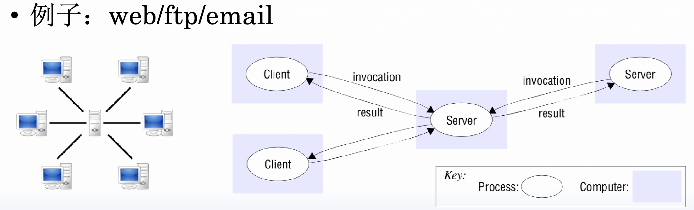  

2. **P2P（对等体系结构）:** 系统应用中，完全由对等进程组成，进程间的通信模式完全依赖于应用的需求。缺点是管理难度大。例子：Bittorrent、IPFS、eDonkey。

#### 2.2.2 分层模型、层次化模型

1. **分层模型**：将一个复杂的系统划分为若干层，每一层利用下一层提供的服务，同时向上一层提供服务。这种模式可以简化系统的设计和实现，提高系统的可维护性和可扩展性。分层模型中的每一层可以看作是一个服务层，提供一定的抽象和功能。例如，分布式系统中常见的分层模型有OSI七层模型、TCP/IP四层模型等。
2. **层次化模型**：与分层模型互补，是一种组织给定层功能的技术。层次化模型将一个服务层划分为多个水平的子层，每个子层可以部署在不同的物理节点上，实现功能的分布和并行。层次化模型可以提高系统的性能和可靠性，适应不同的应用需求和环境。层次化模型中的每个子层可以看作是一个服务层次，提供一定的服务质量和容错能力。例如，分布式系统中常见的层次化模型有Web应用。

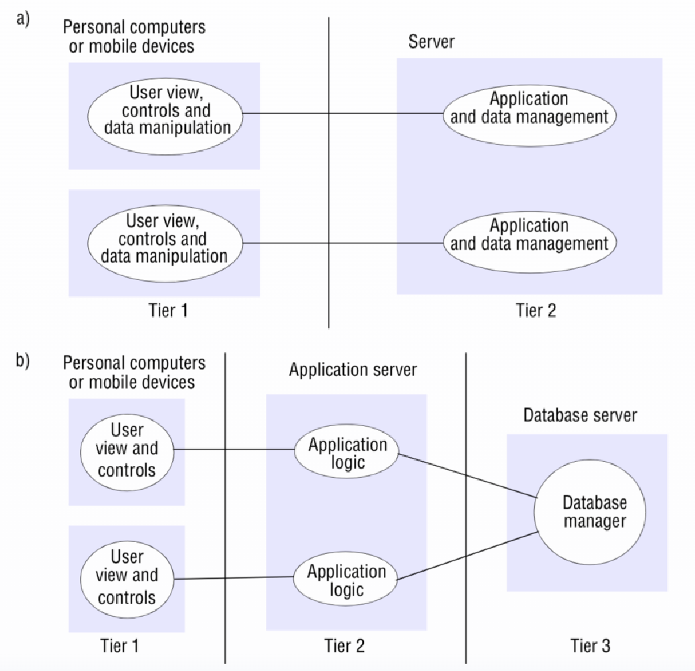  

### 2.3 交互、故障、安全三种基础模型

#### 2.3.1 交互模型

- **交互模型的概念**：分布式系统由多个以复杂方式进行交互的进程组成，进程之间通过消息传递进行交互，实现系统的通信和协作功能。
- **交互模型的影响因素**：通信性能和计算机时钟。通信性能包括延迟、带宽和抖动，计算机时钟包括时钟偏移和时钟校正。
- **交互模型的两个变体**：同步分布式系统（在线电子商务中的商品从订购到付款的过程）和异步分布式系统（例如Email、FTP、VOD）。同步分布式系统有严格的时间限制假设，异步分布式系统没有可预测的时限。异步分布式系统达成协定非常困难，例如Pepperland协定问题（两军问题的区别）。

#### 2.3.2 故障模型

**定义：** 定义故障发生的行为，帮助理解故障对分布式系统的影响。分为三种分类：
- **遗漏故障 Omission failures**：进程或者通信通道没有正常的工作，导致消息的丢失或者进程的崩溃。遗漏故障是良性故障，可以通过重传或者备份来恢复。
- **随机故障 Arbitrary failures**：进程或者通信通道的行为不可预测，可能产生错误的或者恶意的消息。随机故障是最严重的一种故障，对系统的影响最大，而且很难检测和纠正。
- **时序故障 Timing failures**：进程或者通信通道的行为受到时间因素的影响，可能导致消息的延迟或者乱序。时序故障是一种中间程度的故障，可以通过同步或者排序来解决。

#### 2.3.3 安全模型

分布式系统的模块特性和开放性，使他们暴露在内部或者外部的攻击下；

安全模型的目的是提供依据，以此分析系统可能受到的侵害，并在设计系统时防止这些侵害的发生；

## 第三章

### 3.1 时钟漂移及产生原因

时钟漂移是指物理时钟与理想时钟之间的偏差，即每个时钟的滴答速率与标准速率的差异。产生的原因主要有电源稳定性、环境温度等。

### 3.2 内部、外部物理时钟同步


- **内部物理时钟同步**：指的是在一个分布式系统中，所有的节点都尽量保持自己的物理时钟与某个参考时钟一致，或者至少保持时钟之间的偏差在一个可接受的范围内。
- **外部物理时钟同步**：指的是在一个分布式系统中，所有的节点都尽量保持自己的物理时钟与某个外部的标准时钟一致，例如国际原子时（TAI）或者协调世界时（UTC）。
- **物理时钟同步的目的**：是为了让分布式系统中的节点能够正确地协调和执行各种时间相关的任务，例如事件排序、共识算法、分布式事务、超时检测等。
- **物理时钟同步的方法**：有多种，例如基于消息传递的**Cristian算法**和**Berkeley算法**，以及基于网络广播的**NTP协议**和**PTP协议**。这些方法都有各自的优缺点，需要根据不同的场景和需求进行选择和优化。

### 3.3 时钟正确性含义

时钟正确性就是指物理时钟与理想时钟之间的偏差在一个可接受的范围内，即时钟的漂移率在一个可接受的范围内。

- 基于漂移率——漂移率在一个已知的范围内

$$
(1-\rho)\left(t^{\prime}-t\right) \leq H\left(t^{\prime}\right)-H(t) \leq(1+\rho)\left(t^{\prime}-t\right)
$$

- 基于单调性

$$
t^{\prime}>t \Rightarrow C\left(t^{\prime}\right)>C(t)
$$

- 基于混合条件： 单调性+漂移率有界+同步点跳跃前进

### 3.4 物理时钟同步的三种方法

#### 3.4.1 Cristian方法

Cristian方法是一种用于同步分布式系统中的物理时钟的算法。它的基本思想是：

- **客户端向服务器发送请求**：客户端选择一个可信的时间服务器，向它发送一个包含客户端当前时间的请求。
- **服务器回复客户端**：服务器收到请求后，将自己的当前时间作为回复发送给客户端。
- **客户端校正自己的时钟**：客户端收到回复后，计算请求和回复的往返时间，然后用服务器的时间加上往返时间的一半来更新自己的时钟。

Cristian方法的优点是简单易实现，缺点是需要网络延迟的稳定性和可预测性，以及服务器的可靠性和安全性。如果网络延迟变化很大，或者服务器被攻击或故障，那么客户端的时钟可能会出现较大的误差。

#### 3.4.2 Berkeley算法

这部分当前页面介绍了分布式系统中的时钟同步问题和Berkeley算法。Berkeley算法是一种适用于无法得知真实时间的分布式系统的时钟同步算法，其基本思想是：

- 选定一个**协调者**节点，负责收集其他**从属**节点的时钟信息，并计算出一个**平均**时间作为标准时间。
- 协调者节点将**平均**时间与自己的时钟进行比较，得出一个**时钟偏差**，并将其发送给所有从属节点。
- 从属节点根据收到的时钟偏差，对自己的时钟进行**调整**，使之与协调者节点的时钟保持一致。

Berkeley算法的优点是：

- 不需要物理时钟或广播通信，只需要协调者节点和从属节点之间的**点对点**通信。
- 能够处理**失效**节点和**消息延迟**，通过设置**超时**机制和**估计**网络延迟。
- 能够避免时钟**回拨**，即时钟向后调整，因为协调者节点只会发送时钟偏差，而不是绝对时间。

Berkeley算法的缺点是：

- 依赖于协调者节点的**可靠性**，如果协调者节点失效或被攻击，会影响整个系统的时钟同步。
- 需要协调者节点和从属节点之间的**频繁**通信，会增加网络开销和系统负载。
- 无法保证时钟的**精确性**，因为平均时间只是一个**近似**值，而不是真实时间。

#### 3.4.3 网络时间协议（NTP）

- **选择主节点**：网络中的一个节点被选为主节点，其它节点作为从节点。主节点从权威时钟源（如原子钟、GPS）接收精确的协调世界时（UTC）。
- **轮询从节点**：主节点定期轮询所有的从节点，询问它们的时间。此处可以使用克里斯丁算法（Cristian's algorithm）来计算网络延迟和时钟偏移。
- **计算平均值**：主节点根据从节点的时间和自己的时间，计算出一个平均时间，作为网络的标准时间。
- **发送偏移量**：主节点向每个从节点发送需要调整的时钟的偏移量，即从节点的时间与平均时间的差值。通过发送偏移量而不是时间戳来避免网络延迟的影响。
- **调整时钟**：从节点根据收到的偏移量，调整自己的时钟，使之与平均时间一致。这样，网络中的所有节点的时钟就达到了同步。


### 3.5 逻辑时间、逻辑时钟

逻辑时间和逻辑时钟是分布式系统中的重要概念。**在分布式系统中，由于不存在全局物理时间**，因此需要**使用逻辑时间来捕获分布式计算时间之间的因果关系**。逻辑时钟系统由一个时间域 T 和一个逻辑时钟 C 组成。时间域 T 上存在偏序关系 < ，这种关系表示事件发生优先或因果优先。逻辑时钟 C 是一个函数，该函数将分布式系统中的事件 e 映射到时间域 T ，得到的时间戳记为 C (e) 。逻辑时钟满足单调性，如事件 a 影响事件 b ，那么事件 a 的事件戳小于事件 b 。逻辑时钟系统框架定义了时钟一致性条件，即对任意两个事件 $e_i$ 和 $e_j$ ， $e_i \to e_j \Rightarrow C (e_i) < C (e_j)$ 。实现逻辑时钟需要解决两个问题：每个进程表示逻辑时间的数据结构和能够保证时钟一致性条件，用于更新数据结构的协议。

### 3.6 发生在先关系、并发关系及分布式系统中的事件排序

- **事件排序**：在分布式系统中，需要确定不同进程中发生的事件的先后顺序，以便协调和同步各个进程的行为。
- **先关系**：如果一个事件是由另一个事件直接或间接地引起的，那么这两个事件之间存在先关系，记为 **e -> e'**。先关系具有传递性、非对称性和非自反性的特点。
- **并发关系**：如果两个事件之间不存在先关系，那么这两个事件之间存在并发关系，记为 **e || e'**。并发关系表示两个事件是相互独立的，它们的发生顺序无法通过物理时钟或逻辑时钟来确定。

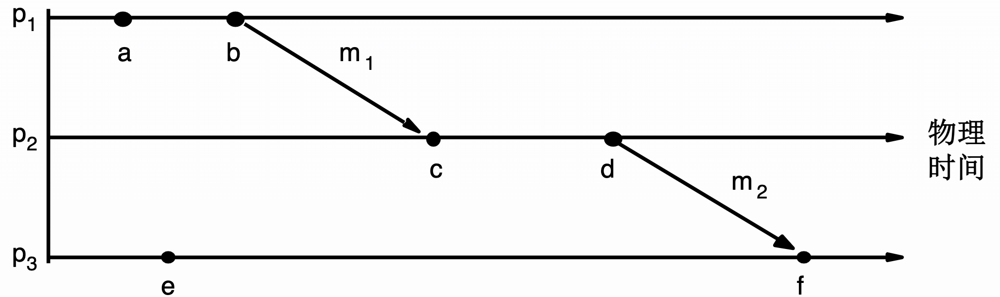  

a→b、c→d 和 e→f成立 b→c 和 d→f成立 b→d、b→f 和 c→f均成立 事件b和e无法比较，即 b||e。

### 3.7 Lamport时钟、全序逻辑时钟及向量时钟

#### 3.7.1 全序逻辑时钟

Lamport时钟是一种逻辑时钟，用于确定分布式系统中事件的因果顺序。它是由**Leslie Lamport**于1978年提出的。Lamport时钟的基本思想是：

- 每个进程维护一个本地计数器，称为**Lamport时间戳**，初始为0。
- 每当一个进程执行一个**内部事件**，它就将其时间戳加1。
- 每当一个进程发送一个**消息**，它就将其时间戳加1，并将该时间戳作为**消息时间戳**附加到消息中。
- 每当一个进程接收一个**消息**，它就将其时间戳更新为**最大值**（自己的时间戳，消息时间戳）+1，并执行**接收事件**。

Lamport时钟的性质是：

- 如果事件a在事件b之前发生（因果顺序），那么Lamport时间戳(a) < Lamport时间戳(b)。
- 如果Lamport时间戳(a) < Lamport时间戳(b)，那么事件a可能在事件b之前发生，也可能与事件b同时发生（并发顺序）。
- Lamport时钟不能区分并发事件的顺序，只能保证因果事件的顺序。

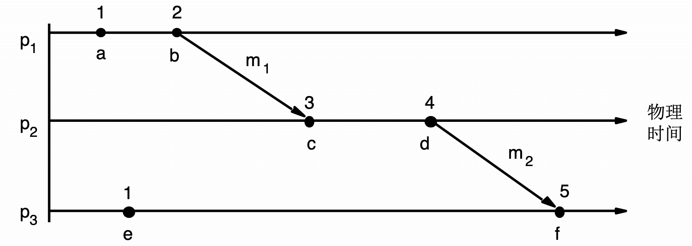  

不同进程产生的消息可能具有相同数值的Lamport时间戳

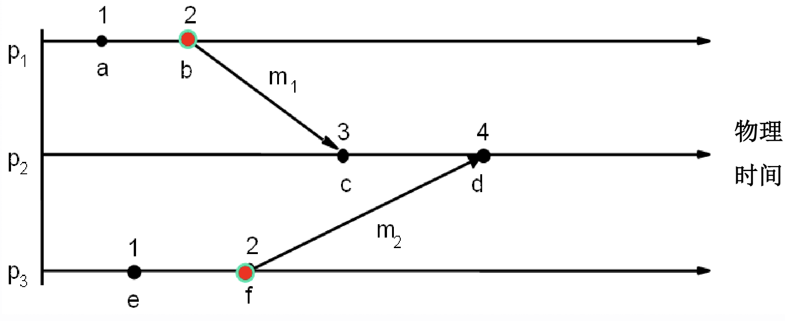  

练习：假设系统中只存在消息发送和接收事件，如下图所示，请给出事件a-g的逻辑时钟。

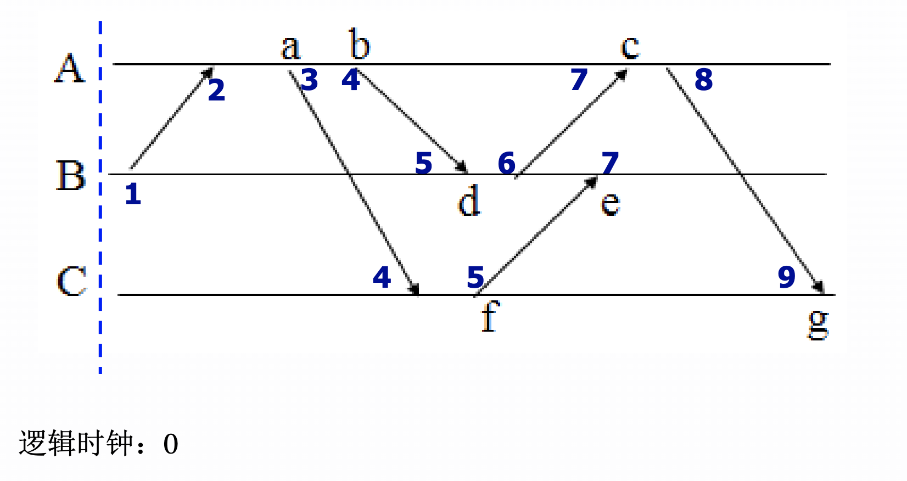  


#### 3.7.3 全序逻辑时钟

全序逻辑时钟是一种用于确定分布式系统中事件的全局顺序的方法。它的基本思想是：

- 每个进程维护一个逻辑时钟，初始为零，每执行一个事件就加一。
- 每个进程在发送消息时，将自己的逻辑时钟值附加到消息中。
- 每个进程在接收消息时，将自己的逻辑时钟更新为自己的逻辑时钟和消息中的逻辑时钟的较大者，然后再加一。
- 两个事件的全序关系由它们的逻辑时钟值和所属进程的标识符决定。如果两个事件的逻辑时钟值不同，那么逻辑时钟值较小的事件先于逻辑时钟值较大的事件。如果两个事件的逻辑时钟值相同，那么所属进程的标识符较小的事件先于所属进程的标识符较大的事件。

全序逻辑时钟的优点是简单、有效，不需要物理时钟的同步。它的缺点是可能与物理时间不一致，且需要每个进程的标识符是唯一的。

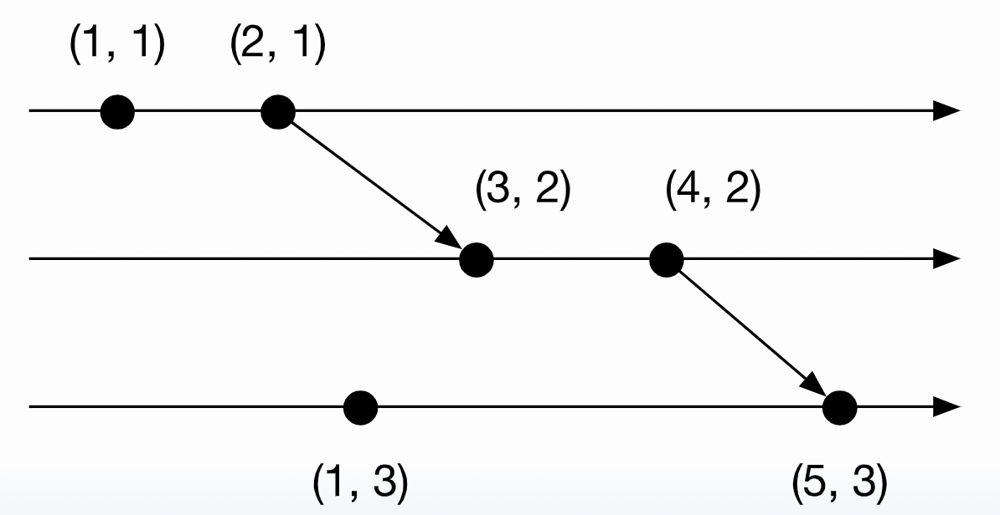  


#### 3.7.4 向量时钟

向量时钟是一种用于表示逻辑时间和事件顺序的方法，它可以解决物理时钟的不准确和不一致的问题。向量时钟的基本思想是，每个进程维护一个向量，其中包含了它自己和其他进程的逻辑时钟值。每当一个进程发生一个内部事件或者发送消息时，它就会增加自己的逻辑时钟值。每当一个进程接收消息时，它就会更新自己的向量，使之不小于自己和消息中的向量。向量时钟可以用于判断两个事件的因果关系，即如果一个事件的向量小于另一个事件的向量，那么它就发生在另一个事件之前；如果两个事件的向量无法比较，那么它们就是并发的。向量时钟可以帮助分布式系统实现全局状态的检测和分布式调试的功能。

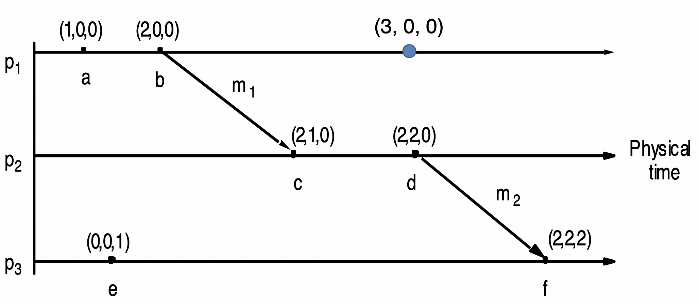  

:::tip

物理意义何在？观察到的对应进程的最新状态，有全局信息。
Lamport时钟只有部分全局信息。

:::

练习：假设系统中只存在消息发送和接收事件，如下图所示，请给出事件a-g的向量时钟。

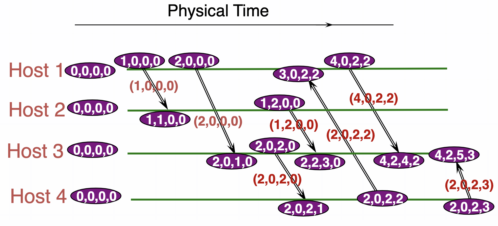  

:::tip

如果有汇聚的情况，取每个进程的最大值。

:::


### 3.8 割集、割集的一致性、一致的全局状态概念


根据当前页面的内容，割集（cut）是一种划分分布式系统中的进程集合的方法，它可以用来描述系统的全局状态。割集有以下几个特点：

- **一致性**：割集中的每个进程的状态都是在同一个逻辑时刻或之前的状态，即不存在因果依赖的状态。
- **完整性**：割集中的每个进程的状态都是由该进程发送或接收的最后一条消息决定的，即不存在未完成的消息传递。
- **可达性**：割集中的任意两个进程之间都存在一条或多条消息传递的路径，即不存在孤立的进程。

割集可以用来捕捉分布式系统的快照，即系统在某一时刻的全局状态。快照可以用来检测系统的属性，如死锁、终止、全局谓词等。快照算法的目标是在不影响系统正常运行的情况下，找到一个一致的割集，并记录割集中的每个进程的状态和通道的消息。


### 3.9 一致的全局状态


- **一致的全局状态**：一个分布式系统中的所有进程在某一时刻的状态的集合，称为该系统的**全局状态**。如果一个全局状态是由一个**切向面**划分的，即每个进程的状态都是在同一个逻辑时刻发生的，那么这个全局状态是**一致的**。
- **切向面**：一个切向面是一个分布式系统中的所有进程的状态的分割线，它可以用来表示一个全局状态。一个切向面可以是**平凡的**，即它包含所有进程的初始或最终状态，也可以是**非平凡的**，即它包含一些进程的中间状态。
- **切向面的性质**：一个切向面的性质取决于它是否包含了**因果依赖**的违反。如果一个切向面没有因果依赖的违反，即它不包含任何从右向左穿过的消息，那么这个切向面是**一致的**。如果一个切向面有因果依赖的违反，即它包含至少一个从右向左穿过的消息，那么这个切向面是**不一致的**。
- **切向面的应用**：切向面可以用来检测分布式系统中的**死锁**，**终止**，**快照**等性质。通过构造和分析切向面，可以确定一个分布式系统的全局状态是否满足某些条件。

算法示例

- 两个进程p1、p2进行交易，每件\$10
- 初始状态:进程p2已经收到5件商品的定单，它将马上发送商品给p1。p1又将订购10个。

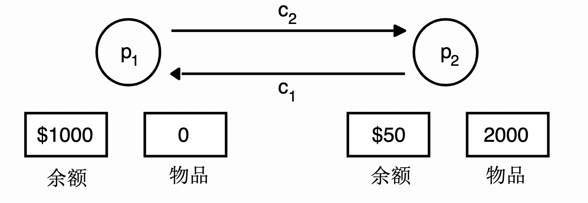  

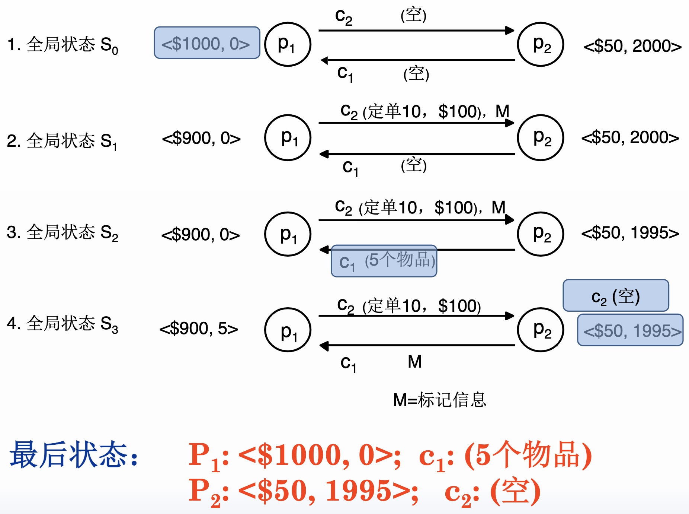  


## 第四章

### 4.1 分布式互斥的含义

分布式互斥是指在分布式系统中，多个进程需要对共享资源进行互斥访问，即同一时间只能有一个进程访问共享资源，而其他进程必须等待。分布式互斥的目的是保证数据的一致性和避免冲突。分布式互斥的实现方法有以下几种：

```
初始化:
     state:=RELEASED;
为了进入临界区
     state:=WANTED;
     组播请求给所有进程;
     T:=请求的时间戳;
     Wait until (接收到的应答数=(N－1));
     state:=HELD;

在pj(i≠j)接收一个请求<Ti,pi>
     if  (state = HELD or (state = WANTED and (T, pj) < (Ti, pi)))
             then  将请求放入pi队列,不给出应答; (见图上，无应答)
             else  马上给pi应答;
             end if
        为了退出临界区;
            state := RELEASED;
            对已进入队列的请求给出应答;
```

### 4.2 解决分布式互斥的方法：中央服务器、环、组播+逻辑时钟、Maekawa投票算法


- **中央服务器 Central Server**：一个专用的进程作为中央服务器，负责管理共享资源的访问。其他进程需要向服务器发送请求消息，获得服务器的许可后才能进入临界区。这种方法的优点是简单、高效，缺点是服务器可能成为性能瓶颈或单点故障。
- **环 Ring**：进程按照一定的顺序组成一个逻辑环，每个进程都有一个唯一的编号。进程需要向环上的所有进程发送请求消息，收到所有进程的回复后才能进入临界区。这种方法的优点是不需要中央服务器，缺点是消息开销大，延迟长，容错性差。
- **组播+逻辑时钟 Multicast + Logical Clock**：进程使用组播通信，将请求消息发送给一个组内的所有进程。请求消息中包含进程的逻辑时钟值，用于表示请求的优先级。进程收到请求后，根据逻辑时钟值和自己的状态，决定是否回复或延迟回复。这种方法的优点是减少了消息开销，缺点是需要维护逻辑时钟的一致性。

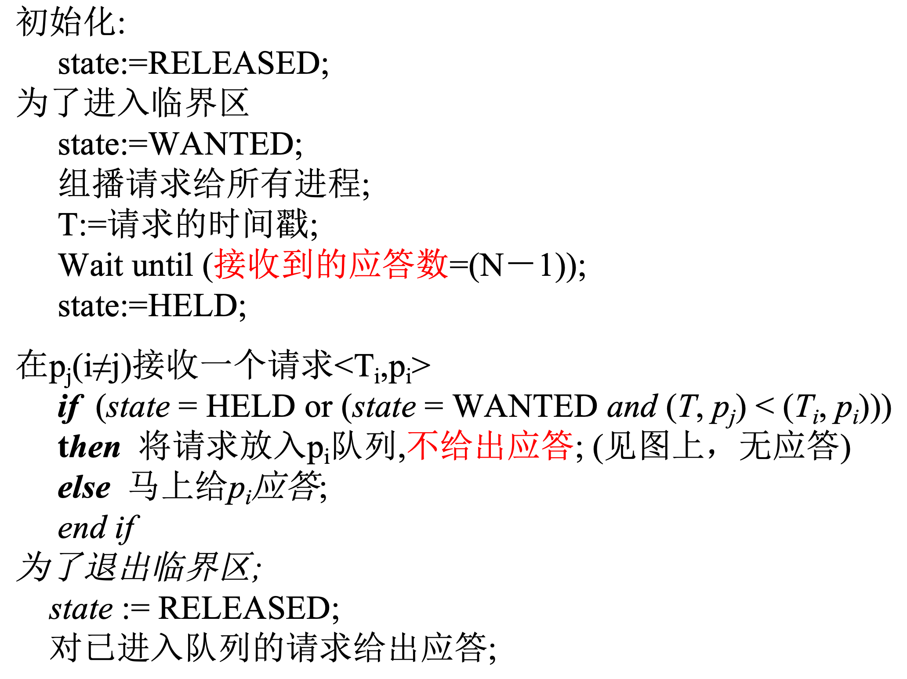  


- **Maekawa投票算法 Maekawa's Voting Algorithm**：进程被划分为若干个投票集，每个投票集包含一部分进程，每个进程属于多个投票集。进程只需要向自己所属的投票集中的进程发送请求消息，获得所有投票后才能进入临界区。这种方法的优点是平衡了消息开销和容错性，缺点是需要复杂的投票协议。

 
```
初始化:
     state:=RELEASED;
     voted:=FALSE;
pi为了进入临界区
     state:=WANTED;
     将请求组播给vi中的所有K个进程（包括自己）;
     Wait until (接收到的应答数=K);
     state:=HELD;
在pj(i≠j)接收来自pi的请求：
     if  (state = HELD or voted= TRUE) 
        then   将来自pi的请求放入队列（按到达时间顺序）,不予应答; 
     else  
        将应答发送给pi;
        voted:=TRUE
     end if
```


### 4.3 分布式选举含义

分布式选举是一种分布式系统中的协调问题，指的是在一组进程中选择一个或多个领导者，以执行一些特定的任务或协调其他进程的行为。分布式选举的目的是在系统中实现一致性和可靠性，例如在主从架构中，选出一个主节点来管理从节点，或者在分布式事务中，选出一个协调者来提交或回滚事务。分布式选举的挑战是如何在网络不可靠、进程可能故障、消息可能丢失或延迟的情况下，达成一个正确、有效、公平的选举结果。分布式选举的算法有很多种，例如基于环形网络的 Bully 算法，基于全连接网络的 Chang-Roberts 算法，基于树形网络的 Gallager-Humblet-Spira 算法等。分布式选举的性能指标有很多，例如消息复杂度、时间复杂度、容错能力、活锁和饥饿的可能性等。

### 4.4 解决分布式选举的方法：环、霸道

- **环 (Ring)**：这种方法假设所有的进程都按照一定的顺序排列在一个逻辑环上，每个进程都知道自己的编号和下一个进程的编号。当一个进程发现协调者故障时，它会向环上的下一个进程发送一个选举消息，包含自己的编号。每个收到选举消息的进程都会比较自己的编号和消息中的编号，如果自己的编号更大，就替换消息中的编号，并转发给下一个进程。如果自己的编号更小，就忽略消息。如果自己的编号和消息中的编号相同，说明自己是最大的编号，就宣布自己成为新的协调者，并向环上的所有进程发送一个协调者消息。这种方法的优点是简单且正确，缺点是消息复杂度高，需要 O(n^2) 个消息，其中 n 是进程的数量。
- **霸道 (Bully)**：这种方法假设所有的进程都知道系统中所有其他进程的编号和地址，且编号越大的进程越强。当一个进程发现协调者故障时，它会向所有编号比自己大的进程发送一个选举消息，如果没有收到任何回复，就宣布自己成为新的协调者，并向所有编号比自己小的进程发送一个协调者消息。如果收到了回复，就放弃选举，等待其他进程的协调者消息。如果在一定时间内没有收到协调者消息，就重新发起选举。这种方法的优点是消息复杂度低，最多需要 O(n) 个消息，其中 n 是进程的数量。缺点是需要知道所有进程的信息，且可能出现多次选举的情况。

### 4.5 基本组播、可靠组播的区别


- **基本组播 Basic Multicast**：一种一对多的通信方式，一个发送者将消息发送给一组接收者，不保证消息的传递顺序和可靠性。基本组播的优点是简单和高效，缺点是可能出现消息丢失、重复或乱序的情况。
- **可靠组播 Reliable Multicast**：一种一对多的通信方式，一个发送者将消息发送给一组接收者，保证消息的传递顺序和可靠性。可靠组播的优点是提高了消息的可信度，缺点是增加了通信的开销和复杂度。可靠组播可以分为有序可靠组播和无序可靠组播，根据是否保证消息的全局顺序。

### 4.6 实现可靠组播的方法

> 有可能是大题！

#### 4.6.1 用B-multicast实现可靠组播

这部分当前页面讲述了如何用B-multicast实现可靠组播。B-multicast是一种基于拜占庭协议的多播算法，它可以容忍一定比例的故障进程。B-multicast的基本思想是：

- **发送者**：发送者将消息多播给所有组成员，并等待收到足够数量的确认消息。如果收到的确认消息不足，发送者会重发消息，直到达到阈值或超时。
- **接收者**：接收者收到消息后，会检查消息的有效性和一致性。如果消息有效且一致，接收者会向发送者和其他接收者发送确认消息，并将消息投递给上层应用。如果消息无效或不一致，接收者会忽略消息，并向发送者发送否认消息。
- **故障处理**：如果发送者或接收者发生故障，其他正常的进程会通过故障检测器或超时机制来检测故障，并将故障进程从组中移除。如果故障进程是发送者，其他进程会选择一个新的发送者来重发消息。如果故障进程是接收者，其他进程会更新确认消息的阈值。

B-multicast的优点是能够在存在故障进程的情况下，保证多播消息的可靠性和一致性。B-multicast的缺点是需要较高的通信开销和时间复杂度，以及对故障进程的比例和类型有一定的限制。

```
初始化：
　  Received:={};
     进程p为了R-multicast一个消息，发送给组g：
　  B-multicast(g,m);
      在进程q On B-deliver(m)时，其中g=group(m)
          if (m 不属于 Received)— 完整性
          then 
             Received:=Received ∪ {m}
             if (q≠p) then B-multicast(g,m); end if—协定
             R-deliver m;--有效性
          end if
```

#### 4.6.2 用IP组播实现可靠组播

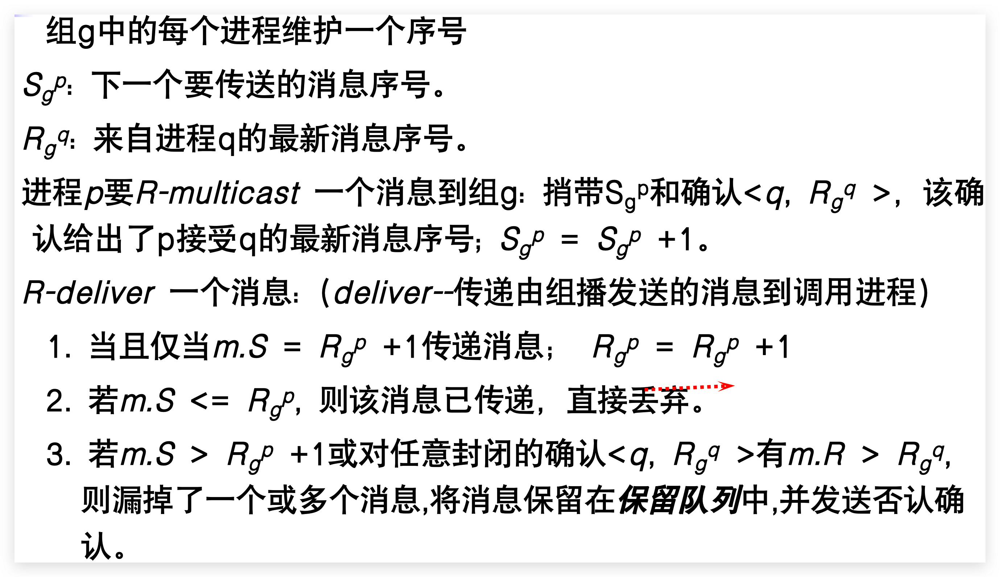  


### 4.7 共识、交互一致性及拜占庭将军问题含义


- **共识**：分布式系统中，多个节点通过通讯交换信息，达成某种一致的决定或状态的过程。
- **交互一致性**：分布式系统中，多个节点对于系统的某些属性或行为有相同的认知和理解的性质。
- **拜占庭将军问题**：一个虚构的场景，用来描述在分布式系统中，如何在存在错误或恶意节点的情况下，达成共识和交互一致性的难题。


### 4.8 三个、四个拜占庭将军问题

#### 4.8.1 同步系统中的拜占庭将军问题

拜占庭问题的最初描述是：N个将军被分隔在不同的地方，忠诚的将军希望通过某种协议达成某个命令的一致(比如一起进攻或者一起后退)。但其中一些背叛的将军会通过发送错误的消息阻挠忠诚的将军达成命令上的一致。

随机故障假设：N个进程中最多有f个进程会出现随机故障。Lamport等人讨论了3个进程相互发送未签名消息的情景，他们证明，如果允许一个进程（f =1）出现故障(或者背叛者)，那么将无法保证满足拜占庭将军问题的条件。他们将这一结果推广到 N≤3f 情况。当N≤3f 时，无法解决拜占庭将军问题。当 N≥3f+1，Lamport于1982年给出了解决算法。

#### 4.8.2 3个进程的不可能性

如下图所示，给出了3个进程中只有一个进程出现故障的两个场景。

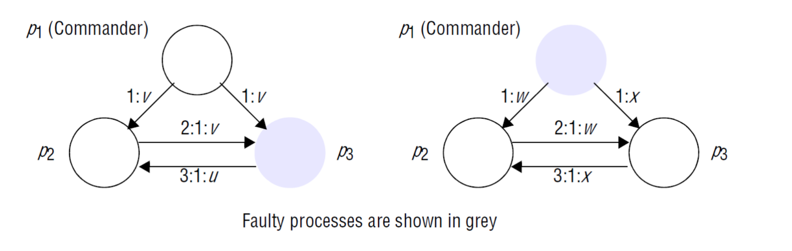  

在左边的场景下，司令正确地将同一个值v发送给其它两个进程，p2正确地将这个消息发送给p3。然而，p3将u≠v发送给p2。在这个阶段p2知道的只是收到了两个不同的值，并不能根据某个规则（少数服从多数）判断p2最终的取值。

在右边的场景下，司令有错误，它发给两个中尉的值是不同的。这样p2，p3处于和前一种情况相同的状态：收到了两个不同的值，无法做出正确的判断。

如果存在一个解决方法, 在左边的场景中，根据完整性条件，p2选择1:v，p3出错选择1：u。在右边的场景中，p2选择1:w，p3选择1:x，都与协定定义矛盾，所以不存在可能的解决办法。如果3个进程要实现拜占庭协议，需要对发出的消息使用数字签名。

#### 4.8.3 对于N≤3f的不可能性

Pease等人推广了3个进程的不可能性结论，证明只要N≤3f，就不可能有解决方法。证明如下：将N个将军分成3组，n1+n2+n3=N且n1,n2,n3 ≤N/3，让进程p1,p2,p3分别模仿n1,n2,n3个将军。若存在一个解决方法，即达成协定性且满足完整性条件，p2在右边的场景中选择1:w，那么根据对称性，p3在右边的场景中选择1:x。这与前面3个将军中有一个是有错的不可能性结论矛盾。

#### 4.8.4 对一个有错进程的解决方案

Pease等人提出了一个算法来解决 N≥3f+1 的同步系统中的拜占庭将军问题。假设N=4，f=1，来说明算法。

正确的将军通过两轮消息取得一致：

- 第一轮，司令给每个中尉发送一个值。
- 第二轮，每个中尉将收到的值发送给与自己同级的人。

不管在哪种情况下，每个正确中尉只需要对它们收到的值集合应用一个简单的majority()函数。由于N≥4，（N-2）≥2≥f，因此，majority函数会忽略出错中尉发来的值，并且当司令正确的时候，该函数能产生司令发来的值。

特别提示:发送命令的每次只有一个将军（司令），将其命令发送给N-1 个中尉。f代表叛国者的个数或者有错进程个数，因为将军总数为N，所以中尉总数为N-1 个。 

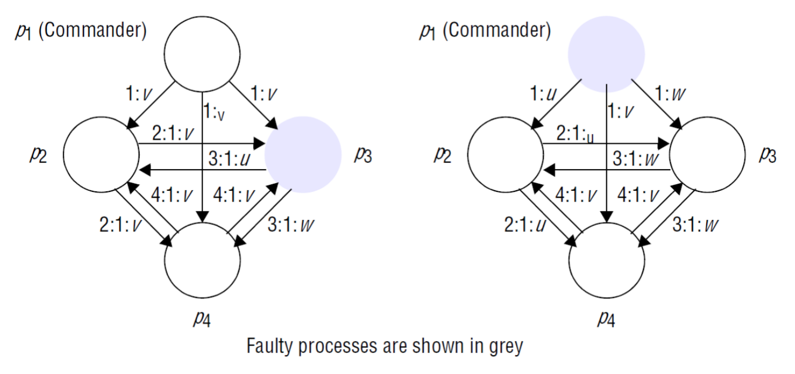  


### 4.9 paxos算法

Paxos 算法是一种用于分布式系统中实现一致性的算法，由Leslie Lamport于1990年提出。该算法解决了在分布式系统中多个节点之间达成一致性的问题，特别是在面临网络分区、节点故障或消息丢失等问题时。

Paxos 算法的主要目标是确保分布式系统中的节点能够就某个值达成一致，即使在存在故障的情况下也能保持一致性。Paxos 算法的核心思想是通过多个阶段的消息交互来达成共识，包括提议（proposal）、接受（acceptance）和学习（learning）等阶段。

以下是 Paxos 算法的基本流程：

1. **提议阶段（Prepare）：** 一个节点（称为提议者）向其他节点发送一个提议编号，请求其他节点“承诺”不再接受小于该编号的提议。

2. **接受阶段（Accept）：** 如果一个节点收到了足够数量的承诺，它就可以向其他节点发送一个提议，请求它们接受该提议。这个提议包含提议编号和一个值。

3. **学习阶段（Learn）：** 一旦一个节点收到了足够数量的接受消息，它就学习到了最终的值，这个值就是达成一致性的结果。

Paxos 算法具有以下特点：

- **活性（Liveness）：** 在正常情况下，只要大多数节点是正常的，Paxos 算法就能够保证最终达成一致性。

- **安全性（Safety）：** 即使在网络分区或者节点故障的情况下，Paxos 也能保证一致性。在这种情况下，系统可能会暂时失去活性，但不会破坏已经达成的一致性。

虽然 Paxos 算法是一个重要的分布式一致性算法，但它相对复杂，难以理解和实现。因此，实际应用中可能使用一些基于 Paxos 的变种或其他分布式一致性算法，如Raft算法。


### 4.10 raft算法

Raft 是一种分布式一致性算法，设计用于提供容错性的强一致性服务。Raft 算法于2013年由Diego Ongaro 和 John Ousterhout 在一篇论文中首次提出。与 Paxos 算法类似，Raft 也用于解决分布式系统中的一致性问题，但相对来说更易于理解和实现。

Raft 算法通过引入领导者（leader）的概念来简化分布式一致性的实现。整个系统的工作过程可以分为三个角色：领导者、跟随者和候选人。

以下是 Raft 算法的主要特点和流程：

1. **领导者选举：** Raft 将时间划分为任期（term），每个任期都由一个领导者主导。在一个任期内，节点可以处于三个状态之一：领导者、跟随者或候选人。如果一个节点在一段时间内没有收到领导者的心跳消息，它可以转变成候选人，并尝试开始一个新的任期。候选人向其他节点发送投票请求，如果它收到了大多数节点的投票，那么它就成为了新的领导者。

2. **日志复制：** 领导者负责接收客户端的请求，并将它们转化为日志条目。这些日志条目通过心跳消息广播给其他节点，其他节点将这些日志条目复制到自己的日志中。只有在大多数节点都复制了相同的日志条目时，该条目才能被提交，从而确保一致性。

3. **安全性：** Raft 算法具有安全性的特性，即它能够保证在正常运行的情况下，不会出现多个领导者和不一致的日志。Raft 通过强制要求大多数节点的一致性来实现这一点。

4. **简化状态机：** Raft 算法将分布式系统建模为一个简化的状态机，每个节点都有一个状态机，通过复制日志来保持一致性。这种模型使得算法更易于理解和实现。

相对于 Paxos，Raft 算法更容易被初学者理解，并且更容易实现。因此，它在一些实际的分布式系统中得到了广泛的应用，包括一些开源系统如etcd、Consul等。


## 第五章

### 5.1 串行等价性的概念、充要条件及应用

定义：如果并发事务交错执行操作的效果等同于按某种次序一次执行一个事务的效果，那么这种交错执行是一种串行等价的交错执行。使用串行等价作为并发执行的判断标准，可防止更新丢失和不一致检索问题

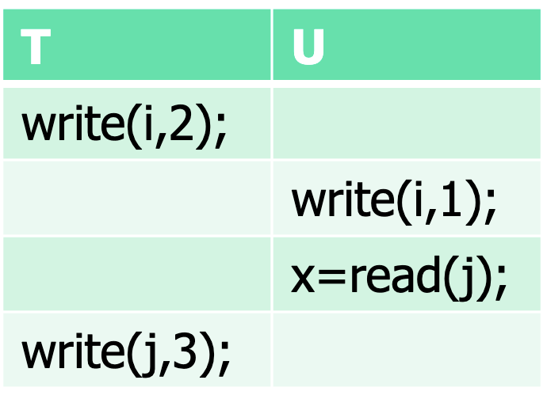  

充要条件：两个事务中所有的冲突操作都按相同的次序在它们访问的对象上执行。

什么是冲突操作？

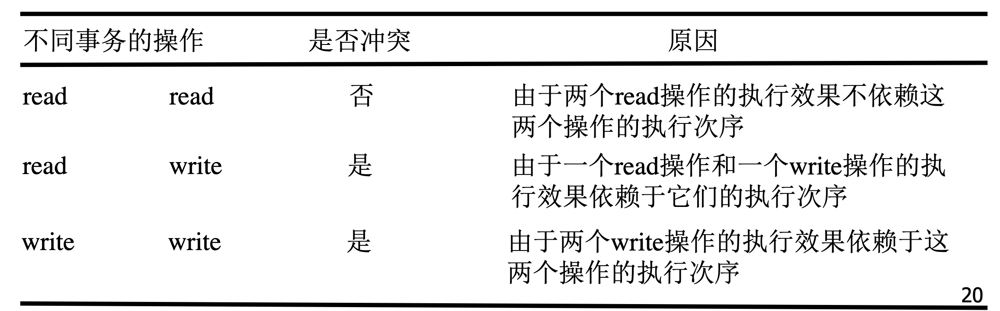  

非串行等价的例子：

事务T：x=read(i); write(i,10); write(j,20)；
事务U：y=read(j); write(j,30); z=read(i)；

  


例题1：

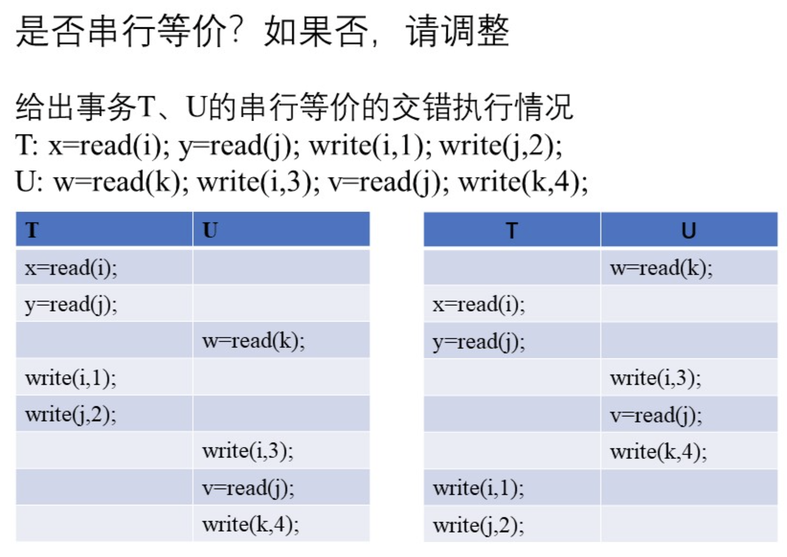  

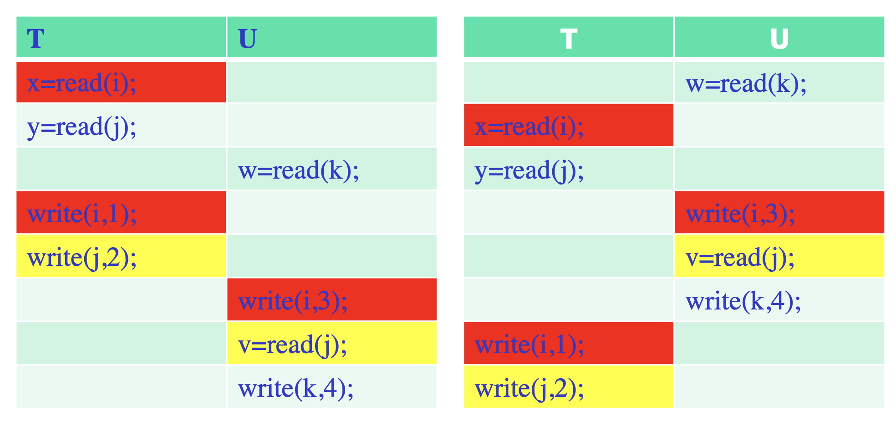  

可得：左边是串行等价的，右边是非串行等价的。

例题2：

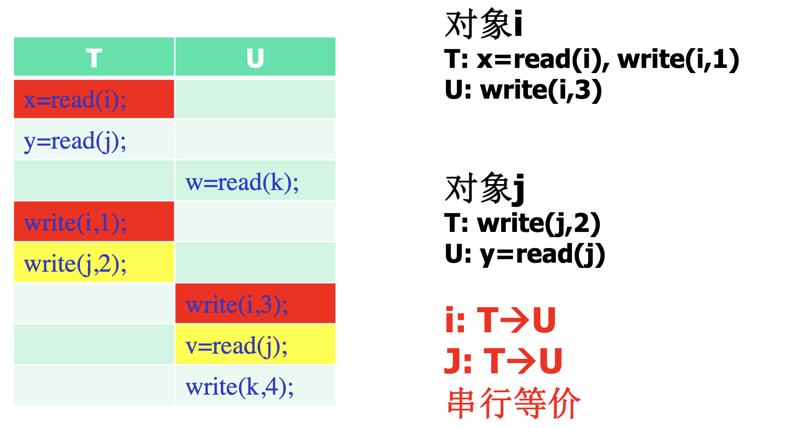  

例题3：

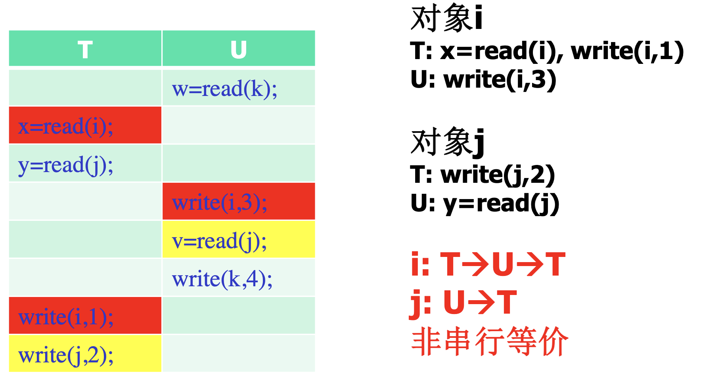  


### 5.2 事务的三种基本控制方法：锁、乐观方法、时间戳，它们的原理、实现、比较

#### 5.2.1 锁

两阶段加锁算法是一种常用的并发控制方法，旨在解决多个事务同时访问共享资源时可能出现的冲突问题。在两阶段加锁算法中，事务的执行分为两个阶段：加锁阶段和解锁阶段。

**加锁阶段：**

在加锁阶段，**事务会不断地获取新锁**。当一个**事务需要访问共享资源时，它首先需要获取相应的锁。如果该锁已经被其他事务占用，则该事务需要等待，直到锁被释放**。在这个阶段，**事务可能会不断地获取新锁，直到它完成了对所有需要访问的资源的访问**。

**解锁阶段：**

在解锁阶段，**事务会释放它在加锁阶段获取的所有锁。这个阶段通常发生在事务提交或放弃之前**。通过释放锁，事务可以确保其他事务可以正确地访问被锁定的资源。

两阶段加锁算法的优点是可以**防止不一致检索和更新丢失问题。通过确保事务在释放任何锁之前已经完成了对资源的访问，该算法可以避免不一致的读取结果和未提交的更新被其他事务看到。此外，两阶段加锁算法还可以防止过早写入和脏数据读取问题**。

**严格的两阶段加锁算法**要求在事务执行过程中获取的所有新锁都必须在该事务提交或放弃后才能释放。这样可以确保事务的正确执行，并避免脏数据读取和过早写入问题。然而，这种算法可能会导致死锁问题，因为在锁定阶段，如果一个事务获取了一个锁并等待另一个事务释放另一个锁，而另一个事务也在等待该事务释放锁，那么两个事务就会相互等待，导致死锁。

为了避免死锁问题，可以采用一些策略，例如**按照一定的顺序获取锁，或者设置超时时间等**。此外，还可以使用其他的并发控制方法来辅助解决死锁问题，例如时间戳排序和乐观并发控制等。

总之，两阶段加锁算法是一种有效的并发控制方法，可以避免不一致检索、更新丢失、过早写入和脏数据读取问题。然而，需要注意避免死锁问题，并选择合适的策略来辅助解决死锁问题。

**检测死锁：**

死锁是一种状态，在该状态下一组事务中的每一个事务都在等待其它事务释放某个锁。死锁检测是避免死锁的常用方法之一。下面介绍死锁检测的方法：

维护等待图：每个事务在开始运行时，都会获取所有需要访问的对象上的锁。如果一个事务在等待其它事务释放某个锁，就在等待图中增加一个从该事务到持有该锁的事务的边。如果一个事务获得了所有需要的锁，就在等待图中删除该事务。通过定期检查等待图，可以发现是否存在环路，即是否存在死锁。

检测等待图中是否存在环路：如果等待图中存在环路，则存在死锁。为了检测环路，可以采用深度优先搜索或广度优先搜索等图遍历算法。从某个事务开始，沿着等待图中的边进行搜索，如果存在环路，则说明存在死锁。

如何确定检测的频率：检测频率可以根据应用程序的特点来确定。如果应用程序中事务的执行速度比较快，那么可以减少检测的频率。如果应用程序中事务的执行速度比较慢，那么可以增加检测的频率。

如何选择放弃的事务：如果检测到死锁，需要选择放弃一个或多个事务来解除死锁。选择放弃的事务应该对整个系统的影响最小。通常可以采用以下策略：

a. 按照事务的优先级排序，优先级高的先运行，优先级低的后运行。如果存在死锁，优先级低的事务可以放弃。

b. 按照事务的运行时间排序，运行时间短的事务先运行，运行时间长的事务后运行。如果存在死锁，运行时间短的事务可以放弃。

c. 按照事务所在的会话排序，会话ID小的事务先运行，会话ID大的事务后运行。如果存在死锁，会话ID大的事务可以放弃。

需要注意的是，死锁检测会降低系统的并发度，因为需要定期检查等待图。为了避免降低系统的并发度，可以采用预防死锁的措施，例如预定次序加锁、设置锁的时间期限等。


例题：

加锁是否正确？如果否，请说明原因

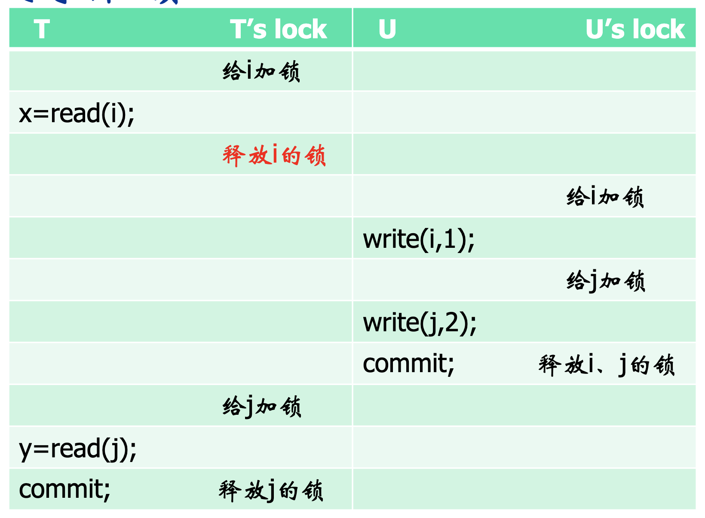  

错误 未提交前不释放锁


#### 5.2.2 乐观并发控制

乐观并发控制是一种并发控制方法，它**在事务执行过程中不进行检测，而是在提交事务之前进行验证**。这种方法**假设事务的执行不会产生冲突**，因此在进行事务提交时才会进行冲突检测。**如果存在冲突，则事务会回滚并重新执行**。

乐观并发控制的主要优点在于，它**避免了使用锁来控制并发访问的开销和引起死锁的风险**。此外，由于没有使用锁，因此可以提高并发度，这对于高并发应用来说是非常重要的。

然而，乐观并发控制也存在一些缺点。首先，**如果存在大量的事务冲突，那么需要回滚和重新执行的事务数量也会增加，这可能会导致性能下降**。其次，如果事务需要长时间运行，那么可能会在事务执行期间发生多次冲突，这可能会导**致事务被频繁地回滚和重新执行，从而增加了系统的开销**。

乐观并发控制中，事务的三个阶段分别是：

- 工作阶段：每个事务拥有所修改对象的临时版本。读操作立即执行，如果临时版本存在，则读临时版本，否则访问对象提交的最新值。每个事务维护访问对象的两个集合：读集合和写集合。
- 验证阶段：在收到closeTransaction请求，判断是否与其它事务存在冲突。如果成功允许提交，失败放弃当前事务或者放弃冲突的事务。每个事务在进入验证阶段前被赋予一个事务号，事务号是整数，并按升序分配，定义了事务所处的时间位置。事务按事务号顺序进入验证阶段。
- 更新阶段：只读事务通过验证立即提交，写事务在对象的临时版本记录到持久存储器后提交。

在乐观并发控制中，事务的执行过程中不进行检测，提交前必须经过验证。不能通过验证的事务不断放弃，可能引发饥饿。

**乐观并发控制向后验证：**

在乐观并发控制中，向后验证是指检查被验证事务的读集和其他较早重叠事务的写集是否重叠。具体来说，如果事务T的读集（即T在执行过程中读取的对象集合）与另一个事务U的写集（即U在执行过程中写入的对象集合）有交集，那么就存在冲突。向后验证的步骤如下：

1. 对于被验证的事务T，确定其读集和写集。
2. 遍历所有在T之前提交的事务（U），检查它们的写集是否有与T的读集重叠的对象。
3. 如果发现冲突，则验证失败，放弃事务T。
4. 如果未发现冲突，则验证成功，提交事务T。

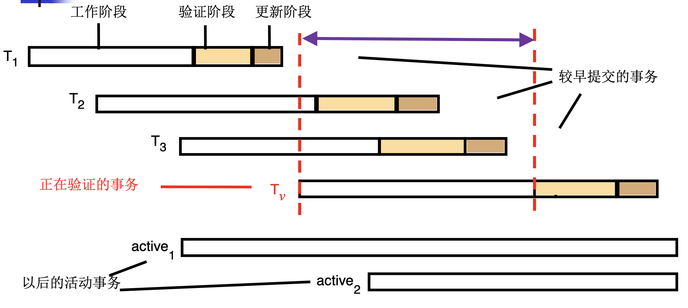  


**乐观并发控制向前验证：**

在乐观并发控制中，向前验证是通过比较较早提交的事务的工作阶段和验证阶段来进行的。具体来说，验证过程包括以下步骤：

1. 在事务开始时，每个操作都要进行验证。验证的内容包括该操作所涉及的对象是否已被其他事务修改。
2. 如果一个事务正在进行验证，那么它就不能读取或写入被其他事务修改的对象。
3. 如果一个事务在验证阶段发现了冲突，即有其他事务修改了同一个对象，那么它就会放弃这个事务，并重新开始。

在向前验证中，比较的内容是当前事务的写集合和所有重叠的活动事务的读集合。如果发现冲突，即有其他事务修改了同一个对象，那么当前事务就会放弃，并重新开始。这种方法可以处理冲突，并且避免了饥饿问题。

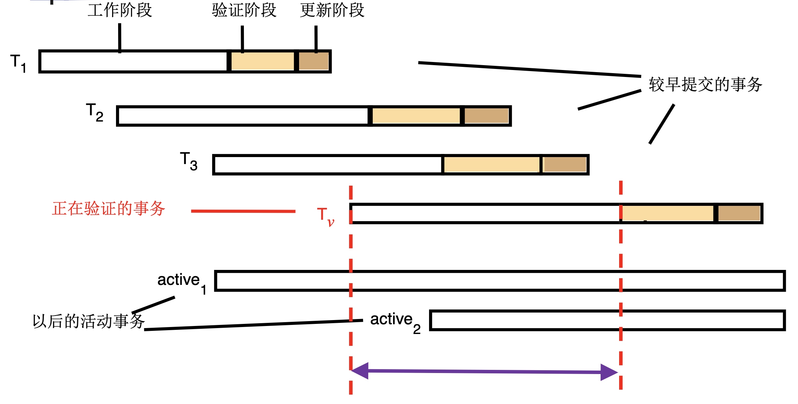  

- 向前验证处理冲突时更灵活，向后验证只能选择放弃被验证的事务
- 向后验证将较大的读集合和较早事务的写集合进行比较
- 向前验证将较小的写集合和活动事务的读集合进行比较
- 向后验证需要存储已提交事务的写集合
- 向前验证不允许在验证过程中开始新的事务


例题：

乐观并发控制向后验证是否正确？如果否，请说明原因

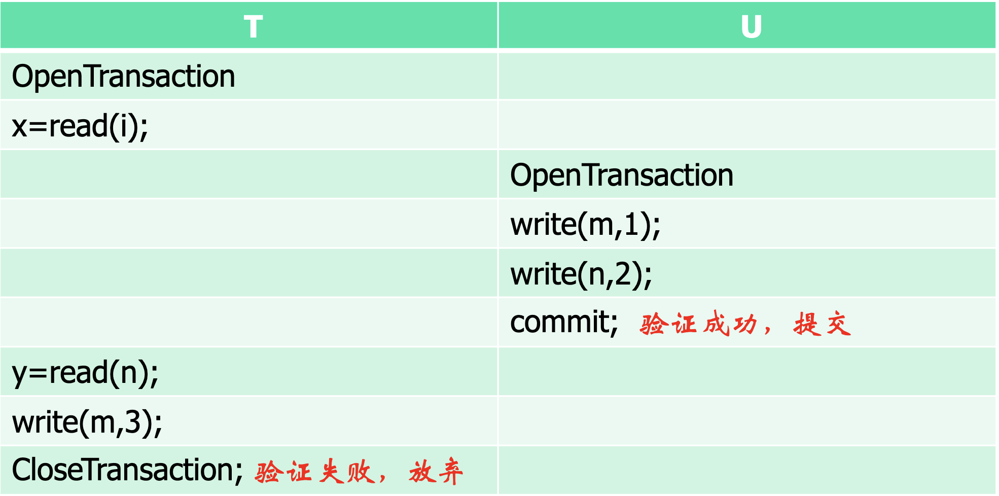  

向后验证：**检查它的读集和其它较早重叠事务的写集是否重叠**

验证U：T不是U的较早重叠事务（重叠的活动事务）

验证T：U是T的较早重叠事务，T读了U写的对象

例题：

乐观并发控制向前验证是否正确？如果否，请说明原因

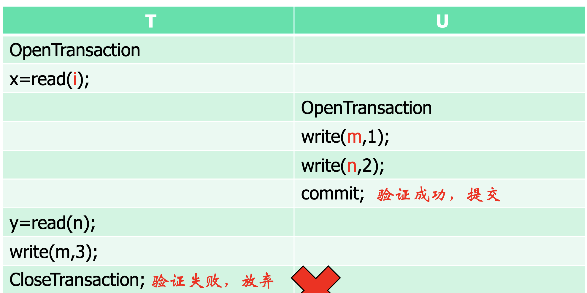  

向前验证：检查它的写集和其它重叠的活动事务的读集是否重叠

验证U：T是U重叠的活动事务，U没有写T读的对象
验证T：U不是T重叠的活动事务（U里面并没有read(m), 所以T里面应该是验证成功）


#### 5.2.3 时间戳

基于时间戳的并发控制是一种常用的并发控制方法，其主要思想是通过时间戳来排序和同步多个事务对共享资源的访问。

时间戳排序的基本思想是，为每个事务赋予一个唯一的时间戳，该时间戳定义了该事务在事务时间序列中的位置。当多个事务同时访问共享资源时，利用时间戳来决定它们的执行顺序，从而避免冲突。

具体来说，基于时间戳的并发控制包括以下关键步骤：

1. 为每个事务分配一个唯一的时间戳，该时间戳通常由系统根据一定的规则生成。
2. 在执行每个操作之前，先验证该操作所属的事务的时间戳。如果该时间戳早于当前事务的时间戳，那么该操作可以执行；否则，该操作将被阻塞，等待当前事务完成后才能执行。
3. 根据时间戳的顺序，依次执行每个事务的操作。如果一个事务的操作与另一个事务的操作发生冲突，那么根据时间戳的顺序，较早的事务具有优先级，其操作将先于较晚的事务执行。
4. 如果一个事务的读操作与另一个事务的写操作发生冲突，那么根据规则进行处理。例如，可以采用“写-读”冲突解决规则，即如果一个事务在写一个对象时，另一个事务在读同一个对象，那么读操作将被阻塞，等待写操作完成后才能执行。

基于时间戳的并发控制方法具有以下**优点**：

1. 可以避免多个事务同时访问共享资源而引起的冲突。
2. 可以处理进程的崩溃故障和通信的遗漏故障。
3. 可以保证事务的原子性和隔离性。

然而，基于时间戳的并发控制方法也存在一些**缺点**：

1. 时间戳的生成和管理需要一定的开销。
2. 在大规模并发情况下，时间戳排序可能会导致性能问题。
3. 时间戳排序无法处理多个进程之间的死锁问题。

#### 5.2.4 比较

两阶段加锁:

- 写较多事务优于时间戳排序
- 只在死锁时放弃
- 容易死锁

时间戳排序：

- 读较多事务优于两阶段加锁
- 到来较晚的事务必须被放弃

乐观并发控制：

- 执行过程中不进行检测，提交前必须经过验证
- 不能通过验证的事务不断放弃，可能引发饥饿


## 第六章


### 6.1 分布式事务概念、平面事务与嵌套事务的概念及区别

#### 6.1.1 分布式事务

分布式事务是指跨越多个网络节点或服务器的事务处理。这些节点可以位于不同的地理位置，并且可能由不同的组织或公司管理。分布式事务的目标是确保在所有节点上数据的一致性和完整性，即使在发生故障或错误时也是如此。

分布式事务通常涉及将一个大型事务分解为一系列较小的子事务，每个子事务在一个单独的节点上执行。这些子事务之间通过通信和协调来确保整个事务的原子性和一致性。

分布式事务的实现通常依赖于原子提交协议、两阶段提交协议、三阶段提交协议等协议，以及并发控制和死锁检测等技术。这些协议和技术可以确保在所有节点上数据的一致性和完整性，以及在发生故障或错误时的事务处理。

#### 6.1.2 平面事务

平面事务是指访问由多个服务器管理的对象的事务，这些事务在多个节点上更新数据。在平面事务中，客户给多个服务器发送请求。事务T是一个平面事务，调用了服务器X、Y和Z上的操作对象。一个平面客户事务完成一个请求后才发起下一个请求。因此，每个事务顺序访问服务器上的对象。当服务器使用加锁机制时，事务一次只等待一个对象。

#### 6.1.3 嵌套事务

嵌套事务是指在**一个事务内部执行另一个事务**。在嵌套事务中，一个事务可以包含另一个事务，后者的执行依赖于前者的成功完成。嵌套事务可以**递归地包含其他事务**，从而形成复杂的事务结构。

在分布式系统中，嵌套事务通常用于处理复杂的业务逻辑，其中一些事务需要在其他事务完成之后才能开始。例如，在银行转账事务中，一个从账户A到账户B的转账事务可能需要先创建一个子事务来检查账户A是否有足够的余额进行转账，然后再创建一个子事务来更新账户B的余额。这些子事务的执行依赖于外部事务的成功完成。

嵌套事务需要使用特定的并发控制技术来确保其正确性和一致性。例如，在分布式系统中，可以使用两阶段提交协议或时间戳并发控制来协调不同节点的并发操作。此外，嵌套事务也需要考虑死锁和其他并发问题，以确保系统的一致性和可靠性。


### 6.2 原子提交协议的概念

在分布式事务中，由于数据被分散到多个节点上，因此需要一种机制来确保这些节点能够协同处理事务，以避免数据不一致的情况。原子提交协议就是解决这个问题的机制之一。

原子提交协议通常分为两个阶段：准备阶段和提交阶段。在准备阶段，各个节点将自己的操作发送给其他节点，并等待其他节点的确认。一旦收到所有节点的确认，节点就进入提交阶段，否则就进入回滚阶段。在提交阶段，节点执行自己的操作，并将结果发送给其他节点。如果某个节点在提交阶段失败，那么已经提交的节点将回滚自己的操作，以保证数据的一致性。

原子提交协议可以保证分布式事务的原子性，即在多个节点上执行的操作要么全部成功，要么全部失败。这有助于避免数据不一致、数据丢失等问题，并提高系统的可靠性和稳定性。

所谓原子性就是：事务中的操作要么全部执行，要么完全不执行

### 6.3 单阶段原子提交协议原理及缺陷

单阶段原子提交协议（One-phase commit protocol）是一种简单的原子提交协议，其基本原理是协调者向事务所有的参与者发送Commit或者Abort请求，并不断地发送请求直至所有参与者都确认。这种协议的优点是简单易理解，能够快速完成事务提交。

然而，单阶段原子提交协议也存在一些缺陷：

1. 不允许参与者单方面决定放弃事务。在某些情况下，如果一个参与者发生故障，协调者可能无法得知这一情况，从而导致该参与者无法完成事务。
2. 可能存在并发控制问题。由于协调者无法得知其他参与者的状态，如果一个参与者无法提交事务，协调者可能无法进行有效的并发控制。
3. 可能存在死锁问题。如果多个参与者之间存在依赖关系，而协调者又无法得知这些情况，就可能导致死锁。
4. 对于大型事务，单阶段原子提交协议可能会引起性能问题。因为协调者需要不断地发送Commit或Abort请求，直到所有参与者都确认，这可能会导致网络拥堵和延迟。

### 6.4 两阶段提交协议（设计动机、基本思想、基本操作、过程描述、通信、性能、缺陷）

#### 6.4.1 设计动机

允许任意一个参与者自行放弃他自己的那部分事务

#### 6.4.2 基本思想

两阶段提交协议将事务的提交过程分为两个阶段：投票阶段和提交阶段。在投票阶段，协调者询问所有参与者是否可以提交事务；在提交阶段，协调者根据参与者的投票结果决定是否提交事务。

#### 6.4.3 基本操作

两阶段提交协议的基本操作包括以下几种：

- canCommit?（询问是否可以提交事务）
- doCommit（提交事务）
- doAbort（放弃事务）
- haveCommitted（告知已经提交了事务）

#### 6.4.4 过程描述

**投票阶段：**

1. 协调者向所有参与者发送询问是否可以提交事务的消息（canCommit?）。
2. 参与者收到询问后，进行本地的事务执行和验证。如果事务执行成功，则回复协调者“可以提交”；如果事务执行失败，则回复协调者“放弃事务”。
3. 协调者根据参与者的投票结果进行判断，如果所有参与者都回复“可以提交”，则进入提交阶段；否则，协调者会发送“放弃事务”的消息给所有参与者，终止事务的执行。

**提交阶段：**

1. 协调者向投Yes票的参与者发送提交事务的消息（doCommit）。
2. 参与者收到提交消息后，进行事务的最终执行，并向协调者发送“已提交”的消息（haveCommitted）。
3. 协调者收到所有参与者的“已提交”消息后，事务执行完毕。

#### 6.4.5 通信

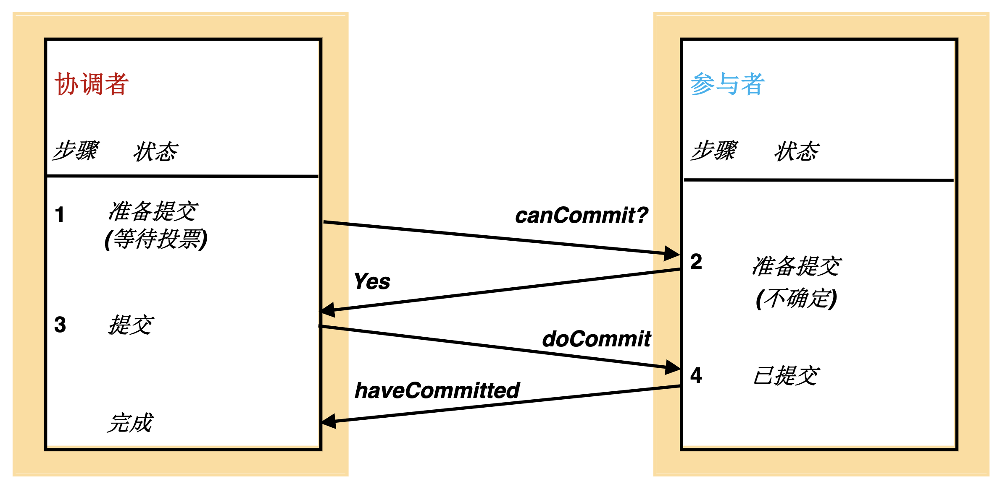  

两阶段提交协议中的通信过程包括协调者和参与者之间的消息传递。在投票阶段，协调者与参与者之间需要进行多次消息传递以获取每个参与者的投票结果；在提交阶段，协调者向所有参与者发送提交或放弃的消息，参与者收到消息后进行本地的事务执行，并通知协调者事务的执行结果。


#### 6.4.6 性能

两阶段提交协议的性能主要受到以下因素的影响：参与者的数量、网络延迟、系统负载等。在参与者数量较大、网络延迟较高或者系统负载较重的情况下，两阶段提交协议的性能可能会受到影响。此外，由于两阶段提交协议需要在投票阶段等待所有参与者的回复，因此在参与者出现故障或者通信异常的情况下，可能会造成较长的等待时间。

#### 6.4.7 缺陷

两阶段提交协议也存在一些缺陷：

1. 存在**同步阻塞问题**，即在投票阶段和提交阶段之间，**所有参与者都会处于阻塞状态，无法进行其他操作。这可能会影响系统的并发性能**。
2. 如果**协调者在发起提议后崩溃，那么投Yes票的参与者将一直处于阻塞状态，无法继续执行其他操作，直到协调者恢复**。
3. 单点故障也是两阶段提交协议的一个问题，因为协调者存在性能瓶颈和单点失效的问题。最后，由于网络延迟或者局部网络异常的情况，可能会导致**部分参与者无法接收到协调者的doCommit消息，进而造成数据不一致的问题**。


### 6.5 分布式事务的并发控制（锁、时间戳、乐观方法）

分布式事务的并发控制可以通过以下几种方法实现：

1. 锁（Locking）：在分布式事务中，锁可以用于控制对共享资源的并发访问。通过使用锁，可以确保在事务执行期间，其他事务不能修改被锁定的资源。锁可以是悲观锁或乐观锁。悲观锁假设最坏的情况，即在事务执行期间，其他事务可能会修改被锁定的资源，因此需要加锁来保护资源。乐观锁则假设其他事务不会修改被锁定的资源，因此不需要加锁，而是在提交事务时检查是否存在冲突。
2. 时间戳（Timestamping）：时间戳是一种乐观方法，用于确定事务的执行顺序。在分布式事务中，每个事务都有一个唯一的时间戳，标记事务的创建时间。时间戳可以用于检查事务的顺序和冲突。例如，如果事务A的时间戳早于事务B的时间戳，那么事务A应该先于事务B执行。如果事务B在事务A完成后执行，并且对事务A所修改的数据进行了相同的修改，那么事务B的时间戳应该晚于事务A的时间戳。
3. 乐观方法（Optimistic Approach）：乐观方法是一种基于假设的并发控制方法。它假设大多数情况下，多个事务不会互相影响或冲突，因此不需要加锁来保护资源。乐观方法在事务执行期间不进行冲突检查，而是在提交事务时进行检查。如果发现冲突，则需要进行冲突解决，例如回滚事务或应用某种冲突解决策略。

分布式事务的并发控制和事务的并发控制基本一致，但是也有一些不同之处。首先，分布式事务的并发控制需要考虑多个节点之间的并发问题，而事务的并发控制只需要考虑单个节点的并发问题。其次，分布式事务的并发控制需要考虑网络延迟和通信异常等问题，而事务的并发控制不需要考虑这些问题。最后，分布式事务的并发控制需要考虑死锁问题，由于不同的事务可能在不同的服务器上执行，而且它们的执行顺序可能不一致，因此可能会出现循环依赖的情况，导致死锁。为了解决这个问题，需要采用一些算法或协议来检测并解除死锁。

### 6.6 分布式死锁产生原因及检测方法（集中、分布式）

**分布式死锁的产生原因：**

在使用加锁机制进行并发控制时，可能出现死锁。当多个事务在分布式系统中交错执行时，可能形成一种相互等待的局面，导致事务无法继续进行。这种情况称为分布式死锁。

**集中式死锁检测：**

1. 其中的一个服务器担任全局死锁检测器。
2. 全局死锁检测器收集局部等待图构造全局等待图。
3. 一旦发现环路，通知各服务器放弃相应事务解除死锁。

不足：

1. 依赖单一服务器执行检测，可靠性差、缺乏容错，没有可伸缩性。
2. 收集局部等待图代价高。

**分布式死锁检测：**

1. 各服务器只有局部等待图，需要通过通信才能发现全局环路。
2. 边追逐方法：无需构建全局等待图，服务器通过转发探询(Probe)消息发现环路。
3. 边追逐算法由下面3步组成：
    - 开始阶段：当服务器发现某个事务T开始等待事务U，而U正在等待另一个服务器上的对象时，该服务器将发送一个<T→U>的探询消息。
    - 响应阶段：收到探询消息的服务器检查是否有环路，若存在环路则发送确认消息通知发送探询消息的服务器。
    - 终止阶段：收到确认消息的发送探询消息的服务器通知事务T放弃执行以解除死锁。

例子：

1. 服务器X发起死锁检测，向对象B的服务器Y发送探询消息 <W→U>
2. 服务器Y收到探询消息 <W→U> 后，发现对象B被事务V拥有，因此将V附加在
3. 探询消息上，产生 <W→U→V>。由于V在服务器Z上等待对象C，因此该探询消息被转发到服务器Z
4. 服务器Z收到探询消息 <W→U→V>，并发现C被事务W拥有，那么将W附加在探询消息后形成 <W→U→V→W>

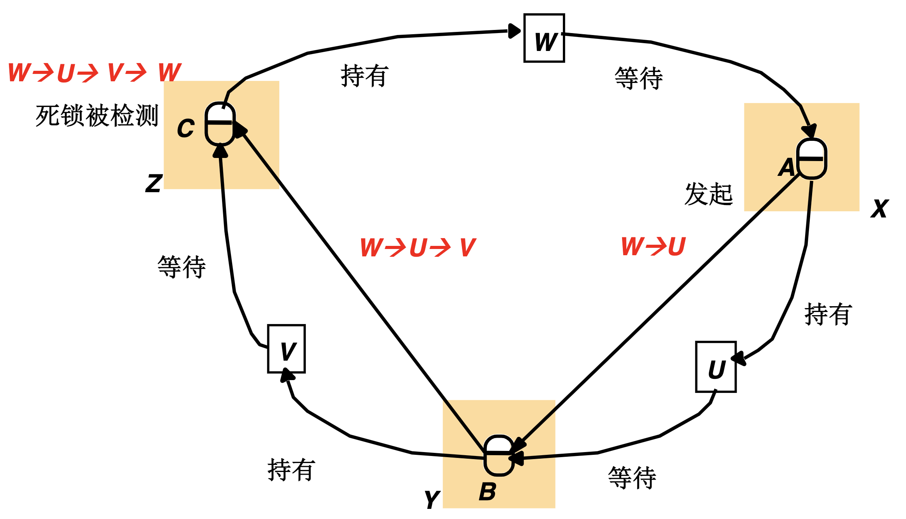  


### 6.7 两阶段提交协议的恢复

两阶段提交协议的恢复主要涉及到在出现故障或异常情况下的处理流程。在两阶段提交协议中，当服务器故障发生时，已经决定要提交事务的处理方式如下：

首先，在服务器故障发生时，协调者会向参与者列表中的所有参与者发送doCommit命令，继续执行两阶段提交协议的第4步。

其次，在收到doCommit命令后，每个参与者都会向协调者发送一个haveCommitted消息。这个消息允许协调者在下一个检查点处丢弃该事务的信息。

然后，如果在获得决议之前参与者发生故障，那么在协调者通知它之前不能确定事务的状态。因此，参与者会向协调者发送getDecision请求来询问事务状态。一旦它获得恢复后，再根据协调者的答复来提交或放弃事务。

此外，如果参与者尚未投票，它可以选择单方面放弃事务。如果协调者在超时后没有收到来自参与者的消息，那么它会放弃事务并通知那些投票者doAbort。

最后，如果处理丢失了canCommit？的请求或者在投票“Yes”之后但在接收doCommit/doAbort之前无法放弃事务，参与者可以选择等待超时，然后发送getDecision请求（重试直到收到答复）。

综上所述，两阶段提交协议的恢复涉及到一系列复杂的操作和处理流程，主要是为了确保在出现故障或异常情况下，事务能够得到正确地提交或放弃。

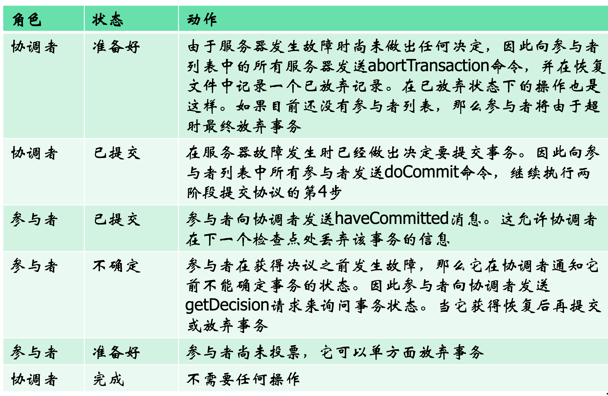  


## 第七章

### 7.1. 复制的概念、动机、基本要求

复制是在多个节点上保存相同数据的一个副本。在分布式系统中，复制是指将数据存储在多个节点上，以便提高系统的可用性、可靠性和性能。这些节点可以是服务器、硬盘、内存等。

复制的动机：

1. 容错：如果一些副本不能被访问，另外一些仍能够被访问。这可以提高系统的可靠性和可用性，减少单点故障的风险。
2. 异常处理：在分布式系统中，异常（软件，硬件和网络）是不可避免的。复制可以提供多个数据备份，以便在某个节点发生故障时，其他节点可以继续提供服务。
3. 更新：复制可以保证多个节点上的数据一致性，从而提供更可靠的服务。同时，在某个节点进行更新操作时，其他节点也可以立即获得更新后的数据。
4. 高可用性：复制可以提高系统的可用性，因为当某个节点发生故障时，其他节点可以接管该节点的任务，从而保证系统的正常运行。
5. 负载均衡：复制可以将数据分布在多个节点上，从而平衡系统的负载。这可以提高系统的性能和响应速度。

复制的基本要求：

1. 保证数据一致性：在多个节点上复制数据时，必须保证数据的一致性。这意味着在任何时刻，所有节点上的数据都应该相同。
2. 确保数据完整性：复制的数据必须保持完整，不能出现数据丢失或损坏的情况。
3. 保证可访问性：在任何时刻，都应该能够从任何一个节点访问到复制的数据。
4. 确保可扩展性：复制应该能够在不影响现有服务的情况下进行扩展，以适应系统规模的扩大。
5. 管理复杂性：复制需要管理多个节点上的数据副本，因此需要一种有效的方法来管理复制过程和确保数据的同步。

### 7.2. 复制的系统模型: 主动复制、被动复制

主动复制是指主节点或副本管理器在接收到请求后，将请求发送到其他副本管理器，并等待所有副本管理器的响应，然后根据一定的算法（如多数投票）来决定请求的结果。在这种模型中，主节点负责协调和同步所有副本管理器的操作，以保证数据的一致性。主动复制具有较好的可控性和可维护性，但主节点可能会成为系统的瓶颈。

被动复制是指每个副本管理器独立处理请求，并在处理完请求后将结果发送给其他副本管理器。在被动复制中，主节点或副本管理器不负责协调和同步其他副本管理器的操作，而是由各个副本管理器之间进行数据同步。这种模型中，主节点仅负责管理数据的初始分布和副本的创建，不参与数据一致性的维护。被动复制具有较好的性能和扩展性，但需要保证副本之间的数据同步和一致性。

在实际应用中，可以根据具体需求和场景选择主动复制或被动复制。例如，在需要保证强一致性的场景中，可以选择主动复制；而在需要提高系统性能和扩展性的场景中，可以选择被动复制。同时，为了解决网络分区和故障导致的数据不一致问题，还可以采取一些容错机制如多数投票、断链恢复等来保证数据的一致性。

### 7.3. 单拷贝串行化的概念、“读一个/写所有”方案原理、适用条件及本地验证方法

#### 7.3.1 单拷贝串行化

单拷贝串行化（Single Copy Serializability）是一个概念，它是指在并发事务处理中，事务的执行顺序与它们在单个物理数据库中的执行顺序相同。换句话说，它保证了在并发控制和事务执行中，每个事务都感觉不到并发，就好像是在一个单一的物理数据库中顺序执行一样。

单拷贝串行化是一种重要的复制正确性标准，它要求在复制数据上的事务应该和它们在一个对象集上的一次执行具有一样的效果。这种性质可以通过 “读一个/写所有”等复制方案来实现。在分布式系统中，单拷贝串行化可以保证在多个副本管理器之间的事务执行顺序的一致性，从而确保系统的正确性和一致性。

#### 7.3.2 “读一个/写所有”方案

“读一个/写所有” 是一种复制方案，用于确保数据一致性和容错性。在这种方案中，**数据被复制到多个副本管理器上，并且每个副本都保持一致**。

对于读请求，**可以由任何可用的副本管理器执行**，这意味着客户可以从中获取数据。而对于**写请求，必须由所有可用副本管理器执行**。这意味着在执行写操作时，需要确保所有副本都处于可用状态，并且所有副本都写入相同的数据。

这种复制方案可以确保数据一致性，但并不是一个完全可靠的方案。例如，如果一个副本管理器崩溃或出现通讯故障，那么写操作将无法完成。此外，由于需要所有的副本都写入相同的数据，因此写操作的性能可能会受到影响。

因此，“读一个/写所有”在某些情况下可能不是一个现实的方案。例如，如**果需要处理大量的写操作或者需要支持高可用性，那么可能需要使用其他更可靠的复制方案**。

**适用条件**：“读一个/写所有”方案适用于**对数据一致性要求非常高的场景，例如金融交易、银行系统等**。它也需要具备**足够的网络带宽和副本管理器可用性**，以确保读/写操作的正确性和高性能。

**本地验证方法**： 在“读一个/写所有”方案中，本地验证是非常重要的一部分。本地验证是指在**进行读/写操作之前，客户端需要验证已访问的副本管理器集是否变化**。这可以通过**检查副本管理器的状态或使用时间戳等方式实现**。如果已访问的副本管理器集中有故障或恢复的副本管理器，那么客户端需要重新执行读/写操作或者采取其他措施来保证数据的正确性和一致性。

### 7.4. 闲聊系统的两个保证、体系结构（含关键数据结构）及基本操作

闲聊系统是指一种分布式系统，它**采用闲聊协议来实现节点之间的信息交换和状态同步**。闲聊系统有两个重要的保证：

1. 随着时间的推移，每个节点总能获得一致的服务。这意味着即使在网络不稳定或部分节点故障的情况下，节点仍然可以获得最新的信息和服务。
2. 副本管理器提供的数据能反映迄今为止客户端已经观测到的更新。这意味着每个节点都可以获得最新的数据副本，并且可以保证数据的完整性和一致性。
闲聊系统的体系结构包括以下关键数据结构：

1. 时间戳向量：每个节点都有一个时间戳向量，用于记录节点访问数据的最新版本。时间戳向量是用来控制操作处理次序的重要数据结构。
2. 副本管理器：副本管理器是闲聊系统中的重要组件，它负责管理数据的副本和节点的状态。每个节点都与一个副本管理器通信，以获取最新的数据副本和状态信息。
3. gossip消息：gossip消息是节点之间通信的基础，它包含了一些关于节点状态和数据更新的信息。节点通过发送和接收gossip消息来同步状态和传播更新。

闲聊系统提供两种基本操作：查询和更新。查询操作是指从副本管理器中获取数据副本的操作，而更新操作是指将新的数据或状态信息发送给副本管理器的操作。这两种操作都是通过 gossip 消息来实现的。

在查询操作中，前端**选择一个可用的副本管理器，并向其发送查询请求**。副本管理器会**返回数据副本以及相关的状态信息**。前端会将这些信息展示给用户，并根据用户输入来更新数据。

在更新操作中，前端将**新的数据或状态信息封装成gossip消息，并发送给副本管理器。副本管理器会将这些信息存储起来，并通知其他节点进行更新**。其他节点在收到通知后，会根据自身的时间戳向量来判断是否需要更新数据，并相应地进行处理。

总之，闲聊系统通过gossip协议实现节点之间的信息交换和状态同步，提供了两个重要的保证：**一致性保证**和**时间戳保证**。其体系结构包括**时间戳向量、副本管理器和gossip消息**等关键数据结构，提供了查询和更新两种基本操作来支持客户端的操作处理次序控制和数据同步。

### 7.5 gossip 体系结构

Gossip协议：

Gossip消息是一种在分布式系统中广泛使用的通信协议，其特点是每个节点都随机地与其他节点通信，**经过一番杂乱无章的通信，最终所有节点的状态都会达成一致**。在gossip协议中，每个节点可能知道所有其他节点，也可能仅知道几个邻居节点，只要这些节点可以通过网络连通，最终他们的状态都是一致的。

在gossip协议中，**每个节点都有一个时间戳，用来反映该节点访问的最新数据值的版本**。当一个节点**收到一个gossip消息时，它会检查消息中的时间戳和自己的时间戳，如果消息中的时间戳比自己的时间戳大，则说明该消息比自己的数据更新，需要将其执行并更新自己的状态**。

Gossip协议具有一些优点，例如**简单易行、易于实现**、**能够容忍网络延迟和故障**等。但是它也有一些缺点，例如可能会**产生大量的网络通信和计算开销**，而且如果系统的规模很大，可能会出现“广播风暴”等问题。因此，在使用gossip协议时需要根据实际情况选择合适的参数和控制机制。

**Gossip体系结构（考试真题）：**

1. 前端可以选择副本管理器（可用且响应时间合理）
2. 提供两种基本操作：查询 + 更新
3. 副本管理器定期通过gossip消息来传递客户的更新

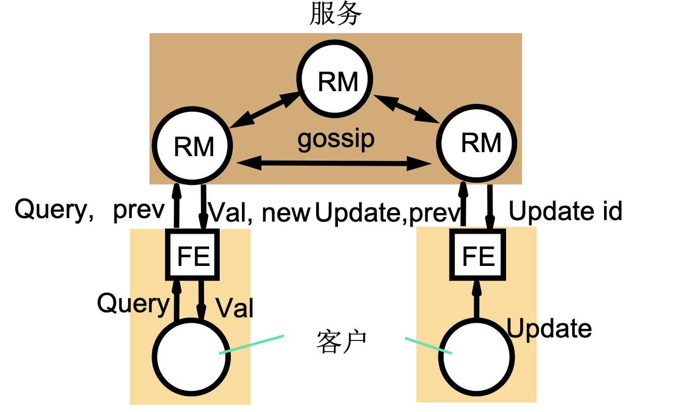  


## 第八章

### 8.1. 分布式文件系统的需求

分布式文件系统的需求主要包括以下几个方面：

1. 性能透明性：系统需要在负载变化时提供合理的性能，以确保性能不受影响。
2. 并发控制：当多个客户同时对文件进行操作时，系统需要确保并发控制，避免文件操作的冲突和错误。
3. 文件复制：为了提高系统的可靠性和性能，文件可以被复制到不同的服务器上，以实现负载分担和容错。
4. 一致性：在多个进程并发访问或修改文件时，系统需要保证文件的一致性，即每个进程都只能看到一个唯一的文件拷贝。
5. 安全性：系统的安全性是至关重要的，需要对客户请求进行认证和访问控制，以确保只有授权的用户可以访问文件。
6. 效率：系统需要提供高效的性能以满足用户的需求。
7. 透明性：分布式文件系统应该像本地文件系统一样，对用户和应用程序是透明的，用户无需了解文件的分布情况，可以通过一组文件操作访问本地/远程文件。
8. 可扩展性：系统需要具备可扩展性，以便在负载和网络规模增长时能够满足需求。
9. 移动透明性：当文件移动时，客户的系统管理表无需修改，如果文件移动到另一个服务器，不应该让用户可见。
10. 硬件和操作系统的异构性：系统需要定义明确的接口，在不同的操作系统和计算机上实现同样的服务。

### 8.2. 文件服务体系结构，即三个组件、作用、接口，设计理念


#### 8.2.1 文件服务的三个组件

文件服务体系结构通常包括三个组件：服务器、目录服务和文件系统。

1. 服务器：服务器是文件服务体系结构的核心组件，负责管理文件和目录的存储、检索和访问。服务器还负责处理来自客户端的请求，并为其提供相应的服务。
2. 目录服务：目录服务是文件服务体系结构的重要组成部分，它负责管理文件和目录的名称和位置信息。目录服务提供了一种层次结构，用于组织和管理文件和目录。
3. 文件系统：文件系统是文件服务体系结构的另一个重要组件，它负责管理文件的存储和检索。文件系统提供了一种命名空间，用于组织和管理文件和目录。文件系统还提供了许多文件操作API，例如create、delete、open、close、read、write、append等，以便客户端可以对其进行操作。

#### 8.2.2 文件服务的作用

用于管理和操作在多个不同计算机上存储的文件。文件服务体系结构定义了如何将文件存储在计算机上，以及如何通过网络在不同的计算机之间共享和访问这些文件。

#### 8.2.3 文件服务的接口

文件服务体系结构的接口在分布式文件系统中起着重要的作用。这些接口提供了跨不同硬件和操作系统平台的一致性文件访问方式。

**平面文件服务接口主要有以下几种操作（考试真题）**：

1. 创建或更新目录（层次文件结构）。
2. 提供文件的文本名（Name）和平面文件结构中唯一文件标识（UFID）的映射。
3. Lookup操作执行Name→UFID的转换。
4. read和write操作需要一个开始位置，不同于UNIX操作中读写指针指向当前位置开始操作。

与传统Linux文件系统相比，平面文件服务接口在容错方面的影响、可重复性操作、无状态服务器等方面有所不同。具体来说：

1. 在容错方面，平面文件服务接口采用了可重复性操作，除了create，其它所有的操作都是幂等的，故障后重启无需客户或服务器恢复任何状态。
2. 在可重复性操作方面，平面文件服务接口的read和write操作都需要一个参数i来指定文件的读写位置，不同于传统Linux文件系统中的读写指针机制。
3. 在无状态服务器方面，平面文件服务接口可以在文件上进行操作而不需要读-写指针，故障后重启无需客户或服务器恢复任何状态。
4.总的来说，平面文件服务接口在某些方面具有更高的可靠性和可重复性，但也需要更多的参数设置和限制条件。

#### 8.2.4 文件服务的设计理念

在设计文件服务体系结构时，需要考虑以下设计理念：

1. 模块化设计：将文件服务体系结构划分为多个模块，每个模块都有明确的职责和功能。这种设计可以提高代码的可维护性和可重用性。
2. 层次结构：文件服务体系结构应该具有一种层次结构，以便于组织和管理文件和目录。这种结构可以提高代码的可扩展性和可维护性。
3. 标准化接口：为了方便客户端对文件服务体系结构进行操作，需要提供标准化的接口。这些接口应该简单易用，并能够满足大多数客户端的需求。
4. 可伸缩性：文件服务体系结构应该具有可伸缩性，以便适应不同规模和不同类型的应用程序的需求。这可以通过使用分布式文件系统来实现。
5. 高可用性：文件服务体系结构应该具有高可用性，以便在出现故障时仍能继续提供服务。这可以通过使用冗余技术和容错技术来实现。

### 8.3. NFS体系结构、NFS服务器操作、路径解析、缓存机制

#### 8.3.1 NFS体系结构

NFS（Network File System）是一种分布式文件系统，它允许客户端通过网络访问远程文件和目录。NFS体系结构包括客户端和服务器端组件，以及在网络上传输数据的方式。

**客户端**：NFS客户端通常是指运行NFS客户端软件的计算机或设备，这些软件通过与服务器通信来访问远程文件和目录。客户端可以通过网络与服务器建立连接，并发送请求来读取或写入文件。

**服务器端**：NFS服务器端是指运行NFS服务器软件的计算机或设备，这些软件负责管理远程文件和目录，并响应客户端的请求。

总的来说，NFS体系结构允许客户端通过网络访问远程文件和目录，使得多个计算机可以共享文件和目录，并且可以方便地进行数据备份和同步。

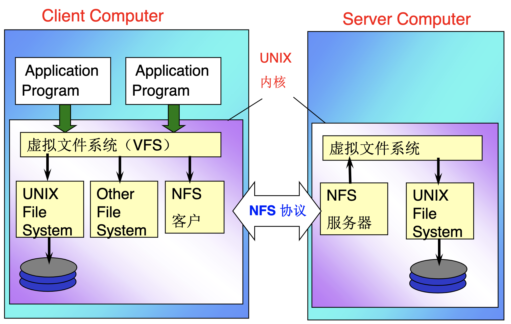

#### 8.3.2 NFS服务器操作

在NFS中，服务器将文件和目录以文件句柄的形式提供给客户端。客户端使用这些文件句柄来访问文件，而不需要了解实际的文件位置或存储方式。文件句柄对客户端来说是透明的，它只关心如何读写文件，而不关心文件在服务器上的物理位置或存储方式。

当客户端需要访问服务器上的文件时，它会向服务器发送一个包含文件名的请求。服务器会检查其文件系统，找到与请求匹配的文件或目录，并返回一个文件句柄。客户端可以使用这个文件句柄来读取或写入文件，就像访问本地文件一样。

在NFS中，服务器还提供了一些其他的操作，例如预先读（pre-fetching）和延迟写（delayed writing）。预先读是将最近常用的页面装入内存，以提高读取效率。延迟写是在缓冲区将被其他页占用时才将该页的内容写入磁盘，以减少磁盘I/O操作。

此外，NFS还支持缓存和认证。缓存可以减少对服务器的负载，提高性能。认证可以确保客户端对文件的访问权限得到正确的验证和控制。总之，NFS服务器通过提供文件句柄和其他操作来允许客户端通过网络访问服务器上的文件，并提供高效的分布式文件系统操作。

### 8.4. AFS应用场景、设计理念、缓存机制、一致性

AFS（Andrew File System）是一种分布式文件系统，它的应用场景主要针对大型分布式计算和存储环境，例如大规模云计算、大数据处理和科学计算等。AFS的设计理念注重可扩展性和性能，它采用了分布式架构和缓存机制来提高文件访问速度和减少网络负载。

经典应用场景：

1. 客户打开一个远程文件：这个文件不在本地缓存时，AFS查找文件所在服务器，并请求传输此文件一个副本
2. 在客户机上存储文件副本
3. 客户在本地副本上进行读/写
4. 客户关闭文件：如果文件被更新，将它刷新至服务器，客户本地磁盘上的拷贝一直被保留，以供同一工作站的用户级进程下一次使用

AFS 的设计理念：

1. 大多数文件，更新频率小，始终被同一用户存取
2. 本地缓存的磁盘空间大，例如：100MB
3. 不支持数据库文件
4. 设计策略基于以下假设：
    - 文件比较小，大多数文件小于10KB。
    - 读操作是写操作的6倍
    - 通常都是顺序存取，随机存取比较少见
    - 大多数文件是被某一个特定的用户访问，共享文件通常是被某一个特定的用户修改
    - 最近使用的文件很可能再次被使用

AFS的一致性是指在整个文件系统中，所有客户端看到的文件和目录的视图都是一致的。为了保证一致性，AFS采用了回调机制。当一个客户端对文件进行修改时，它会向其他客户端发送一个回调通知，告知其他客户端该文件已经发生了改变。其他客户端在收到回调通知后，会更新本地缓存中相应的文件信息。这种回调机制可以保证所有客户端看到的文件和目录视图的一致性。


## 第九章

### 9.1. GFS设计动机、设计思想、体系结构

#### 9.1.1 GFS设计动机

GFS（Google File System）是Google公司设计并实现的一种分布式文件系统，旨在处理大规模的数据存储和访问。GFS设计动机主要基于以下几点：

1. 组件失效被认为是常态事件，而不是意外事件。GFS包括几百甚至几千台普通的廉价设备组装的存储机器，同时被相当数量的客户机访问。由于组件的数量和质量原因，任何给定时间内都有可能发生某些组件无法工作，某些组件无法从它们目前的失效状态中恢复。因此，GFS必须能够高效地处理组件失效的情况，以保证数据的一致性和可靠性。
2. 需要处理非常大的文件。GFS中存储的文件通常以GB为单位，甚至可以达到几个GB的大小。这种大规模的文件处理方式使得传统的文件系统设计方法不再适用，需要重新考虑设计的假设条件和参数，比如I/O操作和Block的尺寸等。
3. 文件的修改主要是通过在文件尾部追加数据，而不是覆盖原有数据的方式进行的。对文件的随机写入操作在实际中几乎不存在。一旦写完之后，对文件的操作就只有读，而且通常是按顺序读。这种针对海量文件的访问模式使得Client对数据块缓存没有意义，数据的追加操作成为性能优化和原子性保证的主要考量因素。
4. 应用程序和文件系统协同设计以提高整个系统的灵活性。由于GFS需要处理大规模的数据，因此它必须能够支持高效的大规模数据流式读取和小规模的随机读取。同时，GFS也需要支持大规模的、顺序的、数据追加方式的写操作。这就要求应用程序和文件系统必须协同设计，以实现高效的并行数据处理和原子性记录追加操作。
5. 系统由许多廉价的普通组件组成，组件失效是一种常态。因此，系统必须持续监控自身的状态，并能够迅速地侦测、冗余并恢复失效的组件。同时，系统存储一定数量的大文件，预期会有几百万文件，大小通常在100MB或者以上，数个GB大小的文件也是普遍存在，需有效管理。

综上所述，GFS的设计动机主要是为了解决大规模数据存储和处理的问题，包括处理大规模文件、处理组件失效的情况、优化数据访问模式、提高系统灵活性以及优化系统组件等方面的问题。

#### 9.1.2 GFS设计思想

1. 文件以数据块 (Chunk) 的形式存储
    - 数据块大小固定，每个数据块拥有句柄
2. 利用副本技术保证可靠性
    - 每个数据块至少在3个Chunkserver上存储副本
    - 每个数据块作为本地文件存储在Linux文件系统中
3. Master维护所有文件系统的元数据 (metadata)
    - 每个GFS簇只有一个Master
    - 利用周期性的心跳消息向Chunkserver发送命令和收集状态


### 9.2. Master不存在性能瓶颈原因

Master服务器在不同的数据文件里保持元数据。数据以64MB为单位存储在文件系统中。Client与Master服务器通讯在文件上做元数据操作并且找到包含用户需要的数据

1. 只存储元数据，不存储文件数据，不让磁盘容量成为Master瓶颈；
2. 元数据会存储在磁盘和内存里，不让磁盘IO成为Master瓶颈；
3. 元数据大小内存完全能装得下，不让内存容量成为Master瓶颈；
4. 所有数据流，数据缓存，都不通过Master，不让带宽成为Master瓶颈；
5. 元数据可以缓存在Client，每次从Client本地缓存访问元数据，只有元数据不准确的时候，才会访问Master，不让CPU成为成为Master瓶颈

### 9.3. 读、写、添加操作流程

#### 9.3.1 读操作流程

1. 应用程序发起读取请求。
2. Client从（文件名，字节范围）->（文件名，组块索引）转换请求，并将其发送到Master。
3. Master以块句柄和副本位置（即存储副本的Chunkserver）作为响应。
4. Client选择一个位置，然后将（块句柄，字节范围）请求发送到该位置。
5. Chunkserver将数据块发送回Client。

#### 9.3.2 写操作流程（互斥操作）

1. Client发送请求到Master。
2. Master返回块的句柄和Replica位置信息。
3. Client将写数据推送给所有Replica（可以根据网络拓扑）。
4. 数据存储在Replica的缓存中。
5. Client发送写命令到Primary。
6. Primary给出写的次序（可能请求来自多个Client）。
7. Primary将该次序发送给Secondaries。
8. Secondaries响应Primary。
9. Primary响应Client。

#### 9.3.3 添加操作流程

1. Client将数据推送给所有Replica，然后向Primary发送请求
2. Primary检查Append是否会导致该块超过64MB
    - 如果小于64MB，按正常情况处理。
    - 如果超过64MB，将该块扩充到最大范围（写0），并要求所有Secondary做同样的操作，同时通知Client该操作需要在下一个块上重新尝试。

#### 9.3.4 如何实现互斥？（考试真题）

1. Master服务器：GFS中的Master服务器负责管理所有的元数据，包括文件名、文件大小、每个数据块的Replica位置等。当一个Client要进行写或追加操作时，它需要先向Master服务器请求一个锁，以防止其他Client同时修改同一个文件。
2. 数据块级别的锁：除了Master服务器外，GFS还引入了数据块级别的锁。当一个Client需要向一个文件添加数据时，它需要先锁定这个文件对应的数据块。这样，其他Client就无法同时修改这个数据块的内容，从而实现了互斥。
3. 追加操作原子性：在GFS中，追加操作是原子性的。这意味着，当多个Client同时向同一个文件添加数据时，GFS会保证它们的数据按照提交的顺序写入到所有的Replica上，从而避免了数据冲突的问题。
4. 副本一致性：GFS使用了副本技术来保证数据的可靠性和一致性。每个数据块至少在3个Chunkserver上存储副本，当一个Chunkserver失效时，其他副本可以继续提供服务。同时，GFS还利用定期的副本同步机制，确保各个副本之间的数据一致性。


### 9.4. 写操作一致（consistent）、确定（defined）含义及分析

一致性（Consistent）：

对于GFS系统中的所有客户端（Client），写操作的结果应该是一致的。也就是说，每个客户端都会看到相同的写操作结果。当多个客户端并发写同一个文件的部分区域时，尽管每个客户端看到的写操作顺序可能不同，但是最终所有的客户端都会看到相同的数据。这就是GFS系统的一致性保证。

确定性（Defined）：

GFS系统还需要保证写操作的确定性。这意味着，对于每个客户端的写操作，系统需要确保其结果是确定的，不受其他客户端的写操作的影响。串行化的写操作可以保证这一点，因为所有的写操作都是按照顺序一个接一个地进行的。然而，并发写的情形就比较复杂了。当多个客户端并发写同一个文件的多个区域时，由于Primary之间并不通信，不同Primary可能选择不同的Client写顺序。尽管这种并发写可能导致不一致的写操作顺序，但是GFS系统仍然需要保证每个客户端的写操作结果是确定的。

## 第十章

### 10.1. P2P基本结构类型：中心化网络、分布式（结构化、非结构化）、混合式

P2P（对等网络）是一种网络模型，其中节点在网络中彼此对等，没有中心节点或服务器。P2P网络的基本结构类型包括中心化网络、分布式（结构化、非结构化）和混合式。

**中心化网络**：中心化网络模型有一个中心索引服务器，它连接着网络中的所有主机。索引服务器存储的是各个资源和服务的索引，而实际的资源还是存储在网络的节点中。这种结构的优点是易于管理，因为所有的节点都由一个中心索引服务器进行控制和监管。但是，这种结构也存在一些缺点，比如性能瓶颈和单点失效的问题。

**分布式（结构化、非结构化）**：

在分布式结构中，节点自组织成网络，节点之间互相下载和搜索。这种结构可以分为结构化P2P和非结构化P2P两种类型。

结构化P2P网络采用某种结构化网络来组织虚拟网络，以提高资源发现性能。这种结构的节点之间有一定的规则和约束，比如节点之间的互连关系、维护连接关系等。

非结构化P2P网络则没有特定的结构，节点之间是随意连接的。这种结构的优点是简单和自组织能力强，但是缺点是资源发现性能低下。

**混合式**：

混合式P2P网络结合了中心化网络和分布式网络的优点。在这种结构中，一些节点可能作为中心索引服务器，负责管理和维护网络中的资源索引，而其他节点则作为对等节点，直接进行资源共享和交互。这种结构的优点是可以兼顾管理和资源共享的效率，但是缺点是需要维护两种不同类型的节点。

### 10.2. 一致性哈希算法

一致性哈希算法是一种特殊的哈希算法，它能够在动态变化的Cache环境中满足平衡性、单调性、分散性和负载等适应条件。与传统的哈希算法不同，一致性哈希算法不再仅仅依赖key的hash本身，而是将服务实例（节点）的配置也进行hash运算。具体而言，一致性哈希算法将每个服务节点和需要存储的key都配置到一个0~232的圆环（continuum）区间上，然后从数据映射到的位置开始顺时针查找，将数据保存到找到的第一个服务节点上。如果超过232仍然找不到服务节点，就会保存到第一个服务节点上。

为了维护上述路由信息，在节点加入/退出系统时，相邻的节点必须及时更新路由信息。这就要求节点不仅存储直接相连的下行节点位置信息，还要知道一定深度 (n跳)的间接下行节点信息，并且动态地维护节点列表。当节点退出系统时，它的上行节点将尝试直接连接到最近的下行节点，连接成功后，从新的下行节点获得下行节点列表并更新自身的节点列表。同样的，当新的节点加入到系统中时，首先根据自身的ID找到下行节点并获得下行节点列表，然后将其添加到自身的节点列表中。

一致性哈希算法具有以下优点：

1. 能够在动态变化的Cache环境中保持数据的分布均匀和负载均衡；
2. 当增加或减少一个节点时，只会影响到其相邻节点的数据映射位置，而不会对整个系统产生影响；
3. 能够处理大量的数据和节点，具有较高的性能和扩展性；
4. 支持分布式存储和缓存，适用于大规模分布式系统。


### 10.3. 分布式哈希表主要思想

分布式哈希表（DHT）是一种分布式存储方法，它可以在无需服务器的情况下实现整个网络的寻址和存储。其主要思想是将内容索引抽象为`<K, V>`对，其中K是内容关键字的Hash摘要，V是存放内容的实际位置，例如节点IP地址等。每个节点负责存储一小部分数据，并负责一小范围的路由，从而实现了整个DHT网络的寻址和存储。在一致性哈希中，每个节点还需存储其上行节点（ID值大于自身的节点中最小的）和下行节点（ID值小于自身的节点中最大的）的位置信息（IP地址），当节点需要查找内容时，就可以根据内容的键值决定向上行或下行节点发起查询请求。收到查询请求的节点如果发现自己拥有被请求的目标，可以直接向发起查询请求的节点返回确认；如果发现不属于自身的范围，可以转发请求到自己的上行/下行节点。

1. 将内容索引抽象为`<K, V>`对:
    - K是内容关键字的Hash摘要：K = Hash(key)
    - V是存放内容的实际位置，例如节点IP地址等
2. 所有的`<K, V>`对组成一张大的Hash表，因此该表存储了所有内容的信息
3. 每个节点都随机生成一个标识(ID)，把Hash表分割成许多小块，按特定规则(即K和节点ID之间的映射关系)分布到网络中去，节点按这个规则在应用层上形成一个结构化的重叠网络
4. 给定查询内容的K值，可以根据K和节点ID之间的映射关系在重叠网络上找到相应的V值，从而获得存储文件的节点IP地址

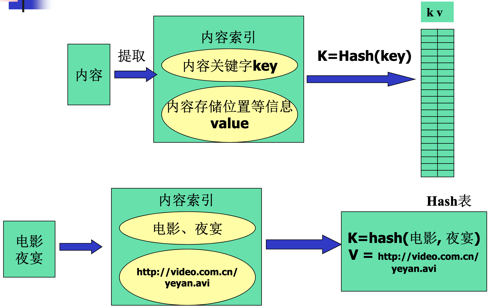  

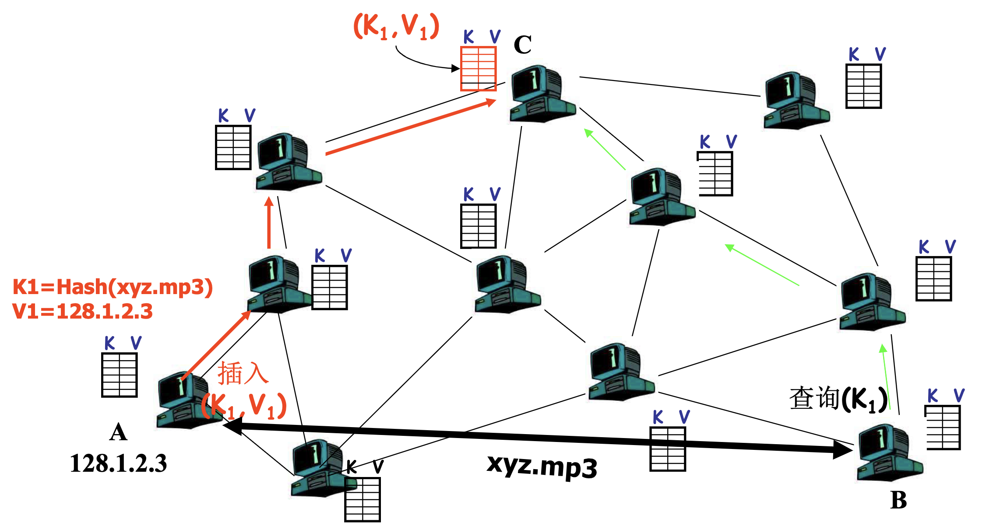  

### 10.3. Chord原理、Hash表分布规则、基于Finger Table的路由技术

P2P应用中有一个基本问题：如何在P2P网络中找到存有特定数据的节点？

#### 10.3.1 Chord原理

Chord是一种基于一致性哈希的路由算法，它通过环形拓扑结构将节点排列在一个逻辑环上，并使用哈希函数将关键字映射到节点上。每个节点都维护其后继节点的信息，查询消息通过后继节点指针在环上传递，直到找到包含关键字对应节点的后继节点。Chord优化了查询过程，将查询需要的跳数从O(N)减少到O(log N)，即使在大规模的P2P网络中也能实现高效的查询。Chord还考虑了节点的加入、退出和失效情况，并对节点加入/退出算法进行了优化。

#### 10.3.2 Hash表分布规则


Chord Hash表分布规则是分布式哈希表（DHT）中的一种，它是一种在分布式系统中存储和检索键值对数据的有效方法。Chord的主要特点是利用节点ID和关键字之间的映射关系来将哈希表分布到网络中的各个节点上。

Chord分布哈希表的过程如下：

1. 首先，每个节点都生成一个唯一的ID，这个ID可以是随机生成的，也可以是根据节点的某些属性（如IP地址）计算出来的。
2. 然后，Chord将整个哈希表按照一定的规则分割成很多小块，每个节点都负责维护其中的一块。具体来说，每个节点都根据其ID的大小顺序排列在一个逻辑环上，哈希表的每个小块都会根据其关键字（K）和节点ID（NID）之间的映射关系被分配给相应的节点。
3. 当需要查询某个关键字（K）时，查询消息会通过逻辑环上的节点进行传递。每个节点都会检查查询消息中的关键字（K）是否在其负责的哈希表分块范围内。如果是，那么该节点就会返回对应的键值对；如果不是，查询消息就会继续传递到下一个节点。
4. Chord为了保证查询的效率，还引入了后继节点和前驱节点的概念。每个节点除了维护其后继节点信息外，还会记录其前驱节点的信息。这样，查询消息在传递过程中，如果发现当前节点不是目标节点，就可以直接跳过其前驱节点，而直接传递到后继节点，从而减少查询的时间和网络流量。
5. 如果在多次查询后仍然没有找到目标节点，Chord会启动一个失败回溯机制，通过回溯来找到目标节点。具体来说，Chord会根据一定的策略回溯到前几个节点，然后逐个尝试这些节点是否包含目标关键字（K）。

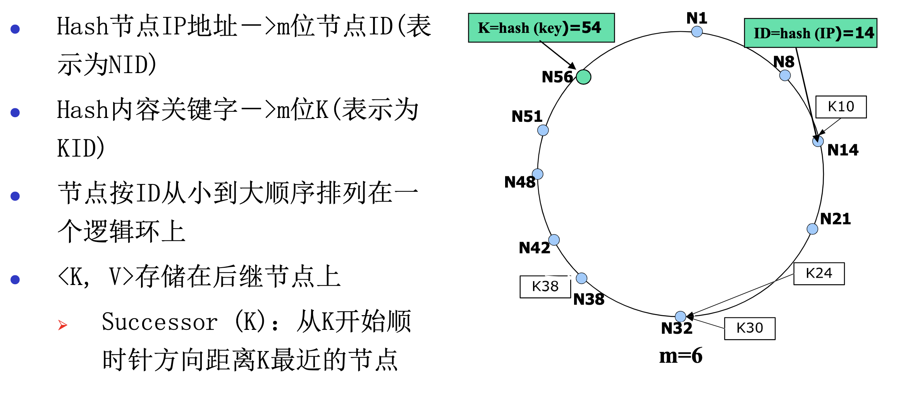  

#### 10.3.3 简单查询过程

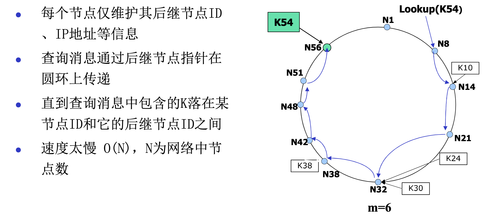  


#### 10.3.4 基于Finger Table的路由技术

基于Finger Table的路由技术是一种用于P2P网络中的路由技术。在这种技术中，每个节点维护一个Finger Table，该表包含指向网络中其他节点的指针。每个节点都存储一个Finger Table，并且每个Finger Table包含指向网络中其他节点的指针。

每个节点都有一个唯一的ID，并且每个节点的ID都被映射到一个特定的位置在Finger Table中。每个Finger Table条目都包含一个节点的ID和该节点的位置信息。节点的位置信息可以是该节点在Finger Table中的位置，也可以是该节点在网络中的其他位置信息。

当一个节点需要查找一个特定的目标节点时，它首先会在自己的Finger Table中查找目标节点的ID。如果找到了目标节点的ID，那么节点就可以通过Finger Table中的位置信息直接将消息路由到目标节点。如果未找到目标节点的ID，那么节点就会将消息发送给它的邻居节点，以便邻居节点可以在它们的Finger Table中查找目标节点的ID。

基于Finger Table的路由技术的优点是它可以提供高效的路由和负载均衡。由于每个节点都存储一个Finger Table，并且每个条目都包含一个节点的ID和位置信息，因此可以快速找到目标节点并进行路由。此外，由于每个节点都存储了其他节点的位置信息，因此可以在多个节点之间进行负载均衡，以避免单个节点的瓶颈。

然而，基于Finger Table的路由技术也存在一些缺点。首先，每个节点都需要存储大量的信息，这可能会导致节点的存储空间不足。其次，如果网络中的节点动态变化，那么每个节点的Finger Table也需要进行更新，这可能会导致大量的网络流量。最后，如果网络中的节点数量不足够多，那么Finger Table可能会变得非常大，这也会导致大量的网络流量。

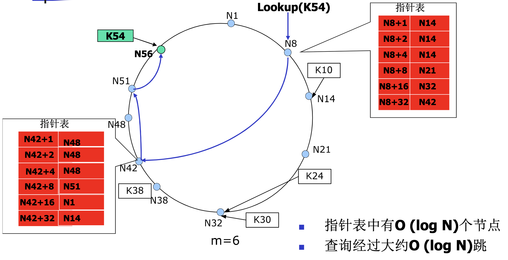  

