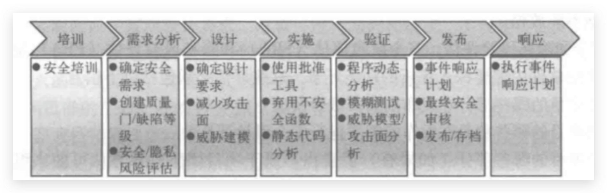

# 软件安全好好复习

## 汇编基础知识

汇编入门教程：https://www.zhihu.com/column/c_144694924

## 一些问题

**1、软件面临的安全威胁有哪些？ 哪些类型**

主要有三大类，软件自身的安全（软件漏洞），恶意代码及软件侵权。

1. 软件漏洞是软件生命周期中与安全相关的设计错误
2. 恶意代码是攻击计算机信息系统的主要载体
3. 软件侵权是因为计算机软件产品开发完成后复制成本低，复制效率高

**2、关于软件安全防护的基本方法**

1. 采用多种检测、分析和挖掘技术或是安全漏洞进行发现，分析与分析。然后采用多种安全控制策略进行错误修复和分享控制。比如打补丁、防病毒、防火墙、入侵检测；
2. 分析软件安全错误发生的原因，将安全错误的修正嵌入到软件开发生命周期的整个阶段

**3、软件漏洞的特点和成因**

1. 软件运行过程中出现错误结果或者运行不稳定，甚至引起死机，例如软件存在内存泄露，导致运行时系统内存消耗越来越大，直到崩溃
2. 漏洞被黑客发现和利用，进而实施窃取隐私信息，甚至破坏系统等攻击行为，例如软件明文存储用户口令，黑客通过数据库漏洞直接获取远程用户权限

**4、让你设计一个CMS系统，你会怎么做？ 核心安全需求是什么？**

1. 对于保密性的需求
    - 口令不能明文存储在后端系统中
    - 传输的用户账号等敏感数据，必须采用传输层安全协议，以防止中间人攻击
    - 系统日志不能包含可读的敏感的数据
2. 对于完整性的需求
    - 输入的表单和参数都需要进行核验，比如身份证的核实
3. 对于可用性的需求
    - 确保软件的关键业务，关键基本功能以及关键支持功能被中断后的恢复时间

**5、wsp top10注入型漏洞**

注入类型的漏洞

风险产生的原因：

1. 应用程序不验证，过滤或清洗用户提供的数据
2. 恶意数据被直接使用或连接，SQL或命令行包含动态查询、命令或存储过程中的结果和恶意程序

预防措施：

1. 选择安全的API
2. 对于白名单服务器端输入验证
3. 查询中使用LIMIT或者其他SQL控件，防止SQL在注入的情况下大量披露记录

**6、密文安全需求有哪些？**

P188-190

**7、你怎么样去做威胁建模？**

威胁建模的步骤：

1. 确定安全目标
2. 创建应用程序概况图
3. 分解应用该程序
4. 确定威胁
5. 威胁评估
6. 确定威胁环节计划或策略
7. 验证和记录威胁
8. 威胁建档

**8、有关于部署的问题，比如SSL协议，你对他的应用是如何理解的**

理解就是：优势 + 存在的问题，比如OpenSSL就出现了心脏滴血的问题

SSL协议具有很高的机密性，由于SSL在传输的过程中有着密钥的保护，所以它可以很好的抵御中间人攻击。SSL协议可以确保数据的完整性，机密性以及认证数据的发送方和接收方。但是SSL协议由于其本身的复杂性会出现问题，比如SSL组件实现有问题，OpenSSL就曾经有过心脏滴血漏洞，还有又开发人员调用不安全接口而导致的不安全性等问题。

**9、软件安全有哪些类型**

**10、你是怎么理解恶意代码的**

任何以某种形式对用户、计算机或网络造成破坏的软件都可以叫做恶意代码，包括计算机病毒、木马、蠕虫等等。 恶意代码还经常跨过多个类别，一个程序可能有一个键盘记录器，来手机密码，而它可能同时有一个蠕虫组件来通过邮件传播自身。

**11、软件的漏洞有什么样的特点，它的成因是什么样的，为什么会出现软件漏洞**

**12、安全编码实施的方案是什么 P201**

1. 验证内容：默认情况下对所有的输入信息进行验证，常用的验证方法有检查数据类型，长度，是否在正常范围内，是否包含特殊字符等
2. 数据净化：将可能是危险的数据转化为无害的形式，主要包含输入数据净化和输出数据精华两种，输入数据净化是将特殊字符从用户输入中去除或者将其替换为安全的数据。(例子：替换script或者将 1' or '1'='1 中的'替换为")。输入数据净化一般是对输出数据进行编码。
3. 错误信息输入保护：比如不要显示用户名不正常或者密码不正常，还是应该输出用户名或密码不知道

**13、SDL模型是什么？**

SDL模型是在软件工程瀑布模型的基础上添加安全活动和业务活动标准，其简化描述如下，SDL的核心理念就是将软件安全的考虑集成在软件开发的每一个阶段需求分析、设计、编码、测试和维护。

**在设计和实施要如何实现**

在设计阶段你需要确定设计要求，减少攻击面，威胁建模

在实施阶段我们要使用批准工具，弃用不安全的函数，进行静态代码分析

**14、PE病毒如何感染PE文件？**

1. 在文件中添加一个新节，然后把病毒代码和执行后返回宿主程序的代码写入到新添加的节中；
2. 同时修改PE文件头的入口地址，使它指向新添加的病毒代码入口；
3. 这样做后，当程序运行时，首先运行病毒代码，运行完后再转去原始OEP去运行宿主代码。

**15、做数据保护在设计的时候要考虑什么问题**

1. 常用的算法，密码算法的选择
2. 如何实现：使用各种密码库 比如OpenSSl
3. 安全的密钥管理
4. 访问控制与审计

注：注意设计和问答的区别，

