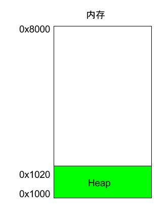
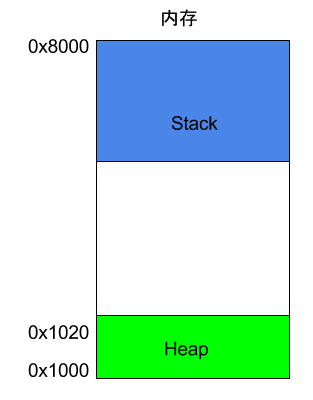

# 课程笔记

:::tip

软件安全课堂笔记

:::

## 汇编基础

**汇编语言是二进制指令的文本形式**，与指令是一一对应的关系。比如，加法指令`00000011`写成汇编语言就是 ADD。只要还原成二进制，汇编语言就可以被 CPU 直接执行，所以它是最底层的低级语言。

### 寄存器

#### 什么是寄存器？

先来看寄存器。CPU 本身只负责运算，不负责储存数据。数据一般都储存在内存之中，CPU 要用的时候就去内存读写数据。但是，CPU 的运算速度远高于内存的读写速度，为了避免被拖慢，CPU 都自带一级缓存和二级缓存。基本上，CPU 缓存可以看作是读写速度较快的内存。

但是，CPU 缓存还是不够快，另外数据在缓存里面的地址是不固定的，CPU 每次读写都要寻址也会拖慢速度。因此，除了缓存之外，CPU 还自带了寄存器（register），用来储存最常用的数据。也就是说，那些最频繁读写的数据（比如循环变量），都会放在寄存器里面，CPU 优先读写寄存器，再由寄存器跟内存交换数据。

#### 寄存器的种类

早期的 x86 CPU 只有8个寄存器，而且每个都有不同的用途。现在的寄存器已经有100多个了，都变成通用寄存器，不特别指定用途了，但是早期寄存器的名字都被保存了下来。

- EAX、EBX、ECX、EDX、EDI、ESI、EBP、ESP

上面这8个寄存器之中，前面七个都是通用的。ESP 寄存器有特定用途，保存当前 Stack 的地址

### 内存模型 Heap

寄存器只能存放很少量的数据，大多数时候，CPU 要指挥寄存器，直接跟内存交换数据。所以，除了寄存器，还必须了解内存怎么储存数据。

程序运行的时候，操作系统会给它分配一段内存，用来储存程序和运行产生的数据。这段内存有起始地址和结束地址，比如从0x1000到0x8000，起始地址是较小的那个地址，结束地址是较大的那个地址。

程序运行过程中，对于动态的内存占用请求（比如新建对象，或者使用malloc命令），系统就会从预先分配好的那段内存之中，划出一部分给用户，具体规则是从起始地址开始划分（实际上，起始地址会有一段静态数据，这里忽略）。举例来说，用户要求得到10个字节内存，那么从起始地址0x1000开始给他分配，一直分配到地址0x100A，如果再要求得到22个字节，那么就分配到0x1020。

这种因为用户主动请求而划分出来的内存区域，叫做 Heap（堆）。它由起始地址开始，从低位（地址）向高位（地址）增长。Heap 的一个重要特点就是不会自动消失，必须手动释放，或者由垃圾回收机制来回收。



### 内存模型 Stack

除了 Heap 以外，其他的内存占用叫做 Stack（栈）。简单说，Stack 是由于函数运行而临时占用的内存区域。



请看下面的例子

```c++
int main() {
   int a = 2;
   int b = 3;
}
```

上面代码中，系统开始执行main函数时，会为它在内存里面建立一个帧（frame），所有main的内部变量（比如a和b）都保存在这个帧里面。main函数执行结束后，该帧就会被回收，释放所有的内部变量，不再占用空间。


如果函数内部调用了其他函数，会发生什么情况？

```c++
int main() {
   int a = 2;
   int b = 3;
   return add_a_and_b(a, b);
}
```

上面代码中，main函数内部调用了`add_a_and_b`函数。执行到这一行的时候，系统也会为`add_a_and_b`新建一个帧，用来储存它的内部变量。也就是说，此时同时存在两个帧：`main`和`add_a_and_b`。一般来说，调用栈有多少层，就有多少帧。

等到add_a_and_b运行结束，它的帧就会被回收，系统会回到函数main刚才中断执行的地方，继续往下执行。通过这种机制，就实现了函数的层层调用，并且每一层都能使用自己的本地变量。

所有的帧都存放在 Stack，由于帧是一层层叠加的，所以 Stack 叫做栈。生成新的帧，叫做"入栈"，英文是 push；栈的回收叫做"出栈"，英文是 pop。Stack 的特点就是，最晚入栈的帧最早出栈（因为最内层的函数调用，最先结束运行），这就叫做"后进先出"的数据结构。每一次函数执行结束，就自动释放一个帧，所有函数执行结束，整个 Stack 就都释放了。

### 常用指令

- `push`: 将运算子压入到栈当中
- `call` : 调用函数
- `mov`: 将一个值写入到某个寄存器当中
- `add`: 将两个运算子相加
- `pop`: 指令取出 Stack 最近一个写入的值，并将这个值写入到运算子对应的位置当中
- `lea`: 取源操作数地址的偏移量，并把它传送到目的操作数所在的单元
- `text`: 逻辑与,逻辑与就是2个数字相同是1,否则是0
- `jnz`: 一般结合`text`一起使用，当test比较的结果不等于0,就跳转

## 一些问题

P6

软件面临的安全威胁有哪些

关于软件安全防护的基本方法

软件漏洞的特点是什么

软件漏洞的成因？

wsp top10里面的某一种漏洞你要清楚（任意一种，原理成因，防范方法）

P152

在线学习系统的安全性分析

核心安全需求，如果让你设计你会做些什么？

密文 安全需求有哪些？

P188-190

你怎么样去做威胁建模？

P246 247

有关于部署的问题，比如SSL协议，你对他的应用是如何理解的

理解就是：优势 + 存在的问题，比如OpenSSL就出现了心脏滴血的问题


### 

## 参考文献

[1] https://www.ruanyifeng.com/blog/2018/01/assembly-language-primer.html
