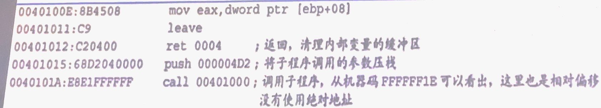

# 课程笔记

:::tip

自用资料，理性查看，可能有错！！！

:::


> RVA 如何转换到FOA ？（10分）


RVA为00002010则FOA是多少？

虚拟偏移是1000

2010//1000 = 2 => 第二个节

2010%1000 = 10 => 偏移是10

则FOA是600+10 = 610

> 一个动态链接库的大小是20


> PE文件在加载的过程中内存的变化过程

1. 从PE头偏移80H，得到RVA


> PE文件的开头（10分）

PE文件的开头都是MZ，DLL也是一种PE文件。DLL文件的开头地址一定是对齐粒度的整数倍

> 导出表结构题的结构

导出表结构体结构如下：


有三项需要仔细掌握：

- NumberOfFunctions: 函数的数量，在导出表里不是以0作为结尾的，而是到足够数量后结束；

- AddressOfFunction: 函数入口的地址


- AddressOfNames：函数名字的地址


## 栈

### 栈会用在哪些场合？

1. 保存程序临时的数值
2. 保存程序的现场
3. 传递函数参数
4. 存放过程中局部变量

### call指令的具体调用过程

1. 将调用函数用到的参数入栈。
2. 将call指令的下一条指令入栈，以备返回。
3. 保存原始 ebp指针
4. 函数准备栈空间，ebp指向栈中该函数的基地址。
5. 为函数中定义的局部变址开辟栈空间（通过调整 esp来完成）
6. 运行函数中定义的语句。
7. 清理局部变量，恢复原始的ebp指针-leave
8. 返回步骤 2 保存的下一条指令处执行，同时清理栈中的函数参数（通过指令retn 4n，押入了多少个参数就return n * 4，n是参数的个数）

- 定位参数方法就是EBP+x

> 给定一些操作，写地址
>
> 

解析过程如下：


> 如何计算栈的偏移量，请计算最后一个栈的相对偏移
>
> 

解析：00401000 - 0040101A + 5 = FFFFFFE1

## 划重点

### 第一章

1. 大端小端
2. 字节序

### 第二章

1. 指令解析比如invoke，先压参数再call再jump

### 第三章第四章

1. FOA、RVA、VA的相互转换
2. 要能看懂PEditor中的信息，比如节表中的信息

### 第五章

1. 壳的原理是什么？155页
2. call的过程要清楚
3. 缓存区溢出是什么，它的原理是什么？


## 作业：手工修改PE文件

### 作业目的

1. 修改文件颗粒度
2. 修改文件显示内容
3. 修改标签栏显示内容

### 步骤

#### 修改节表对齐

未修改之前：

通过PEEditor查看修改之前的文件内容如下图所示：


##### 修改文件对齐字段

文件中Image Header Origin的部分如下图所示：


接下来我们将FileAlignment 修改为1000，BaseOfData改为3000，如下图所示：


##### 修改节表相关属性

接下来使用Winhex打开修改RawSize和RawOffset对应的字段把它们改成0x00001000,0x00001000; 0x00001000,0x00002000; 0x00001000,0x00003000;


保持文件重新使用PEditor打开：


可以发现成功修改文件的颗粒度

##### 添加节区中缺少的 0 字符

​		节表中对于节区在磁盘文件上的大小和节区在磁盘文件上的起始偏移已经进行了修改， 按照偏移进行修改；


### 直接修改EXE文件相应字段值及代码

直接修改EXE文件相应字段值及代码，运行新的helloworld，得到以下效果：


#### 修改HelloWorld-modified by OD

直接在Winhex中修改相应的内容即可，修改过程如下图所示：


#### 修改标签栏

1. .text 节的位置从 0x00401000 处开始;
2. “Well-done”字符串的地址在 0x00403000 处; 
3. “Good JOB”字符串的地址在 0x00403030 处;
4.  “MessageBoxA”函数的导入地址在 0x402080 处; 
5. “ExitProcess”函数的导入地址在 0x402000 处。

可以编写出如下的汇编代码帮助理解：

```
push 0
push 00403030
push 00403000
push 0
call 0040101A
push 0
call 00401020
jmp [00402080]
jmp [00402000]
```

将上述代码转化为.text中的16进制文件就是：

```
6A00
6820304000
6800304000
6A00
E809000000
6A00
E808000000CD03
FF2508204000
FF2500204000
```


接下来使用上述二进制替换Hello World中的16进制代码：


即可得到最终的结果：


