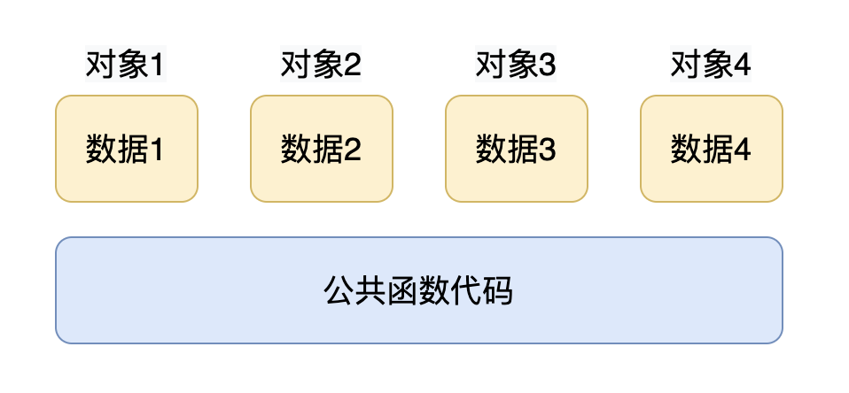

# 面向对象模型

## 成员变量和函数的存储

C++ 实现了 “封装”，**数据和处理数据的操作是分开存储的**。 C++ 中非静态数据成员直接内含在类对象中，成员函数虽然内含在 class 声明之内，却不出现在对象中。每一个非内联成员函数只会诞生一份函数实例。 也就是说成员函数和静态成员一样，是类的所有对象共享的。

`sizeof(Data1)` 的大小只是类的对象所占的空间大小。

## this 指针

### this 指针工作原理

通过上个例子我们知道，C++的数据和操作是分开存储的，并且每一个非内联函数只会诞生一份函数实例，也就是说多个同类型的对象会共用一块代码，那么问题是：这一块代码是如何区分是哪个对象调用的自己呢？

  

答案就是：通过 this 指针。 C++ 通过提供特殊的对象指针，this 指针，解决了上述问题。this 指针指向被调用的成员函数所属的对象。

成员函数通过 this 指针即可知道操作的是哪个对象的数据。 This 指针是一种隐含指针，它隐含于每个类的非静态成员函数中。This 指针无需定义直接使用即可。

```cpp
public:
	int mA;
	void setA(int a)
	{
		mA = a; 
		// this-> 可写可不写，编辑器会自动帮我们添加
		this->mA = a; 
	}
```

注意：静态成员函数没有this指针，静态成员函数不能操作非静态成员变量。

### this 指针的应用

#### 1、函数形参和成员同名可以使用this指针

```cpp
class Data1
{
public:
	int a;
public:
	// 函数的形参和成员变量同名，可以用this指针区分
	Data1(int a)
	{
		cout << this << endl;
	}
};
void test01()
{
	Data ob1(10);
	cout << ob1.a << endl;
	cout << &ob1 << endl;
}
```

#### 2、this 来完成链式操作

```cpp
#include <iostream>
using namespace std;

class Data1
{
public:
	Data1& myPrintf(char *str)
	{
		cout << str << " ";
		return *this;
	}
};

void test01()
{
	// 套娃操作
	Data1().myPrintf("hello").myPrintf("world");
}
```

## const修饰成员函数

用 const 修饰成员函数的时候， const 修饰 this 指针指向的内存区域，成员函数体内不可以修改本类中的任何普通成员变量，当成员变量类型前用 mutable 修饰的时候除外。

```cpp
class Data 
{
public:
	int a;
	int b;
	mutable int c;
public:
	Data(int a, int b, int c)
	{
		this->a = a;
		this->b = b;
		this->c = c;
	}
	// const 修饰成员函数为只读（该成员函数不允许对成员函数赋值）
	// mutable 修饰的成员除外
	void showData(void) const
	{
		c = 100;
		cout << a << " " << c << endl;
	}
};

int main()
{
	Data ob1(10, 20, 30);
	ob1.showData();
}
```

