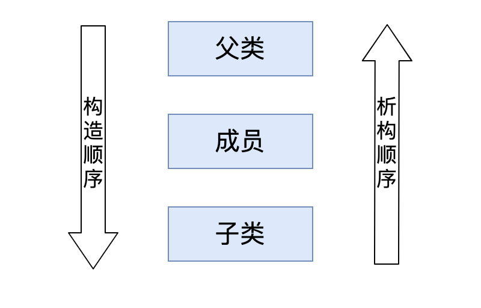

# 继承与多态

## 继承

### 继承的基本概念

C++最重要的特征是代码重用，通过继承机制可以利用已有的数据类型来重新定义新的数据类型，新的类不仅有旧类的成员，还拥有新定义的成员。一个B类继承于A类，或者称为类A派生类B。这样的话，类A成为基类（父类），类B成为派生类。派生类中的成员，包含两大部分：一类是从基类继承过来的，一类是自己增加的成员。从基类继承过来的表现其共性，而新增的成员体现了其个性。

### 派生类的定义

```cpp
class 父亲{};
class 子类:继承方式 父亲{};
```

继承方式有三种：public、protected、private。默认继承方式为private。 public继承方式，基类的public成员和protected成员在派生类中都是public成员；基类的private成员在派生类中是不可访问的。 protected继承方式，基类的public成员和protected成员在派生类中都是protected成员；基类的private成员在派生类中是不可访问的。 private继承方式，基类的public成员和protected成员在派生类中都是private成员；基类的private成员在派生类中是不可访问的。

### 继承中的构造和析构

#### 子类的构造析构顺序

子类的构造析构顺序是先构造父类，再构造子类，析构顺序相反。

  

#### 子类调用成员对象、父类的有参构造

首先子类实例化对象时会自动调用成员对象和父类的默认构造

子类必须使用初始化列表调用成员对象、父类的有参构造

初始化列表时：父类写类名称 成员对象用对象名

```cpp
class Base 
{
public:
	int a;
public:
	Base()
	{
		cout << "Base()" << endl;
	}
	Base(int a)
	{
		cout << "Base(int a)" << endl;
	}
	~Base()
	{
		cout << "~Base()" << endl;
	}
};

class Other 
{
	public:
		int b;
	public:
		Other()
		{
			cout << "Other 默认构造" << endl;
		}
		Other(int b)
		{
			cout << "Other 有参构造" << endl;
		}
		~Other()
		{
			cout << "~Other()" << endl;
		}

};

class Son:public Base
{
public:
	Other ob;
	int c;
public:
	Son()
	{
		cout << "Son()" << endl;
	}
	Son(int a, int b, int c):Base(a),ob(b)
	{
		cout << "Son(int a, int b, int c)" << endl;
	}
	~Son()
	{
		cout << "~Son()" << endl;
	}
};

int main()
{
	Son ob(10, 20, 30);
	return 0;
}
```

### 子类和父类的同名处理

同名成员，最简单，最安全的处理方式：加作用域

#### 子类和父类，同名成员数据

子类默认优先访问，子类的同名成员

访问父类的同名成员，必须加作用域

#### 子类和父类 ，同名成员函数

子类默认优先调用，子类的同名成员函数， 如果子类没有同名成员函数，才会调用父类的同名成员函数。 如果子类有同名成员函数，但是想调用父类的同名成员函数，必须加作用域。

`重载`：无继承，同一个作用域，参数的个数、类型、顺序不同，就是重载。

`重定义`：有继承、子类 重定义 父类的同名函数（参数可以不同）（非虚函数）子类一旦重定义了父类的同名函数（不管参数是否一致），子类中都将屏蔽掉父类的同名函数。

### 多继承

我们可以从一个类去继承，也可以从多个类去继承，这就是多继承。 

#### 多继承的基本语法

```cpp
class Son:public Base1,public Base2
{
public:
	int c;
public:
	Son()
	{
		cout << "Son()" << endl;
	}
	Son(int a, int b, int c):Base1(a),Base2(b)
	{
		cout << "Son(int a, int b, int c)" << endl;
	}
	~Son()
	{
		cout << "~Son()" << endl;
	}
};
```


