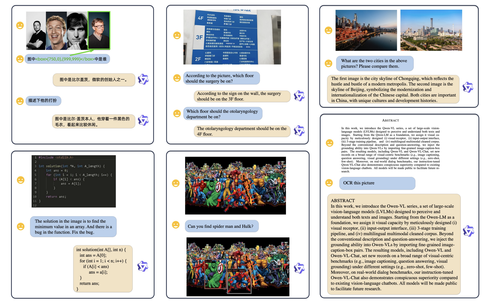
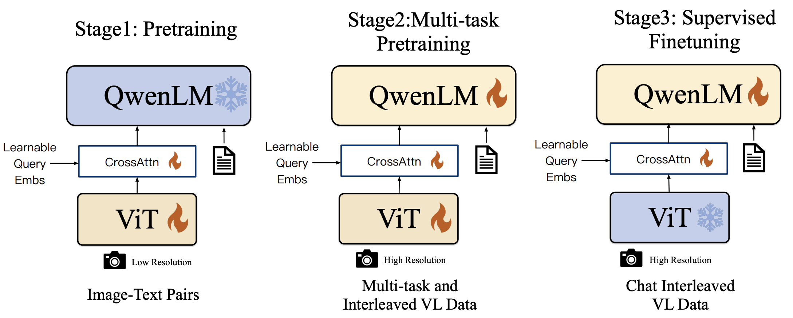
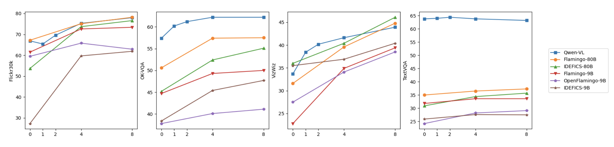

# QWen-VL - 一款能看能听的 AI 模型

## 1. 视觉语言模型的崛起

近年来，人工智能中的 **大语言模型（LLM）如 GPT 虽然在文本生成和理解上表现出色，但它们无法处理视觉信息（如图像、视频），这一局限性催生了视觉语言模型（LVLM）** 的诞生。这类模型不仅能理解文本，还能同时“看”懂图片。

Qwen-VL 是阿里巴巴推出的最新视觉语言模型，不仅能生成图片描述，还能回答与图片相关的问题，实现多模态对话，为视觉语言模型开辟了新的应用前景。

## 2. Qwen-VL 能做什么？它有哪些核心功能

  

Qwen-VL 是一款面向多模态任务的视觉语言模型，具备了强大的视觉理解和文本生成能力。在众多应用场景中，Qwen-VL 通过结合图像和文本数据，提供了高效、准确的解决方案。它的核心功能主要包括：图像描述生成、图像问答（Visual QA）以及文本识别（OCR），这些功能展示了该模型在多模态任务上的卓越表现。

Qwen-VL 的第一项重要功能是能够根据图像生成精准的自然语言描述。Qwen-VL 利用其视觉编码器（Vision Encoder），通过 ViT（Vision Transformer）架构对图像进行分块处理，从而提取细节特征。随后，这些视觉特征被输入到模型的语言生成模块中，生成符合上下文的自然语言描述。该过程不仅要求模型理解图片中的全局信息，还需要准确捕捉图片中的细节。

Qwen-VL 的另一大亮点是其图像问答能力，用户可以基于图片向模型提出各种问题，而 Qwen-VL 能够根据图片内容生成精准的答案。例如，用户可以上传一张会议照片，并询问：“图片中有多少个人？” Qwen-VL 会分析图片，计算出人物数量并给出答案。

除了描述和问答功能外，Qwen-VL OCR 能力，可以从图片中精确提取文字信息。无论是扫描文档还是拍摄的商店招牌，Qwen-VL 都能从中识别出文本，并将其转化为可编辑的文字。

## 3. Qwen-VL 的技术架构：它是如何工作的

Qwen-VL 的强大能力来源于其精心设计的模型架构和训练流程。通过结合视觉编码和语言理解，Qwen-VL 实现了跨模态任务的无缝衔接。我们将从其三大核心组件及其三阶段训练流程深入剖析该模型的工作原理。

### 3.1 模型架构概览

Qwen-VL 的架构可以分为三大核心组件，每个组件都在多模态信息处理的过程中发挥了关键作用：

1. 视觉编码器（Vision Encoder）: Qwen-VL 采用了 ViT（Vision Transformer）架构来处理图像数据。ViT 将输入的图像划分成固定大小的图像块（patch），然后将这些块作为输入向量，送入 Transformer 进行处理。通过这种方式，模型能够捕捉到图像中的全局和细节信息，提取出高质量的视觉特征。
ViT 架构相比传统卷积神经网络（CNN），具备更好的扩展性和表现力，尤其是在复杂视觉任务上表现出色。
2. 语言模型（Language Model）: Qwen-VL 的语言处理部分基于 Qwen-7B 大语言模型。这个模型具备强大的自然语言理解与生成能力，能够在处理文本时展现出精细的上下文推理能力。Qwen-7B 负责将视觉编码器提取的特征转化为自然语言输出，例如图片描述、回答用户问题等。
3. 视觉-语言适配器（VL Adapter）: 为了 **缓解长图像特征序列带来的效率问题** ，Qwen-VL 引入了一个视觉语言适配器，用于压缩图像特征。该适配器由一个单层交叉注意力模块组成，该模块随机进行初始化。模块使用一组可训练向量（Embeddings）作为查询向量和视觉编码器生成的图像特征作为键进行交叉注意力操作。这种机制将视觉特征序列压缩到 256 个固定长度。此外，考虑到对精细图像理解的位姿信息的重要性，2D-绝对位姿编码被纳入交叉注意力机制的查询-键对中，以减轻压缩过程中潜在的位姿细节损失。压缩后的图像特征序列长度为 256，随后被喂入大型语言模型。

### 3.2 三阶段训练流程

  

Qwen-VL 的卓越表现不仅得益于其架构设计，还得益于其精细化的三阶段训练流程。该训练流程确保了模型在处理不同任务时的通用性和适应性。

#### 阶段一：预训练

预训练 Qwen-VL 的预训练阶段使用了大规模的图文配对数据集，模型通过这些数据进行初步的视觉-语言理解能力训练。具体来说，模型使用了 1.4 亿对图文数据，这些数据经过清洗后，包含了丰富的图像内容和相应的文字描述。

预训练过程中，模型主要学习如何将图像中的视觉特征与文字描述相匹配。由于数据集包含中英文内容，Qwen-VL 具备了处理多语言任务的能力。数据清洗策略包括去除不相关内容，确保输入数据的质量和一致性，使模型能够在不同语言和场景下都有良好的表现。

#### 阶段二：多任务预训练

在此阶段，Qwen-VL 进一步接受了多任务预训练，即在同一训练过程中学习完成多个任务。这些任务包括图像问答（VQA）、物体定位和 **OCR（光学字符识别）** 等复杂的视觉语言任务。通过多任务学习，模型获得了更强的通用能力，能够在多种任务之间共享知识，从而提升整体表现。

这一阶段的一个关键点是通过多任务学习提高模型的灵活性和适应性。模型能够同时理解和处理多个任务的需求，这使得它在面对多模态任务时更加高效和准确。

#### 阶段三：监督微调

在最后的监督微调阶段，Qwen-VL 通过人工标注的对话数据集进行了指令微调。这一阶段的主要目标是增强模型的对话和多轮交互能力，使其更好地理解用户意图。例如，在用户提出连续多个问题时，Qwen-VL 能够根据上下文进行准确的回答。

微调过程中使用了**指令微调（Instruction Tuning）**技术，这种技术能够帮助模型更好地理解复杂指令，并生成更加自然和连贯的对话输出。这种微调极大地提升了 Qwen-VL 在实际应用场景中的表现，尤其是在需要多轮对话和上下文理解的任务中。

简单来说，指令微调就是通过给模型一系列明确的任务指令进行训练，使其能够理解指令并执行相应任务。例如，用户可以给出“描述这张图片”的指令，模型需要根据这个指令生成一个合适的图片描述。在这个过程中，模型不仅要理解图片内容，还要理解用户的语言意图，并根据指令生成合理的回答。

指令微调的目标是使模型学会在面对多样化的指令时，表现得更加灵活和精准。这种技术特别适合那些需要多轮对话或复杂任务执行的场景，比如 Qwen-VL-Chat 这种交互式模型。

## 4. Qwen-VL 的性能如何

Qwen-VL 不仅在架构设计和训练方法上表现出色，在实际应用中的性能也十分亮眼。在各种视觉和语言任务的基准测试中，Qwen-VL 都取得了优异的成绩，尤其是在图像描述、视觉问答（VQA）和文本问答等任务上，它展示了强大的处理能力。此外，Qwen-VL 还表现出色的**零样本（Zero-shot）和少样本（Few-shot）**学习能力，能够在缺乏专门训练数据的情况下依然完成复杂任务。

### 4.1 基准测试数据

在多个重要的基准测试中，Qwen-VL 的表现超越了同类模型，尤其是在 Flickr30K、VQAv2 和 TextVQA 等任务上，展示了其作为视觉语言模型的强大优势。以下是 Qwen-VL 在这些测试中的具体表现。

  

### 4.2 零样本与少样本学习能力

除了在常规任务中的优异表现，Qwen-VL 在**零样本（Zero-shot）和少样本（Few-shot）**学习方面也展现了强大的泛化能力。零样本学习指的是模型在没有经过专门任务训练的情况下直接进行推理，而少样本学习则是模型在仅有极少量训练数据时进行任务推理的能力。

  

## 5. 总结：为什么 Qwen-VL 值得关注

Qwen-VL 是一款在技术和应用上都非常值得关注的多模态 AI 模型。它通过创新的视觉-语言适配架构，结合 ViT 和 Qwen-7B 语言模型，实现了卓越的图像描述、问答和文本识别功能。同时，经过三阶段训练流程，Qwen-VL 展现出强大的零样本和少样本学习能力，在多个基准测试中超越了同类模型。

其实际应用前景广阔，无论是智能客服、视觉辅助还是文档处理，Qwen-VL 都能提供高效的解决方案。随着多模态 AI 技术的持续发展，Qwen-VL 在未来的智能交互和复杂任务中必将发挥更大的作用，推动 AI 走向更高层次的应用场景。

