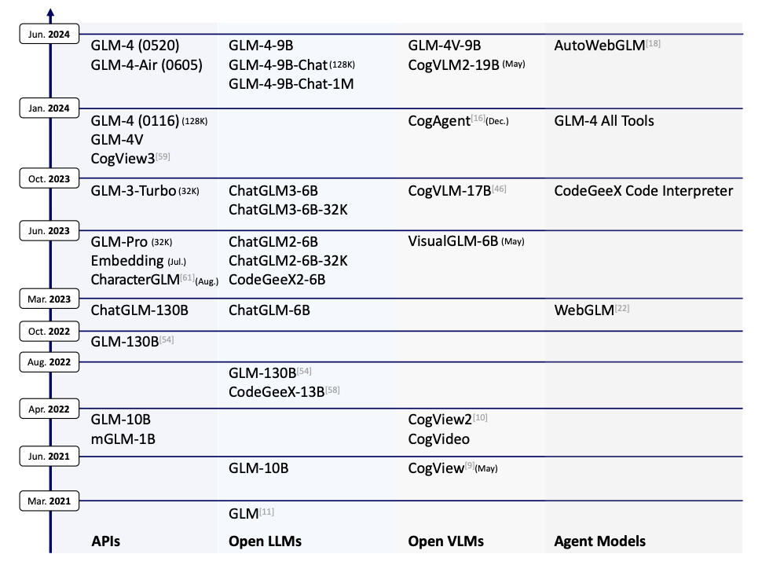
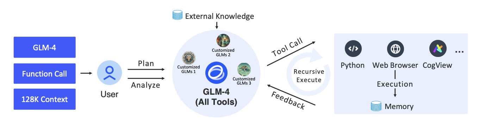

# GLM-4

## 1. ChatGLM-4 的技术演变

在自然语言处理的飞速发展中，大语言模型（LLM）不断突破极限，而 ChatGLM 系列则是其中的一个重要创新，从 GLM-130B 到最新的 GLM-4，它不仅在语言理解上表现强大，还在结构设计和多模态支持上展现出极高的潜力。

### 1.1 ChatGLM 系列的起点：GLM-130B

ChatGLM 系列最早可以追溯到 GLM-130B。它作为一个通用语言模型，专注于多语言支持，尤其是在中英双语环境中表现出色。GLM-130B 的目标是提供与 OpenAI 的 GPT-3 类似的语言理解和生成能力，并以此为基础，探索超大规模模型的训练方法和推理性能。

### 1.2 向更强语言理解进化：ChatGLM-6B 和 ChatGLM-3

随着 ChatGPT 的流行，ChatGLM 系列逐渐转向对人类语言意图的更深度对齐，通过引入监督微调（SFT）和人类反馈强化学习（RLHF）技术，让模型能够更准确地理解和响应用户指令。ChatGLM-6B 是第一个开源的版本，它采用了 62 亿参数，能够以较低的计算资源成本部署，并在中文和英文对话中实现了良好的表现。ChatGLM-3 进一步扩展了上下文长度，使其支持 32K 的长文本输入，并优化了推理速度，为更复杂的多轮对话任务提供支持。

### 1.3 ChatGLM-4：多模态与多工具支持的全面升级

在 ChatGLM-4 中，模型实现了从语言生成到多模态任务的跨越，能够处理更长的文本、支持图像输入，甚至可以智能调用多种工具。其“GLM-4 All Tools”版本特别适用于解决复杂任务，因为它可以根据任务需求自主选择并调用多种工具，比如调用 Python 解释器处理数学问题，或使用网页浏览器查找实时信息。

ChatGLM-4 的亮点在于通过长上下文扩展和跨模态对齐技术，使其不仅在中英双语环境中表现优异，还能够在长文本处理和图像生成任务中实现接近或超越 GPT-4 的效果。这一版本的发布标志着 ChatGLM 从通用语言模型向多模态智能体（agent）转型的重要一步。

## 2. GLM-4 的内部设计

ChatGLM-4 通过精心设计的模型架构，在保证高效训练与推理的前提下，进一步提升了长上下文处理能力和多模态支持。

### 2.1 无偏置设计：专注 QKV 偏置，提升训练与推理速度

在 ChatGLM-4 的注意力层中，**模型采取了“无偏置”的创新设计，即除了查询、键和值（QKV）矩阵外，其余层的偏置项被移除**。这一设计主要基于以下两个原因：

1. **加速训练与推理过程**：通过减少偏置项，模型参数量和计算复杂度相应降低，从而有效提升了训练和推理的速度。偏置项在大部分注意力模型中的主要作用是提高表示灵活性，而 GLM-4 的实验表明，在保留 QKV 偏置的情况下，去除其他偏置项对生成质量影响较小，但显著优化了计算效率。
2. **提升模型长度外推性能**：移除偏置项在一定程度上增强了模型的长度外推能力，即模型可以更稳定地处理比训练中出现更长的文本，特别适用于长文本的上下文处理需求。

### 2.2 RMSNorm 和 SwiGLU 激活函数：稳定性与效率的提升

在层归一化和激活函数的选择上，GLM-4 采用了 RMSNorm 替代传统的 LayerNorm，并引入了 SwiGLU 作为激活函数，这种组合在性能和稳定性方面带来了显著提升。

### 2.3 组查询注意力（GQA）：高效的参数管理

GLM-4 在注意力机制上还引入了组查询注意力（Group Query Attention, GQA），替代传统的多头注意力（Multi-Head Attention, MHA）。这一调整带来了更高的参数效率，尤其在推理过程中的缓存管理方面效果显著：

1. 减少 KV 缓存大小：GQA 通过减少键和值的存储需求，有效降低了推理阶段的内存占用。这对于长文本推理任务尤其重要，因为减少缓存意味着可以处理更长的上下文而不会造成内存溢出。
2. 参数效率提升：与 MHA 相比，GQA 需要的参数量更少，这使得 ChatGLM-4 在保持模型规模的同时，能够将剩余参数用于增强前馈网络（FFN）的规模。这样一来，模型在不增加总参数量的情况下提高了计算能力，增强了模型的处理精细度。

## 3. 多模态能力：ChatGLM-4 如何支持图像

ChatGLM-4 不仅在自然语言处理中表现出色，还实现了多模态支持，能够处理图像输入并生成相应的文本或视觉内容。这使得模型在任务类型上更加多样化，从纯文本生成拓展到更广泛的应用场景。

### 3.1  图像嵌入与融合方式：扩展 Transformer 架构以支持图像输入

为了实现图像和文本的融合处理，GLM-4 通过对 Transformer 架构进行扩展，使其能够处理图像数据：

1. 图像嵌入处理：GLM-4 **在输入层引入了图像嵌入层**，将图像像素数据转换为与文本相似的向量表示。这样，图像数据能够与文本数据在同一架构中处理，实现图像与文本的统一表示。
2. 多模态融合机制：GLM-4 在 Transformer 层中**设计了多模态融合模块，使图像与文本信息能够在注意力机制中互相交互**。这种设计让模型能够在生成过程中既考虑图像信息，又能维持文本逻辑，使得图像描述或跨模态任务（如图像理解、文字生成图像）更加自然。

### 3.2 CogView 模型的集成：实现文本到图像的生成与理解

GLM-4 集成了 CogView 系列模型，使其能够在推理阶段完成文本到图像的生成以及图像到文本的理解。**CogView 是一个高效的文本到图像生成模型，通过分层次的生成机制**，它能够根据输入的文本生成对应的图像，这一集成使得 GLM-4 成为一个强大的多模态模型。

### 3.3 跨模态对齐：确保图像与文本任务的一致性

为了使图像和文本信息在同一模型中融合并对齐，GLM-4 使用了跨模态对齐机制，主要包含对齐损失和互信息最大化两种策略。

1. **对齐损失**：GLM-4 引入对齐损失来优化图像和文本的嵌入空间，使得同一语义信息的图像和文本在高维空间中更接近。设图像嵌入为 $z_{\mathrm{img}}$ ，文本嵌入为 $z_{\mathrm{text}}$ ，对齐损失定义为两者之间的余弦相似度：

$$
\mathcal{L}_{\text {align }}=1-\frac{z_{\text {img }} \cdot z_{\text {text }}}{\left\|z_{\text {img }}\right\|\left\|z_{\text {text }}\right\|}
$$

这一损失函数在多模态训练时被最小化，从而促使模型在图像和文本处理上保持一致性。
2. **互信息最大化**：在跨模态对齐时，GLM-4 采用了自监督学习策略，通过最大化图像和文本的互信息来提升对齐质量。互信息表示图像和文本嵌入之间的信息相关性，定义为：

$$
I\left(z_{\text {img }}, z_{\text {text }}\right)=H\left(z_{\text {img }}\right)+H\left(z_{\text {text }}\right)-H\left(z_{\text {img }}, z_{\text {text }}\right)
$$

其中 $H(\cdot)$ 为信息摘。通过增大 $I\left(z_{\mathrm{img}}, z_{\mathrm{text}}\right)$ ，模型在训练过程中能够自动捕捉图像和文本的对应关系，确保跨模态任务中的高质量生成。

## 4. ChatGLM-4 的多工具对齐机制

ChatGLM-4 不仅仅是一个语言模型，还被设计为支持多种工具调用的智能助手，可以通过自动选择并调用外部工具（如网页浏览器、Python 解释器和图像生成器）来处理复杂任务。下面我们具体探讨 ChatGLM-4 在工具选择与调用以及任务规划与递归调用方面的技术实现。

  

### 4.1 工具选择与调用：任务需求的智能分析

GLM-4 All Tools 通过特定的分析机制来判断用户的任务需求，选择合适的工具并在不同任务间高效切换。以下是它实现智能工具选择的核心步骤：

1. **任务意图解析**：模型首先会分析用户输入的内容，通过分析输入中的关键词、句式结构等特征来判断任务的类型。比如，当输入中涉及计算任务时，模型会判断是否调用 Python 解释器；如果涉及信息检索，则判断是否需要调用浏览器。
2. **工具适配策略**：在确定任务意图后，GLM-4 会根据任务复杂度和工具能力进行适配。例如，对于基本的数学运算，模型可能会直接计算；而更复杂的数学问题则会调用 Python 解释器以确保结果准确。对于需要图像处理的任务，模型则会调用图像生成器（如 CogView）来完成图像生成或解析。
3. **工具调用接口**：GLM-4 中每种工具的调用都通过标准化的 API 接口实现。模型可以通过调用预设接口，将中间结果传递到特定工具中，再将工具的输出数据返回到核心生成模块中，以便进一步处理。这样，GLM-4 能够灵活而高效地进行工具选择和调用，支持多步骤的复杂任务。

### 4.2 任务规划与递归调用：完成多步骤复杂任务

GLM-4 在处理复杂任务时不仅会选择适合的工具，还能够对任务进行规划，并在需要时递归调用工具。这种机制确保模型可以分步处理复杂问题，尤其在包含多个子任务的情境下表现出色。

## 5. 总结

ChatGLM-4 作为 ChatGLM 系列的最新版本，通过多工具对齐、多模态支持和超长上下文处理等技术创新，展现出卓越的多任务适应能力。不仅在语言理解和生成上达到与 GPT-4 相近的水准，GLM-4 还进一步扩展了模型在图像处理、智能任务分解等复杂任务场景中的表现。这使得它不仅适用于标准的对话任务，还能够胜任多模态分析、计算推理和动态信息获取等场景，为多领域实际应用提供了广泛的可能。

尽管 GLM-4 已取得显著成效，但在提升性能和优化结构上依然面临一些技术挑战：

1. 长文本处理效率：未来版本可能在提升长文本处理效率上取得突破，使模型能高效处理百万字符级别的上下文。
2. 多模态对齐优化：扩展到音频、视频等模态，并改进跨模态对齐机制，以提升多模态任务的自然性与一致性。
3. 智能任务规划与学习：进一步增强任务分解与递归调用的智能化，使模型能够自主调整多工具调用策略。

