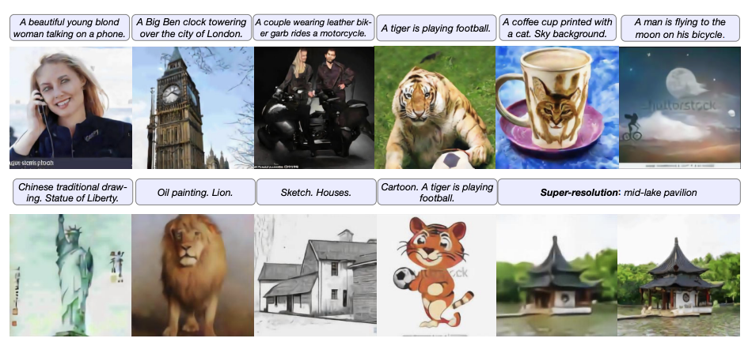
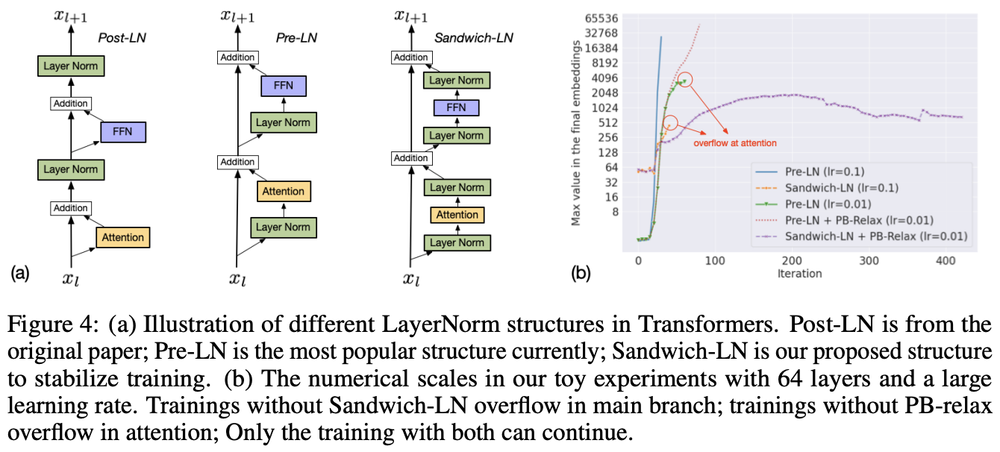
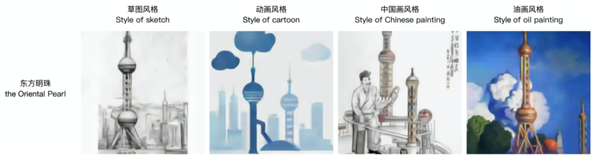

# CogView

## 1. 引言

文本到图像生成是一个跨模态的 AI 挑战，要求模型不仅能生成多样化的图像，还能准确理解并表达输入文本的语义。然而，传统的生成对抗网络（GAN）在复杂场景和高分辨率图像生成中表现不佳。近年来，Transformer 架构在文本生成和图像生成方面展现出巨大潜力，尤其是 OpenAI 的 DALL-E 等模型推动了文本到图像生成的进展。

在此背景下，清华大学与阿里巴巴达摩院联合提出了 CogView 模型。CogView 采用了 4 亿参数的 Transformer 架构，结合向量量化变分自编码器（VQ-VAE）作为图像编码器，通过大规模中文数据集训练，能够生成高质量的图像。其主要创新点包括：

1. 生成质量和多样性提升：在复杂通用场景下保证图像的清晰度和与文本的语义一致性。
2. 多种应用场景支持：CogView 不仅生成图像，还支持风格迁移、超分辨率、图像排序等功能。
3. 训练稳定性增强：通过精度瓶颈放松（PB-Relaxation）和夹层正则化（Sandwich LayerNorm）解决大模型训练中的不稳定问题。

  

## 2. VQ-VAE 与 Transformer 的结合

CogView 模型在文本到图像生成上采用了创新的架构和训练优化技术。该模型使用 VQ-VAE 和 Transformer 结合实现对文本的理解与图像生成，并通过针对生成过程的稳定性和质量的优化策略，实现了高质量和多功能的跨模态生成。

### 2.1. VQ-VAE 用于图像编码

CogView 的生成过程基于 VQ-VAE 和 Transformer 的结合。VQ-VAE 负责将图像编码为离散表示，再由 GPT 架构的 Transformer 对这些离散标量进行建模生成。这样，模型不需要直接生成像素级别的数据，从而极大地提升了生成效率。

VQ-VAE 是 CogView 模型的图像编码模块，负责将高分辨率的输入图像转换为低维离散表示，以便于后续的文本和图像序列统一建模。其过程包括三个步骤：

首先，输入图像（例如尺寸为\(256 \times 256\)的彩色图像）通过卷积神经网络（CNN）被压缩为更小的特征图，尺寸为\(32 \times 32 \times d\)（其中\(d=256\)表示特征维度）。然后，这些连续的特征向量通过最近邻映射量化到一个固定的“码本”中。这个量化过程将每个特征点映射为一个离散标量，从而生成\(32 \times 32\)个图像 Token。每个 Token 可以视作一个编码过的像素区域的“标识符”，这些 Token 的组合代表了原始图像的简化表示。最后，生成过程中这些图像 Token 将输入到解码器中，从而恢复出接近原图的图像。

VQ-VAE 将图像转换为低维序列表示，不仅减少了数据规模，同时保留了图像的空间信息，为后续 Transformer 的跨模态生成奠定了基础。

VQ-VAE 将图像转换为低维序列表示，不仅减少了数据规模，同时保留了图像的空间信息，为后续 Transformer 的跨模态生成奠定了基础。

### 2.2 Transformer 用于文本和图像的联合建模

经过 VQ-VAE 编码后的图像被转换为一个包含图像和文本 Token 的序列，再由 Transformer 进行统一建模。CogView 使用 GPT 式的 Transformer 模型来实现自回归序列生成，即逐步生成每个 Token，使生成结果在语义上与输入文本相符。

输入到 Transformer 的序列包含文本的 Token 和图像的 Token，例如序列结构为“[ROI1] 文本 Token [BASE] 图像 Token”。其中，[ROI1]和[BASE]等特殊标记用于区分文本和图像部分。Transformer 以自回归的方式预测每一步的 Token，从而在文本生成的同时逐步生成图像部分。通过这种方式，Transformer 能够同时考虑文本和图像之间的关联性，使生成的图像能够准确反映输入文本的内容。

### 2.3 联合概率建模的优化目标

CogView 的训练目标是最大化图像和文本之间的联合生成概率。为此，CogView 的损失函数设计基于 VQ-VAE 的 ELBO 框架，将文本和图像的生成过程统一起来。

在模型的训练过程中，首先通过优化图像重构损失来训练 VQ-VAE 的编码器和解码器，确保编码的图像能够接近于原始图像。接下来，通过自回归的方式训练 Transformer 模型，以同时最大化文本和图像序列的联合概率。该过程中的损失函数由文本生成的负对数似然损失和图像生成的重构损失组成，从而使生成的图像在语义上与文本一致。

VQ-VAE 和 Transformer 结合，使得 CogView 能够在生成过程中既保持图像质量，又实现了文本到图像的语义映射，从而实现了复杂多样的跨模态生成效果。这种架构使得 CogView 在文本到图像生成任务上展示出显著优势，不仅提高了生成效率，还在保证生成质量的同时拓展了模型的应用场景。

  

## 3. 训练稳定性改进

在训练大规模 Transformer 模型时，尤其是在涉及图像与文本跨模态数据时，由于数据的异构性，模型容易出现数值不稳定性，例如损失函数值出现 NaN（Not a Number）的现象。为解决这一问题，CogView 提出了“精度瓶颈放松”（PB-Relaxation）和“夹层正则化”（Sandwich LayerNorm）技术。这些方法帮助模型在 FP16（半精度浮点数）训练中保持稳定，尤其适用于大规模的生成任务。

### 3.1 精度瓶颈放松（PB-Relaxation）

PB-Relaxation 的主要目的是避免在前向传播过程中产生数值溢出。CogView 通过以下两种策略来降低模型中数值爆炸的可能性：

**LayerNorm 的预归一化**：在 Transformer 层较深的部分，网络的数值在归一化前可能达到非常高的幅值（如 \(10^4\) 至 \(10^5\)）。如果不做特殊处理，这样的数值会导致 LayerNorm 出现溢出。PB-Relaxation 的思路是先对输出除以最大值，以降低其幅值，具体公式为：
  \[
  \text{LayerNorm}(x) = \text{LayerNorm}\left( \frac{x}{\max(x)} \right)
  \]
  这样一来，LayerNorm 操作在不同的层中能保持在稳定的数值范围内，减少了因数值过大而引起的 NaN 问题。

**调整注意力计算顺序**：Transformer 的注意力机制中的注意力分数（attention scores）计算为 \( \frac{Q K^T}{\sqrt{d}} \)，当\(Q\)和\(K\)的值很大时，注意力分数的结果也可能非常大。为了减少计算中的数值爆炸，PB-Relaxation 将计算顺序调整为：
  \[
  \text{softmax} \left( \frac{Q K^T}{\sqrt{d}} \right) = \text{softmax} \left( \frac{Q}{\alpha} \cdot \frac{K^T}{\sqrt{d}} \cdot \alpha \right)
  \]
  其中，\(\alpha\)为一个较大的常数，例如 32，这样可以有效减少计算过程中的数值幅度，从而避免了溢出。

这些技巧减少了 FP16 精度训练中数值溢出的风险，确保了模型在较大规模数据集上的稳定性。

### 3.2 夹层正则化（Sandwich LayerNorm）

在标准 Transformer 中，通常采用前置 LayerNorm（Pre-LayerNorm）来稳定训练。但在 CogView 的跨模态生成任务中，单一 LayerNorm 结构不足以应对数据异构性导致的数值波动，因此提出了“夹层正则化”（Sandwich LayerNorm）：

**双 LayerNorm 结构**：在每个 Transformer 层的残差连接中，增加一个 LayerNorm 层。这种结构在 LayerNorm 的前后各加一层归一化，能够对每层的输出进行更严格的数值控制。具体而言，Sandwich LayerNorm 在 LayerNorm 操作之前和残差分支的末端各加一层：
  \[
  \text{Sandwich-LN}(x) = \text{LayerNorm}(\text{LayerNorm}(x) + f(x))
  \]
  其中\(f(x)\)表示该层的主要计算分支（如自注意力或前馈网络）。这个操作限制了每层的输出幅值，避免了残差层叠带来的数值爆炸。

夹层正则化使得深层 Transformer 在数值控制上更加稳定，特别适用于大模型的跨模态生成任务。实验表明，该方法在多层的 Transformer 结构中也能保持较高的数值稳定性。

  

## 4. 微调策略：在不同任务中的适用性

CogView 通过针对特定任务的微调，拓展了文本到图像生成模型的功能，使其能够高效适应不同的下游任务。

### 4.1 超分辨率重建

CogView 的 VQ-VAE 编码器将图像压缩为低维 Token 序列，使得生成图像在低分辨率下表现出一定的模糊性。为解决这个问题，CogView 应用了超分辨率微调策略，以在不同分辨率上逐步恢复细节。

### 4.2 图像风格迁移

在生成风格化图像的任务中，CogView 通过风格迁移微调实现了特定风格的生成，例如中国传统绘画、油画、素描和卡通风格。这些图像风格通过从网络上搜集的特定风格图像进行微调训练，使模型学会生成带有明确风格特征的图像。

1. **风格标签控制**：微调过程中，将图像标注上风格标签（如“油画风格”），并将标签融入输入文本，以便模型在生成时理解风格特征​。
2. **对象与风格结合**：在生成阶段，通过在输入文本中指定风格和对象（如“东方明珠的油画风格图像”），模型能够将学到的形状知识和风格特征结合，生成既符合描述又具有特定风格的图像​。

  

### 4.3 图像文本排序（Self-reranking）

CogView 的自排序功能通过计算描述损失（Caption Loss）来评估生成图像与文本的匹配度，从而在生成结果中选取最优图像。这种方法可以在没有额外模型（如 CLIP）的情况下进行排序。

## 5. 总结

CogView 通过 VQ-VAE 与 Transformer 的结合，提出了一种高效的文本到图像生成方法，不仅解决了大规模异构数据下的数值稳定性问题，还通过精度瓶颈放松（PB-Relaxation）和夹层正则化（Sandwich LayerNorm）等技术确保了模型训练的稳定性。同时，CogView 利用微调策略实现了不同任务的适用性：在超分辨率重建中提升了图像清晰度，在风格迁移中支持多种艺术风格的生成，并通过自排序方法提高了生成结果的语义一致性。这些技术创新和微调策略使得 CogView 不仅在生成质量上超越传统方法，还具备了多场景、多任务的拓展能力，展示了跨模态生成模型在实际应用中的广泛潜力。