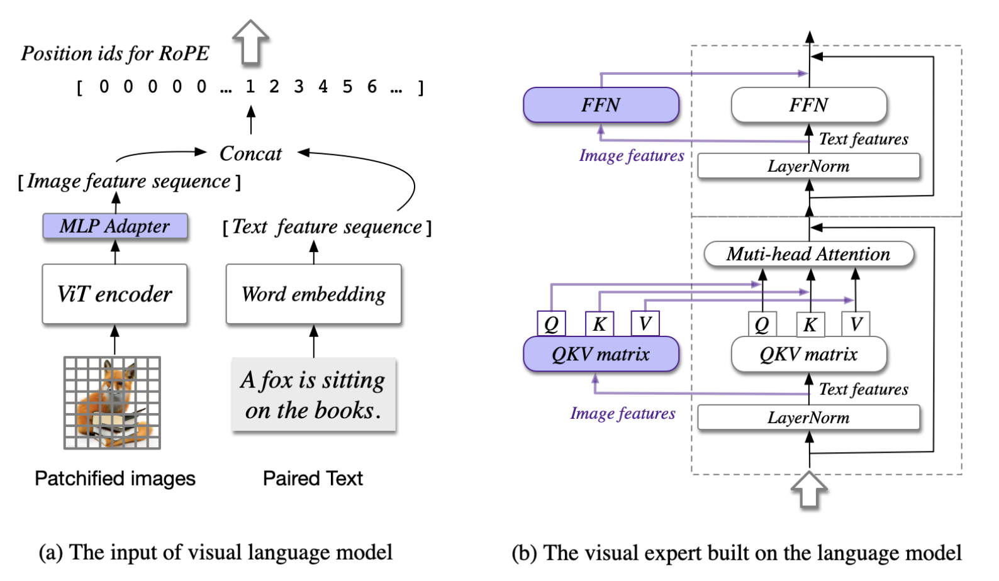

# CogVLM

## 1. 多模态 AI 的核心与挑战

目前，许多 VLMs 仍然依赖于一种被称为“浅层对齐”的方法。这种方法通过一个简单的映射层或线性层将图像特征“拼接”到文本输入中，然后直接交给预训练的语言模型进行处理。虽然听起来方法简单、实现方便，但在实际应用中，这种浅层的对齐方式暴露出了显著的缺陷：

1. **缺乏视觉与文本的深度交互**: 浅层对齐方法只是将图像当作额外的上下文添加到文本输入中，并未让图像特征与文本特征进行深度交互。这意味着，模型只能在表面上理解图像信息，无法感知图像中的复杂细节或层次关系，极大限制了模型的理解能力。
2. **图像特征和文本特征不匹配**: 视觉信息具有丰富的空间和语义层次，但传统的浅层对齐方法通常会将图像特征直接嵌入文本空间，忽略了视觉特征的多层次性。这样一来，图像特征常常在转换中流失，导致模型对图像理解“错位”，无法完整掌握图片细节。
3. **性能受限**: 浅层对齐方法的另一个问题在于其性能瓶颈。在复杂任务中（如图片生成、视觉问答），模型难以达到理想效果，特别是在需要更高跨模态理解的任务中表现尤为明显。浅层对齐方法的表现距离那些通过深度融合方法取得的最新效果还有相当差距。

## 2. CogVLM：创新性视觉语言模型的架构设计

  

CogVLM 是一种创新的视觉语言模型（VLM），通过视觉特征和语言特征的深度融合，实现对多模态任务的精准理解。与传统模型不同，CogVLM 采用了模块化的设计，主要由四个核心组件组成：视觉编码器（ViT-EVA2-CLIP）、MLP 适配器、预训练的大型语言模型（Vicuna-7B）和视觉专家模块。这些组件在架构中各司其职，共同作用于视觉-语言特征的深度对齐。

- 视觉编码器（ViT-EVA2-CLIP）：用来提取图像特征，去掉了特定层，以保留每个视觉特征的位置信息，为多模态融合奠定了基础。
- MLP 适配器：将视觉编码器输出的特征转换成与语言模型输入一致的格式，从而让图像特征可以顺利进入语言模型的处理流程。
- 预训练语言模型（Vicuna-7B）：作为模型的语言理解核心，CogVLM 选择固定 Vicuna-7B 的参数，以保留其语言能力，避免在多模态训练中发生“灾难性遗忘”。
- 视觉专家模块：这是架构的关键创新。通过在每层中引入独立的 QKV 矩阵和前馈网络（FFN），视觉专家模块让图像特征在每层都能与文本特征深度交互，实现了视觉-语言的无缝对齐。

## 3. 核心技术创新与实现细节

### 3.1 视觉编码器（ViT-EVA2-CLIP）

在 CogVLM 的多模态架构中，视觉编码器就像是模型的“眼睛”，专门负责提取图像中的重要信息。CogVLM 选择了 ViT-EVA2-CLIP 作为视觉编码器，这一选择为后续的视觉与语言特征融合打下了坚实的基础。那么，ViT-EVA2-CLIP 究竟是如何高效地提取视觉特征的呢？

ViT-EVA2-CLIP 是视觉 Transformer（ViT）的一种变体，专门为视觉任务设计。通常情况下，ViT 模型在最后一层会对所有图像片段进行聚合，将它们“压缩”成一个综合的图像特征。但是，**CogVLM 在使用 ViT-EVA2-CLIP 时，选择移除了这一聚合操作，让每一个图像片段保留了独立的特征信息**。这样做的好处是可以让模型在每层都能访问这些独立的视觉特征，从而为多模态任务的深度融合提供更加丰富的图像信息。

在 CogVLM 中，视觉编码器并不仅仅是生成一个简单的图像描述，而是要提供尽可能多的视觉细节。通过移除聚合层，每个图像片段就像是一个个独立的“视觉单元”，可以携带位置信息、颜色、形状等多种特征。这些细化的信息使得模型后续处理时，能够实现对图像更细致的理解，特别是当图像与文本信息结合时，能捕捉到两者之间更细腻的关联。

### 3.2 MLP 适配器：特征空间映射与匹配

在 CogVLM 的架构中，视觉编码器（ViT-EVA2-CLIP）负责将图像分解为丰富的视觉特征。但是，生成的视觉特征格式和语言模型习惯处理的文本特征格式并不相同——就像让说不同语言的人沟通，这就需要一个“翻译”。这里，MLP 适配器就充当了这个“翻译”的角色，确保视觉特征能够以语言模型能理解的方式进入下一个阶段。

MLP 适配器其实是一个小型神经网络，由两层全连接层组成，使用了一种叫做 SwiGLU 的激活函数。这种激活函数可以让数据在经过每一层时保持其非线性特点，从而更好地适应多模态特征的转换需求。可以把 MLP 适配器看成一个过滤器，它能够将视觉特征处理成符合语言模型输入要求的格式。

想象一下，视觉编码器提取的图像特征就像一组精细的视觉“描述”，但这种描述和语言模型的输入标准不完全匹配。MLP 适配器的作用就是对这些视觉特征进行“格式转换”，让它们更贴近语言模型的特征空间。这样一来，语言模型就能将视觉信息和文本信息“放在同一个频道”上，从而顺利实现后续的多模态融合。

当视觉编码器输出的图像特征通过 MLP 适配器时，适配器会对这些特征进行两步处理：

1. 第一次映射：将图像特征调整到更接近语言模型输入的格式。
2. 激活和非线性转换：使用 SwiGLU 激活函数赋予数据非线性特点，让视觉特征能更好地保留空间和语义信息。

这种映射不仅让视觉特征能够顺利“对接”到语言模型，还确保它们在转换过程中不会丢失关键信息。

### 3.3 预训练大型语言模型（Vicuna-7B）：固定参数，保留语言知识

在 CogVLM 架构中，Vicuna-7B 是作为语言处理的核心模块。Vicuna-7B 是一个经过大量文本预训练的大型语言模型，具有强大的语言理解和生成能力。为了在多模态任务中保留这种语言能力，CogVLM 采取了一个特别的策略：**固定 Vicuna-7B 的参数，仅训练其他模块**。这种设计在多模态模型中非常关键，既保证了语言知识的完整性，也显著降低了训练开销。

**为什么选择“固定参数”？**

对于像 Vicuna-7B 这样的大型语言模型，预训练过程积累了丰富的语言知识，如果在多模态训练过程中对其参数进行更新，可能会发生“灾难性遗忘”（Catastrophic Forgetting），即模型的语言理解能力下降。这种现象常见于多模态训练，因为图像数据的引入会干扰模型对语言的精确理解。

### 3.4 视觉专家模块：视觉与文本特征的深度融合核心

在 CogVLM 的架构中，“视觉专家模块”可以说是整个模型的核心创新。这个模块的任务是让图像特征与文本特征在每一层都能深度交互，而不仅仅是简单地拼接或映射。可以把它想象成一个“桥梁”——它让图像和语言信息在多层级中相互作用，实现了真正的跨模态理解。

#### 什么是视觉专家模块

**视觉专家模块是一个特殊的子模块，嵌入在每一层的 Transformer 结构中，专门用来帮助图像和文本特征进行深层次的融合。具体来说，这个模块通过引入独立的 QKV 矩阵和前馈网络（FFN）单元。** 

#### QKV 矩阵：让图像和文本各自拥有“视角”

在 Transformer 架构中，Q（查询）、K（键）和 V（值）矩阵负责生成注意力机制，帮助模型在输入特征中找出最相关的部分。视觉专家模块为图像特征和文本特征分别设立了独立的 QKV 矩阵——这就像是让图像和文本各自拥有不同的“视角”，能在每层中对各自的信息进行充分处理。

具体来说，假设输入特征为 $X \in \mathbb{R}^{B \times H \times (L_I + L_T) \times D}$，其中：

- $ B $：批量大小
- $ H $：注意力头的数量
- $ L_I $ 和 $ L_T $：图像和文本序列的长度
- $ D $：隐藏层维度

视觉专家模块对图像特征和文本特征分别设置独立的 QKV 矩阵，计算方式如下：

$$
Q = \text{concat}(X_I W_Q^I, X_T W_Q^T)
$$

$$
K = \text{concat}(X_I W_K^I, X_T W_K^T)
$$

$$
V = \text{concat}(X_I W_V^I, X_T W_V^T)
$$

其中，$ W_Q^I $、$ W_K^I $、$ W_V^I $ 是图像特征的 QKV 矩阵，$ W_Q^T $、$ W_K^T $、$ W_V^T $ 是文本特征的 QKV 矩阵。这个设计让图像和文本特征在每一层的注意力机制中都能独立处理，保持各自的空间信息和语义结构。

对于图像特征，这个独立的 QKV 矩阵会让它们在每一层与文本特征发生深度交互，而不仅是简单地与文本特征叠加。这样的设计确保了图像特征能够“主动”参与到注意力机制中，而不是被动地作为文本的附加信息。

#### 前馈网络（FFN）：让图像特征自适应更新

视觉专家模块在每层的前馈网络（FFN）中也为图像特征加入了独立的处理单元。这就好像为图像特征设置了一条专属的“更新路径”。传统的多模态模型往往只让图像特征在初始层被处理，而在视觉专家模块中，图像特征在每一层的 FFN 中都会根据上下文进行自适应更新。

$$
\text{FFN}(X) = \text{concat}(\text{FFN}_I(X_I), \text{FFN}_T(X_T))
$$

其中，$\text{FFN}_I$和$\text{FFN}_T$分别处理图像和文本特征。这种设计让图像特征在每一层都能根据上下文进行更新，使视觉特征在多层结构中不断与文本对齐。

#### 因果掩码：控制视觉信息的传递顺序

视觉专家模块在处理视觉特征时采用了因果掩码，即让图像特征按照一定顺序传递。相比于一般的全掩码，因果掩码更符合语言模型的结构，使得视觉信息的传递能够更自然地适应语言特征。这种机制提升了模型对视觉信息的整合能力，让图像特征更好地在语言模型中发挥作用。

## 4. 总结

CogVLM 通过引入视觉专家模块、多层视觉-语言深度融合架构，以及高效的视觉编码和适配机制，实现了在多模态任务中的显著提升。与传统的视觉语言模型（VLMs）相比，CogVLM 在架构设计上更注重图像和语言特征的逐层对齐，而不仅仅是简单的浅层拼接。这种创新架构让 CogVLM 能够捕捉图像和文本之间更细腻的关系，从而在图像描述、视觉问答等任务上表现出色。