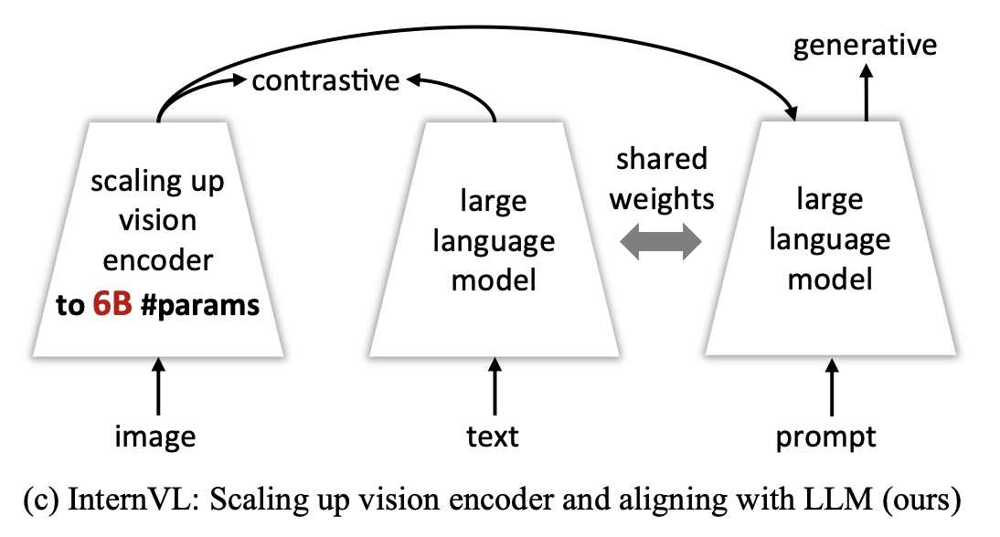
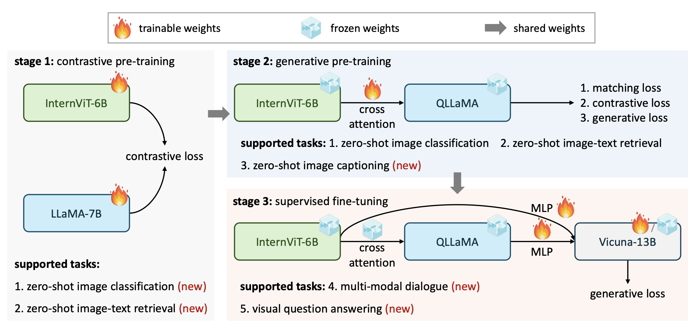
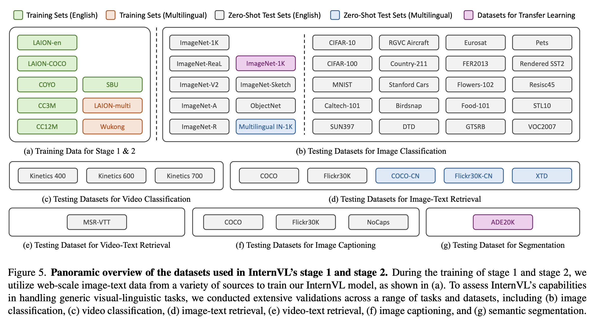

# InternVL 系列 - InternVL v1.0

## 1. InternVL 简介

InternVL 旨在创建一个能够在视觉和语言任务中广泛应用的基础模型，通过大规模视觉编码器和语言模型之间的对齐，克服当前视觉-语言模型存在的跨模态表达不一致性和参数规模不匹配的问题。

## 2. InternVL 的模型架构与关键设计

  

### 2.1 InternViT-6B

InternVL 的视觉编码器基于经典的 Transformer 结构，类似于 ViT（Vision Transformer），但经过了扩展和调整，以支持更大规模的视觉-语言任务。核心组件为一个包含 6B（十亿）参数的视觉编码器“InternViT-6B”，结合了多层堆叠的注意力层与多层感知机（MLP）模块。这种结构能有效捕捉图像的全局特征，同时具备灵活性以适应多任务。

为直观理解这个编码器的架构，可以将其视为一个“编码-映射-解码”的流程：

1. 编码部分：将输入的图像划分为固定大小的图像块（类似于视觉单词），然后利用多个多头注意力层分析这些图像块之间的关系。
2. 映射部分：通过线性变换对图像块进行特征映射，将视觉特征转换为中间表示，方便后续任务进行进一步处理。
3. 解码部分：借助多层感知机模块，将中间表示重新整合，形成可以用于分类、检索或生成任务的视觉特征。

### 2.2 语言中间层 QLLaMA

在 InternVL 的架构中，语言中间层 QLLaMA 扮演着桥梁的角色，将大规模视觉编码器（InternViT-6B）生成的图像特征与大型语言模型整合在一起，以实现高度一致的跨模态特征表示。

**预训练初始化：**QLLaMA 基于多语言 LLaMA 模型（LLM）初始化。LLaMA 在文本特征空间上的强大表达能力为 InternVL 提供了丰富的语言理解基础，使模型能更好地理解和生成多语言文本。论文中提到，通过这样的预训练初始化，QLLaMA 在一开始便能对语言特征做出良好的表示，从而更快地适应多模态任务。

**可学习查询节点与交叉注意力机制：**在 LLaMA 的基础上，QLLaMA 增加了 96 个可学习的查询节点和交叉注意力层。这些查询节点的引入为模型提供了动态调整能力，能够自动关注图像中特定的内容区域，并生成与之关联的特征。**可学习查询节点通过查询图像特征，从视觉编码器生成的特征中提取核心信息；之后，交叉注意力机制对这些特征进行有效整合，将图像内容映射到语言特征空间，使得语言模型能生成更加贴合图像的描述**。相比传统轻量级“胶水”层，这些大规模参数和查询节点增强了特征表达，使模型在多模态对话、图像描述等复杂任务中的表现得以提升。

QLLaMA 在整合视觉编码器生成的图像特征与语言特征时，采用了对比学习和生成学习相结合的策略，以实现特征空间的对齐和任务的生成效果。

图像-文本对齐损失设计：

1. 图像-文本对比损失（Image-Text Contrastive Loss, ITC）：对比损失确保模型对相似图像-文本对生成高相似度分数。具体而言，QLLaMA 通过对比损失学习图像和文本特征，使相对应的图像和文本特征在特征空间中更为接近，从而在检索等任务中可以更高效地匹配图像-文本对。
2. 图像-文本匹配损失（Image-Text Matching Loss, ITM）：匹配损失用于提高模型对图像内容的描述生成能力。QLLaMA 通过将图像特征映射到文本特征空间后，评估生成的文本与目标图像的语义一致性。该损失在多模态对话和生成任务中尤其有效。
3. 图像锚定文本生成损失（Image-Grounded Text Generation Loss, ITG）：QLLaMA 还结合了生成损失，这一损失允许模型在提供图像的基础上生成符合上下文的自然语言描述。例如，模型能够根据图像的内容生成文本描述或回答多模态对话任务中的问题。这种生成式的特征对齐机制使得模型在多模态对话系统中表现卓越。

## 3. 分阶段训练策略详解

InternVL 的训练采用了三个逐步递进的阶段：对比学习、生成式学习和监督微调。这一分阶段训练策略不仅帮助模型稳步提升跨模态特征对齐能力，还能在不同任务上获得更强的泛化性能。

  

### 3.1 阶段一：对比学习

在对比学习阶段，InternVL 利用海量的多语言图像-文本对数据（如 LAION 数据集）进行对齐训练，初步实现视觉特征与语言特征的融合。

该阶段使用的图像-文本数据对来自多种数据源，包括 LAION-en、LAION-multi、COYO、Wukong 等多语言数据集，总数据量高达 6.03 亿对。经过数据清洗后，最终保留了约 4.98 亿对数据用于训练。

在该阶段，InternViT-6B 图像编码器提取图像特征，LLaMA-7B 文本编码器提取文本特征。QLLaMA 通过对比损失（Contrastive Loss）来缩小正确配对的图像和文本特征之间的距离，优化目标是使图像和文本特征在特征空间中尽量靠近。

这一阶段主要采用对称交叉熵损失来对齐图像和文本特征，并在训练过程中引入随机负样本，以增强模型对多样化数据的鲁棒性。

### 3.2 阶段二：生成式学习

在生成式学习阶段，InternVL 连接 QLLaMA 语言中间层进行进一步的生成式训练。这一阶段的目标是提高模型的图像描述和多模态对话生成能力。

相比阶段 1，该阶段使用了更为精炼的数据，仅保留了约 1.03 亿对高质量图像-文本数据，以提高生成效果。

在阶段 1 对齐的基础上，QLLaMA 生成的视觉特征与文本特征一致性更高，因此可用于生成式任务。为此，模型利用以下三种损失函数进行优化：

1. 图像-文本对比损失（ITC）：该损失确保相似的图像和文本特征在特征空间中的距离更小。
2. 图像-文本匹配损失（ITM）：该损失用于提升图像和文本特征的语义匹配效果，帮助模型生成更准确的描述。
3. 图像锚定文本生成损失（ITG）：该生成损失使 QLLaMA 在给定图像的情况下生成合理的文本描述，适用于描述生成、图像问答等任务。

通过生成式学习，InternVL 在生成任务（如图像描述生成、多模态对话等）上的表现得到了显著提升。

### 3.3 阶段三：监督微调

监督微调阶段主要面向特定任务进行优化，将训练后的 InternVL 与现有的 LLM 解码器（如 Vicuna）结合，通过监督学习实现对多模态对话任务的微调。

  

## 4. 总结

InternVL 提出了一种创新的大规模视觉-语言基础模型，通过扩展视觉编码器的参数规模并引入强大的语言中间层 QLLaMA，实现了图像和文本特征的深度对齐。分阶段的训练策略使得 InternVL 在多模态对话、图像描述、图像-文本检索等多种任务中都表现出色。InternVL 不仅达到了多项任务的最先进表现，还展示了多模态对齐的技术潜力，为未来的多模态大模型研究提供了新的思路和改进方向。