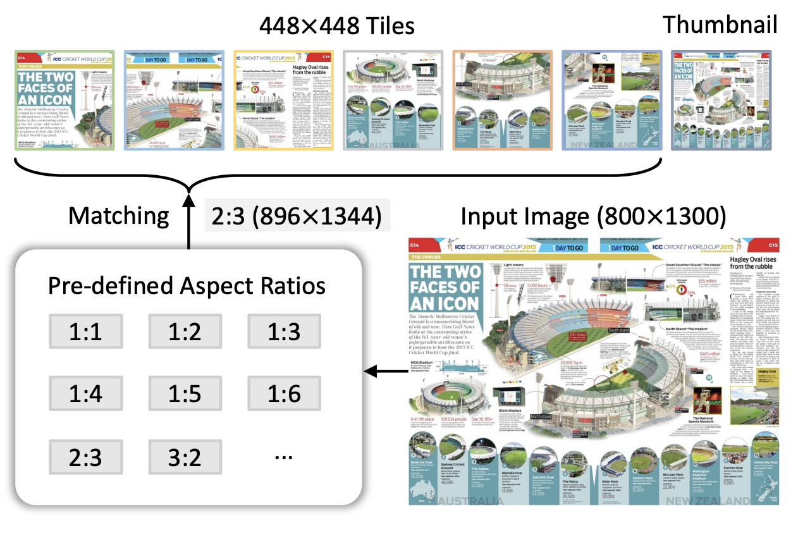

# InternVL 系列 - InternVL v1.5

## 1. 引言

InternVL 1.5 旨在缩小开源与商用多模态模型在视觉语言理解上的性能差距。通过引入高效的视觉编码器、动态高分辨率策略和高质量的双语数据集，InternVL 1.5 显著提升了模型在视觉场景理解和多语言支持方面的表现。相比传统开源模型，InternVL 1.5 更好地适应多样化的图像输入需求，并在 OCR 及中文任务上展现出卓越性能，为多模态领域的开源解决方案树立了新的标杆。

## 2. 核心技术流程

### 2.1 模型架构

InternVL 1.5 采用了先进的 ViT-MLP-LLM 结构，其整体设计融合了视觉编码器（InternViT-6B）和语言模型（InternLM2-20B），通过一个 MLP 投影器实现视觉与语言特征的高效结合。模型的核心在于将视觉编码器提取的视觉特征投射到与语言模型兼容的空间，提升视觉信息在多模态任务中的传递效率。

在此结构中，InternViT-6B 作为视觉编码器，通过处理高分辨率图像切片（448×448 像素）生成视觉特征。这些特征再经过 MLP 投影器处理，映射到适合语言模型的向量空间，并输入到 InternLM2-20B，完成多模态信息的语义理解和生成。这样，InternViT-6B 的视觉特征可以流畅地与 InternLM2-20B 的语言特征融合，实现对图像和文本的精细理解。

### 2.2 动态高分辨率策略

InternVL 1.5 通过动态高分辨率策略来适应不同视觉任务的需求，特别是在文档、图表等需要高分辨率支持的场景中，实现了细节处理与计算效率的平衡。该策略的核心是将输入图像切分成多个 448×448 像素的图像块（tiles），并通过动态选择适合的宽高比，使模型能够保留图像的原始结构和信息。

  

从上图可以看到，动态高分辨率策略分为以下几个步骤：

1. **宽高比匹配：**首先，模型会计算输入图像的宽高比（例如图中的 800×1300），并与预定义的多个宽高比进行匹配。图中显示了多个预定义宽高比选项，如 1:1、1:2、2:3 等。对于 800×1300 的输入图像，最接近的匹配宽高比是 2:3，模型将图像调整到对应的 896×1344 分辨率，以尽量减少拉伸或压缩带来的变形。
2. **图像切片与缩略图生成**：在调整好宽高比之后，模型将图像切分为多个 448×448 的图像块。这样一来，模型可以同时处理多个图像块，从而获取图像的细节信息。此外，为了保持全局上下文，InternVL 1.5 还会生成一个 448×448 尺寸的缩略图，作为全图的概览输入。这一缩略图让模型在关注细节的同时，也能掌握图像的整体布局，确保局部信息与全局语境的结合。
3. **适应多分辨率需求**：在训练阶段，模型通常使用 1 至 12 个图像块，以平衡计算资源和细节处理需求；而在推理阶段，模型可以动态扩展至 40 个图像块（相当于 4K 分辨率），以满足更高精度的需求。通过这种灵活的图像分割和缩略图策略，InternVL 1.5 在处理复杂图像时实现了细节捕捉和整体理解的双重保障。

### 2.3 高质量双语数据集

为提升 InternVL 1.5 在多语言任务（尤其是中文场景）中的表现，研究团队精心构建了一个覆盖多任务的高质量双语数据集。该数据集包含了常见的场景图像、文档图像、以及丰富的英汉问答对，为模型在多模态任务中的跨语言理解和问答能力提供了强大支持。

在数据构建过程中，研究团队采用了自动化数据翻译管道，将大量的英文数据集转换为中文。这一翻译管道利用开源的大语言模型或 GPT-3.5 等先进的翻译技术，在保证语义准确的前提下生成中文标注。这种自动化的数据翻译不仅显著提升了数据构建效率，还确保了英汉两种语言标注的一致性。具体来说，数据集包含多样化的任务类别：

1. 场景理解：涵盖自然场景、生活场景等日常视觉任务的数据，帮助模型在中英文环境下实现场景识别和语义理解。
2. 文档和图表图像：包含文档处理、表格识别、图表理解等任务中的双语数据，确保模型在 OCR 任务中能准确识别和理解中英文文本。这对于处理多语言文档和图表等高分辨率内容至关重要。
3. 问答数据：包含大量的中英文问答对，涵盖常识、科学、地理等多领域内容，使模型在处理跨语言问答任务时能更好地理解上下文并生成准确回答。

通过结合双语数据集和翻译管道，InternVL 1.5 在 OCR 任务和中文场景下表现出色，尤其是在文档识别和场景问答中优于传统开源模型。

## 3. 预训练和微调策略

InternVL 1.5 的训练流程分为预训练和微调两个阶段，以确保模型在多模态任务中的稳定性和广泛适应性。

### 3.1 预训练阶段

在预训练阶段，InternVL 1.5 侧重于优化视觉特征的提取能力。模型使用了大量多样化的图像-文本数据，通过视觉编码器（InternViT-6B）提取高质量的视觉特征，并将这些特征投射到与语言模型兼容的语义空间。为了提升视觉特征的适应性，模型在这个阶段使用了不同类型的图像，包括自然场景、文档和图表，确保在各种视觉任务中都能提取到稳定而有意义的特征。这一阶段的训练为模型提供了坚实的基础，使其在多模态任务中能够保持一致的性能和鲁棒性。

### 3.2 微调阶段

微调阶段采用了更加多样化和有针对性的数据集，以增强模型在特定任务场景中的表现。这些数据集涵盖了场景问答、OCR、科学图表理解等多个任务类别，帮助模型适应在不同应用领域中的多模态任务需求。通过在广泛的任务数据上进行微调，模型获得了更强的任务专注性，能够在特定场景下做出精确的视觉-语言理解和生成。

### 3.3 动态分辨率适应性

在预训练和微调阶段，InternVL 1.5 使用了动态分辨率策略以适应不同任务的分辨率需求。对于需要精细处理的 OCR 任务，模型能够将输入图像分割成多个 448×448 的高分辨率切片，从而在复杂文本和图像细节中实现精确识别；而在不需要高分辨率支持的任务（如常规场景理解）中，模型可以减少切片数量，从而节省计算资源。通过这种动态调整，InternVL 1.5 在实现高精度处理的同时，保持了计算效率的优化，使其能够在广泛的任务场景中表现出色。

## 4. 总结

InternVL 1.5 作为一款开源多模态大模型，通过创新的模型架构、动态高分辨率策略以及高质量双语数据集的支持，成功缩小了开源模型与商用模型在多模态理解上的性能差距。该模型在预训练阶段优化了视觉特征提取，确保了在多模态任务中的稳定性；而在微调阶段，结合多样化的数据集和动态分辨率适应性，大幅提升了其在 OCR、场景问答等复杂任务中的表现。