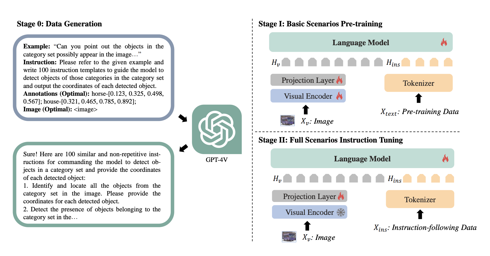

# Griffon 系列 - Griffon v1

## 1. 引言

随着大规模视觉语言模型（LVLMs）在自然语言处理和视觉理解任务中展现出强大的表现，如何使它们具备更细致的对象定位能力成为研究的焦点。然而，现有的 LVLMs 大多局限于识别单一预定义对象，难以在复杂场景中精准定位多个目标。为了解决这一问题，Griffon 引入了一种创新的纯 LVLM 模型架构和语言引导的定位数据集，通过无依赖的输入输出格式和逐步的训练策略，使模型能够在任何粒度下对多种对象进行定位，显著提升了 LVLMs 在多对象场景中的表现。Griffon 不仅在主流的 RefCOCO 和 Flickr30K 等数据集上达到最新的表现，还接近专业模型在 MSCOCO 检测基准上的精确度，为视觉语言任务的进一步融合提供了全新思路。

## 2. 核心技术

### 2.1 模型架构

Griffon 的核心模型架构基于 LLaVA（包括视觉编码器、投影层和语言模型），通过端到端设计在对象定位上实现了精确性和高效性。具体来说，Griffon 采用 ViT-L/14 作为视觉编码器，将图像编码为视觉特征向量，并使用轻量的投影层将特征映射至语言嵌入空间，从而统一图像和文本信息。输入的图像特征与自由格式的文本指令拼接后输入到语言模型（LLama2-13B），从而使模型在不依赖检测头或特定标记的情况下生成精细的目标坐标。


### 2.2 统一输入输出表示

在 Griffon 的设计中，统一输入输出表示的结构显著优化了多目标检测的效率。模型采用了无特殊标记的输入输出格式，将文本指令与图像特征一并输入，输出则包含目标对象的类别标签及其坐标（如 “person-[x1, y1, x2, y2]”）。在多对象场景下，这种表示方式将所有目标通过“&”符号串联，避免了传统模型在多对象定位中逐一推理的繁琐步骤，从而显著减少了重复推理的需求，提高了模型处理多重指令的速度和灵活性。

假设输入图像中包含三个人和两只狗，当用户输入“定位所有人和狗”时，Griffon 的输出可能是：

```plain
person-[0.05, 0.15, 0.2, 0.3] & person-[0.4, 0.5, 0.6, 0.7] & person-[0.7, 0.8, 0.9, 1.0] & dog-[0.2, 0.3, 0.4, 0.5] & dog-[0.6, 0.7, 0.8, 0.9]
```

### 2.3 训练无关的评分机制

Griffon 引入了一种训练无关的置信度评分机制，以提高检测结果的准确性。该评分机制通过计算每个对象的条件概率，为每个检测结果分配一个置信度得分。具体来说，模型根据坐标和标签生成的概率综合计算出定位置信度，使置信度更高的对象在输出中优先级更高。这一机制确保了多目标场景中更可靠的检测效果，减少了误检和漏检的情况，使 Griffon 能够在复杂场景中保持较高的定位精度和稳定性。

假设在前面的多目标检测中，Griffon 对“person-[0.05, 0.15, 0.2, 0.3]”的置信度得分为 0.9，而对“dog-[0.2, 0.3, 0.4, 0.5]”的置信度得分为 0.6。该机制会优先返回置信度较高的检测结果，从而有效避免低质量检测结果的干扰。这种方式确保在多目标场景中能更精准地识别用户关注的高置信度目标，减少误检，提高模型的整体定位精度。

## 3. 两阶段训练策略

Griffon 的训练策略分为两个阶段，以逐步增强其多对象感知能力和对复杂场景指令的理解。

  


### 3.1 基础场景预训练

在第一阶段，Griffon 的训练旨在建立多对象感知的基础能力。这一阶段使用的是大规模、语言引导的定位数据集，涵盖了大量的对象类别和不同场景。模型通过这种预训练数据学会了识别和定位图像中的多个对象，例如同时识别图片中的人、狗和汽车等多种目标。为了增强模型的细致感知，预训练过程中不只训练投影层，而是对整个模型进行优化，使视觉特征中保留更丰富的细节信息，特别是在定位小目标和进行精细辨别时表现更优。这一阶段的目的是为 Griffon 提供可靠的视觉-语言对齐能力和基本的多对象定位能力。

### 3.2 全场景指令调优

在第二阶段，Griffon 进行全场景的指令调优，以便更好地适应用户可能提出的各种复杂指令。在基础场景预训练后，模型已经具备了基本的对象定位能力，但还需要进一步优化以理解多样化的用户需求。为此，该阶段使用涵盖四种定位场景的指令数据，包括单对象、多对象和不存在的目标检测等复杂场景的实例。通过调优，Griffon 学会了在不同指令下精准理解用户意图。例如，当用户指令中描述了一个不存在的对象时，模型会输出“None”，而不是误检出其他无关对象。通过全场景指令调优，Griffon 显著增强了对多对象、复杂场景的理解与适应能力，使其在实际应用中能够有效处理多样化的定位任务。

## 4. 总结

Griffon 通过创新的两阶段训练策略和纯 LVLM 架构，实现了在多对象复杂场景下的精确定位能力。借助语言引导的定位数据集，Griffon 在基础场景预训练中建立了稳固的多对象感知基础，再通过全场景指令调优，使模型能够精准理解用户的多样化需求。在无特殊标记的输入输出格式、统一的标签-坐标表示，以及无依赖的评分机制的支持下，Griffon 不仅大幅提升了 LVLM 在复杂定位任务中的效率和准确性，还达到了与专家模型相媲美的性能。凭借这一创新，Griffon 不仅为多模态视觉任务开辟了新方向，也为 LVLM 在广泛应用场景中的潜力提供了有力支持。
