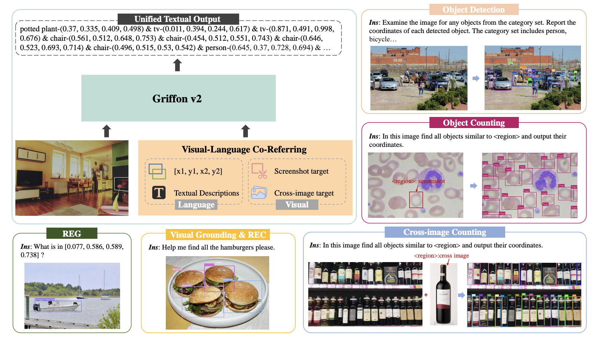
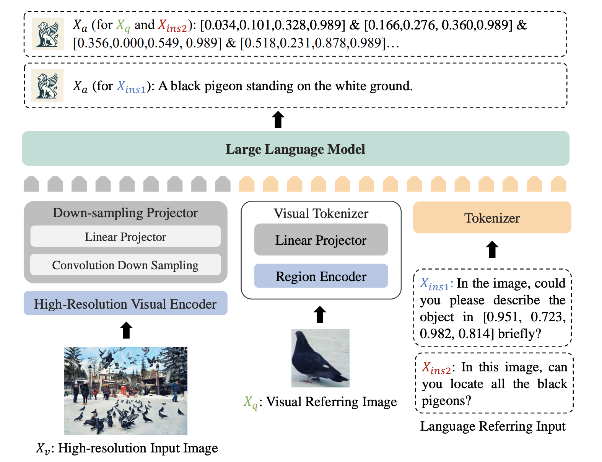
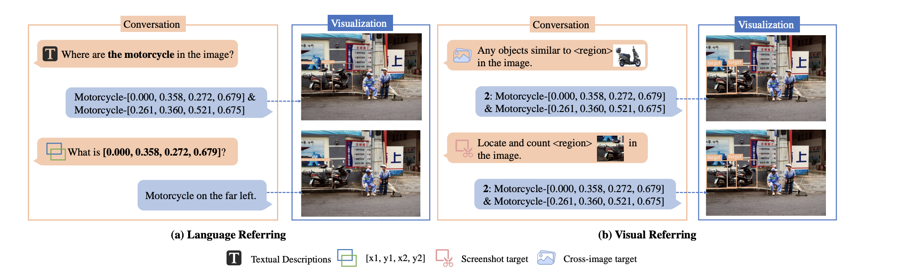

# Griffon 系列 - Griffon v2

## 1. 引言

近年来大规模视觉语言模型（LVLMs）取得了显著的进展，尤其是在细粒度的对象感知任务中展现出强大的表现力。然而，这些模型在应对复杂、密集场景时，往往会因图像分辨率的限制而表现不佳，尤其是在细小物体的识别、精确对象计数等任务上难以超越专用任务模型。低分辨率会导致细节丢失，模型无法充分捕捉场景中的微小特征，进而影响多对象定位的精度和上下文理解能力。

为了解决这一问题，**Griffon v2 提出了一种高分辨率感知的创新架构，旨在突破分辨率限制的瓶颈。它通过支持高分辨率输入，结合视觉-语言联合指代技术，使模型能够灵活处理各种用户指令，无论是文本描述、坐标指定，还是图像截取等指代方式**。这种创新设计不仅显著提升了模型在小物体识别和对象计数等任务中的表现，也为 LVLM 在更广泛的应用场景中发挥作用提供了强大的支持。

## 2 Griffon v2 模型架构

### 2.1 架构简介

Griffon v2 的模型架构专为高分辨率视觉感知和灵活的视觉-语言指代而设计。它通过高分辨率视觉编码器直接提取图像特征，并利用轻量级卷积下采样投影器压缩视觉特征，确保在不分割图像的情况下保持细节。

### 2.2 高分辨率视觉编码器

Griffon v2 的高分辨率视觉编码器基于 Vision Transformer (ViT) 构建，采用了预训练的 EVA2-CLIP-L/14@336 模型，并通过双线性插值扩展位置嵌入，以适应超过 1K 的高分辨率输入。ViT 本身会将输入图像划分为固定大小的图像块（patch），然后为每个图像块提供位置编码，从而确保模型在处理高分辨率图像时，仍然能够保持每个图像块的空间位置信息。这种位置嵌入的插值调整，使 Griffon v2 在支持更大尺寸图像时，仍能准确表达完整的图像上下文信息。

在 Griffon v2 中，双线性插值主要用于调整位置嵌入矩阵的大小，以适应比预训练时更高的图像分辨率，而不直接影响视觉特征的编码或卷积操作。**ViT 模型在预训练时使用固定的图像分辨率和对应的固定位置嵌入矩阵。但 Griffon v2 需要支持更高的分辨率，因此对位置嵌入矩阵进行双线性插值。这一过程会对位置嵌入矩阵进行缩放，使得其大小与高分辨率图像中的图像块数量相匹配**，从而确保每个位置嵌入在新分辨率下仍准确地表示其对应图像块的位置信息。

:::note

Griffon v2 在初始化时通过双线性插值对预训练的 EVA2-CLIP 模型的 位置嵌入矩阵 进行调整，以支持更高分辨率，而不需要每次前向传播时重复插值。这一插值操作是在模型初始化时将位置嵌入扩展到目标分辨率，例如 1022。换句话说其实是不支持动态调整分辨率的。

:::

此外，Griffon v2 引入了卷积下采样投影器，通过一个轻量级的卷积层对从 ViT 编码器输出的高分辨率特征进行压缩。该投影器使用 3×3 的卷积核和步长为 2 的下采样，将视觉特征有效地映射到词嵌入空间中。这一设计在减少冗余特征的同时，保留了细节信息，大大降低了计算成本和内存消耗，从而在多目标检测和细粒度感知任务中实现更高的精度和效率。

## 2.3 语言联合指代机制

Griffon v2 的视觉-语言联合指代机制旨在提供多种用户友好的对象指代方式，支持通过文本、截图和坐标等输入方式来识别和定位目标对象。

### 2.3.1 视觉指代

Griffon v2 使用了预训练的 EVA-CLIP-L/14 模型来处理用户提供的目标截图或视觉区域。模型会将该截图编码为区域特征，并通过线性投影器将这些特征映射到语言嵌入空间。这一机制依赖于 CLIP 的强大语义特征提取能力，以确保视觉参考图像中的对象能够与文本描述一致地表示。最终，视觉提示通过 [CLS] token 表示，帮助模型保持指代的一致性和稳定性。

### 2.3.2 语言指代

Griffon v2 支持文本描述和坐标两种语言指代方式。在文本描述指代中，模型可以接受用户的自然语言输入，以便更灵活地描述图像中的目标。对于坐标指代，模型能够处理给定对象的左上角和右下角坐标，作为描述对象的另一种形式。此坐标信息被转换为文本嵌入，并在嵌入空间中表示对象的位置，从而实现对复杂、密集场景中的对象精准定位

### 2.3.3 联合指代

Griffon v2 在多模态环境中将视觉和语言特征对齐，通过在高分辨率图像上训练大量指令跟随数据，实现灵活交互。这一机制能够处理各种场景的指令，使模型具备适应多样化用户需求的能力。在具体应用中，通过使用 `<region>` 占位符，模型可以在用户指令中引用目标对象的位置或描述，从而实现直观且高效的交互​。

  

## 3. 三阶段训练策略

### 3.1 高分辨率视觉-语言对齐

在第一阶段，模型利用高分辨率图像和文本数据集，将视觉编码器和大语言模型（LLM）进行对齐。这一阶段的目标是确保视觉特征和语言特征之间能够准确匹配，从而为多模态任务提供良好的基础。为了实现这一对齐，Griffon v2 在超过 500,000 对图像-文本对上进行训练，使高分辨率的视觉特征能够顺利映射到 LLM 的嵌入空间，从而在不损失细节的情况下完成多模态信息的融合。

### 3.2 联合多任务预训练

第二阶段是在大规模多任务数据集上进行联合预训练，以增强模型在不同视觉-语言任务中的指代能力。Griffon v2 使用了 1200 万个样本，涵盖多种任务和不同的视觉语言指代场景，包括对象检测、区域表达理解（REC）、短语定位（REG）等。在这一阶段，模型会在大量的视觉和语言任务上接受训练，获得视觉-语言联合指代的能力，同时增强其对细粒度、多目标场景的理解，使其可以在复杂场景中进行精确定位和描述。

### 3.3 用户意图增强调优

在第三阶段，模型通过指令调优来提升对用户意图的理解能力。这一阶段使用了近 90 万条指令数据，通过更丰富的多样化指令来微调模型，使其能够更灵活地响应用户需求。例如，模型在用户的自由文本输入、具体坐标描述等不同指令下准确执行定位和生成描述的任务。通过这种方式，Griffon v2 能够准确捕捉用户的多种意图，为实现更高层次的多模态交互奠定基础。

## 4. 总结

Griffon v2 通过创新的高分辨率视觉编码器和视觉-语言联合指代机制，为多模态感知任务带来了显著提升。其三阶段训练策略使模型在不同的视觉-语言任务中具备了高分辨率下的精细感知能力和强大的多任务处理能力。通过对高分辨率图像和语言特征的对齐、多任务预训练、以及用户意图增强调优，Griffon v2 实现了在复杂场景中对细小物体的精准定位与描述，不仅在对象检测、对象计数等任务上超越了现有的专用模型，也表现出在多模态互动中的卓越表现。