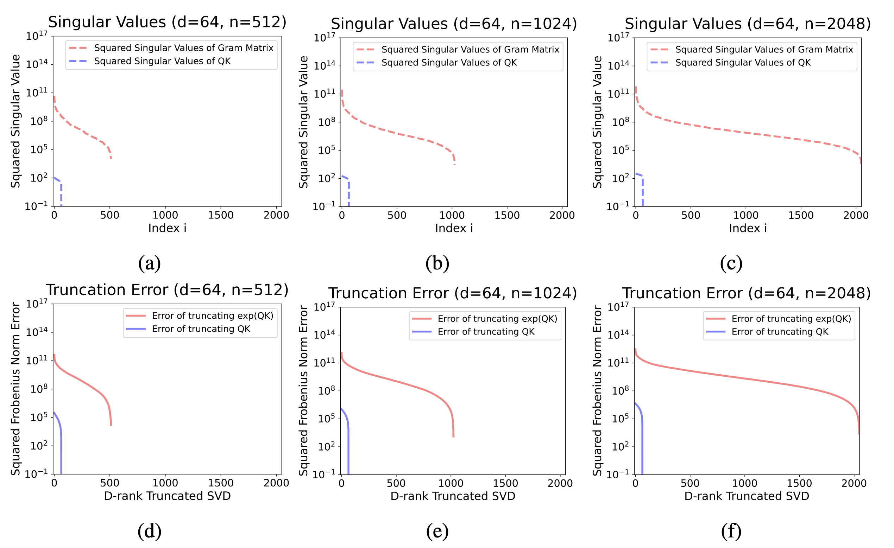
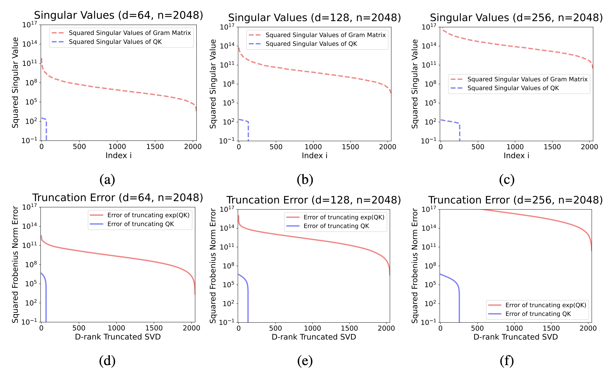

# 线性注意力机制

要理解线性注意力，我们必须先回到标准的 Softmax Attention，看看它为什么是“二次方”的

## 1. Softmax Attention 的“症结”

在标准的 Transformer 里，计算一个 token (比如第 `t` 个 token) 的输出 $y_t$ 时，公式是这样的：

$y_t = \sum_{i=1}^{t} \alpha_{ti} v_i$

这里的 $v_i$ 是第 `i` 个 token 的 Value 向量。关键在于权重 $\alpha_{ti}$，它是这么算的：

$
\alpha_{ti} = \frac{\exp(q_t \cdot k_i)}{\sum_{j=1}^{t} \exp(q_t \cdot k_j)}
$

这个分母 $\sum_{j=1}^{t} \exp(q_t \cdot k_j)$，它意味着，为了计算当前 token `t` 对过去任意一个 token `i` 的注意力权重，你必须把 `t` 的 query ($q_t$) 和 **从 1 到 t 的所有** key ($k_j$) 都点乘一遍，然后求和。当 `t` 增长时，这个计算量就是 $t \times t$，也就是 $O(t^2)$ 的复杂度。这就是“二次方”的根源。

## 2. 线性注意力的“魔法”

线性注意力的核心思想是**打破 Softmax 的耦合**。它通过一个巧妙的数学变换，避免了那个必须遍历所有 key 的分母。

这个魔法就是如下公式：

$\exp(q_t \cdot k_i) \approx \phi(q_t)^T \phi(k_i)$

这里 $\phi$ 是一个特征映射函数（feature map），可以把它理解成一个能把向量“变身”的函数。这个近似的核心作用是**把 $q_t$ 和 $k_i$ 的计算分离开**。这个近似能不能做好，直接决定了线性注意力的效果。他的具体构造如下：

$\phi(x) = [\exp(w_1^T x), ..., \exp(w_{D/2}^T x), \exp(-w_1^T x), ..., \exp(-w_{D/2}^T x)]$

这里的 `x` 可以是 query 向量 `q` 或者 key 向量 `k`。我们来一步步拆解这个公式：

公式的核心部分是 $w_i^T x$。这里的 $w_i$ 是一个可学习的权重向量 (learnable weights) 。$w_i^T x$ 是一个点积运算，从几何上讲，它是在计算向量 `x` 在 $w_i$ 这个“方向”上的投影长度。你可以把它想象成**从不同的角度去观察和度量**这个输入向量 `x`。

计算出投影值之后，函数对它取了指数，也就是 `exp()`。这是关键的非线性变换。为什么要用 `exp`？因为它正是 Softmax Attention 里的核心元素，使用它有助于更好地**模仿** Softmax 的行为。

你可以注意到公式很有趣，它不仅包含了 $\exp(w_i^T x)$，还包含了 $\exp(-w_i^T x)$。这意味着，它同时考虑了 `x` 在 $w_i$ 方向上的“正向投影”和“反向投影”。这大大增加了特征的表达能力，使得 $\phi(x)$ 能够捕捉更复杂的信息。

最后，把这 $D/2$ 组正向和反向的结果拼接在一起，就得到了一个 $D$ 维的新向量 $\phi(x)$。这个新向量就是 `x` 经过“变身”之后的高维特征表示。

这些用于“投影”的“方向向量”$w_i$ 不是固定的，而是模型的参数。在训练过程中（比如通过知识蒸馏），模型会**自动学习**出最优的 $w_i$ 集合，使得 $\phi(q)^T \phi(k)$ 能够最好地近似真实老师模型（比如 Llama）的 $\exp(q \cdot k)$ 的值。

现在我们看看应用了这个魔法之后，输出 $y_t$ 的计算（同样先忽略分母）变成了什么样：

$y_t \approx \sum_{i=1}^{t} \phi(q_t)^T \phi(k_i) v_i$

注意看，对于这个求和来说，$\phi(q_t)^T$ 是一个**公共项**，因为它不随 `i` 的变化而变化。根据线性代数的乘法分配律，我们可以把它提取出来：

$y_t \approx \phi(q_t)^T \left( \sum_{i=1}^{t} \phi(k_i) v_i^T \right)$

括号里的那部分 $\left( \sum_{i=1}^{t} \phi(k_i) v_i^T \right)$ 也就是**隐状态矩阵 $H_t$**。这个 $H_t$ 是过去所有 Key-Value 信息（经过 $\phi$ 变换后）的**累加和**。最妙的是，这个矩阵可以**循环更新** (recurrently)：

$H_t = H_{t-1} + \phi(k_t)v_t^T$

我们可以简单推导一下，很好理解的：

1. 初始时，$H_1 = \phi(k_1)v_1^T$。
2. 当 `t=2` 时，$H_2 = H_1 + \phi(k_2)v_2^T = \phi(k_1)v_1^T + \phi(k_2)v_2^T$。
3. 当 `t=3` 时，$H_3 = H_2 + \phi(k_3)v_3^T = \phi(k_1)v_1^T + \phi(k_2)v_2^T + \phi(k_3)v_3^T$。
4. 以此类推，直到 `t`。

也就是说，在计算第 `t` 步时，你根本不需要知道 $k_1, k_2, ..., k_{t-1}$ 具体是什么，你只需要拿到上一步的 $H_{t-1}$，然后把当前这一步的新信息 $\phi(k_t)v_t^T$ 更新上去就行了。

这样，线性注意力把 $O(t^2)$ 的计算变成了：

1.  用当前的 $(k_t, v_t)$ 更新一下 $H_t$ （常量时间）。
2.  用当前的 $q_t$ 去查询 $H_t$ （常量时间）。

这样一来，每一步的计算和内存都变成了**常量**，因为它只需要维护一个固定大小的矩阵 $H_t$ 就行了，再也不需要那个无限增长的 KV Cache 了。

## 3. 代价是什么

话说回来了，那么代价是什么呢？

### 3.1. 记忆冲突与信息模糊 (Memory Collisions)

线性注意力的核心操作是把所有过去的信息 Key-Value 对 $(k_i, v_i)$ 压缩累加到一个固定大小的隐状态矩阵 $H_t$ 中。问题在于，不同的 key 向量在经过 $\phi$ 映射后，可能并不是完全正交的。当它们被“叠加”在一起时，它们的信息就会互相干扰。

这就好比你把多张半透明的照片叠在一起。虽然能看到一个大概的轮廓（整体上下文），但每张照片独有的细节就会彼此覆盖、变得模糊不清。

### 3.2. 有损的低秩近似

线性注意力的效果不好，是有其深刻的数学原因的。线性注意力本质上是在用一个“低秩”（low-rank）矩阵去近似标准 Softmax Attention 中那个“无限秩”（infinite-rank）的指数点积核。

有文献证明，Softmax Attention 的那个指数核（Gram 矩阵）的奇异值下降得非常缓慢。这意味着，信息分布在很多个维度上，很难用少数几个维度（也就是“低秩”）来完美代表。要想得到一个还算不错的近似效果，可能需要一个维度非常高的隐状态 $H_t$。

  

这个图在回答一个问题：“信息的重要性”是集中还是分散？

- X 轴 (Index i)：代表奇异值的重要性排名，从左到右，从最重要到最不重要
- Y 轴 (Squared Singular Value)：代表该排名的奇异值有多“重要”（能量有多大）。Y 轴是对数坐标，意味着数值差异被极大地缩小了
- 橙色线 (exp(QK))：代表我们真正关心的 Softmax Attention 核心矩阵
- 蓝色线 (QK)：只是一个对比基准，代表没有经过 exp 的普通矩阵

奇异值 (Singular Value) 你可以把它通俗地理解成一个矩阵中“信息的重要性”或“能量”在不同方向上的分布。一个大的奇异值对应一个主要的信息方向。

我们可以看到蓝色线（QK）掉得非常快。这说明它的信息高度集中在前面少数几个奇异值上。你只需要保留前面一小部分（比如前 50 个）最重要的奇异值，就能抓住这个矩阵的绝大部分信息。它容易被压缩。

橙色线（exp(QK)）掉得非常非常慢，这意味着，没有少数几个“绝对核心”的奇异值，大量靠后的、看似不那么重要的奇异值，其实也包含了不可忽略的信息。信息是“雨露均沾”地分散在很多个维度上的。它很难被压缩。

  

这个图在回答一个更实际的问题：如果我强行压缩，会损失多少信息？

- X 轴 (D-rank Truncated SVD)：代表你允许使用的“关键维度”数量，也就是你压缩后的“秩 D”。
- Y 轴 (Squared Frobenius Norm Error)：代表压缩后损失的信息总量，也就是“近似误差”。误差越小，说明近似得越好。

蓝色线（QK）的误差迅速降低，也就是说随着你增加 D（允许使用的关键维度变多），蓝色线的误差迅速下降到几乎为零。这再次说明，它很容易被近似。

橙色线（exp(QK)）的误差居高不下，这意味着即使 D 已经很大了（比如 X 轴走到了 500），橙色线的误差依然非常高。  这说明，即使你用了 500 个维度去近似它，损失的信息量依然是巨大的。要想让误差降下来，你必须使用非常非常大的 D 值，几乎要接近原始矩阵的完整维度。

这就让线性注意力陷入了一个两难境地。如果为了效率，把隐状态的维度 $D$ 设得很低，那么近似误差就会很大，模型效果就差。但如果为了效果，把维度 $D$ 提得很高，那计算和内存开销又上去了，在一定程度上违背了使用线性注意力的初衷。

### 3.3. 上下文学习能力下降

这是大模型一个很神奇的能力，你给它几个例子（比如 “苹果 -> 红色，香蕉 -> 黄色”），它就能学到规律，然后正确回答“葡萄 -> 紫色”。这需要模型能精确地记住并分析你在上下文中给出的示例。

由于记忆模糊的问题，线性注意力模型很难精确无误地提取和存储这些上下文中的示例，导致其在这类需要“现学现卖”的任务上表现明显落后于标准 Transformer。

## 参考文献

[1] Katharopoulos, A., Vyas, A., Pappas, N., & Fleuret, F. (2020). Transformers are RNNs: Fast autoregressive transformers with linear attention. In International conference on machine learning.
[2] Choromanski, K. M., Likhosherstov, V., Dohan, D., et al. (2020). Rethinking attention with performers. In International Conference on Learning Representations.
[3] Zhang, M., Bhatia, K., Kumbong, H., & Re, C. (2024). The hedgehog & the porcupine: Expressive linear attentions with softmax mimicry. In The Twelfth International Conference on Learning Representations.
[4] Eckart, C., & Young, G. (1936). The approximation of one matrix by another of lower rank. Psychometrika, 1(3), 211-218.