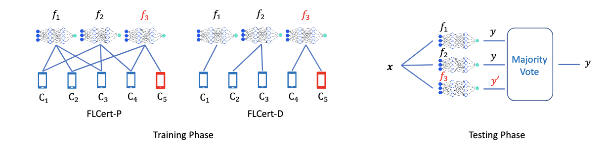

# 针对中毒攻击的可证明安全联邦学习《FLCert: Provably Secure Federated Learning against Poisoning Attacks》

:::tip

:::

## 初识

由于其分布式性质，联邦学习容易受到 `poisoning attack`，即恶意客户端通过操纵其本地训练数据和/或发送给云服务器的本地模型更新来 `poisoning` 训练过程，从而使毒化后的全局模型对许多无差别的测试输入或攻击者选择的输入进行错误分类。现有的防御主要利用拜占庭鲁棒联邦学习方法或检测恶意客户端。然而，这些防御没有针对 `poisoning attack` 的可证明安全保证，并且可能容易受到更高级的攻击。 本篇文章提出了 `FLCert`，一个集成联邦学习框架，它能够在有限数量的恶意客户端存在的情况下对毒化攻击提供可证明的安全性保证。我们的主要思想是将客户端分成组，在使用任何现有的联邦学习方法为每个客户端组学习全局模型，然后在全局模型中进行多数投票来对测试输入进行分类。具体而言，文章考虑两种将客户端分组的方法，并相应地提出了两种变体 `FLCert-P` 和 `FLCert-D`，即随机对每个组的客户端进行抽样和确定性地将客户端划分到不相交的组中。

:::tip

有一篇论文的思路和这篇相似也是用分组众投的方式去抵抗中毒攻击，但是这篇给出了可证明的安全保证，并且提出了两种不同的分组方式。

:::

总结一下，这篇论文主要有3个贡献点

- 提出了FLCert，这是一个具有可证明抗中毒攻击安全保证的FL框架。具体而言，FLCert-P提供概率安全保证，而FLCert-D提供确定性保证。证明了我们推导出的认证安全级别是紧密的。
- 提出了一种随机化算法来计算FLCert-P的认证安全级别。

## 相知

  

上图中展示了 `FLCert`，其中有n=5个客户端和N=3个组。在 `FLCert-P`中，每个组包含从n个客户端中随机抽样的k=3个客户端，而在`FLCert-D` 中，客户端被分成了N个不相交的组。我们将N个组表示为G1、G2、...、GN。我们使用一种确定的基础FL算法为每个客户组学习全局模型。我们确定基础FL算法，以便我们可以推导出 `FLCert` 的可证明安全性。由于 `FLCert` 有 N 个组，因此总共学习 N 个全局模型。`FLCert` 将 N 个全局模型组合起来，以预测测试输入的标签。具体而言，`FLCert` 在 N 个全局模型中进行多数投票，以预测测试输入的标签。

### 如何进行分组

FLCert将客户端分配到N个组中。考虑到可证明的安全性以及通信/计算开销，分组应满足两个限制条件：

1. 恶意客户端应影响少量的组，这使得FLCert能够对更多的恶意客户端保持安全，

2. 客户端应属于少量的组，这降低了客户端的通信和计算开销。为了满足这两个限制条件，本文提出了两种将客户端分组的方法，对应于 `FLCert` 的两种变体，即 `FLCert-P` 和 `FLCert-D`。具体而言，在 `FLCert-P` 中，我们随机抽样k个客户端作为一组。在 `FLCert-D` 中，我们使用客户端用户 ID 的哈希值将 n 个客户端分成 N 个不相交的组。

:::tip

安全等级的含义是 `FLCert` 可以容忍的最大恶意客户端数量。 本文还对 `FLCert-P` 和 `FLCert-D` 的安全等级进行了公式推导

:::

## 回顾

总体来说，文章的新颖程度并不是很高，方法也是以前论文已经有的方法。但是给出了安全等级的公式推导过程，能在其基础上进行探索的空间很少。

