# 物理世界中的目标检测攻击

## 简介

### 什么是攻击目标检测网络 

攻击目标检测网络，简单来说就是让一个功能正常的目标检测器无法出来受到干扰的图片中的物体。最常见的产生干扰的方式有两种。一种是对图像的原图的像素进行修改，修改后的图片对于人眼来说和原图没有太大区别，但是目标检测网络却无法正常的进行检测。另一种方法是在图像的物体上贴上特制的贴片 (patch)，贴上了贴片的物体无法被正常的检测出来。

### 如何攻击物理世界中的检测器

想要攻击物理世界中的目标检测网络，就需要攻击的方式在物理世界中能够复现出来。所以像攻击分类网络那样去扰动输入图片像素的方式就不可行，目前攻击物理世界中目标检测器的主流方式是生成一个通用的对抗性贴片(adversarial patch)，然后通过将贴片打印出来的方式去攻击物理世界中的目标检测器，如下图 [1] 所示：

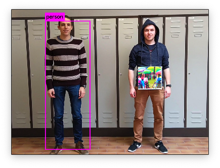

## 攻击物理世界中的检测器

### 生成对抗性贴片

想要攻击物理世界中的检测器，我们就需要生成一张具有攻击性的贴片 (patch)。一般我们使用`梯度下降`的方式去生成对抗性贴片；下图 [1] 能够比较具体的描述patch的生成过程：

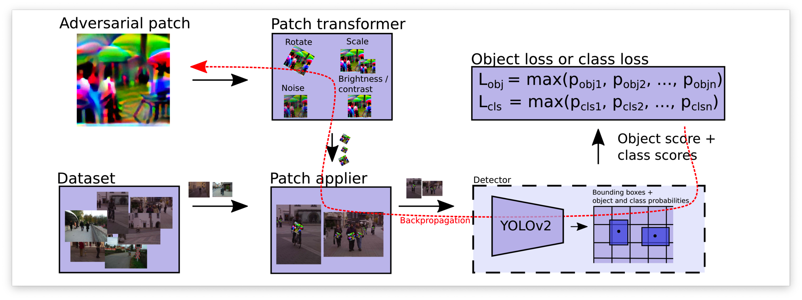

想要生成对抗性贴片我们首先需要一个被攻击的目标检测器（图中的YOLOv2），接下来我们就可以生成对抗性贴片了。在生成之前我们先随机生成一张贴片，在每一轮的训练当中将贴片贴在数据集的人的身上，然后送入到目标检测网络中进行预测，根据预测的结果去计算损失函数，然后根据损失函数去反向传播更新对抗性贴片的像素值。注意在更新的过程中所有的操作都被计算图当中，目标检测器的网络参数需要冻结；

### 物理世界中的攻击

由于贴片的这种方式可以通过打印的方式迁移到物理世界当中，有很多研究都会附上物理世界中的攻击效果；

在Thys 等人的研究中[1]，他们直接将贴片打印出来挂在身体上来攻击物理世界中的检测网络，也就是第一张图片显示的效果。在后续的研究中Wu等人的研究 [2] 中将贴片直接打印在衣服上制造出了伪装性更好的adversarial patch。

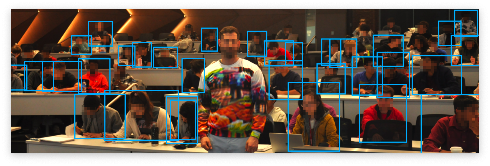

也有研究发现衣服上的图片可能会在走路的过程中变形，进而导致攻击力下降。在此基础上他们提出了TPS损失函数去优化物理世界中的攻击力；

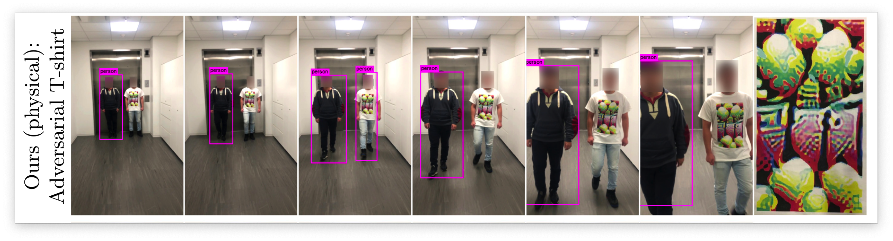

除了攻击行人目标检测网络之外，也有研究去攻击其他目标比如限速标还有红外检测下的目标检测器。清华大学有一篇文章就是去红外下的目标器，他们利用了小灯泡的发热去排列组合图形（我尝试去复现了他们的思路，但是不知道为什么攻击成功率远远达不到论文的标准，可能是我的代码哪里写的有问题）。

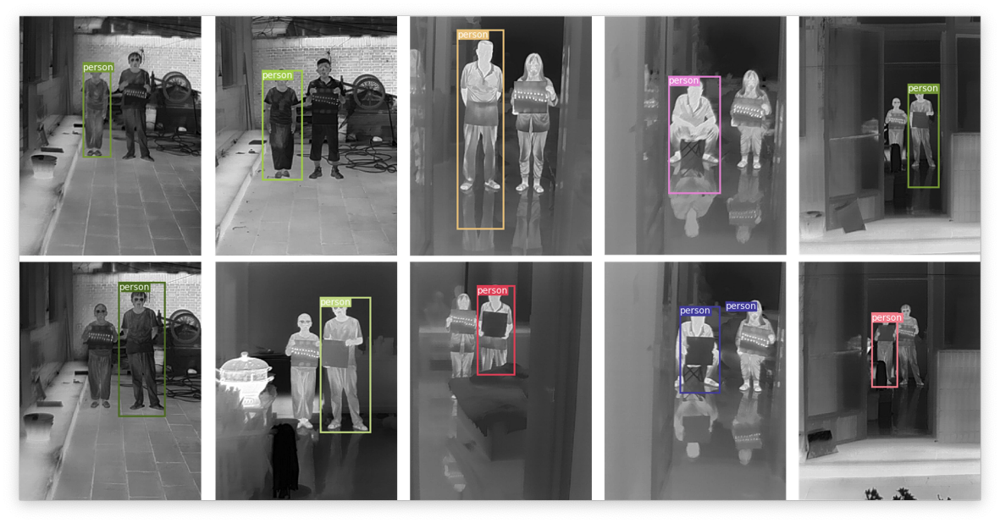

还有的研究是制造出了具有对抗性的路标，能够让目标检测网络无法正确地识别：

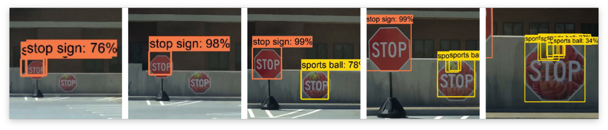

除了攻击路标之外还有研究 [6] 通过伪造假的车牌攻击车牌的OCR系统，伪造后的车牌可以让OCR系统误识别为其他车牌。

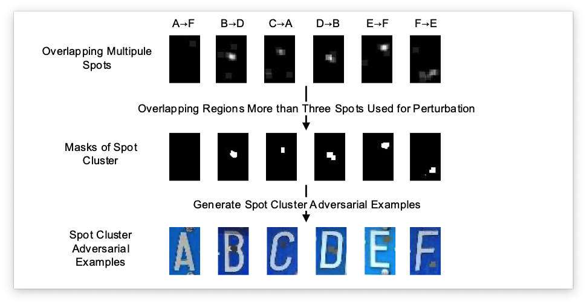

当下攻击物理世界目标检测的研究主要可以分为以下几个方向：

1.   增加攻击成功率
2.   增加在物理世界中的伪装性（看起来很“正常”的路标 [5]，看起来很“正常”的衣服 [2, 3]，化妆，车牌误识别 等）
3.   攻击不同视角下的目标检测器（摄像机从不同的角度拍摄都可以成功攻击 [3, 5]）
4.   攻击不同场景下的目标检测器（红外摄像机 [4] ，OCR车牌识别 [6] ，车道线识别 等）
4.   提高生成对抗性贴片的速度（现在生成一个对抗性贴片需要几天的时间才能生成好）
5.   占坑类型（现在坑基本都没了，比如攻击Zeroshot的目标检测器）

## 优化物理世界中的攻击性

这一个小结介绍一下目前的研究中优化物理世界中攻击性的方法

### 打印机色域不足

如果直接把patch打印下来，打印机的色域很有可能无法正常的显示，生成的图像是RGB色域的，但是打印机彩印使用的颜色空间一般是CMYK色域，两者的色域转换会产生一定的色差。[1] 中使用的解决方法是用一个损失函数来约束生成的patch在打印机的色域范围内，损失函数项如下：
$$
L_{n p s}=\sum_{p_{\text {patch }} \in p} \min _{c_{\text {print }} \in C}\left|p_{\text {patch }}-c_{\text {print }}\right|
$$
 $p_{\text {patch }}$ 是贴片 $P$ 上的像素， $c_{\text {print }}$ 是可印刷颜色集合 $C$ 中的颜色. 这个损失函数让生成的贴片上的像素尽可能的接近可印刷颜色的集合；

### 衣服变形

很多的工作[1-3]都是将对抗性贴片贴在衣物上，但是贴在衣服上的图像在人走动的时候很有可能变形，这就导致了攻击性的下降。在 [3] 的工作中将TPS变换运用到生成对抗性贴片的过程中从而增加了其在物理世界中的攻击性；

想要理解[3]这篇工作的工作流程，首先需要了解什么是TPS变换。仿射变换可能很多人都知道，它的原理是根据坐标点映射的方式将图案去变换到一个新的视角上。TPS变换的效果和仿射变换的原理很相似，它在确认了需要变换的坐标点后会使用两个平滑函数对坐标进行采样从而达到更好的映射效果。

我们还需要知道这篇论文的数据集是什么样的，这篇论文并没有使用COCO或者VOC这样的数据集，而是使用自己制作的数据集。这是因为在他们的工作中需要使用TPS的变换点，为了得到有TPS变换点的数据集他们让人穿上有黑白棋牌格的衣服，根据黑白棋盘格的坐标来获取TPS算法需要的变换点，如下图 [3]所示：

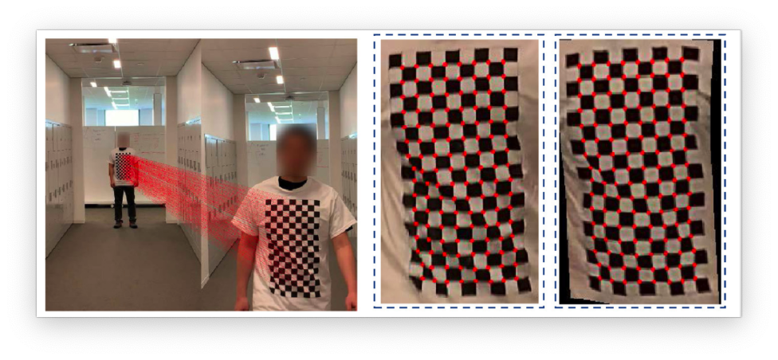

了解了TPS变换和他们使用的数据之后就可以看懂下面的攻击流程图了，[3] 这篇工作的主要创新点就在于TPS变换和他的数据集。他们的Baseline生成流程还是和 [1, 2] 中的生成流程是一样的。

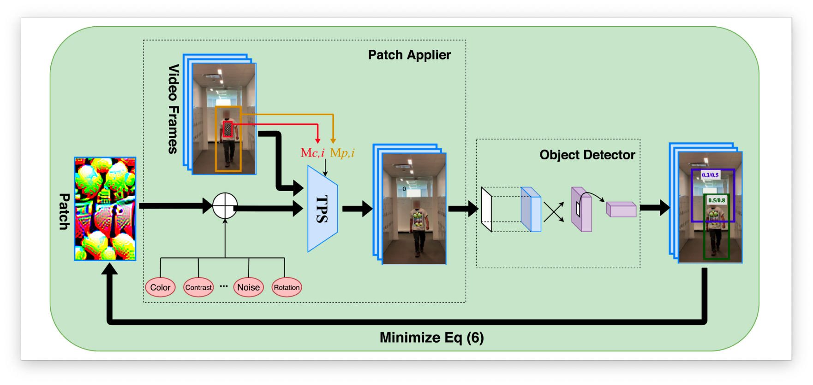

图中很详细的说明了生成流程；首先，将一个穿着印有棋盘图案 t 恤的人的视频帧作为训练数据。然后会经过很多种不同类型的转换，最后对抗性贴片将会被贴在人的身上。通过最小化属于“person”类的预测概率优化对抗性贴片（将person类的预测置信度作为生成patch时的损失函数），之后通过反向传播去更新patch的像素值；

### 红外系统下的攻击

除了正常RGB色域下的目标检测，红外系统下的目标检测也应用的非常广泛。由于红外系统下无法用颜色去构造出贴片，我们就只能用发热的物体去构建patch。[4] 中利用了小灯泡的发热去构建 patch，下图是他们的物理设备：

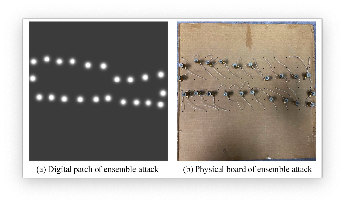

为了模拟这样的效果 [4] 中用一个个的二维高斯分布来模拟小灯泡在红色设备下的成像情况。在进行生成patch的时候将高斯分布的中心坐标点加入到优化器当中以此来生成具有攻击性的patch，下图是 [4] 中生成贴片的过程。

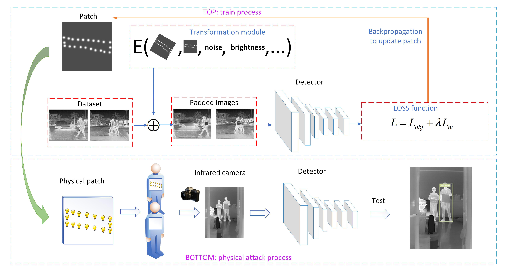

:::tip

大伙画的流程图都大差不差，其实现在主要生成patch的方法就是使用梯度下降的方法去生成

:::

### 不同角度下的攻击

​		对于攻击检测路标的神经网络，在实际场景下车辆驶过路标的时候，看路标看到的是多角度的。想要在物理世界中攻击成功就要求从不同角度看都需要具有攻击性；[5, 7] 中就生成了在不同视角下都具有攻击性的路标；

### 攻击OCR系统（车牌）

​		在 [6] 的工作当中，他们成功的攻击了物理世界中的车牌识别系统，下图概述了他们的攻击流程：

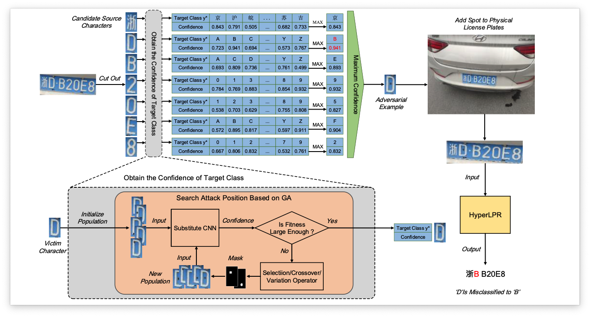

在 [6] 的工作中他们将攻击车牌识别系统看做一个黑盒系统，在无法获取模型参数的情况下，就无法通过反向传播的方式去优化。因此他们将使用了遗传算法GA去进行优化，目标函数如下：
$$
\begin{aligned}
&\underset{a, b}{\arg \max } f_{y^{*}}(X \odot(J-M(a, b, r))+M(a, b, r) \cdot \delta) \\
&\text { s.t. } \quad a \in\left[0, X_{a}-r\right], b \in\left[0, X_{b}-r\right]
\end{aligned}
$$
其中 $X$ 是输入图像，$M(a, b, r)$ 是一个掩码这个掩码的大小和 $X$ 是一样的，掩码中白色的区域的左上角坐标点是$(a, b)$ 右上角点是 (a + r, b + r) 的图像区域；$\delta$ 控制了扰动的幅度。 $X_a$ 和 $X_b$ 代表了原图的长和宽，$J$ 代表了所有大小为 $X_{a} \times X_{b}$ 的矩阵。 $f (\cdot ) $ 表示一个CNN的分类器， $y^*$ 是目标类别。简单来说优化的目标就是让CNN对于输出物体产生错误的类别，实现一个类别误导攻击；

## 未来研究趋势

本文文章中简单的介绍了当前一些攻击目标检测网络的工作，在 [adversarial list](https://nicholas.carlini.com/writing/2019/all-adversarial-example-papers.html) 当中每天都有将近5篇可信机器学习的文章更新出来（Arxiv上又多了5篇可信机器学习的文档）；在大致的看了2021-2022年攻击了目标检测网络的工作之后发现大家主要在做的事情可以分为几类：

-   增加在物理世界中的攻击性和隐蔽性（打印在衣服上，不同角度都有攻击性）
-   将攻击目标检测器应用在特定场景下（自动驾驶，路标检测，车牌检测等）
-   增加贴片的攻击性（将强力的攻击分类网络的算法应用在目标检测网路上，从频率角度去增强攻击算法等，用生成网络去生成patch）
-   针对目标检测网络的后门攻击
-   防御目标检测网络攻击（主要是用将patch检测出来的方法）

可以看出来能做的点还是非常多的（私货：希望研究生期间能继续做对抗性攻击这块，这块的文章思路真的很有意思，有时候真的佩服那些脑洞那么大的作者 ）

## 参考文献

[1] Thys, Simen, Wiebe Van Ranst, and Toon Goedemé. "Fooling automated surveillance cameras: adversarial patches to attack person detection." *Proceedings of the IEEE/CVF conference on computer vision and pattern recognition workshops*. 2019.

[2] Wu, Zuxuan, et al. "Making an invisibility cloak: Real world adversarial attacks on object detectors." *European Conference on Computer Vision*. Springer, Cham, 2020.

[3] Xu, Kaidi, et al. "Adversarial t-shirt! evading person detectors in a physical world." *European conference on computer vision*. Springer, Cham, 2020.

[4] Zhu, Xiaopei, et al. "Fooling thermal infrared pedestrian detectors in real world using small bulbs." *Proceedings of the AAAI Conference on Artificial Intelligence*. Vol. 35. No. 4. 2021.

[5] Chen, Shang-Tse, et al. "Shapeshifter: Robust physical adversarial attack on faster r-cnn object detector." *Joint European Conference on Machine Learning and Knowledge Discovery in Databases*. Springer, Cham, 2018.

[6] Qian, Yaguan, et al. "Spot evasion attacks: Adversarial examples for license plate recognition systems with convolutional neural networks." *Computers & Security* 95 (2020): 101826.

[7] Eykholt, Kevin, et al. "Robust physical-world attacks on deep learning visual classification." *Proceedings of the IEEE conference on computer vision and pattern recognition*. 2018.

