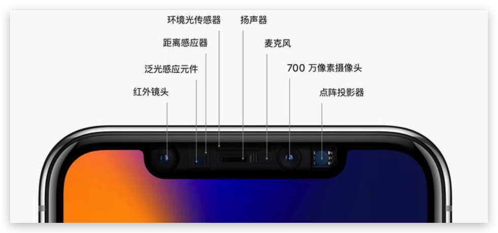
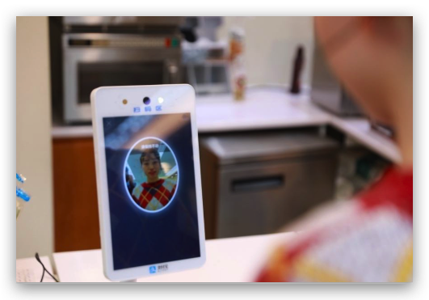

# 多模态对抗攻击「人脸识别」

## 手机厂商人脸识别算法调研

### 苹果 Apple

苹果的FaceID算是所有手机里面最有名的人脸识别算法了，苹果的人脸识别算法是基于3D结构光来做的，每次进行扫脸的时候都会有非常多的红外点映射到你的脸上，下面是苹果官方介绍FaceID的描述:

用于实现面容 ID 的技术是我们迄今为止开发出的一些最先进的硬件和软件。原深感摄像头会通过投射并分析成千上万个不可见的点来捕获准确的面部数据，进而创建您面部的深度图；另外它还会捕获您面部的红外图像。A11 芯片、A12 仿生芯片、A12X 仿生芯片、A13 仿生芯片、A14 仿生芯片和 A15 仿生芯片的神经网络引擎有一部分安全存放于安全隔区中，它会将深度图和红外图像转换为数学表示形式，然后再将这个表示形式与注册的面部数据进行对比。(好像都直接不用RGB了)

  

### 华为 Huawei

华为官方描述："3D 人脸识别，采集更多面容信息，识别更安全，更准确。采用 TOF 3D 超感技术，暗光也能识别人脸。"

TOF 3D超感技术就是通过发射近红外光，传感器计算红外光与目标触达返回时间差，从而实现立体视觉

### 算法总结

除了苹果和华为之外，很多厂商都是使用的**3D结构光**以及**TOF**去进行手机的人脸识别。苹果现在还是使用的3D结构光来完成FaceID， 除了手机解锁，3D结构光还被广泛用于刷脸支付、智能安防、空间扫描、机器人交互、商用屏显、体感游戏等领域，具有广阔的市场空间。例如在刷脸支付领域，国内3D传感企业奥比中光自主研发的3D结构光摄像头，为**支付宝**、**中国银联提供模组**支持，通过3D人脸识别，可以实现快速安全便捷支付，目前刷脸支付设备已经成功落地全国。

  

:::tip
所以说当下3D人脸识别以及逐渐普及，并且广泛的应用在了非常广泛的领域里面，如果能够攻击基于3D结构光的人脸识别算法，那么将会对当下的手机市场造成非常大的威胁
:::

## 3D 结构光人脸识别

