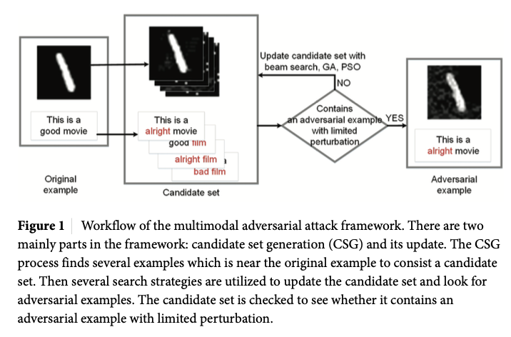
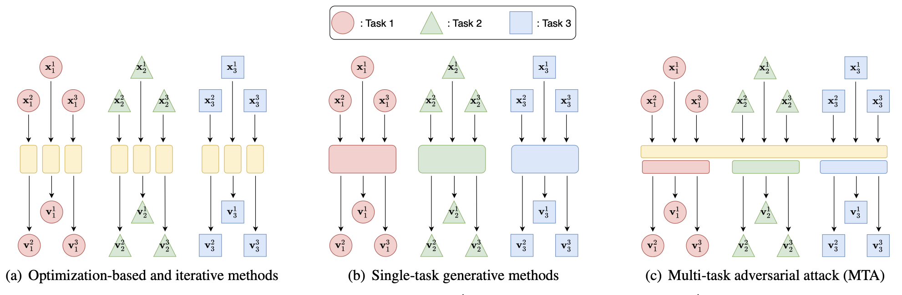

# 多模态对抗攻击「论文记录」

`A Multimodal Adversarial Attack Framework Based on Local and Random Search Algorithms`

The proposed framework firstly generates candidate set to find the substitution words or pixels and generate candidate adversarial examples. Secondly, the framework updates candidate set and search adversarial examples with three local or random search methods [beam search, genetic algorithm (GA) search, particle swarm optimization (PSO) search].

`Adversarial robustness and attacks for multi-view deep models`

 This paper proposes two strategies, two-stage attack (TSA) and end-to-end attack (ETEA), to attack against well-trained multi-view models.  The main idea of TSA is to **attack the multi-view model with adversarial examples generated by attacking the associated single-view model**, by which state-of-the-art single-view attack methods are directly extended to the multi-view scenario. **Then we further propose the ETEA strategy where the multi-view model is provided publicly.** The ETEA is applied to accomplish direct attacks on the target multi-view model, where we develop three effective multi-view attack methods. 

`Multi-Task Adversarial Attack`

To this end, we propose Multi-Task adversarial Attack (MTA), a unified framework that can craft adversarial examples for multiple tasks efficiently by leveraging shared knowledge among tasks, which helps enable large-scale applications of adversarial attacks on real-world systems.

