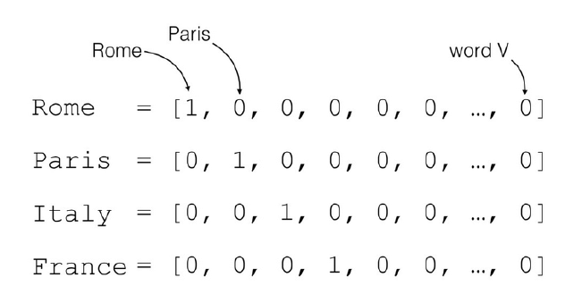
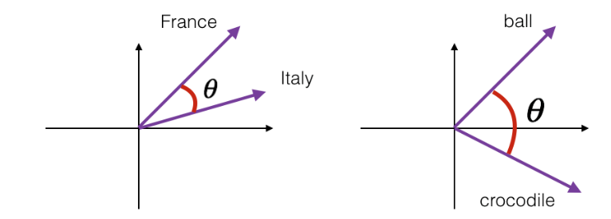
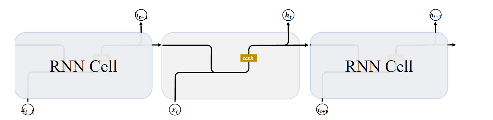
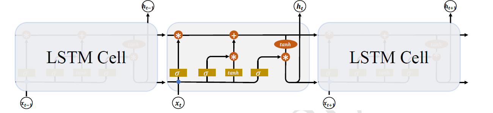
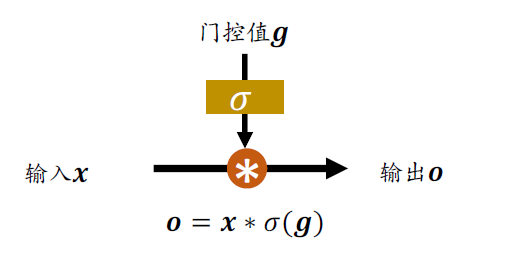
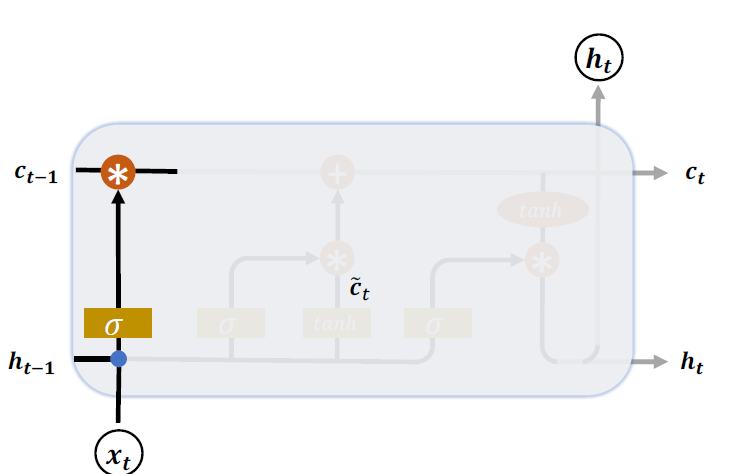
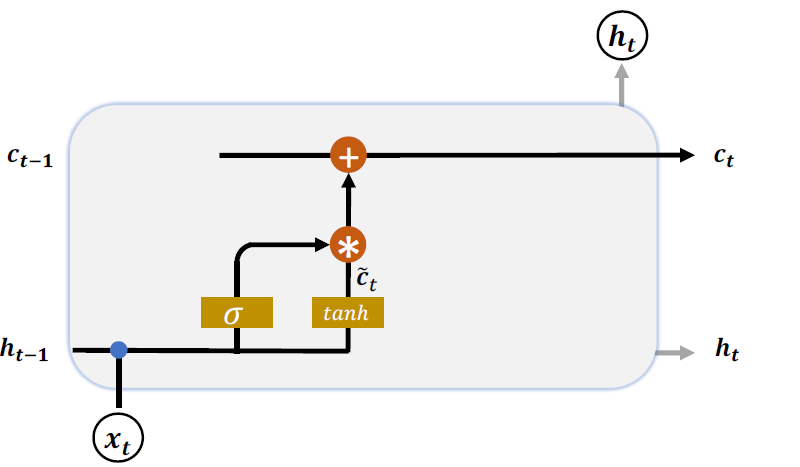
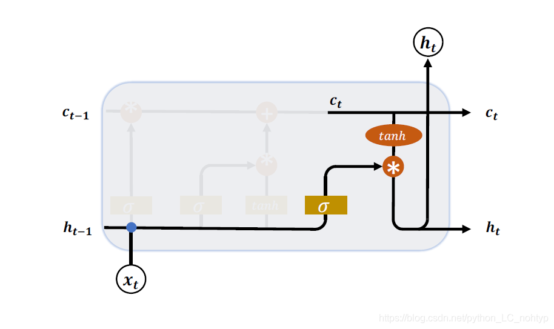

# LSTM原理解析
## 序列的表示方式
`具有先后顺序的数据一般叫作序列(Sequence)`，比如随时间而变化的商品价格数据就是非常典型的序列,。考虑某件商品A 在1 月到6 月之间的价格变化趋势，我们记为一维向量：[𝑥1, 𝑥2, 𝑥3, 𝑥4, 𝑥5, 𝑥6] ,如果要表示𝑏件商品在1 月到6 月之间的价格变化趋势，可以记为2 维张量：张量的形状是[b,6] 其中𝑏表示商品的数量.

这么看来，序列信号表示起来并不麻烦，`只需要一个shape 为[𝑏, 𝑠]的张量即可，其中𝑏为序列数量，𝑠为序列长度。但是对于很多信号并不能直接用一个标量数值表示，比如每个时间戳产生长度为𝑛的特征向量，则需要shape 为[𝑏, 𝑠, 𝑛]的张量才能表示。`考虑更复杂的文本数据：句子。它在每个时间戳上面产生的单词是一个字符，并不是数值，不能直接用某个标量表示。我们知道`神经网络本质上是一系列的矩阵相乘、相加等数学运算，它并不能够直接处理字符串类型的数据。如果希望神经网络能够用于自然语言处理任务，那么怎么把单词或字符转化为数值就变得尤为关键`。接下来我们主要探讨文本序列的表示方法，其他非数值类型的信号可以参考文本序列的表示方法。

对于一个含有𝑛个单词的句子，单词的一种简单表示方法就是`One-hot编码`。以英文句子为例，假设我们只考虑最常用的1 万个单词，那么每个单词就可以表示为某位为1，其它位置为0 且长度为1 万的`稀疏One-hot 向量`；对于中文句子，如果也只考虑最常用的5000 个汉字，同样的方法，一个汉字可以用长度为5000 的One-hot 向量表示。如图中所示，如果只考虑𝑛个地名单词，可以将每个地名编码为长度为𝑛的Onehot向量。


  

我们把文字编码为数值的过程叫作`Word Embedding`。One-hot 的编码方式实现WordEmbedding 简单直观，编码过程不需要学习和训练。但是`One-hot 编码的向量是高维度而且极其稀疏的，大量的位置为0，计算效率较低，同时也不利于神经网络的训练`。从语义角度来讲，One-hot 编码还有一个严重的问题，`它忽略了单词先天具有的语义相关性`。举个例子，对于单词“like”、“dislike”、“Rome”、“Paris”来说，“like”和“dislike”在语义角度就强相关，它们都表示喜欢的程度；“Rome”和“Paris”同样也是强相关，他们都表示欧洲的两个地点。对于一组这样的单词来说，`如果采用One-hot编码，得到的向量之间没有相关性，不能很好地体现原有文字的语义相关度`，因此One-hot 编码具有明显的缺陷。

在自然语言处理领域，有专门的一个研究方向在探索如何学习到单词的表示向量(Word Vector)，使得语义层面的相关性能够很好地通过Word Vector 体现出来。一个衡量词向量之间相关度的方法就是**余弦相关度(Cosine similarity)

下图演示了单词“France”和“Italy”的相似度，以及单词“ball”和“crocodile”的相似度，𝜃为两个词向量之间的夹角。可以看到cos(𝜃)较好地反映了语义相关性。其实有时候真的感觉很神奇，`在单独学习数学的时候两向量余弦角就是余弦角会计算就行了，但是它在自然语言处理中却有着这样的运用`。




## Embedding层
### 什么是Embedding层

在神经网络中，单词的表示向量可以直接通过训练的方式得到，我们把单词的表示层
叫作Embedding 层。Embedding 层负责把单词编码为某个词向量𝒗，它接受的是采用数字
编码的单词编号i，如2表示“I”，3 表示“me”等，系统总单词数量记为𝑁vocab，输出长
度为𝑛的向量𝒗：
$$
\vec v = f_{\theta}(i|N_{vocab},n)
$$
Embedding 层实现起来非常简单，构建一个shape 为[𝑁vocab, 𝑛]的查询表对象table，**对于任意的单词编号𝑖，只需要查询到对应位置上的向量并返回即可**
$$
\vec v = table[i]
$$

**Embedding 层是可训练的**，它可放置在神经网络之前，完成单词到向量的转换，得到的表示向量可以继续通过神经网络完成后续任务，并计算误差ℒ，**采用梯度下降算法来实现端到端(end-to-end)的训练。**

在 TensorFlow 中，可以通过layers.Embedding(𝑁vocab,𝑛)来定义一个Word Embedding层，其中𝑁vocab参数指定词汇数量，𝑛指定单词向量的长度。例如：
```python
x = tf.range(10) # 生成10个单词的数字编码
x = tf.random.shuffle(x)
# 创建共10个单词，每个单词用长度为4的向量表示
net = layers.Embedding(10,4)
out = net(x)
```

上述代码创建了10 个单词的Embedding 层，每个单词用长度为4 的向量表示，可以传入数字编码为0~9 的输入，得到这4 个单词的词向量，这些词向量随机初始化的，尚未经过网络训练，例如：

```python
<tf.Tensor: id=96, shape=(10, 4), dtype=float32, numpy=
array([[-0.00998075, -0.04006485, 0.03493755, 0.03328368],
[-0.04139598, -0.02630153, -0.01353856, 0.02804044],…
```

我们可以直接查看Embedding 层内部的查询表table：

```python
In [1]: net.embeddings
Out[1]:
<tf.Variable 'embedding_4/embeddings:0' shape=(10, 4) dtype=float32, numpy=
array([[ 0.04112223, 0.01824595, -0.01841902, 0.00482471],
[-0.00428962, -0.03172196, -0.04929272, 0.04603403],…
```

并查看net.embeddings 张量的可优化属性为True，即可以通过梯度下降算法优化。

```python
In [2]: net.embeddings.trainable
Out[2]:True
```

### 预训练的词向量

Embedding 层的查询表是`随机初始化`的，需要从零开始训练。实际上，**我们可以使用预训练的Word Embedding 模型来得到单词的表示方法，基于预训练模型的词向量相当于迁移了整个语义空间的知识，往往能得到更好的性能。**

目前应用的比较广泛的预训练模型有**Word2Vec 和GloVe** 等。它们已经在海量语料库训练得到了较好的词向量表示方法，并可以直接导出学习到的词向量表，方便迁移到其它任务。比如GloVe 模型**GloVe.6B.50d，词汇量为40 万**，每个单词使用长度为50 的向量表示，用户只需要下载对应的模型文件即可，“glove6b50dtxt.zip”模型文件约69MB

那么如何使用这些预训练的词向量模型来帮助提升NLP 任务的性能？非常简单，对于Embedding 层，不再采用随机初始化的方式，而是利用我们已经预训练好的模型参数去初始化 Embedding 层的查询表。例如：

```python
# 从预训练模型中加载词向量表
embed_glove = load_embed('glove.6B.50d.txt')
# 直接利用预训练的词向量初始化Embedding层
net.set_weights([embed_glove])
```

经过预训练的词向量模型初始化的Embedding 层可**以设置为不参与训练：net.trainable= False**，那么预训练的词向量就直接应用到此特定任务上；**如果希望能够学到区别于预训练词向量模型不同的表示方法，那么可以把Embedding 层包含进反向传播算法中去，利用梯度下降来微调单词表示方法。**

## LSTM原理
### 基础RNN网络
基础的 RNN 网络结构如下图所示，上一个时间戳的状态向量t-1与当前时间戳的输入xt经过线性变换后，通过激活函数𝑡𝑎𝑛ℎ后得到新的状态向量 𝑡。




### LSTM 结构
相对于基础的RNN网络只有一个状态向量 𝑡，LSTM 新增了一个状态向量$Ct$，同时引入了`门控(Gate)机制，通过门控单元来控制信息的遗忘和刷新`，如下图所示：





在 LSTM 中，有两个状态向量𝒄和h ，其中`𝒄作为LSTM的内部状态向量`，可以理解为LSTM 的内存状态向量Memory，而 h表示LSTM 的输出向量。相对于基础的RNN 来说，`LSTM 把内部Memory 和输出分开为两个变量`，同时利用三个门控：`输入门(Input Gate)、遗忘门(Forget Gate)和输出门(Output Gate)来控制内部信息的流动。`

门控机制可以理解为**控制数据流通量的一种手段**，类比于**水阀门**：当水阀门全部打开时，水流畅通无阻地通过；当水阀门全部关闭时，水流完全被隔断。在LSTM 中，**阀门开和程度利用门控值向量𝒈表示**，如下图所示，通过𝜎(𝒈)激活函数将门控制压缩到[0,1]之间区间，当𝜎(𝒈) = 0时，门控全部关闭，输出𝒐 = 0；当𝜎(𝒈) = 1时，门控全部打开，输出𝒐 = 𝒙。通过门控机制可以较好地控制数据的流量程度。




下面分别介绍三个门控的原理及作用

### 遗忘门
遗忘门作用于LSTM 状态向量𝒄上面**用于控制上一个时间戳的记忆𝒄𝑡−1对当前时间戳的影响**。遗忘门的控制变量$gf$由$g f=\sigma(W f[\mathrm{ht}-1, \mathrm{xt}]+\mathrm{bf})$产生，如图下图所示，其中$Wf$和$bf$为遗忘门的参数张量，可由反向传播算法自动优化，**$\sigma$为激活函数，一般使用Sigmoid 函数**。当门控$gf$ = 1时，遗忘门全部打开，LSTM 接受上一个状态𝒄𝑡−1的所有信息；当门控$gf$ = 0时，遗忘门关闭，**LSTM 直接忽略𝒄𝑡−1，输出为0的向量。这也是遗忘门的名字由来**。
经过遗忘门后，LSTM 的状态向量变为$g_{f} c_{t-1}$。



### 输入门
`输入门用于控制LSTM 对输入的接收程度`。首先通过对当前时间戳的输入xt和上一个
时间戳的输出t - 1做非线性变换得到新的输入变量 
$$\hat{c} = tanh(W_c[h_{t-1},x_t]+b_c)$$
其中 $Wc$ 和 $bc$ 为输入门的参数，需要通过反向传播算法自动优化，tanh 为激活函数，用于将
输入标准化到[−1,1]区间。𝒄 𝑡并不会全部刷新进入LSTM 的Memory，而是通过输入门控制
接受输入的量。输入门的控制变量同样来自于输入xt和输出ht - 1：
$$g_i = \sigma(W_i[h_{t-1},x_t]+b_i)$$
其中𝑾𝑖和𝒃𝑖为输入门的参数，需要通过反向传播算法自动优化，𝜎为激活函数，一般使用Sigmoid 函数。**输入门控制变量𝒈𝑖决定了LSTM 对当前时间戳的新输入𝒄 𝑡的接受程度**：当𝒈𝑖 = 0时，LSTM 不接受任何的新输入𝒄 𝑡；当𝒈𝑖 = 1时，LSTM 全部接受新输入𝒄 𝑡，如图所示。
经过输入门后，待写入Memory 的向量为𝒈𝑖 𝒄𝑡



#### 刷新Memory
在遗忘门和输入门的控制下，LSTM 有选择地读取了上一个时间戳的记忆𝒄𝑡−1和当前
时间戳的新输入𝒄 𝑡，状态向量𝒄𝑡的刷新方式为：
$$
\boldsymbol{c}_{t}=\boldsymbol{g}_{i} \tilde{\boldsymbol{c}}_{t}+\boldsymbol{g}_{f} \boldsymbol{c}_{t-1}
$$
得到的新状态向量𝒄𝑡即为当前时间戳的状态向量，如上图所示。

### 输出门

LSTM 的**内部状态向量𝒄𝑡并不会直接用于输出**，这一点和基础的RNN 不一样。基础的RNN 网络的状态向量 **既用于记忆，又用于输出**，所以基础的RNN 可以理解为状态向量𝒄和输出向量 是同一个对象。在LSTM 内部，**状态向量并不会全部输出，而是在输出门的作用下有选择地输出**。输出门的门控变量𝒈𝑜为：
$$
\boldsymbol{g}_{o}=\sigma\left(\boldsymbol{W}_{o}\left\lfloor\boldsymbol{h}_{t-1}, \boldsymbol{x}_{t}\right\rfloor+\boldsymbol{b}_{o}\right)
$$
其中𝑾𝑜和𝒃𝑜为输出门的参数，同样需要通过反向传播算法自动优化，𝜎为激活函数，一般使用Sigmoid 函数。当输出门𝒈𝑜 = 0时，输出关闭，LSTM 的内部记忆完全被隔断，无法用作输出，此时输出为0 的向量；当输出门𝒈𝑜 = 1时，输出完全打开，LSTM 的状态向量𝒄𝑡全部用于输出。LSTM 的输出由：
$$
\boldsymbol{h}_{t}=\boldsymbol{g}_{o} \cdot \tanh \left(\boldsymbol{c}_{t}\right)
$$
产生，即内存向量𝒄𝑡经过tanh激活函数后与输入门作用，得到LSTM 的输出。由于𝒈𝑜 ∈ [0,1]，tanh(𝒄t) ∈ [−1,1]，因此LSTM 的输出 𝑡 ∈ [−1,1]。




## 小结
LSTM 虽然状态向量和门控数量较多，计算流程相对复杂。但是由于每个门控功能清晰明确，每个状态的作用也比较好理解。这里将典型的门控行为列举出来，并解释其代码的LSTM 行为，如表所示。

|  输入门控| 遗忘门控 |LSTM行为|
|--|--|--|
| 0| 1 |只使用记忆|
| 1| 1 |综合输入和记忆|
| 0| 0 |清零记忆|
|1 | 0 |输入覆盖记忆|

