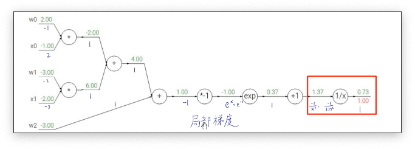

# 深度学习常见问题

:::note
1.正定矩阵和半正定矩阵判断
:::

- 正定矩阵(PD):
给定一个大小为 $n \times n$ 的实对称矩阵 $A$, 若对于任意长度为 $n$ 的非零向量 $X$, 有 $X^{T} A X>0$ 恒成立, 则矩阵 $A$ 是一个正定矩阵。
- 半正定矩阵(PSD)
给定一个大小为 $n \times n$ 的实对称矩阵 $A$, 若对于任意长度为 $n$ 的非零向量 $X$, 有 $X^{T} A X \geq 0$ 恒成立, 则矩阵 $A$ 是一个半正定矩阵。

:::note
2.L1和L2范数
:::

L1范数是矩阵内元素绝对值之和，可以用来表示矩阵的稀疏性。L2范数是矩阵内每个元素的平方和再开根号。L2范数的优点是它是一个凸函数，求导运算更加简单。在深度学习中可以计算网络权重参数的L1范数与L2范数作为损失函数的正则项来预防模型训练的过拟合。

可能会顺着问的问题：

1. 为什么L1正则项可以防止模型过拟合？ L1正则项可以让网络参数稀疏化，更有利于模型特征的选择。网络参数的稀疏性就是很多参数是0，这相当于对模型进行了一次特征选择，只保留了下来有用的参数信息，有利于提高模型的泛化能力。
2. 为什么L2正则项可以防止模型过拟合？L2正则项可以让模型的参数都尽可能的小，一般我们认为一个模型中如果参数都很小就说明这个模型更加鲁棒。用线性模型举例，如果一个线性模型的参数非常大，那么输入很小的改变都可能会导致输出产生很大的变化。如果参数比较小，微小差距的输入的输出也会是接近的。模型抗干扰的能力就更强。

:::note
3.什么是特征值和特征向量
:::

特征向量表示矩阵的一个特征，特征值表示这个特征有多重要。一个矩阵所有的特征值和特征向量可以完整的还原出这个矩阵。

:::note
4.条件概率和贝叶斯公式
:::

条件概率表示在事件B发生的前提下事件A发生的概率。贝叶斯公式给出了该概率等于A和B都发生的概率除以B发生的概率。

:::note
5.高斯分布和拉普拉斯分布以及正态分布
:::

高斯分布又叫做正态分布，这种分布的概率密度函数呈现钟形。在缺乏分布的先验知识，不知道选择何种形式的时候，默认选择正态分布一般不会出错。

拉普拉斯分布的概率密度函数的形状是两个指数函数背对背的靠在一起，服从拉普拉斯分布的随机变量，出现极端大的值的概率，要远远大于正态分布。

可能会追加的问题：为什么一般选择正态分布不会出错？

根据中心极限定理可以知道，很多独立的随机变量的分布都近似的符合正态分布。同时正态分布是具有相同方差的分布中不确定性最大的分布，也就是说正态分布是引入先验知识最少的分布。

:::note
6.线性回归和逻辑回归的区别
:::

1. 线性回归的输出是连续值，而逻辑回归的输出只能是0和1
2. 线性回归和逻辑回归的拟合函数也是不一样的，线性回归的拟合函数是对f(x)的输出y的拟合，而逻辑回归的拟合函数是对样本的概率的拟合

:::note
7.常用的损失函数、分类和回归损失函数
:::

常见的损失函数有：
1. 0-1损失函数：预测正确损失为0，预测错误损失为1
2. 绝对值损失函数：预测值与正实值的差作为损失函数
3. 平方损失函数：将预测值与正实值的差的平方作为损失函数
4. 均方差损失函数（MSE）：将预测的分布与真实的分布计算均方差
5. 交叉熵损失函数：将预测的分布和真实的分布计算交叉熵

常用回归损失函数有MSE：预测值和真实值的差值平方的平均值、MAE：预测值和真实差值绝对值的平均值

常用的分类损失有广泛作为神经网络损失函数的交叉熵损失函数和作为SVM损失函数的合页损失函数。合页损失函数会对错误越大的样本施加更大的惩罚，但是这样会导致损失对噪声敏感。

:::note
8.深度神经网络训练的问题
:::

在训练神经网络的时候可能会遇到梯度消失与梯度爆炸的问题。梯度消失产生的原因是由于在反向传播的过程中会不断的求导，求导的次数越多网络的梯度就越小，最终导致了梯度消失的结果。梯度爆炸是指在深层网络和权值初始化值太大的情况下。在深层神经网络或循环神经网络中，误差的梯度会在更新中累积相乘。如果网络层之间的梯度值大于 1.0，那么重复相乘会导致梯度呈指数级增长，梯度变的非常大，然后导致网络权重的大幅更新而产生梯度爆炸

如何解决梯度消失和梯度爆炸的问题？

梯度消失和梯度爆炸的原因都是由于梯度不稳定造成的，常用的解决方法有：
1. 使用Relu这样大部分数值都落在常数上的激活函数
2. 使用batch normaliztion，bn可以将参数从非饱和区域限制到饱和区域，同时权重参数满足固定的方差和均值避免了梯度过大和过小的问题
3. 梯度阈值，对梯度设置一个阈值，如果超过阈值就强行将梯度限制到这个阈值内
4. 正则化可以用来解决梯度爆炸的情况，如果发生了梯度爆炸正则化损失项就会非常大，从而限制权重的大小。

:::note
9.反向传播的过程以及链式法则
:::

反向传播的过程大致可以分为2个步骤，首先我们有一个计算图，计算图中存储了正向传播过程中的各个节点计算的数值。第一步我们分别求出每个节点的局部梯度。第二步中我们反向将局部梯度进行累乘得到每一个节点的梯度。将每个节点的数值减去节点对应的梯度就完成了一次反向传播更新参数的过程。还有一个细节就是在计算图中有加减乘除这样的分叉。不同的运算梯度的传播方式不一样，比如对于加法梯度就是均分到两个插路上，对于乘法梯度就是两个分支的梯度计算后做一个交换，对于max运算梯度就只传播到较大的分支上

:::note
10.卷积核大小如何选取？1 x 1卷积核的作用？
:::

在大多数情况下堆叠小的卷积核比如3x3和5x5的卷积核要比大的卷积核更加有用。但是并不是说大的卷积核就没有用了，比如在自然语言处理方面处理文本时往往需要更大的感受野来关联词汇之间的关系，而文本又不像图像那样需要提取非常深层的特征，因此自然语言处理的网络模型往往比较浅，使用大的卷积核也不会增加太多的计算量。卷积核并没有特定的选取规则，需要根据具体的场景具体去选择。

1x1卷积又叫做网络中的网络。1x1卷积核最大的作用就是用来改变维度，当卷积核的维度小于网络的channel数的时候就可以起到特征较维的作用，同样的1x1卷积也可以用来升维度。1x1卷积后跟上非线性的激活函数可以提高网络的非线性。1x1卷积还可以实现channel之间信息的交互。

:::note
11.卷积计算的公式
:::

深度学习中的卷积运算的结果和传统统计数学上的卷积运算公式不太一样。深度学习中的卷积其实是互相关运算，是通过滑动窗口的方式进行计算的，用一个窗口在矩阵上滑动然后将对应位置相乘后相加。在计算结果上互相关运算得到的矩阵和统计数学中的卷积运算得到的结果相反，但是由于卷积核的参数是自动学习的且互相关运算的运算量更小所以在深度学习中都使用互相关运算来实现卷积。

:::note
12.常见的激活函数有哪些？激活函数有哪些特点？如何选择激活函数?
:::

常见的激活函数有sigmoid、tanh、relu、leak-relu等；

激活函数都是非线性的如果激活函数是恒等函数那么MLP其实就和单层的神经网络没有区别了。激活函数还需要具有可微性，因为神经网络是基于求导去更新参数的。激活函数会限制输出的范围，这样基于梯度的优化算法会更加的稳定。

选择激活函数其实并没有特定的方法论，很多时候都是按个尝试一下每种激活函数对比一下效果。但是也会有经验性的选择，如果对于01二分类问题，输出层一般会选择sigmoid激活函数，其他层选择relu激活函数。如果不确定使用哪个激活函数就选择relu激活函数或者leak-relu激活函数。

可能会追加的问题：relu激活函数的优点是什么？

relu激活函数在程序实现上就是一个if-else结构，在实现上比sigmoid激活函数更快。sigmoid和tanh在正负饱和区的梯度都会接近于0，这会导致梯度弥散的，而relu和leak-relu函数大于0地方的导数都是常数，不会产生梯度弥散的现象。relu函数小于0的时候梯度为0，会产生所谓的稀疏性，但是leak-relu不会。因此leak-relu可以解决死神经元的问题。

:::note
13.batch size如何选取？有什么影响？
:::

batch size的选择可以决定下降的方向，在内存允许的情况下batch size可以取的尽可能大。对于目标检测或者语义分割的网络，1080ti的显卡能达到的最大batch size就是在4左右。batch size取的越大对于网络的引导能力就越好，迭代的速度也会更快。但是增大batch size也是有瓶颈的当batch size大于一定阈值之后其对于网络的引导的能力就基本不变了。

:::note
14.如何解决过拟合和欠拟合
:::

模型过拟合是指模型过度拟合训练集在训练集上有非常好的效果但是在测试集上的效果很差。模型欠拟合是指模型在训练集和测试集上效果都欠佳。

模型欠拟合可以通过增加模型的复杂程度，减少正则项还有添加特征来解决模型欠拟合问题

模型过拟合可以通过添加训练样本、降低模型复杂度、添加正则项或者dropout结构、减小迭代次数、添加噪声数据以及提前停止训练来解决过拟合问题

:::note
15.简述下BN算法
:::

首先计算上一层输入数据的均值，然后再计算上一层数据的标准差。然后对数据进行归一化处理。将归一化处理的结果进行一下重构（乘以一个参数在加上一个参数，这两个参数都是可学习的）。bn算法可以让网络更加的鲁棒、让网络更加容易训练以及让网络更加不容易过拟合。

可能会追加的问题：
1. 为什么bn可以让网络更加鲁棒：因为bn的操作让一个batch的图像信息进行了交互，这相当于一个数据增强的操作因此可以让网络更加的鲁棒. 
2. 为什么bn可以让网络更加容易训练？bn的操作让神经网络在更新的时候可以根据多个图像去确定下一步该怎么走，更容易确定最优点的方向。同时bn的操作会把权重的方差变为1，均值变为0。这样的操作可以把分布从饱和区域转化到非饱和区域为反向传播提供一个更好的梯度。

:::note
16.简述下局部连接和权值共享
:::

由于对于图像局部的像素关联性分享，可以让一个神经元去关联一部分的图像像素而不是与整个图像做全连接。局部连接可以在保持网络精度的同时减少网络的参数量。权重共享是指计算同一深度的神经元时采用的卷积核参数是共享的。权重共享的好处是大大减少了网络的参数量，让网络的训练更加容易。

:::note
17.网络训练的一些技巧
:::

1. 对参数进行随机初始化（符合正态分布）
2. 对数据集进行类别平衡
3. 测试不同的学习率
4. 对数据增强
5. 使用预训练模型，比如yolov3的darknet骨干网络会在imagenet上进行预训练
6. 使用earlystopping来判断停止训练的时机

:::note
18.Pytorch或者tensorflow的优点
:::

Pytorch 的非常容易上手，代码非常的简介。但是没有kears api那样简洁部分的功能比较难实现。TF1的学习成本非常的高还需要自己构造静态图，但是tf2将keras的api全部纳入进来后tf2的代码已经和pytorch的代码一样简介了，有时候都感觉tf2就是照着pytorch做的。还有就是tf2在分布式部署上有着天然的优势。但是很多学术研究的代码都是基于pytorch实现的。两者各有各的好处吧。

