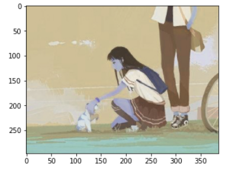
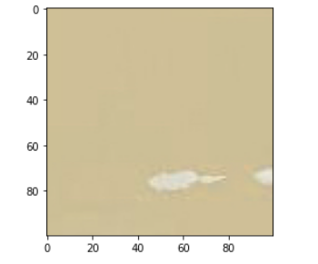
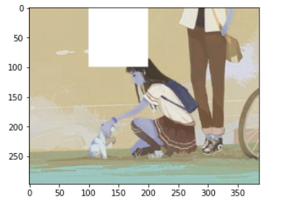

# Numpy常用代码

## 什么是Numpy？

Numpy是一个用与数值操作的计算库，在计算机视觉领域Numpy经常被使用来处理图像矩阵

## Numpy基本操作

### 创建 Numpy 数组

我认为Numpy可以简单的理解为C语言中的数组，但是Numpy里面的数组提供很多高级的功能，比如求和矩阵的元素，求和矩阵内的平均值等等；

#### 创建一维数组

我们可以使用如下的代码去初始化一个Numpy的数组：

```python
import numpy as np # 导入numpy库
np.array([1, 2, 3, 4, 5]) # 初始化Numpy数组
```
```
[1 2 3 4 5]
```

可以看到它好像和一个普通的Python List没有什么区别；到这里你可以暂时把Numpy array理解为一个C的数组。我们还可以打印一下他的shape看一看，使用如下代码：

```python
print(a.shape)
```

```
(5,)
```

可以看到这里显示这是一个一维的数组，长度为5；

#### 创建高维的数组

我们还可以创建更高维度的数组，如下：

```python
a = np.array([[1, 2, 3], [3, 4, 5], [6, 6, 8]])
print(a.shape)
```
```
(3, 3)
```

可以看到我们创建了一个3 x 3的数组；

#### 更多的创建方法

有时候我们需要创建一个指定大小的数组，比如全0和全1的数组，或者一个随机的数组。我们可以使用如下的代码创建：

```python
print(np.ones([3, 4])) # 创建一个3 x 4的全为0的数组
print(np.zeros([2, 2, 1])) # 创建一个2 x 2 x 1的数组
print(np.random.random([1,4])) # 创建一个 1 x 4的随机数组
```
```
[[1. 1. 1. 1.]
 [1. 1. 1. 1.]
 [1. 1. 1. 1.]]
[[[0.]
  [0.]]

 [[0.]
  [0.]]]
[[0.03435034 0.01300884 0.07781422 0.90073944]]
```

### Numpy数组的索引

#### 基本的索引

对于Numpy非常重要的一个部分就是索引了，对于普通的索引就和C语言以及Python里面的索引很相似：

```python
a = np.array([1, 2, 3, 5, 1])
print(a[0], a[1], a[2])
```

```
1 2 3
```

同样的我们也可以对高维度的列表进行索引：

```python
a = np.ones([1, 3, 5])
print(a[0][1][2]) # 第一维的第0个，第二维的第1一个和第三维的第2个
a[0][1][3] = 4 # 使用索引修改赋值
print(a)
```

```
1.0
[[[1. 1. 1. 1. 1.]
  [1. 1. 1. 4. 1.]
  [1. 1. 1. 1. 1.]]]
```

除了 `a[0][1][2]` 这样的基本写法，numpy还提供了更加简单的写法 `a[0,1,2]`, 一般我们都习惯使用第二种写法。

#### 高级的索引方式

**索引多个维度**

我们除了可以一次索引一个值，我们还可以一次索引多个值：

```python
a = np.random.random([2,4]) # 创建一个2 x 4的随机数组
print(a)
print(a[0:2, 1]) # 获取a的第1列和第2列的第2个元素
print(a[0:2, 2:4]) # 获取a的1到2行，3到4列
```

```
[[0.67621526 0.45927106 0.1584721  0.27989956]
 [0.8240355  0.89808379 0.25783252 0.17546073]]
[0.45927106 0.89808379]
[[0.1584721  0.27989956]
 [0.25783252 0.17546073]]
```

有时候我们想获取某一行，或者某一列，这个时候我们需要用到 `:` ，不说那么多，看代码和注释就懂了

```python
a = np.random.random([2,4]) # 创建一个2 x 4的随机数组
print(a)
print(a[1, :]) # 获取第一行
print(a[:, 2]) # 获取第二列
```

```
[[0.0629189  0.22251761 0.62609524 0.6338876 ]
 [0.78682128 0.21346585 0.49867616 0.65842141]]
[0.78682128 0.21346585 0.49867616 0.65842141]
[0.62609524 0.49867616]
```

**条件索引**

除了上述的索引方式之外我们还可以用条件对numpy的数组进行索引. 

我们先来看一下对于上述的`a`如果使用一个条件语句去判断会怎么样？

```python
a = np.random.random([2,4]) # 创建一个2 x 4的随机数组
print(a)
print(a > 0.5)
```

```
[[0.07459217 0.6784954  0.34206544 0.28612372]
 [0.80459115 0.35963276 0.66272934 0.81212657]]
[[False  True False False]
 [ True False  True  True]]
```

可以看到了我们得到了一个和a的形状相同的布尔数组，`a` 里面的元素如果大于0.5就是True，否则就是False

**我们可以把这个布尔数组用作索引**， 请看下面的例子：

```python
a = np.random.random([2,4]) # 创建一个2 x 4的随机数组
print(a)
print(a[a > 0.5])
```

```
[[0.24999975 0.43876265 0.29919775 0.99730222]
 [0.74754461 0.20366952 0.72258937 0.83574451]]
[0.99730222 0.74754461 0.72258937 0.83574451]
```

我们还可以用条件索引去 **批量修改数组里面的元素**

```python
a = np.random.random([2,4]) # 创建一个2 x 4的随机数组
print(a)
a[a > 0.5] = 1 # 把数组里面的大于0.5的元素全部置为0
a[a == 1] *= 3 # 把数组里面等于1的元素全部乘以3
print(a)
```

```
[[0.46666678 0.38713478 0.51001509 0.72846503]
 [0.31711053 0.65133523 0.18128171 0.19953942]]
[[0.46666678 0.38713478 1.         1.        ]
 [0.31711053 1.         0.18128171 0.19953942]]
```

:::note

作业：用numpy去完成图像的二值化：

1. 随机生成一个3维的图片，数值范围是 0-255 （提示： 先生成随机的数组，再乘以255）
2. 把大于180的置为255，小于180的置为0
3. 打印一下数组看一看

:::

#### 数组的基本操作

下面我们介绍一下Numpy数组的一些基本的功能运算

`np.sum(input, axis=None)` 

对数组元素进行求和，axis可以用来指定求和的维度，你可以使用行求和也可以用列求和；

```python
a = np.ones([4,3])
print(a)
print(np.sum(a)) # 整体求和
print(np.sum(a, axis=0)) # 每行求和
print(np.sum(a, axis=1)) # 每列求和
```

```
[[1. 1. 1.]
 [1. 1. 1.]
 [1. 1. 1.]
 [1. 1. 1.]]
12.0
[4. 4. 4.]
[3. 3. 3. 3.]
```

`np.max(input, axis=None)`

求解数组内元素的最大值，axis可以用来指定求最大值的维度，你可以求每一行的最大值或者每一列的最大值

```python
a = np.random.random([2,4])
print(a)
print(np.max(a))
print(np.max(a, axis=0))
print(np.max(a, axis=1))
```

```
[[0.1818726  0.23069836 0.19246234 0.70129938]
 [0.86895019 0.84763904 0.97005164 0.62474319]]
0.9700516416188457
[0.86895019 0.84763904 0.97005164 0.70129938]
[0.70129938 0.97005164]
```

`数组加减法`

在Numpy中两个shape一个的数组是可以直接进行加减乘除运算的，运算的规则就是把每一位的数值进行加减法处理；

```python
a = np.random.random([2, 4])
b = np.random.random([2, 4])
print(a)
print(b)
print(a + b)
```

```
[[0.71272401 0.24610014 0.80143632 0.48679384]
 [0.61820054 0.01355512 0.89339273 0.56430379]]
[[0.35076946 0.63963265 0.63104611 0.55540414]
 [0.19385594 0.18368245 0.29891667 0.25290185]]
[[1.06349347 0.88573278 1.43248242 1.04219799]
 [0.81205648 0.19723757 1.1923094  0.81720564]]
```

我们还可以结合索引对一定区域内的元素计算，计算的时候只要保证运算的两个数组的形状相同就行了。

## 图像的读取与显示

对于一张图像，我们可以使用opencv来进行读取，opencv是一个开源的视觉工具库，它读取的对象类型是numpy array类型；

首先先导入工具库：

```python
import cv2 # opencv 工具库
import matplotlib.pyplot as plt # 用于显示图像的工具库（暂时记住就行）
```

下面读入一张图片并把它显示出来

```python
im = cv2.imread("1.jpg")
plt.imshow(im)
plt.show()
```



你可能发现这个图片的颜色有点不对劲，但是不用担心，这是由于工具库的默认颜色通道不同导致的，并不是我们读取的图片有问题。我们可以用numpy去看看这个图片的一些基本信息，还有对其做一些修改：

```python
print(im.shape) # 打印图片的形状
print(np.max(im)) # 最大值
print(np.min(im)) # 最小值
print(np.average(im)) # 平均数
```

```
(297, 386, 3)
255
18
168.57084372801125
```

我们还可以使用索引获取图像的一部分，以及对图像的一部分进行处理

```python
# 获取图片的一部分
im2 = im[0:100, 0:100, :]
plt.imshow(im2)
plt.show()
```



```python
# 获取图片的一部分
im2 = im
im2[0:100, 100:200, :] = 255
plt.imshow(im2)
plt.show()
```




