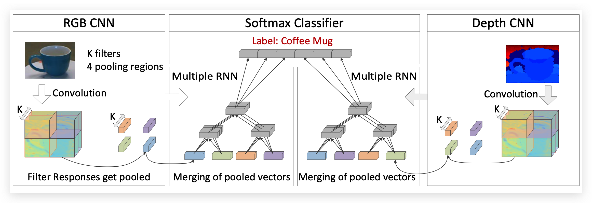
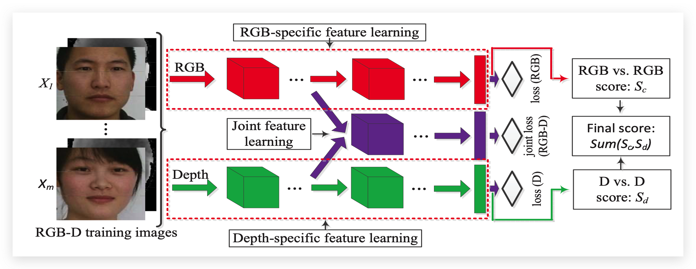
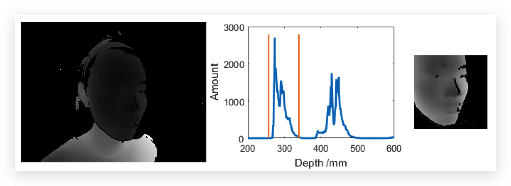
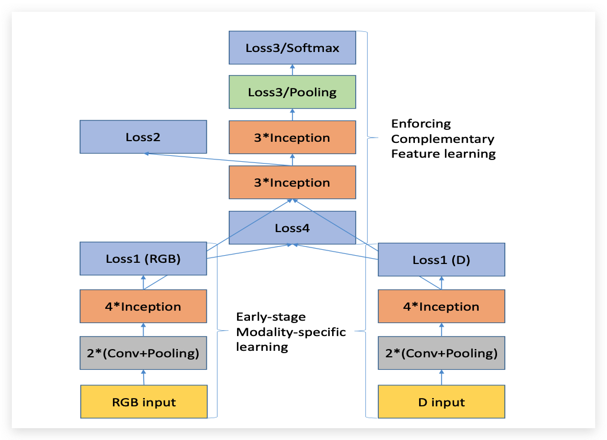
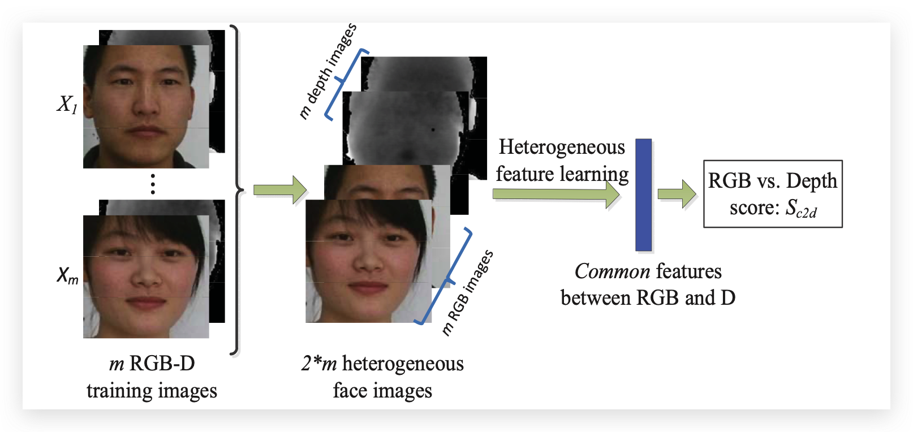

# 多模态人脸识别

:::note

本文主要对一篇2018年的文章：[ `RGB-D Face Recognition via Deep Complementary and Common Feature Learning `](http://www.jdl.link/doc/2011/201911019481237692_2018070916412329.pdf)中的内容进行整理，以下用该论文代指这篇文章；

:::

:::note

该论文提出了一种新的 RGB-D 人脸识别方法，该方法能够从多种模式和不同模式之间的共同特征中学习互补特征。具体来说，该论文引入了一个联合损失函数，这个损失能够让RGB模态和深度模态的特征能够更好的融合。

:::

## 多模态人脸识别简介

​		近年来，RGB-D 人脸识别由于其在无约束环境下的鲁棒性 受到越来越多的关注。RGB-D的多模态人脸识别是将RGB模态和深度模态进行了融合。当下的研究大部分都是使用将两种模态独立的进行处理，没有充分的利用好模态的相关性。

### RGB-D 人脸识别

​		在深度学习兴起之前，以前后很多的工作是基于传统的视觉特征去构建的，比如去提取HOG特征并使用随机森林去进行分类，但是在神经网络兴起之后这些方法也就逐渐消失了。

​		[1] 中提出了针对RGB-D的物体识别和形状识别的3D-ShapeNets，它将体积深度作为输入。[2] 将多视角的深度模型应用在物体识别当中。大多数类似于[1,2] 的方法都只使用了形状信息（3D形状或者深度图），但是并没有联合RGB图像的信息。[3] 中将从RGB和增强的深度图中的深度特征信息进行融合，然后构造出了一个联合SVM分类器用于人脸认证。

​		[4] 中提出了一个一种用于RGB-D人脸识别的卷积递归神经网络（CRNN）。这个网络是又两个CNN组成的，每个CNN独立的使用RGB图像和深度图像进行训练。然后学习到的CNN特征将会被输入到两个RNN网络中去获取最终的特征。

​		该文中的Related Work中列举了很多基于RGB-D的工作，但是当时的工作（2018年的时候）都有一个问题就是`RGB模态和深度模态的内容都是分开的，并没有融合到一块`所以该文就提出了将RGB模态的内容和Depth模态在训练的时候进行融合，并提出了一个联合Loss。

### 改进方法

#### Overview

​		从下图我们可以很清晰的看到该文章中提出的算法的框架，RGB模态的分支和Depth模态的分支并不是分开的了，而是中间有一个`Joint feature learning`的过程；

该文章的优化目标如下：
$$
\begin{array}{r}
\underset{\left\{W^{j}\right\}_{j=1}^{t}, W^{\mathbb{J}}}{\arg \min } \sum_{j=1}^{t} \sum_{i=1}^{m} \mathcal{L}\left(y_{i}, \mathcal{F}\left(X_{i}^{j}, W^{j}\right)\right), \\
+\mathcal{L}\left(y_{i}, \mathcal{F}\left(X_{i}, W^{\mathbb{J}}\right)\right)
\end{array}
$$
$\mathcal{L}(.)$ 表示损失函数，$y_i$ 是人脸的真实标签，$\mathcal{F}(.)$ 表示人脸识别结果。$W^j$ 表示RGB模态的特征或者Depth模态的特征。$W^{\mathbb{J}}$ 表示联合模态的特征。

### 实现的一些细节

#### 深度图预处理

在融合RGB模态和Depth模态，首先需要将RGB图像和深度图像进行对齐。文章采用的是用RGB图像中人的五个特征点和深度图像中的特征点进行对齐（通过调整摄像机的参数实现）。

在设置完相机的参数之后，还需要对深度图进行处理：首先计算深度直方图（下图中的直方图），然后将第一个峰值的部分截取下来（黄色的线）。在截取了深度直方图之后，将人脸的部分裁剪下来（得到最右边的图）

### 互补特征学习

该论文里面用两张流程图非常清晰的展示了整个算法流程：

其中Loss4是由Loss1(RGB)和Loss1(D)组成的，下图展示了Loss4的具体计算流程：

里面的模块结构都是非常的清晰，这里我就不多做解释了；

### 共同特征学习

该工作中还提到了当前RGB-D人脸识别算法的一个弊端就是在很多时候监控设备的摄像头都是RGB的。该工作想做的就是让RGB-D的算法也能在RGB上进行运用，这也就是交叉模态问题。在这个工作里面将这个问题划分为两个问题：

#### RGB到RGB的匹配

对于 RGB 到 RGB 的匹配，可以直接使用上面提出的互补特征学习网络，得到 RGB 到 RGB 的匹配得分

#### RGB到深度的匹配

对于RGB和深度的匹配，该工作选择用RGB和Depth的共同特征。很多多模态的特征融合学习都使用了手工设计的特征，此外这样的方法还需要学习一个格外的特征转换。该工作中建议去学习一种适用于每种独立特征的通用变换。下图给出了该工作是怎么做的：

首先有m张RGB-D的训练图像，然后将这m张RGB-D图像拆分成2m张异构的人脸图像。该工作把共同特征变换的优化作为一个异构特征学习问题来处理并优化异构特征学习网络。

## 参考文献

[1] Z. Wu, S. Song, A. Khosla, F. Yu, L. Zhang, X. Tang, and J. Xiao. 3D ShapeNets: A deep representation for volumetric shapes. In *IEEE CVPR*, pages 1912–1920, 2015.

[2] H. Su, S. Maji, E. Kalogerakis, and E. Learned-Miller. Multi- view convolutional neural networks for 3D shape recognition. In *IEEE ICCV*, pages 945–953, 2015.

[3] Y. Lee, J. Chen, C. Tseng, and S. Lai. Accurate and robust face recognition from RGB-D images with a deep learning approach. In *BMVC*, pages 123.1–123.14, 2016.

[4] R. Socher, B. Huval, B. Bath, C. D Manning, and A. Y Ng. Convolutional-recursive deep learning for 3d object classification. In *NIPS*, pages 665–673, 2012.

