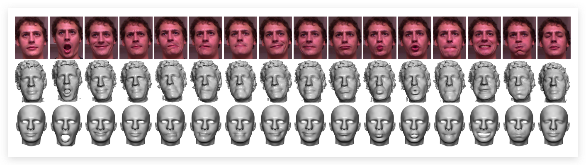

# RGB-D 人脸识别

## RGB-D 人脸识别数据集

### VAP 

包含来自31个对象的1149张图片

下载地址：[Download](https://vap.aau.dk/rgb-d-face-database/)

### EURECOM

该数据集由52人(14名女性，38名男性)的多模式面部图像组成

  

下载地址：[Download](http://rgb-d.eurecom.fr)

### Lock3DFace

Lock3DFace 数据库共包含5671个 RGBD 人脸视频剪辑，分别属于509个不同面部表情、姿势、遮挡和时间推移的个体。

  

下载地址：[Download](http://irip.buaa.edu.cn/lock3dface/index.html)

### IST-EURECOM

### FaceWarehouse

FaceWarehouse 是一个面向视觉计算应用的3D 面部表情数据库。使用 Kinect RGBD 照相机，拍摄了150个来自不同种族背景的7-80岁的人。对于每个人，该数据集采集了每个人不同表情的 RGBD 数据，包括中性表情和其他19种表情，如张嘴、微笑、亲吻等。对于每个 RGBD 原始数据记录，彩色图像上的一组面部特征点(如眼角、嘴部轮廓和鼻尖)将被自动定位，并且如果需要更好的准确性，将进行手动调整。然后变形模板面部网格，以适应深度数据尽可能接近，同时匹配的特征点在彩色图像上的对应点的网格。从这些拟合的面部网格，我们构建了一套个人特定的表情混合形状为每个人。

  

下载地址: [Download](http://kunzhou.net/zjugaps/facewarehouse/)

## 基于深度学习的RGB-D人脸识别方法

