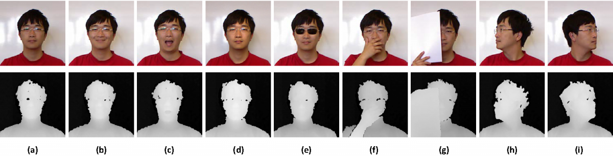
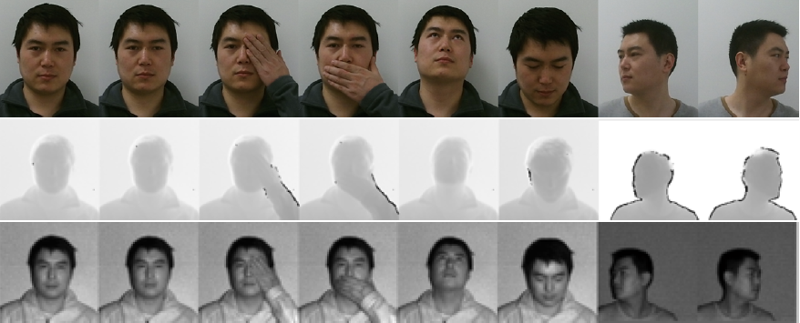

# RGB-D 人脸识别

## RGB-D 人脸识别数据集

### VAP 

包含来自31个对象的1149张图片

下载地址：https://vap.aau.dk/rgb-d-face-database/

### EURECOM

该数据集由52人(14名女性，38名男性)的多模式面部图像组成

  

下载地址：http://rgb-d.eurecom.fr

### Lock3DFace

Lock3DFace 数据库共包含5671个 RGBD 人脸视频剪辑，分别属于509个不同面部表情、姿势、遮挡和时间推移的个体。

  

下载地址：http://irip.buaa.edu.cn/lock3dface/index.html

### CurtinFaces

### IST-EURECOM

### FaceWarehouse

### VGGFace2

## 传统RGB-D人脸识别方法

## 基于深度学习的RGB-D人脸识别方法