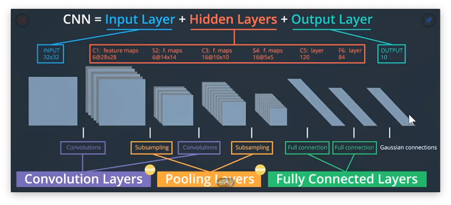
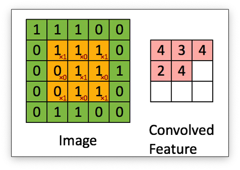
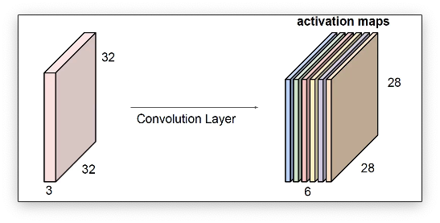

# 卷积神经网络

CS231N中还比较详细的说明了卷积神经网络的历史，有兴趣的可以去看一看，这里我就不记录卷积神经网络的历史了。

卷积神经网络可以应用在非常多的方面：分类、检索、目标检测、无人驾驶、人脸识别、视频处理、人体姿态估计、强化学习、医疗诊断、神经风格迁移等等都有卷积神经网络的影子。

## 卷积神经网络的基本结构

卷积神经网络有三个基础的组成部分：卷积层、池化层和全连接层。卷积层可以理解为特征的提取，池化层可以理解为把图像变小了，池化操作也可以叫做降采样。全连接层也就是最后的输出层。

## 什么是卷积

### 卷积运算

卷积的操作我认为可以用以下的描述来进行概括：

首先我们需要一个卷积核，常见的卷积核大小就是3x3的卷积核。卷积核在图像上进行滑动，每次滑动就进行一次卷积运算。经过卷积运算后就得到一个特征图。

下面这个图可以更好的说明卷积的运算过程：

`卷积的运算过程就是相应区域的数字相乘后相加`

如果只是单单的进行卷积我们会发现，中间的数经过了多次的运算。但是周围的数运算的次数是比较少的。这样对于周围的像素的不公平的。所以我们就可以在周围填充一圈的0。`填充0一个是可以让周围的元素参与比较多次的计算一个是可以控制卷积运算后特征图的大小`。

有图像处理相关经验的同学应该知道，一个图像是有三个通道的。那么理论上卷积运算也应该是对三个通道都要进行卷积运算才行。所以我们就会有三个卷积核分别进行计算。

下面这个图也可以比较好的说明这个问题：

在同济子豪兄的CS231N的视频里面有很多便于理解的动图，大家都可以去看一看。

---

卷积是一个特征提取的过程，不同的卷积核可以提取图像中不同的特征。

上图中通过不同的卷积核就可以提取出不一样的特征。左右分别的卷积核更容易提取出竖像分布的特征，上下分布的卷积核更容提取出横向分布的特征。

### 卷积层

在卷积神经网络当中卷积层是重要的组成部分。卷积层简单来说就是又多个卷积核组成的。卷积层的参数也就是这些卷积核的参数。**每个卷积核都会产生一个特征图，特征图叠加起来后就是卷积层的输出了**。

# 池化

池化进行的是特征图缩小的一个操作。对于一个特征图，我们不选取全部的数据去进行计算了，而且选取一部分的数据去进行计算,就相当于从特征图里面选了一些**代表**去进行计算。

那么我们如何去选取这些“代表”呢？我们有很多种方法可以选取这些代表，比如上图，我们如果选取一个方框里面的最大值这种池化方法就叫做**最大池化**，如果我们选取的是平均值这种池化方法就叫做平均池化。

那么池化有什么样的作用呢？

神经网络经过池化层后可以对图像的位置信息更加不敏感也就是所谓的**平移不变性**。比如下面这个图，假设我们现在使用和眼睛相似度比较高的卷积核去卷积。如果不经过池化操作， /*-卷积之后的输出结构还是会有比较大的差距的。如果先使用了池化的操作再去使用卷积，卷积之后的输出就是一样的。

池化的主要作用总结一下就是：

1. 减小参数量
2. 平移不变性
3. 防止过拟合

# 总结

1. 卷积神经网络是把卷积层、池化层和全连接层组合的
2. 目前是趋势是使用更小的卷积核和更深的网络
3. 倾向于不适用全连接层和池化层，池化和全连接都会让图片丢失空间信息。全连接层还会让参数量变的非常大。我们更愿意只使用卷积层也就是全卷积网络FCN

