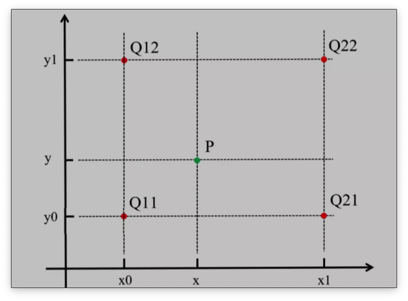
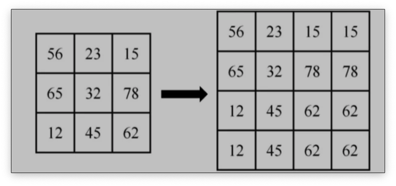
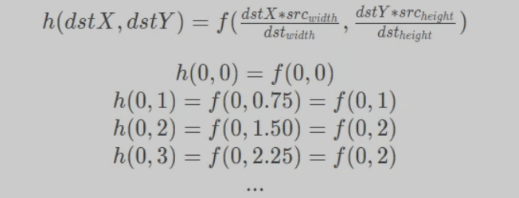
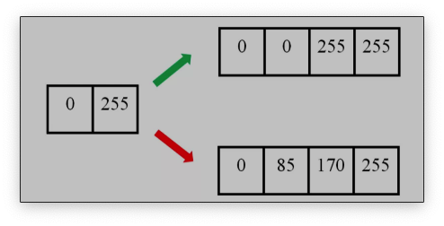
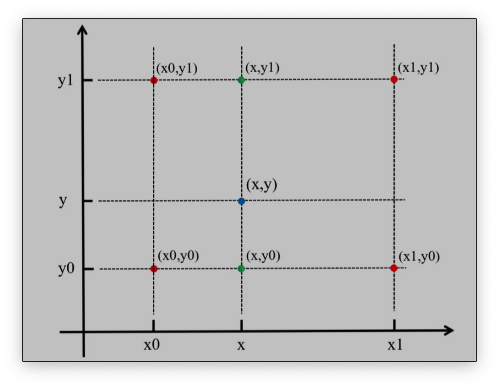
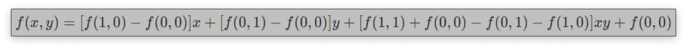
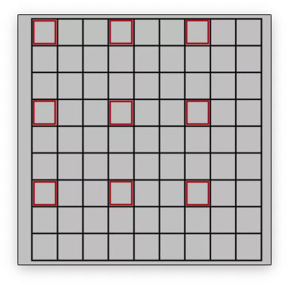
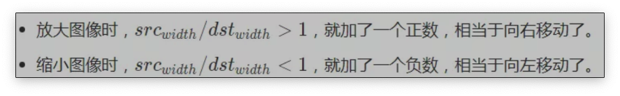
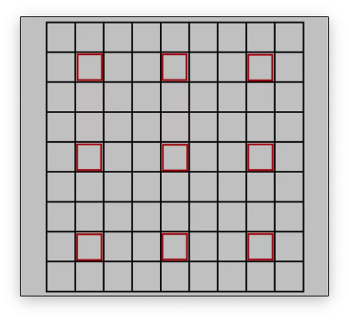

# 图像缩放对于模型精度的影响

在基于卷积神经网络的应用过程中，图像Resize是必不可少的一个步骤。通常原始图像尺寸比较大，比如常见监控摄像机出来的是1080P高清或者720P准高清画面，而网络模型输入一般没有这么大，像Yolo系列目标检测的网络模型输入大小一般为608x608/416x416 等等。那么`如何将大尺寸图像输入到网络模型呢`？很容易想到的一个方法就是`对原始图像进行Resize`，将1920x1080的原始图像Resize到网络模型输入尺寸，比如608x608。在压缩图像的过程中，如果像尽最大可能的保留图像的特征就需要考虑很多的因素。

## 是否应该保证宽高的一致？

其实两种方式均可，前提是要保证模型训练和模型推理时的操作方式一致。也就是说，如果在网络模型训练时，所有的训练素材都是直接拉伸到网路的输入尺寸（不保持宽高比例），那么模型推理时也应该如此，反之亦然。其中保持宽高比例的做法一般是用增加padding的方式，然后用固定颜色填充，保证图像画面中部的内容不变形。下图说明两种方式的差异：

其实对于网络模型来讲，`图像是否变形其实不太重要`。如果在训练的时候，模型认为一个变形的动物是猫，那么经过大量数据拟合后，在推理阶段，它同样会正确识别出变形的目标。当然根据相关资料显示，`通常一般推荐使用直接拉伸的方式去做图像Resize，原因是增加padding填充后会对网络带来一定噪音，影响模型准确性`，具体影响有多大我目前没有具体数据证明。这里需要指出的是，一些算法应用框架对细节封装得太好，对原始图像进行Resize的过程被隐藏起来，具体Resize的方式也不得而知。如果你发现模型集成后的准确性下降严重，这时候就需要检查一下框架对图像Resize的方式跟我们模型训练时是否一致。

## 选择什么样的插值方式？

我们在对图像进行上下采样时（缩放），有时候要在原有像素基础上删除一些像素值（缩小），有时候要在原有像素基础上增加一些像素值（放大），**增加/删除像素的方式叫图像插值算法**。OpenCV中的Resize函数其实有一个“插值模式”的参数，这个参数有一个默认值：INTER_LINER线性插值。它是一种插值方式，如果你在调用Resize函数时没有修改该参数值，那么该函数就以“线性插值”的方式进行图像缩放。

下面对各种插值方式进行一下总结：

### 近邻插值算法

近邻插值算法将目标图像中的点，对应到原图像中后，找到**最相邻的整数坐标点的像素值，作为该点的像素值输出。**

如上图所示，目标图像中的某点投影到原图像中的位置为点P，与P距离最近的点为Q11，此时易知，f(P)=f(Q11)。

举个例子：

将一幅3x3图像放大到4x4，用f(x , y)表示原图像，h(x ,y)表示目标图像，我们有如下公式：

缺点：

由最邻近插值法，放大后的图像有很严重的马赛克，会出现明显的块状效应；缩小后的图像有很严重的失真。

这是一种**最基本、最简单的图像缩放方式。变换后的**每个像素点的像素值，只由原图像中的一个像素点确定**。例如上面，点(0,0.75)的像素只由(0,1)确定，这样的效果显然不好。点(0,0.75)的像素不止和(0,1)有关，和(0,0)也有关，只是(0,1)的影响更大。**如果可以用附近的几个像素点按权重分配，共同确定目标图像某点的像素，效果会更好。**下面的双线性插值就解决了这个问题。

### 双线性插值

#### 线性插值

在讲双线性插值之前先了解一下线性插值。线性插值：`使用连接两个已知量的直线来确定在这两个已知量之间的一个未知量的值。`  线性插值形式：
$$
f(x)=a_{1} x+a_{0}
$$
如下图所示：

线性插值多项式：
$$
y=y_{0}+\left(x-x_{0}\right) \frac{y_{1}-y_{0}}{x_{1}-x_{0}}=y_{0}+\frac{\left(x-x_{0}\right) y_{1}-\left(x-x_{0}\right) y_{0}}{x_{1}-x_{0}}
$$
其实，**即使x不在x0到x1之间，这个公式也是成立的。在**这种情况下，这种方法叫作**线性外插**。

线性插值的误差：**线性插值其实就是拉格朗日插值有2个结点时的情况。插值余项为：**
$$
R_{n}(x)=\frac{f^{\prime \prime}(\xi)\left(x-x_{0}\right)\left(x-x_{1}\right)}{2 !} \leq \frac{f^{\prime \prime}(\xi)\left(x_{0}-x_{1}\right)^{2}}{8}, \xi \in\left(x_{0}, x_{1}\right)
$$
从插值余项可以看出，随着二阶导数的增大，线性插值的误差增大。即函数的曲率越大，线性插值近似的误差也越大。

举个例子。下图中，左边为原图像，拉伸后，理想的输出图像的像素分布应该为绿色箭头指向的，但是按照线性插值，会得到红色箭头指向的结果。

#### 双线性插值

双线性插值形式：
$$
f(x, y)=a x+b y+c x y+d
$$
双线性插值是线性插值在二维时的推广,**在两个方向上共做了三次线性插值**。定义了一个双曲抛物面与四个已知点拟合。

具体操作为在X方向上进行两次线性插值计算，然后在Y方向上进行一次插值计算。如下图所示：

首先，f(x,y)为二元函数，假设我们知道f(x0,y0),f(x1,y1),f(x0,y1),f(x1,y0)四个点的值。这四个点确定一个矩形，我们希望通过插值得到矩形内任意点的函数值。

先在x方向上进行两次线性插值，得到：
$$
\begin{aligned}
&f\left(x, y_{0}\right)=\frac{x_{1}-x}{x_{1}-x_{0}} f\left(x_{0}, y_{0}\right)+\frac{x-x_{0}}{x_{1}-x_{0}} f\left(x_{1}, y_{0}\right) \\
&f\left(x, y_{1}\right)=\frac{x_{1}-x}{x_{1}-x_{0}} f\left(x_{0}, y_{1}\right)+\frac{x-x_{0}}{x_{1}-x_{0}} f\left(x_{1}, y_{1}\right)
\end{aligned}
$$
再在y方向上进行一次线性插值，得到：
$$
f(x, y)=\frac{y_{1}-y}{y_{1}-y_{0}} f\left(x, y_{0}\right)+\frac{y-y_{0}}{y_{1}-y_{0}} f\left(x, y_{1}\right)
$$
综合起来，就是双线性插值的结果：
$$
f(x, y)=\frac{\left(y_{1}-y\right)\left(x_{1}-x\right)}{\left(y_{1}-y_{0}\right)\left(x_{1}-x_{0}\right)} f\left(x_{0}, y_{0}\right)+\frac{\left(y_{1}-y\right)\left(x-x_{0}\right)}{\left(y_{1}-y_{0}\right)\left(x_{1}-x_{0}\right)} f\left(x_{1}, y_{0}\right)+\frac{\left(y-y_{0}\right)\left(x_{1}-x\right)}{\left(y_{1}-y_{0}\right)\left(x_{1}-x_{0}\right)} f\left(x_{0}, y_{1}\right)+\frac{\left(y-y_{0}\right)\left(x-x_{0}\right)}{\left(y_{1}-y_{0}\right)\left(x_{1}-x_{0}\right)}
$$
如果选择一个坐标系统，使f(x)已知的四个点的坐标分别为(0,0),(0,1),(1,0),(1,1)，那么确定一个单位正方形，四个点分别为正方形的四个顶点：

- 首先对上端的两个顶点进行线性插值得：

$$
f(x, 0)=f(0,0)+x[f(1,0)-f(0,0)]
$$

- 再对底端的两个顶点进行线性插值得：

$$
f(x, 1)=f(0,1)+x[f(1,1)-f(0,1)]
$$

- 最后，做垂直方向的线性插值，以确定：

$$
f(x, y)=f(x, 0)+y[f(x, 1)-f(x, 0)]
$$

- 整理得插值公式的化简形式：

#### 原图像和目标图像的几何中心对齐

在计算目标图像中，对应原图像的虚拟坐标点时，一般的变换是：
$$
\begin{aligned}
\operatorname{srcX} &=\operatorname{dst} X\left(\operatorname{src}_{\text {width }} / d s t_{\text {width }}\right) \\
\operatorname{srcY} &=\text { dst } Y\left(src_{height} / d s t_{\text {height }}\right)
\end{aligned}
$$
这种变换下，原图像的**有些点没有参与计算。**举个例子，把9∗9的原图像缩小成3∗3，原图像的原点(0,0)和目标图像的原点(0,0)都为左上角，目标图像右上角的坐标为(0,2)，对应原图像的坐标为(0∗(9/3),2∗(9/3))=(0,6)。目标图像右边已经没有点了，(0,6)右边的像素点也就用不到了。

原图像和目标图像的像素之间的对应关系如下：

从图片可以看出，只有圈出来的红色部分参与运算了。目标图像的每个像素点的灰度值相对于原图像偏左上方，右下角的元素实际上没有参与运算。

为了让原图像和目标图像的中心对齐，我们规定另外一种变换方式：
$$
\begin{gathered}
\operatorname{src} X=\text { dst } X\left(\text { src }_{\text {width }} / \text { dst }_{\text {width }}\right)+0.5\left(\operatorname{src}_{\text {width }} / d s t_{\text {width }}-1\right) \\
\operatorname{srcY}=d s t Y\left(\text { src }_{\text {height }} / \text { dst }_{\text {height }}\right)+0.5\left(src_{height} / \text { dst }_{\text {height }}-1\right)
\end{gathered}
$$
就是在原来的变换后面加了调节因子：
$$
0.5(src_{width}/dst_{width}−1)
$$

这种变换下，目标图像的中心点(1,1)，对应了原图像的中心点(4,4)，两个图像的几何中心重合，能充分利用原图像的点，并且目标图像的每个像素点之间都是等间隔的，也都和两边有一定的边距。实际上，在openCv中也是这种变换方式。

## 参考文献

[[1] https://zhuanlan.zhihu.com/p/362701716](https://zhuanlan.zhihu.com/p/362701716)

