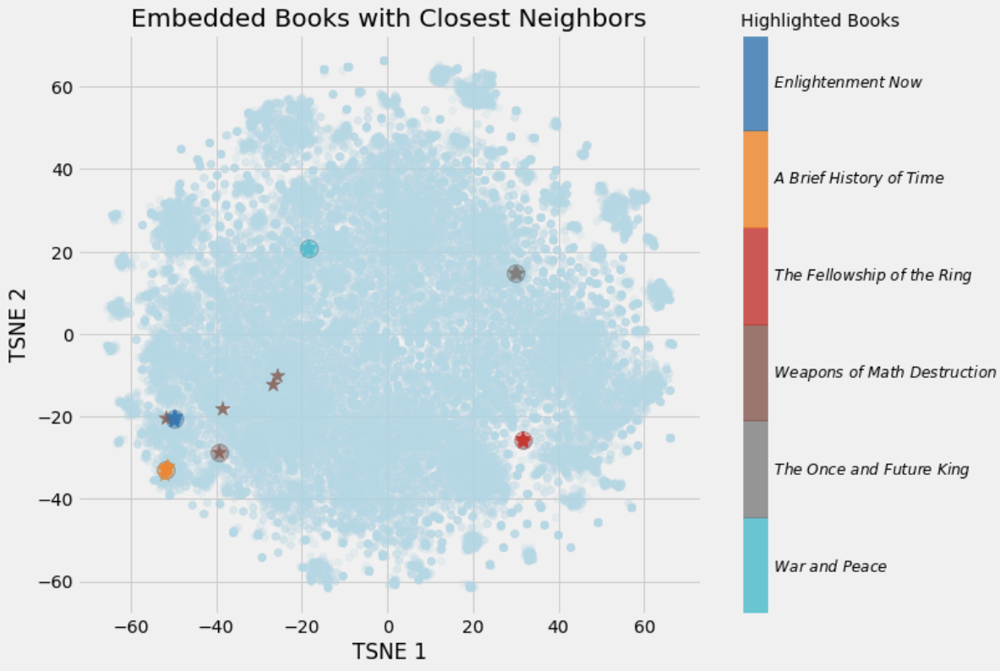
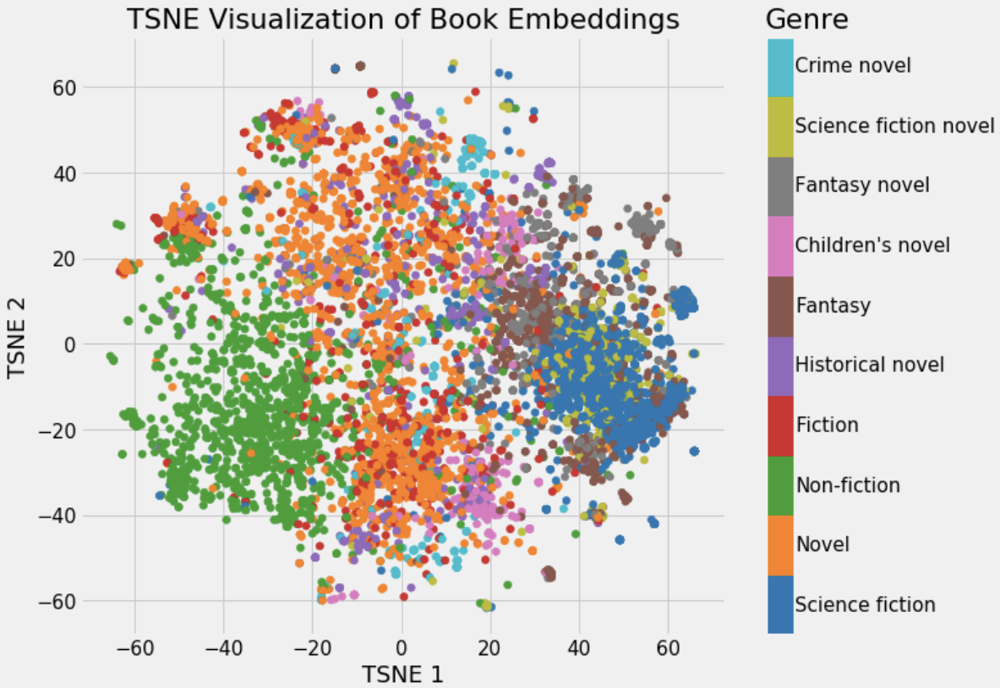

# 深度学习中的Embeddings

原文链接：[https://towardsdatascience.com/neural-network-embeddings-explained-4d028e6f0526](https://towardsdatascience.com/neural-network-embeddings-explained-4d028e6f0526)
>Applications of neural networks have expanded significantly in recent years from image segmentation to natural language processing to time-series forecasting. One notably successful use of deep learning is embedding, a method used to represent discrete variables as continuous vectors. This technique has found practical applications with word embeddings for [machine translation](https://arxiv.org/abs/1705.03127) and [entity embeddings for categorical variables](https://arxiv.org/abs/1604.06737).

近年来，神经网络的应用从图像分割到自然语言处理再到时间序列预测都有了很大的发展。深度学习的一个显著成功应用是`Embedding`(嵌入)，一种将离散变量表示为连续向量的方法。该技术已在机器翻译的单词嵌入和分类变量的实体嵌入中得到了实际应用。

在本文中，我将解释什么是神经网络Embedding，为什么我们要使用它们，以及如何学习它们。我们将结合我正在研究的一个实际问题来讨论这些概念：将维基百科上的所有书籍表示为向量，以创建一个图书推荐系统。

## Embeddings

Embedding是一个离散范畴变量到连续数向量的映射。在神经网络的上下文中，Embedding是低维的，学习的离散变量的连续向量表示。神经网络Embedding是有用的，因为它可以降低分类变量的维数，并在变换空间中有意义地表示类别。

神经网络Embedding有3个主要目的：

1. 在嵌入空间中寻找最近邻。这些可用于根据用户兴趣或集群类别提出建议。
2. 作为有监督任务的机器学习模型的输入。
3. 用于概念和类别之间关系的可视化。

这就意味着在图书项目中，使用神经网络Embedding，我们可以在维基百科上获取所有37000篇图书文章，并用一个向量中的50个数字来表示每一篇文章。此外，因为Embedding是学习的，所以在学习问题的上下文中更相似的书籍在Embedding空间中彼此更接近。

神经网络Embedding克服了表示分类变量的常用方法的两个局限性：one-hot encoding.

### 独热编码的局限性

一个热编码分类变量的操作实际上是一个简单的Embedding，每个分类映射到一个不同的向量。这个过程采用离散的实体，并将每个观测值映射到一个0的向量和一个1来表示特定的类别。

独热编码技术主要有如下有两个缺点：

1. 对于高纬度变量-那些有许多独特的类别-转换向量的维数变得难以管理。

2. 映射完全没有信息：“相似”的类别在嵌入空间中没有放得更近。

第一个问题很好理解：对于每一个额外的类别，我们必须在一个热编码向量中添加另一个数字来表示这个类别。如果我们在维基百科上有37000本书，那么表示每本书就需要37000维向量，这使得在这种表示上训练任何机器学习模型都是不可行的。

第二个问题同样会使得单热编码具有局限性：一个热编码不会在向量空间中将相似的实体放得更近。如果我们使用余弦距离来度量向量之间的相似性，那么在一次热编码之后，实体之间的每一次比较的相似性都是0。

这意味着像战争与和平和安娜卡列尼娜（这两本书都是托尔斯泰的经典著作）这样的实体，如果我们使用一个热编码的话，它们之间的距离并不比《战争与和平》与《银河系漫游指南》更近。

```python
# One Hot Encoding Categoricals
books = ["War and Peace", "Anna Karenina", 
          "The Hitchhiker's Guide to the Galaxy"]
books_encoded = [[1, 0, 0],
                 [0, 1, 0],
                 [0, 0, 1]]
Similarity (dot product) between First and Second = 0
Similarity (dot product) between Second and Third = 0
Similarity (dot product) between First and Third = 0
```

考虑到这两个问题，表示分类变量的理想解决方案所需的数量将少于唯一类别的数量，并且将使相似类别彼此更接近。

```python
# Idealized Representation of Embedding
books = ["War and Peace", "Anna Karenina", 
          "The Hitchhiker's Guide to the Galaxy"]
books_encoded_ideal = [[0.53,  0.85],
                       [0.60,  0.80],
                       [-0.78, -0.62]]
Similarity (dot product) between First and Second = 0.99
Similarity (dot product) between Second and Third = -0.94
Similarity (dot product) between First and Third = -0.97
```

构建更好的分类实体表示，我们可以使用Embedding神经网络和监督任务来学习Embedding。

### 学习Embedding

独热编码的主要问题是它的转换不依赖于任何监督。通过在有监督的任务上使用神经网络来学习Embedding，我们可以极大地改进Embedding。[Embedding形成了网络的参数](https://stats.stackexchange.com/questions/182775/what-is-an-embedding-layer-in-a-neural-network)-权重-并对其进行了调整，以使任务的损失最小化。生成的Embedding向量是类别的表示，其中类似的类别（相对于任务）彼此更接近。

例如，如果我们在一组电影评论中使用了50000个单词的词汇量，我们就可以使用一个Embedding神经网络来学习每个单词的100维Embedding，这个神经网络训练用来预测评论的感伤性(有关此应用程序的详细信息，请参阅此[Google Colab](https://colab.research.google.com/notebooks/mlcc/intro_to_sparse_data_and_embeddings.ipynb?utm_source=mlcc&utm_campaign=colab-external&utm_medium=referral&utm_content=embeddings-colab&hl=en)笔记本）。词汇表中与正面评论相关的词语，如“辉煌”或“优秀”，将在Embedding空间中更接近，因为网络已经了解到这两者都与正面评论相关。


在上面给出的图书示例中，我们的监督任务可以是“识别一本书是否是托尔斯泰写的”，由此产生的Embedding将使托尔斯泰写的书彼此更接近。弄清楚如何创建有监督的任务来产生相关的表示是制作Embedding最困难的部分。

### 改进

在Wikipedia图书项目（这里是[complete notebook](https://github.com/WillKoehrsen/wikipedia-data-science/blob/master/notebooks/Book%20Recommendation%20System.ipynb)）中，监督学习任务被设置为预测一本书的文章中是否出现指向Wikipedia页面的给定链接。我们提供成对的（书名，链接）训练示例，其中混合了正-真-负-假-对。这种设置基于这样的假设：链接到类似维基百科页面的书籍彼此相似。由此产生的嵌入应该把类似的书放在向量空间中更近的地方。

我使用的网络有两个平行的嵌入层，它们将book和wikilink映射成50维向量，还有一个点积层，它将Embedding的内容组合成一个数字进行预测。Embedding是指在训练过程中调整网络的参数或权值，以使被监督任务的损失最小化。

在Keras代码中，如下所示（如果您不完全理解代码，请不要担心，只需跳到图片）：

```python
 # Both inputs are 1-dimensional
book = Input(name = 'book', shape = [1])
link = Input(name = 'link', shape = [1])

# Embedding the book (shape will be (None, 1, 50))
book_embedding = Embedding(name = 'book_embedding',
                           input_dim = len(book_index),
                           output_dim = embedding_size)(book)

# Embedding the link (shape will be (None, 1, 50))
link_embedding = Embedding(name = 'link_embedding',
                           input_dim = len(link_index),
                           output_dim = embedding_size)(link)

# Merge the layers with a dot product along the second axis (shape will be (None, 1, 1))
merged = Dot(name = 'dot_product', normalize = True, axes = 2)([book_embedding, link_embedding])

# Reshape to be a single number (shape will be (None, 1))
merged = Reshape(target_shape = [1])(merged)

# Output neuron
out = Dense(1, activation = 'sigmoid')(merged)
model = Model(inputs = [book, link], outputs = out)

# Minimize binary cross entropy
model.compile(optimizer = 'Adam', loss = 'binary_crossentropy', metrics = ['accuracy'])
```

尽管在有监督机器学习任务中，目标通常是训练模型对新数据进行预测，但在这种Embedding模型中，预测只是达到目的的一种手段。我们需要的是嵌入权重，将书籍和链接表示为连续向量。

Embedding本身并不那么有趣：它们只是数字的向量：


但是，Embedding可以用于前面列出的3个目的，对于这个项目，我们主要感兴趣的是推荐基于最近邻的书籍。为了计算相似度，我们取一本查询书，找出它的向量和其他所有书的向量之间的点积(如果我们的Embedding是标准化的，这个点积就是向量之间的余弦距离，范围从-1，最不相似，到+1，最相似。我们也可以用欧几里德距离来衡量相似性）。

这是我构建的图书嵌入模型的输出：

```
Books closest to War and Peace.
Book: War and Peace              Similarity: 1.0
Book: Anna Karenina              Similarity: 0.79
Book: The Master and Margarita   Similarity: 0.77
Book: Doctor Zhivago (novel)     Similarity: 0.76
Book: Dead Souls                 Similarity: 0.75
```

（向量与自身之间的余弦相似性必须为1.0）。经过一些降维（见下文），我们可以制作如下图：



我们可以清楚地看到学习Embedding的价值！我们现在在维基百科上的每一本书都有50个数字表示，类似的书彼此之间更接近。

## Embedding 可视化

关于Embedding最酷的部分之一是，它们可以用来可视化概念，例如与其他概念相关的新奇或非虚构的概念。这就需要进一步的降维技术来将维数降到2或3。最流行的降维技术本身就是一种Embedding方法：t分布随机邻域嵌入（TSNE）。

我们可以将维基百科上所有书籍的原始37000维，使用神经网络Embedding将它们映射到50维，然后使用TSNE将它们映射到2维。结果如下：


（TSNE是一种流形学习技术，它试图将高维数据映射到低维流形，创建一个嵌入，试图保持数据中的局部结构。它几乎只用于可视化，因为输出是随机的，不支持转换新数据。一个新兴的替代方案是统一流形近似和投影，UMAP，它速度更快，并且支持将新数据转换到嵌入空间。

这本身并不是很有用，但一旦我们开始根据不同的书籍特点给它上色，它就会很有见地。



我们可以清楚地看到属于同一类型的书的分组。这并不完美，但令人印象深刻的是，我们可以用2个数字来表示维基百科上的所有书籍，这些数字仍然捕捉到了不同流派之间的差异。

书中的例子展示了神经网络Embedding的价值：我们可以将分类对象用低维的，并且在嵌入空间中把相似的实体放得更近的向量表示。

### Bonus:交互式可视化

静态图的问题是，我们不能真正地研究数据和研究变量之间的分组或关系。为了解决这个问题，TensorFlow开发了projector，这是一个在线应用程序，可以让我们可视化并与嵌入进行交互。

## 总结

神经网络Embedding是学习离散数据作为连续向量的低维表示。这些Embedding克服了传统编码方法的局限性，可以用于查找最近邻、输入到另一个模型和可视化等目的。

虽然许多深度学习概念在学术术语中被讨论，但神经网络Embedding既直观又相对简单。我坚信，任何人都可以学习深度学习，并利用Keras等图书馆构建深度学习解决方案。嵌入是处理离散变量的有效工具，也是深度学习的一个有用应用。

## 参考文献

[Google-Produced tutorial on embeddings](https://developers.google.com/machine-learning/crash-course/embeddings/video-lecture)

[TensorFlow Guide to Embeddings](https://www.tensorflow.org/guide/embedding)

[Book Recommendation System Using Embeddings](https://github.com/WillKoehrsen/wikipedia-data-science/blob/master/notebooks/Book Recommendation System.ipynb)

[Tutorial on Word Embeddings in Keras](https://machinelearningmastery.com/use-word-embedding-layers-deep-learning-keras/)


