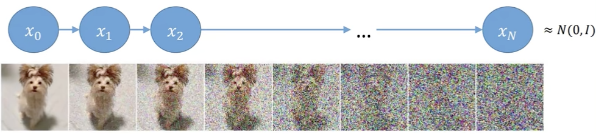

# 概率扩散模型

## GAN的缺点

- GAN 需要训练俩个网络，难度比较大，容易不收敛，而且多样性交叉，只关注能判别器就得了

- Diffusion Model 用一种更简单的方法来诠释了生成模型该如何学习以及生成数据，感觉要更简单一些

## Diffusion 模型

  

- 这里先看前向的过程，其实就是不断输入数据并加入噪声，最后很快就变成了一个纯噪声

- 每个时刻都要添加高斯噪声，后一时刻都是由前一时刻的噪声得到

- 其实这个过程可以看做一个**不断构建标签**（噪声）的过程

### 如何得到 $x_t$ 时刻的分布？

$x_t$ 时刻的噪声依赖于 $\alpha_t$ 这个变量， $\alpha_t = 1-\beta_t$，论文中范围是 0.0001 到 0.002, 也就是说 $\alpha$ 需要越来越小才行。 $x_t$ 的计算公式如下：

$$
x_t=\sqrt{\alpha_t} x_{t-1}+\sqrt{1-\alpha_t} z_1
$$

$z_1$ 是一个高斯噪声， $x_{t-1}$ 是上一时刻的噪声。 论文中对于 $\sqrt{\alpha_t}$ 是从概率论的角度去解释的，但是其实可以把 $\sqrt{\alpha_t}$ 看做权重，这样会更好理解一些。

一开始加一点噪声就有效果，越往后加越多的噪声，最后就是纯噪声。但是现在我们只知道最后一个时刻的分布是由前一个时刻的分布得到的，但是整个序列要如何计算呢？ 如果一个一个计算，速度就会非常慢，能不能从 $x_0$ 直接算出来 $x_t$ 呢？

我们把 $x_{t-1}$ 的公式带入到 $x_t$ 的公式中，得到：

$$
x_{t-1} = \sqrt{\alpha_{t-1}} x_{t-2}+\sqrt{1-\alpha_{t-1}} z_1 \\
x_t = \sqrt{\alpha_t} \sqrt{\alpha_{t-1}} x_{t-2}+\sqrt{\alpha_t} \sqrt{1-\alpha_{t-1}} z_1+\sqrt{1-\alpha_t} z_1
$$

其中每一步中加入的噪声都是服从高斯分布 $z_1, z_2, \ldots \sim \mathcal{N}(0, \mathbf{I})$ ，把上面的式子化简一下，得到：

$$
x_t=\sqrt{\alpha_t \alpha_{t-1}} x_{t-2}+\left(\sqrt{\alpha_t\left(1-\alpha_{t-1}\right)} z_2+\sqrt{1-\alpha_t} z_1\right) \\
=\sqrt{\alpha_t \alpha_{t-1}} x_{t-2}+\sqrt{1-\alpha_t \alpha_{t-1}} z_2
$$

$z_1$ 和 $z_2$ 都服从高斯分布，分别是$\mathcal{N}\left(0,1-\alpha_t\right)$ 和 $\mathcal{N}\left(0, a_t\left(1-\alpha_{t-1}\right)\right)$， 由于高斯分布满足下面的性质所以可以进行上面化简：

$$
\mathcal{N}\left(0, \sigma_1^2 \mathbf{I}\right)+\mathcal{N}\left(0, \sigma_2^2 \mathbf{I}\right) \sim \mathcal{N}\left(0,\left(\sigma_1^2+\sigma_2^2\right) \mathbf{I}\right)
$$

不断的往里面套就能发现规律了，其实就是一个累乘的过程：

$$
x_t = \sqrt{\bar{\alpha}_t} x_0+\sqrt{1-\bar{\alpha}_t} z_t
$$

这个公式告诉我们，任意时刻的分布都可以通过 $x_0$ 状态算出来，一步到位。这是我们的第一个核心公式。

**现在我们可以加噪声了，现在我们需要求反向的过程**

### 如何求解反向的过程

逆向过程我们需要使用贝叶斯公式：

$$
q\left(\mathbf{x}_{t-1} \mid \mathbf{x}_t, \mathbf{x}_0\right)=q\left(\mathbf{x}_t \mid \mathbf{x}_{t-1}, \mathbf{x}_0\right) \frac{q\left(\mathbf{x}_{t-1} \mid \mathbf{x}_0\right)}{q\left(\mathbf{x}_t \mid \mathbf{x}_0\right)}
$$

公式中的三项都可以通过前面的公式得到：

$$
\begin{aligned}
&q\left(\mathbf{x}_{t-1} \mid \mathbf{x}_0\right) = \sqrt{\overline{\alpha}_t-1} x_0+\sqrt{1-\overline{\alpha}_t-1} z \quad \sim \mathcal{N}\left(\sqrt{\overline{\alpha_t}-1} x_0, 1-\overline{\alpha}_{t-1}\right)\\
&q\left(\mathbf{x}_t \mid \mathbf{x}_0\right) = \sqrt{\bar{\alpha}_t} x_0+\sqrt{1-\bar{\alpha}_t} z \quad \sim \mathcal{N}\left(\sqrt{\bar{\alpha}_t} x_0 \quad, 1-\bar{\alpha}_t\right)\\
&q\left(\mathbf{x}_t \mid \mathbf{x}_{t-1}, \mathbf{x}_0\right)=\sqrt{\alpha_t} x_{t-1}+\sqrt{1-\alpha_t} z \quad \sim \mathcal{N}\left(\sqrt{\alpha_t} x_{t-1}, 1-\alpha_t\right)
\end{aligned}
$$

根据标准正态分布的性质，我们可以得到，$q\left(\mathbf{x}_{t-1} \mid \mathbf{x}_t, \mathbf{x}_0\right)$ 也就是 $\exp \left(-\frac{1}{2}\left(\frac{\left(\mathbf{x}_t-\sqrt{\alpha_t} \mathbf{x}_{t-1}\right)^2}{\beta_t}+\frac{\left(\mathbf{x}_{t-1}-\sqrt{\bar{\alpha}_{t-1}} \mathbf{x}_0\right)^2}{1-\bar{\alpha}_{t-1}}-\frac{\left(\mathbf{x}_t-\sqrt{\bar{\alpha}_t} \mathbf{x}_0\right)^2}{1-\bar{\alpha}_t}\right)\right)$

接下来继续进行化简：

$$
\begin{aligned}
&= \exp \left(-\frac{1}{2}\left(\frac{\left(\mathbf{x}_t-\sqrt{\alpha_t} \mathbf{x}_{t-1}\right)^2}{\beta_t}+\frac{\left(\mathbf{x}_{t-1}-\sqrt{\bar{\alpha}_{t-1}} \mathbf{x}_0\right)^2}{1-\bar{\alpha}_{t-1}}-\frac{\left(\mathbf{x}_t-\sqrt{\bar{\alpha}_t} \mathbf{x}_0\right)^2}{1-\bar{\alpha}_t}\right)\right) \\
&=\exp \left(-\frac{1}{2}\left(\frac{\mathbf{x}_t^2-2 \sqrt{\alpha_t} \mathbf{x}_t \mathbf{x}_{t-1}+\alpha_t \mathbf{x}_{t-1}^2}{\beta_t}+\frac{\mathbf{x}_{t-1}^2-2 \sqrt{\bar{\alpha}_{t-1}} \mathbf{x}_0 \mathbf{x}_{t-1}+\bar{\alpha}_{t-1} \mathbf{x}_0^2}{1-\bar{\alpha}_{t-1}}-\frac{\left(\mathbf{x}_t-\sqrt{\bar{\alpha}_t} \mathbf{x}_0\right)^2}{1-\bar{\alpha}_t}\right)\right) \\
&=\exp \left(-\frac{1}{2}\left(\left(\frac{\alpha_t}{\beta_t}+\frac{1}{1-\bar{\alpha}_{t-1}}\right) \mathbf{x}_{t-1}^2-\left(\frac{2 \sqrt{\alpha_t}}{\beta_t} \mathbf{x}_t+\frac{2 \sqrt{\bar{\alpha}_{t-1}}}{1-\bar{\alpha}_{t-1}} \mathbf{x}_0\right) \mathbf{x}_{t-1}+C\left(\mathbf{x}_t, \mathbf{x}_0\right)\right)\right)
\end{aligned}
$$

C是一个常数，我们可以忽略它，它不会影响我们的结果。我们的核心是求和 $x_{t-1}$有关的，其他的现在都不需要关心。上面的步骤其实就是在做一个配方的操作，对标标准正态分布公式：

$$
\exp \left(-\frac{(x-\mu)^2}{2 \sigma^2}\right)=\exp \left(-\frac{1}{2}\left(\frac{1}{\sigma^2} x^2-\frac{2 \mu}{\sigma^2} x+\frac{\mu^2}{\sigma^2}\right)\right)
$$

对比上下的式子我们就可以得到：

$$
\tilde{\boldsymbol{\mu}}_t\left(\mathbf{x}_t, \mathbf{x}_0\right)=\frac{\sqrt{\alpha_t}\left(1-\bar{\alpha}_{t-1}\right)}{1-\bar{\alpha}_t} \mathbf{x}_t+\frac{\sqrt{\bar{\alpha}_{t-1}} \beta_t}{1-\bar{\alpha}_t} \mathbf{x}_0
$$

将 $x_0$ 和 $x_t$ 的转化式子 $\mathbf{x}_0=\frac{1}{\sqrt{\bar{\alpha}_t}}\left(\mathbf{x}_t-\sqrt{1-\bar{\alpha}_t} \mathbf{z}_t\right)$ 带入到上面的式子中，我们就可以得到：

$$
\tilde{\mu}_t=\frac{1}{\sqrt{a_t}}\left(x_t-\frac{\beta_t}{\sqrt{1-\bar{a}_t}} z_t\right)
$$

但是好像还有一个问题就是 $z_t$ 要怎么求解呢？其实我们在正向的过程中会知道 $z_{t-1}$ 和 $z_t$ 之间的关系，我们可以用一个神经网络来预测 $z_t$，然后我们就可以得到 $x_t$ 的分布了。 

:::tip

$z_t$ 其实就是我们要估计的每个时刻的噪声，这家伙看起来没法直接求解，所以我们用一个神经网络来预测。还有一个比较神奇的事情是相关的论文里面居然都是用 Unet 来做这个事情的，我也不知道为什么，但是我觉得这个网络结构是不是有点太简单了，可能编码和解码的结果看起来比较舒服？

:::

### 终极流程图

下面是前向和后向的过程，分别对应我们前面所说的：

  

