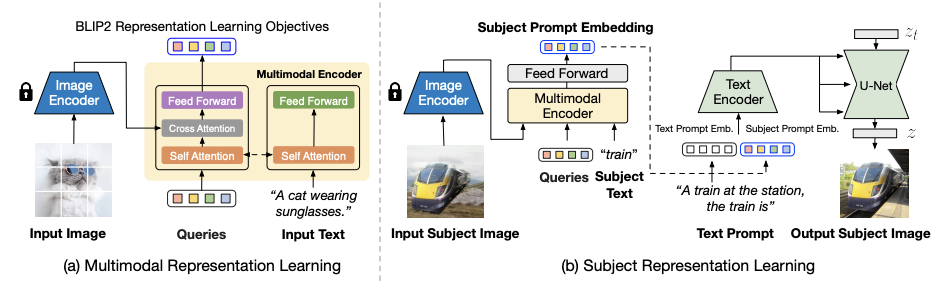

# BLIP-Diffusion 论文阅读

## 摘要翻译

主题驱动的文本到图像生成模型根据文本提示创造输入主题的新版本。现有模型存在长时间微调和难以保持主题保真度的问题。为了克服这些限制，我们引入了BLIP-Diffusion，这是一个支持多模态控制的新型主题驱动图像生成模型，它接受主题图像和文本提示作为输入。与其他主题驱动生成模型不同，BLIP-Diffusion引入了一个新的多模态编码器，该编码器经过预训练，用于提供主题表示。我们首先使用BLIP-2进行预训练，以生成与文本对齐的视觉表示。然后，我们设计了一个主题表示学习任务，使扩散模型能够利用这种视觉表示并生成新的主题版本。与之前的方法（如DreamBooth）相比，我们的模型实现了 Zero-shot 主题驱动生成，并且可以高效地微调，速度提高了20倍。我们还证明了BLIP-Diffusion可以灵活地与现有技术（如ControlNet和prompt-to-prompt）结合使用，以实现新的主题驱动生成和编辑应用程序。实现代码将会公开。

## 文章核心

### BLIP-Diffusion模型

一个新的基于扩散的文本到图像生成模型，可以通过预训练的主体表示实现多模态控制。该模型可以根据输入的主体图像和文本提示，生成不同的主体呈现。

### 多模态表示学习

使用BLIP-2编码器从输入图像和主体类别文本中提取与文本对齐的主体视觉表示。**BLIP-2编码器是一个多模态变换器，使用可学习的查询令牌和自注意力层和交叉注意力层来融合图像和文本信息**。

### 主体表示学习

使用 Stable-Diffusion 模型从输入的主体视觉表示中生成新的主体呈现。为了训练扩散模型，设计了一个提示上下文生成的任务，其中**使用随机背景合成输入图像，并以原始主体图像为目标输出**。这样可以有效地分离前景主体和背景上下文，防止无关信息干扰主体表示。

### 微调和可控推理

预训练的主体表示支持零样本和高效微调的主体驱动生成。此外，该模型还可以与现有的技术结合，如ControlNet和prompt-to-prompt，实现结构控制和主体驱动的图像生成和编辑。

## 相关工作

### 扩散模型用于文本到图像生成

扩散模型是一种通过逐步去噪一个高斯随机变量来生成图像的方法。本文特别关注预训练的文本到图像的潜在扩散模型，它可以根据文本提示生成逼真的图像和图形。

### 主体驱动的文本到图像生成

给定一个主体的几张图片，主体驱动的文本到图像生成的任务是根据文本提示生成该主体**在新的场景中的不同呈现**。现有的模型通常需要对每个新主体进行大量的微调，这限制了它们的效率和泛化能力。最近的一些工作尝试通过预训练扩散模型在特定领域的图片上，或者使用检索增强的方法来减少微调的时间和精力。但是，这些方法也受到了主体类别的约束，不能很好地适应通用的主体。

### 多模态表示学习

多模态表示学习是指从不同类型的输入（如图像和文本）中提取有意义和一致的特征表示。这对于实现多模态控制和融合是非常重要的。本文借鉴了最近的视觉语言预训练模型BLIP-2，它可以产生与文本对齐的图像表示，并将其用于提取主体表示。

## 核心方法

  

如图是BLIP-Diffusion的整体架构。左边是多模态表示学习阶段，使用BLIP-2编码器来根据输入的图像和文本，输出与文本对齐的图像特征。右边是主题表示学习阶段，使用扩散模型来利用图像特征，生成不同的主题变化。具体来说，我们用随机背景合成输入图像，然后用BLIP-2编码器得到主题特征，再和文本提示结合，引导扩散模型生成目标图像。这样可以让扩散模型同时考虑主题和文本的信息，从而实现可控的主题驱动的图像生成。

### 模型介绍

BLIP-Diffusion是一个基于扩散模型的文本到图像生成模型，具有多模态控制的能力，可以利用输入的主题图像和文本提示来生成不同的主题变化。为了实现这一目标，模型采用了以下几个步骤：

1. 首先，模型使用BLIP-2编码器来提取多模态主题表示。BLIP-2编码器是一个视觉语言预训练模型，可以根据输入的图像和文本，输出与文本对齐的图像特征。BLIP-2编码器在通用的图像文本数据上进行了预训练，学习了丰富的视觉和语言概念。
2. 其次，模型使用稳定扩散模型来利用多模态主题表示，生成不同的主题变化。稳定扩散模型是一个基于CLIP文本编码器和U-Net的潜在扩散模型，可以根据文本提示逐步去噪一个随机变量，从而生成高质量的图像。为了让扩散模型能够同时考虑主题和文本的信息，我们设计了一个主题表示学习任务，在这个任务中，我们使用合成的输入图像和目标图像作为训练数据。具体来说，我们用随机背景合成输入图像，然后用BLIP-2编码器得到主题特征，再和文本提示结合，引导扩散模型生成目标图像。
3. 最后，模型可以在零样本或少样本的情况下进行微调和推理。给定一些主题图像和主题类别文本，我们首先用BLIP-2编码器得到主题表示，然后用它们的平均值作为主题提示嵌入。我们将主题提示嵌入添加到文本提示嵌入中，作为扩散模型的条件。我们在微调时固定图像编码器和文本编码器，只优化BLIP-2多模态编码器和U-Net的参数。我们发现一般在40-120步之后就可以得到满意的结果。在推理时，我们使用PNDM调度器进行100步去噪，并使用固定的引导比例7.5。

### 两阶段预训练策略

为了实现高质量和可控的主题驱动的图像生成，文章提出了一个两阶段的预训练策略。第一阶段是多模态表示学习，使用BLIP-2编码器在通用的图像文本数据上进行预训练。第二阶段是主题表示学习，使用扩散模型在合成的输入图像和目标图像上进行预训练。

### 零样本或少样本微调和推理

利用预训练的主题表示，模型可以在零样本或少样本的情况下进行微调和推理。给定一些主题图像和主题类别文本，首先用BLIP-2编码器得到主题表示，然后用它们的平均值作为主题提示嵌入。将主题提示嵌入添加到文本提示嵌入中，作为扩散模型的条件。在微调时固定图像编码器和文本编码器，只优化BLIP-2多模态编码器和U-Net的参数。作者发现一般在40-120步之后就可以得到满意的结果。在推理时，作者使用PNDM调度器进行100步去噪，并使用固定的引导比例7.5。

### 与其他技术结合

模型不仅可以实现主题驱动的图像生成，还可以与其他技术结合，实现更多有趣和有用的应用。例如，与ControlNet结合，可以实现结构控制和主题控制相结合的图像生成；与prompt-to-prompt结合，可以实现主题驱动的图像编辑。

  

如展示了BLIP-Diffusion模型与其他技术结合的两个应用。左边是ControlNet和主题控制相结合的图像生成，右边是主题驱动的图像编辑。具体来说：

- ControlNet和主题控制相结合的图像生成：BLIP-Diffusion与ControlNet 结合，可以实现同时根据输入的结构条件（如边缘图和深度图）和主题条件（如主题图像和文本提示）来生成图像。这样可以在保持主题外观的同时，调整主题的位置、大小、角度等。我们的模型不需要重新训练ControlNet的参数，只需要将其U-Net与BLIP-Diffusion的U-Net通过残差连接即可。
- 主题驱动的图像编辑：BLIP-Diffusion与prompt-to-prompt结合，可以实现根据文本提示来编辑图像中的主题部分。例如，我们可以将一只狗变成一个可爱的赛博朋克角色。为了实现这个功能，我们首先假设原始图像的生成过程是已知的，或者可以通过反演得到。然后，我们指定要编辑的文本标记，例如“狗”。接下来，我们用该标记的交叉注意力图来自动提取一个编辑区域的掩码。为了保留未编辑区域的布局和语义，我们保持原始生成时的注意力图，同时为插入的主题表示生成新的注意力图。我们根据提取的编辑掩码来混合每一步的去噪潜在变量。也就是说，未编辑区域的潜在变量来自原始生成，而编辑区域的潜在变量来自主题驱动生成。这样，我们就可以得到带有特定主题视觉效果的编辑图像，同时保留未编辑区域。

## 总结

BLIP-Diffusion模型是一种新型的文本到图像生成模型，具有多模态控制的能力，可以利用输入的主题图像和文本提示来生成不同的主题变化。该模型的优点包括：提出了BLIP-Diffusion模型，是第一个具有预训练主题表示的文本到图像生成模型；设计了一个两阶段的预训练策略，分别进行多模态表示学习和主题表示学习，提高了主题驱动的图像生成的质量和可控性；实现了零样本或少样本的主题驱动的图像生成，相比以往的方法大大提高了微调的效率和灵活性；与其他技术结合，实现了结构控制和主题控制相结合的图像生成，以及主题驱动的图像编辑等有趣和有用的应用。

但是该模型也存在一些局限性，例如：受限于底层扩散模型的能力，可能无法理解复杂或细致的文本提示，或者生成不符合语义或逻辑的图像；依赖于预训练数据的质量和数量，可能存在一些偏见或不恰当的内容，需要进行内容审核和监管；目前只能生成静态图像，无法生成动态或交互式的内容。

