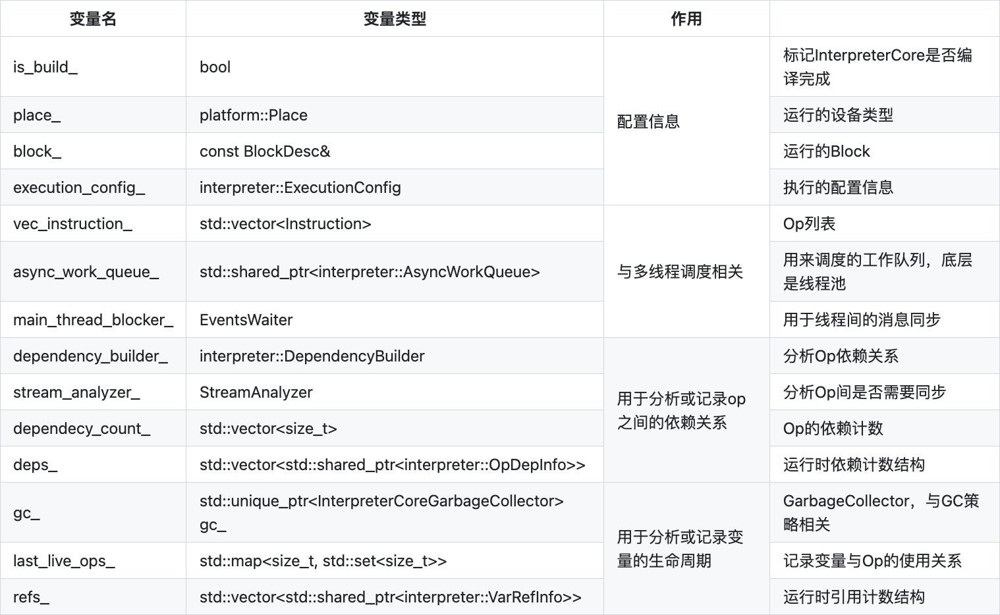
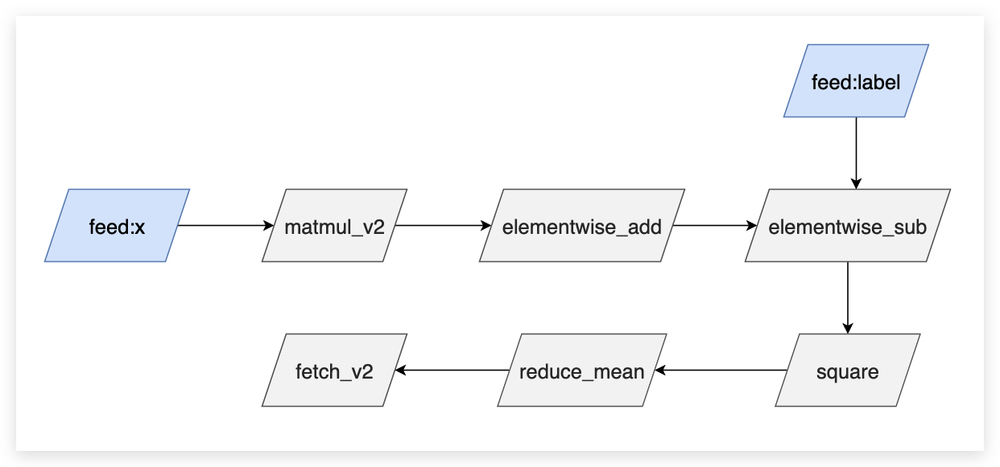

# 静态图执行过程

:::tip

本文在阅读 [文章](https://github.com/PaddlePaddle/community/blob/master/pfcc/paddle-code-reading/static_graph_execution/20221230_static_graph_execution.md) 时所做的笔记，主要是对静态图组网过程的理解。

全文结合 PaddlePaddle 的源码进行说明

:::

在上一篇文章中，我们已经对 PaddlePaddle 的静态图组网过程有了一个大致的了解，这一篇文章我们将对静态图执行过程进行分析。 接下来我们从 Python 侧和 C++ 侧两个入口进行分析。

## Python 侧入口

在组网完成以后，需要执行器执行 `Program` 进行训练。首先需要初始化一个 `Executor`，然后再通过 `executor` 运行 `startup_program`，进行参数的初始化，正式开始对网络的训练。 对应代码如下：

```python
# Executor 只需要在静态图模式下使用
paddle.enable_static()

# 设置运行的设备
# use_cuda = True
# place = paddle.CUDAPlace(0) if use_cuda else paddle.CPUPlace()
# exe = paddle.static.Executor(place)

# 如果不设置place，PaddlePaddle会自动选择一个默认的设备
exe = paddle.static.Executor()

train_program = paddle.static.Program()
startup_program = paddle.static.Program()
with paddle.static.program_guard(train_program, startup_program):
	data = paddle.static.data(name='X', shape=[None, 1], dtype='float32')
	hidden = paddle.static.nn.fc(data, 10)
	loss = paddle.mean(hidden)
	paddle.optimizer.SGD(learning_rate=0.01).minimize(loss)

# 运行一次startup_program，初始化参数
# 不需要优化/编译 startup_program
exe.run(startup_program)

# 直接运行主程序，不需要编译
x = numpy.random.random(size=(10, 1)).astype('float32')
loss_data, = exe.run(train_program, feed={"X": x}, fetch_list=[loss.name])

# 或者也可以先编译主程序，然后再运行，参考 `CompiledProgram` 获取更多信息
compiled_prog = paddle.static.CompiledProgram(
	train_program)
loss_data, = exe.run(compiled_prog, feed={"X": x}, fetch_list=[loss.name])
```

`exe = Executor(place)` 的作用是初始化一些变量，没有特别重要的内容，特别是这里并没有真正的创建执行器。 下面直接来看run方法的执行流程。

```
# https://github.com/PaddlePaddle/Paddle/blob/develop/python/paddle/fluid/executor.py#L1449
Executor.run
-> Executor._run_impl
-> _ExecutorCache._get_program_and_executor
-> nex_exe.run
```

:::note

`Executor`、`StandaloneExecutor`、`ParallelExecutor` 有什么区别？

`Executor._run_impl` 中的执行器有以下区别：

- `Executor`：支持单机单卡、单机多卡、CPU 等多种运行模式，是 PaddlePaddle 的核心执行器。
- `StandaloneExecutor`：支持单机单卡、单机多卡、CPU 等多种运行模式，可以在不依赖 PaddlePaddle 的环境下运行。
- `ParallelExecutor`：支持单机多卡、CPU 等多种运行模式，可以在训练过程中自动切分数据并分配到不同的设备上进行计算。

:::


`Executor._run_impl` 中有比较复杂的分支选择逻辑，会根据不同的配置或参数选择不同的执行器，如 `Executor`、`StandaloneExecutor`、`ParallelExecutor`，这里只介绍 `StandaloneExecutor` 的执行过程。其对应的相关代码为：

```python
# Executor._run_impl
# https://github.com/PaddlePaddle/Paddle/blob/develop/python/paddle/fluid/executor.py#L1633
if self._enable_interpreter_core and _can_use_interpreter_core(program, self.place):
    feed = self._update_feed(program, feed) # 如果Program中不包含相应的feed,就在这里去掉
    program, new_exe = self._executor_cache.get_program_and_executor(
                program, feed,
                fetch_list, feed_var_name,
                fetch_var_name, self.place, scope,
            )
    
    #添加feed相应的variable并设置其值
    self._feed_data(program, feed, feed_var_name, scope)
	...
	return new_exe.run(
		scope, list(feed.keys()), fetch_list, return_numpy
	)
```

:::note

[https://github.com/PaddlePaddle/Paddle/blob/develop/python/paddle/fluid/executor.py#L1484](https://github.com/PaddlePaddle/Paddle/blob/develop/python/paddle/fluid/executor.py#L1484)

里面的不同 `Program` （program._pipeline_opt、program._heter_pipeline_opt 等）是用来干什么的？

`program._pipeline_opt` 和 `program._heter_pipeline_opt` 是 PaddlePaddle 框架中的两个类，用于支持异构计算和管道并行计算。其中，`program._pipeline_opt` 是用于管道并行计算的，而 `program._heter_pipeline_opt` 是用于异构计算的。这两个类都是用来优化模型训练的，可以提高训练速度和效率。

:::

对于 `Program` 和 `Executor`，是存在 `cache` 机制的，对于同一个 `Program`，我们会缓存它的执行器，缓存的key结构如下： `program.desc.cached_hash_str() + _get_program_cache_key(feed, fetch_list)` 这里key分为两部分，第一部分是 `ProgramDesc` 中 `cached_hash_str` 字段

```cpp
// https://github.com/PaddlePaddle/Paddle/blob/develop/paddle/fluid/framework/program_desc.cc#L260
desc_.SerializePartialToString(&serialize_str); //这里是ProgramDesc的protobuf序列化得到的字符串
cached_hash_str_ = std::to_string(XXH64(serialize_str.c_str(), serialize_str.size(), 1));
```

第二部分是程序接收的输入和输出，`_get_program_cache_key(feed, fetch_list)`。

每次调用 `executor.run` 的时候，如果 `ExecutorCache(LruCache)` 没有命中，就需要新建一个出来：

```python
def _get_program_and_executor(self, cached_data):
    # ... 略去一些参数初始化和其他执行器分支
    
    program = _add_feed_fetch_ops(program=inner_program,
                          feed=feed,
                          fetch_list=fetch_list,
                          feed_var_name=feed_var_name,
                          fetch_var_name=fetch_var_name,
                          use_fetch_v2=True)

    enable_inplace = True if build_strategy is None or build_strategy.enable_inplace else False
    enable_addto = True if build_strategy is not None and build_strategy.enable_addto else False
    if enable_inplace or enable_addto:
        # inplace should skip feed and fetch var
        skip_var_names = eval(_get_program_cache_key(feed, fetch_list))
        _apply_inplace_addto_pass(program, enable_inplace, enable_addto,
                                  skip_var_names)

    new_program = program.clone()
    new_exe = _StandaloneExecutor(place, new_program, scope)
    return new_program, new_exe
```

在新建过程中，有两个对Program的修改：

1. 添加了`feed`和`fetch op`。对每个`feed`变量，都会添加一个`feed op`到`global block`；对每个`fetch`变量，都会添加一个`fetch`变量到`global block`。
2. 对`Program`开启了`inplace`和`addto`两个`pass`。这两个`pass`均与inplace`相关。

:::note

`feed op` 是用来将数据输入到模型中的操作符，`fetch op` 是用来从模型中获取输出数据的操作符。

在 Paddle 中，inplace pass 是一种优化策略，可以减少内存的使用，提高程序的运行效率。inplace pass 会将一些操作符的输出直接覆盖到输入变量中，从而减少内存的使用。而 addto pass 则是一种特殊的 inplace pass，它会将两个变量相加，并将结果直接覆盖到其中一个变量中。

:::

到这里，程序在 `python` 侧的执行就结束了，接下来会调用 `StandaloneExecutor` 在 `C++` 侧运行 `Program`。 

总的来说，在 Python 侧，主要是创建 `Program` 和 `Executor`，然后调用 `Executor.run` 运行 `Program`。

## C++ 侧入口

### 静态图相关概念

在解释静态图的执行过程之前，先来梳理一下之前涉及的一些与静态图相关的概念。首先对于静态图表示来说，最重要的是这些Desc后缀的类，它们是静态图的**表示核心**。在Python侧，我们为这些Desc定义了相应的接口类，便于在python侧进行组网操作。

在静态图执行的时候，这里的 `OpDesc` 和 `VarDesc` 就不能直接拿来使用了。因为它们缺少了重要的运行时信息，`VarDesc` 是不持有内存的，也就不保存数据。`OpDesc` 中是没有 `kernel` 相关的信息的，因而也不能得到具体的运算逻辑。运行时我们需要接触的两个对应的类型分别是 `Variable` 和 `OperatorBase`，它们分别持有了数据和计算逻辑。**执行器的关键一步就是从这里静态图的描述信息到运行信息的转化**。

`OpFuncNode/Instruction` 是新执行器在执行期间会用到的类，在概念上可以将其等价理解为 `OperatorBase`，不同在于附加了执行器运行期间需要的上下文信息

### StandaloneExecutor

执行器的任务是根据给定的 `ProgramDesc`，执行其中包含的Op，返回最后的结果。执行器需要处理的事情：

1. 变量(Variable)的创建、管理与释放
2. 算子(OperatorBase)的创建、调度执行

现存的执行器有Executor、PE和新执行器。这里我们以新执行器的执行流程为主，其他执行器目前都不推荐使用了。新执行器的正式名称是 `StandaloneExecutor`。

```cpp
class StandaloneExecutor {
 public:
  StandaloneExecutor(const platform::Place& place, const ProgramDesc& prog);
  ~StandaloneExecutor() {}
private:
  platform::Place place_;
  const ProgramDesc& prog_;
  std::unordered_map<std::string, std::shared_ptr<InterpreterCore>> interpretercores_;
}
```

其中 `place` 是指定的运算设备，`prog_` 是新执行器需要执行的 `Program`，`InterpreterCore` 是调度的核心。 这里的 `interpretercores_` 类型是`std::unordered_map<std::string, std::shared_ptr<InterpreterCore>>`，用于缓存 `InterpreterCore`。缓存的key的结构是 `feed:$feed,fetch:$fetch,scope:$scope`

:::note

InterpreterCore 是一个解释器，它可以解释 PaddlePaddle 的程序并执行它们。InterpreterCore 还可以将程序转换为可执行的代码，并将其传递给底层的执行引擎。

:::

`StandaloneExecutor` 首先尝试从 `interpretercores_` 中查询是否已经存在相应的核心，如果没有就新建一个，否则返回已存在的核心。并在 `run` 方法中调用该核心执行 `Program`，因此新执行器的核心类其实是 `InterpreterCore`，`StandaloneExecutor` 本身的作用很小。

InterpreterCore的主要成员变量如下:

  

InterpreterCore的run方法实现如下：

```cpp
paddle::framework::FetchList InterpreterCore::Run(
    const std::vector<std::string>& feed_names,
    const std::vector<phi::DenseTensor>& feed_tensors) {
  SetDeviceId(place_); // 指定运行设备，新执行器本身是只支持单机单卡运行Program的
  CheckCUDAGraphBeforeRun(feed_names); //检查是否已经启动了CUDA图模式

#ifdef PADDLE_WITH_MKLDNN
  platform::AttachPointerHashToMKLDNNKey(this, place_); // 附加指针哈希到MKLDNN key中
#endif

  bool is_build = is_build_;
  Prepare(feed_names, feed_tensors, is_build); // 准备运行所需的上下文信息

  if (is_build) {
    RunImpl(); // 当前Program应该是被动态图构建出来的，运行它的执行计算图的具体实现
  }

  if (HasLocalScope()) {
    ClearLoDTensorArrayInLocalScope(); // 在本地作用域中清除LoD Tensor Array
  }

  // 将Fetch Tensor返回
  auto* fetch_var = local_scope_->FindVar(interpreter::kFetchVarName); // 在本地作用域中查找Fetch Tensor
  if (fetch_var) {
    auto fetch_list = std::move(*fetch_var->GetMutable<framework::FetchList>()); // 获取Fetch Tensor
#ifdef PADDLE_WITH_CUDA
	// 如果CUDA图模式已经启动
    if (platform::IsCUDAGraphCapturing()) { 
	  // 获取数据时会出错
      PADDLE_ENFORCE_EQ(fetch_list.empty(),
                        true,
                        platform::errors::InvalidArgument(
                            "Cannot fetch data when using CUDA Graph.")); 
    }
#endif
    return fetch_list; // 返回Fetch Tensor
  } else {
    return {}; // 如果没有获取到Fetch Tensor则返回空列表
  }
}
```

`InterpreterCore` 的执行有两个分支，一种是尚未 `build` 执行 `build` 过程，另一种是 `build` 完成直接执行 `instruction` 的 `list`。需要说明的是，在 `build` 过程中，会顺序的调用每个op run一次，因此对于一个刚创建的 `InterpreterCore`，不需要连续调用两次 `run` 方法，一次 `build`，一次运行。 最后 `return` 的时候，在 `scope` 中查找名叫 `fetch` 的变量，返回该变量给用户。

新执行器的执行过程过程可以分为两步：

1. 预分析阶段：静态化运行时信息，分析变量生命周期，Op的依赖分析
2. 调度执行阶段：异步调度、跨流同步、算子执行、依赖更新、变量回收

## 预分析阶段

:::tip

为什么需要预分析的阶段？

预分析的主要核心作用就是：考虑执行一个Op需要哪些信息？哪些信息是可以复用的。

:::

对比最基础的 Executor 的实现，它的执行流程可以划分为以下几个步骤：

1. 调用 `OpRegistry::CreateOp(OpDesc)` 为每个 Op 实例化对应的 `OperatorBase`
2. 调用 `PrepareUnusedVars` 确定 Block 中的变量应该在第几个 Op 执行结束后回收
3. 为 Block 中的每个 VarDesc 实例化对应的 Variable ，这些 Variable 尚未持有真正的数据
4. 按顺序调用 Op->Run 方法，同时在 Op 执行结束后回收不需要用到的变量
  - 创建 `RuntimeContext` ：用于在 scope 中查找 op 需要的输入和输出变量
  - 创建 `ExecutionContext` ：用于 `kernel` 的选择和分发
  - 选择运算 kernel
  - 根据 `GetExpectedKernelType` 进行数据类型转换
  - 创建 `RuntimeInferShapeContext` ：用于推导变量的维度和类型
  - 调用 `infer_shape`
  - 执行 `kernel` 进行运算

上述过程中的第三步和第四步，每次 Executor 运行的时候都需要执行一遍，这里面很多的操作都可以通过缓存的方式避免重复运算。预分析的过程就是静态化这些运行信息，加速执行的过程。

预分析的第二个作用是为了并行调度和变量回收的准备工作。

```cpp
// 为Block中的每个VarDesc实例化对应的Variable，这些Variable尚未持有真正的数据，对应 Executor.3
paddle::framework::interpreter::BuildVariableScope(
        block_, execution_config_, &var_scope_);

// 按顺序调用Op->Run方法，并缓存部分信息，对应Executor.4
std::vector<paddle::framework::OpFuncNode> op_func_nodes;
paddle::framework::interpreter::BuildOpFuncList(
    place_,
    block_,
    execution_config_.skip_gc_vars,
    &op_func_nodes,
    &var_scope_,
    execution_config_,
    HasLocalScope(),
    static_build_);
// 对于用户输入的变量，在 var_scope_ 中将他们设置为跳过 inplace 相关判断，避免修改用户的输入变量
SetFeedVarsInplaceSkip(feed_names);
// 分析并确定op间的依赖关系，记录gc信息，可以对应Executor.2
Convert(&op_func_nodes);
// ???
UpdateSyncOpNum();
if (static_build_) {
  VLOG(4) << "RUN impl";
  RunImpl();
}
is_build_ = true;
```

当前需要处理的 `Program`

  

上述代码里面有几个核心的点，分别是 `BuildVariableScope`、`BuildOpFuncList`、`Convert`。 下面分别介绍这三个函数的作用。

### BuildVariableScope

BuildVariableScope 的内部核心代码如下：

```cpp
auto inner_scope = var_scope->GetMutableScope();

// created in var_scope.scope_ , and other scope is created in local scope.
// 这个 scope 是新执行器初始化时传入的 scope
Scope* local_scope = execution_config.create_local_scope
                          ? var_scope->GetMutableLocalScope()
                          : var_scope->GetMutableScope();

// 遍历创建 block 的所有 VarDesc 并实例化为 Variable，加入到 scope 中
for (auto& var_desc : block.AllVars()) {
  auto var_name = var_desc->Name();
  if (var_name == framework::kEmptyVarName) {
    continue;
  }

  if (var_desc->Persistable() ||
      execution_config.force_root_scope_vars.count(var_name)) {
    // 原则上，我们应该把所有可训练的参数放在全局作用域中，也就是作用域树的根。
    // 有些情况下，比如量化会在全局范围内查找这些参数。
    const Scope* ancestor_scope = inner_scope;
    while (ancestor_scope->parent()) {
      ancestor_scope = ancestor_scope->parent();
    }
    auto* ptr = const_cast<Scope*>(ancestor_scope)->Var(var_name);

    // 如果 var 存在于 scope 中并且类型正确
    // initializvariable 将不会创建一个新变量。
    InitializeVariable(ptr, var_desc->GetType());
  } else {
    auto* ptr = local_scope->Var(var_name);
    InitializeVariable(ptr, var_desc->GetType());
  }
  var_scope->AddVar(var_name, var_desc);
}
```

BuildVariableScope 遍历创建 block 的所有 VarDesc 并实例化为 Variable，加入到 scope 中。 scope 用于管理变量，op 在运行时从 scope 中查找输入和输出变量。

```cpp
class Scope {
  mutable std::unordered_map<std::string, std::unique_ptr<Variable>, KeyHasher> vars_;
  mutable std::list<Scope*> kids_;
  const Scope* parent_{nullptr};
}
```

scope 的底层数据结构是一个多叉树，树根这层用于保存 Parameter，也就是可训练的参数，第二层用于保存中间变量。一般执行器会默认传入的是树根这层，在树根的基础上自己创建一个 local_scope 并将运行期间产生的变量保存在 local_scope 中。

  


### BuildOpFuncList

这一步的主要目标是确定运行时 Op 需要的一些信息，比如 kernel 选择。相关信息保存在数据结构 OpFuncNode 中。

OpFuncNode 的定义如下：

```cpp
struct OpFuncNode {
  int stream_priority_{0};  // lower value, higher priority
  // fit for phi kernel
  phi::Kernel* phi_kernel_{nullptr};  // not owned
  platform::DeviceContext* dev_ctx_;  // not owned

  std::map<int, int> inplace_back_map;

  std::map<std::string, std::vector<int>> input_index;
  std::map<std::string, std::vector<int>> output_index;

  std::shared_ptr<OperatorBase> operator_base_;
  std::string execution_stream_{kDefaultStream};

  OpFuncType type_; // 用于决定在哪个线程池上进行调度，一般根据 kernel.place 决定
  OpKernelComputeFunc kernel_func_;

  SchedulingPriority scheduling_priority_{0};  // lower value, higher priority
};
```

这一步的主要逻辑如下：

**1、CreatorOps为每个Op实例化对应的OperatorBase**

**2、控制流op的内部变量的gc设置**

如果前向 op 中的变量会被反向 op 用到，那么该变量最终会被设置为 skip_gc_vars，跳过 gc 步骤。

```cpp
if (!used_for_jit) {
// If gc is enabled and block size > 1
const ProgramDesc& main_program = *block.Program();
operators::PrepareSafeEagerDeletionOnConditionalOpAndConditionalGradOp(
    main_program, block.ID(), ops_unique);
operators::PrepareSafeEagerDeletionOnWhileOpAndWhileGradOp(
    main_program, block.ID(), ops_unique);
operators::PrepareSafeEagerDeletionOnRecurrentOpAndRecurrentGradOp(
    main_program, block.ID(), ops_unique);
}
```

**3、 确定每个 op 执行结束后可以释放的变量的列表 unused_var_map**

用于在预分析阶段进行变量 GC。从前向后遍历 op 的输入输出，更新变量的生存周期为相应 op 的 index。

```cpp
std::unordered_map<const paddle::framework::OperatorBase*,
                   std::vector<std::string>>
GetUnusedVars(const BlockDesc& block,
              const std::vector<std::shared_ptr<OperatorBase>>& ops) {
  std::unordered_map<std::string, size_t> var_op_idx_map;

  for (size_t i = 0; i < ops.size(); ++i) {
    const auto& op = ops[i];

    OpInOutInfo info;
    // 判断输入是否可在此 op 执行后被回收
    for (auto& name_pair : op->Inputs()) {
      for (auto& name : name_pair.second) {
        // 变量存在，不是可训练参数，类型为需要回收的类型
        if (!var_can_be_deleted(name, block)) {
          continue;
        }
        // 部分Op如reshape不需要具体的数据，只需要形状信息，
        // 这时其输出变量的数据是不需要被回收的
        if (!info.IsBuilt()) {
          info.Build(op.get());
        }

        if (info.IsInArgBufferNeeded(name)) {
          // Update the last living op of variable to current op
          var_op_idx_map[name] = i;
        } else {
          VLOG(10) << "Skip reference count computing of variable "
                   << name_pair.first << "(" << name << ") in Operator "
                   << op->Type();
        }
      }
    }

    // 更新变量的存活周期
    for (auto& name_pair : op->Outputs()) {
      for (auto& name : name_pair.second) {
        if (var_can_be_deleted(name, block)) {
          // Update the last living op of variable to current op
          var_op_idx_map[name] = i;
        }
      }
    }
  }

  // 整理 name->op_index 到 op_index -> vector<name>
  std::unordered_map<const OperatorBase*, std::vector<std::string>> result;
  for (auto& name_op_idx_pair : var_op_idx_map) {
    auto& name = name_op_idx_pair.first;
    size_t op_idx = name_op_idx_pair.second;
    auto op = ops[op_idx].get();
    result[op].emplace_back(name);
    VLOG(4) << op->Type() << " " << name;
  }
  VLOG(4) << "gc map size:" << result.size();
  return result;
```


**4、 为每个op创建对应的OpFuncNode**

第一步需要创建 `BuildVariableMap`


VariableScope 的成员如下：

```cpp
std::vector<Variable*> var_list_;

std::map<std::string, int> name2id_;
// 变量的引用计数和是否可以inplace、var_desc
std::vector<VariableMetaInfo> vec_meta_info_;

Scope* scope_{nullptr};
Scope* local_scope_{nullptr};

// var_name -> var_type
std::vector<std::pair<std::string, int>> data_transfer_added_vars_;
```

VariableScope的作用和scope类似，区别在于它通过vector管理而非map。


### Convert


## 调度执行阶段