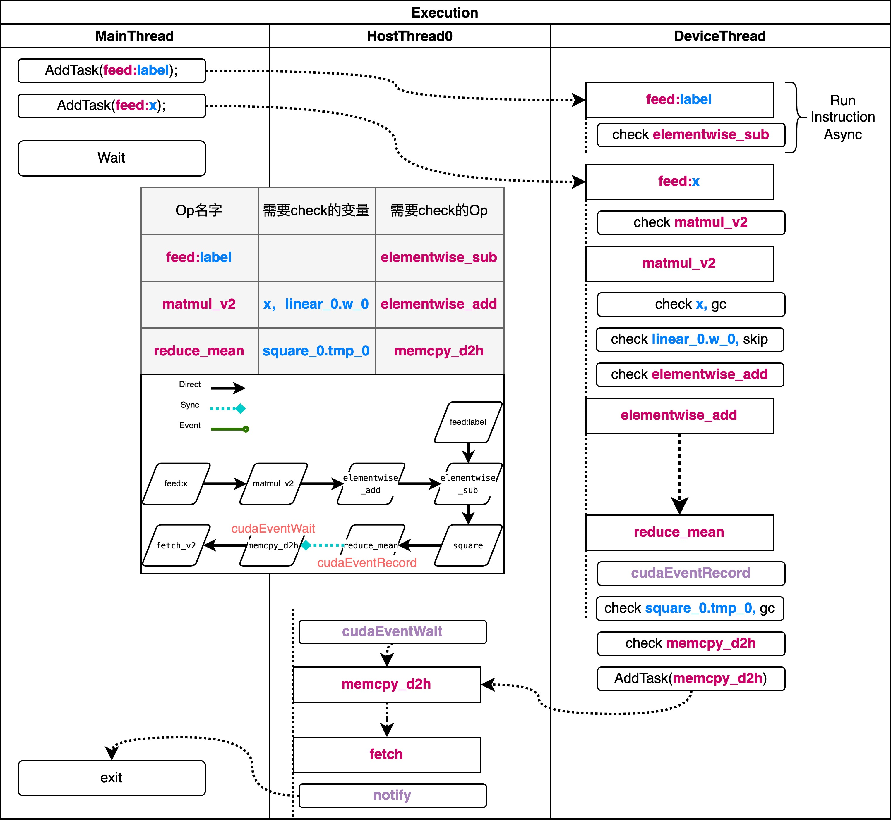
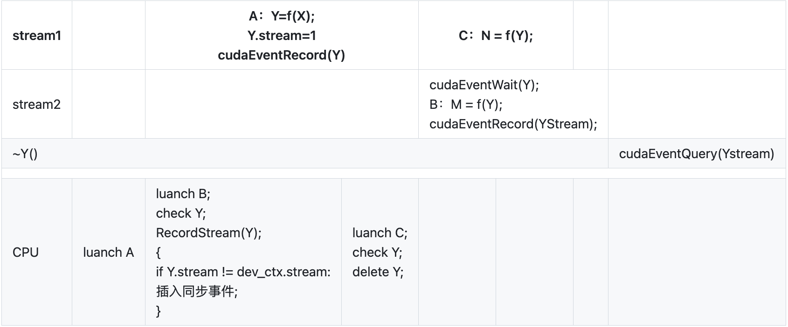

# 静态图执行过程

:::tip

本文在阅读 [文章](https://github.com/PaddlePaddle/community/blob/master/pfcc/paddle-code-reading/static_graph_execution/20221230_static_graph_execution.md) 时所做的笔记，主要是对静态图组网过程的理解。

全文结合 PaddlePaddle 的源码进行说明

:::

在上一篇文章中，我们已经对 PaddlePaddle 的静态图组网过程有了一个大致的了解，这一篇文章我们将对静态图执行过程进行分析。 接下来我们从 Python 侧和 C++ 侧两个入口进行分析。

## Python 侧入口

在组网完成以后，需要执行器执行 `Program` 进行训练。首先需要初始化一个 `Executor`，然后再通过 `executor` 运行 `startup_program`，进行参数的初始化，正式开始对网络的训练。 对应代码如下：

```python
# Executor 只需要在静态图模式下使用
paddle.enable_static()

# 设置运行的设备
# use_cuda = True
# place = paddle.CUDAPlace(0) if use_cuda else paddle.CPUPlace()
# exe = paddle.static.Executor(place)

# 如果不设置place，PaddlePaddle会自动选择一个默认的设备
exe = paddle.static.Executor()

train_program = paddle.static.Program()
startup_program = paddle.static.Program()
with paddle.static.program_guard(train_program, startup_program):
	data = paddle.static.data(name='X', shape=[None, 1], dtype='float32')
	hidden = paddle.static.nn.fc(data, 10)
	loss = paddle.mean(hidden)
	paddle.optimizer.SGD(learning_rate=0.01).minimize(loss)

# 运行一次startup_program，初始化参数
# 不需要优化/编译 startup_program
exe.run(startup_program)

# 直接运行主程序，不需要编译
x = numpy.random.random(size=(10, 1)).astype('float32')
loss_data, = exe.run(train_program, feed={"X": x}, fetch_list=[loss.name])

# 或者也可以先编译主程序，然后再运行，参考 `CompiledProgram` 获取更多信息
compiled_prog = paddle.static.CompiledProgram(
	train_program)
loss_data, = exe.run(compiled_prog, feed={"X": x}, fetch_list=[loss.name])
```

:::note

直接运行主程序和先编译主程序再运行有什么区别？

首先先解释一下什么是 startup_program, startup_program 是用来初始化参数的，比如初始化权重、偏置等。然后在进行后续的 `run` 操作。 在后续的 `run` 操作中，分为了俩种，一种是直接运行主程序，一种是先编译主程序再运行。先编译主程序的操作主要目的就是将你组好的网络，转换成底层的一些其他表达，在这个过程中会对网络去做很多的优化，比如去除一些不必要的计算，去除一些不必要的变量，去除一些不必要的操作等等。这些优化都是为了提升运行的效率。所以在运行的时候，如果你的网络比较复杂，建议使用 `CompiledProgram` 进行编译，这样可以提升运行的效率。

:::

`exe = Executor(place)` 的作用是初始化一些变量，没有特别重要的内容，特别是这里并没有真正的创建执行器。 下面直接来看run方法的执行流程。

```
# https://github.com/PaddlePaddle/Paddle/blob/develop/python/paddle/fluid/executor.py#L1449
Executor.run
-> Executor._run_impl
-> _ExecutorCache._get_program_and_executor
-> nex_exe.run
```

:::note

`Executor`、`StandaloneExecutor`、`ParallelExecutor` 有什么区别？

这三个执行器其实是 Paddle 开发历史中的产物，`Executor` 是最初的执行器，后来为了支持多卡训练，又引入了 `ParallelExecutor`，后来为了统一接口，又引入了 `StandaloneExecutor`。`StandaloneExecutor` 也叫做新执行器，老的执行器已经不再推荐使用了，会在未来的版本中被移除。

:::


`Executor._run_impl` 中有比较复杂的分支选择逻辑，会根据不同的配置或参数选择不同的执行器，如 `Executor`、`StandaloneExecutor`、`ParallelExecutor`，这里只介绍 `StandaloneExecutor` 的执行过程。其对应的相关代码为：

```python
# Executor._run_impl
# https://github.com/PaddlePaddle/Paddle/blob/develop/python/paddle/fluid/executor.py#L1633
if self._enable_interpreter_core and _can_use_interpreter_core(program, self.place):
    feed = self._update_feed(program, feed) # 如果Program中不包含相应的feed,就在这里去掉
    program, new_exe = self._executor_cache.get_program_and_executor(
                program, feed,
                fetch_list, feed_var_name,
                fetch_var_name, self.place, scope,
            )
    
    #添加feed相应的variable并设置其值
    self._feed_data(program, feed, feed_var_name, scope)
	...
	return new_exe.run(
		scope, list(feed.keys()), fetch_list, return_numpy
	)
```

:::note

[https://github.com/PaddlePaddle/Paddle/blob/develop/python/paddle/fluid/executor.py#L1484](https://github.com/PaddlePaddle/Paddle/blob/develop/python/paddle/fluid/executor.py#L1484)

里面的不同 `Program` （program._pipeline_opt、program._heter_pipeline_opt 等）是用来干什么的？

`program._pipeline_opt` 和 `program._heter_pipeline_opt` 都是 Paddle 里面用来处理流水线并行的，是在使用多机训练的时候用的。 program 中有很多类似这样的属性，根据这些属性就可以根据不同的业务模块，选择不同的执行体系。

:::

对于 `Program` 和 `Executor`，是存在 `cache` 机制的，对于同一个 `Program`，我们会缓存它的执行器，缓存的key结构如下： `program.desc.cached_hash_str() + _get_program_cache_key(feed, fetch_list)` 这里key分为两部分，第一部分是 `ProgramDesc` 中 `cached_hash_str` 字段。

```cpp
// https://github.com/PaddlePaddle/Paddle/blob/develop/paddle/fluid/framework/program_desc.cc#L260
desc_.SerializePartialToString(&serialize_str); //这里是ProgramDesc的protobuf序列化得到的字符串
cached_hash_str_ = std::to_string(XXH64(serialize_str.c_str(), serialize_str.size(), 1));
```

第二部分是程序接收的输入和输出，`_get_program_cache_key(feed, fetch_list)`。

每次调用 `executor.run` 的时候，如果 `ExecutorCache(LruCache)` 没有命中，就需要新建一个出来：

```python
def _get_program_and_executor(self, cached_data):
    # ... 略去一些参数初始化和其他执行器分支
    
    program = _add_feed_fetch_ops(program=inner_program,
                          feed=feed,
                          fetch_list=fetch_list,
                          feed_var_name=feed_var_name,
                          fetch_var_name=fetch_var_name,
                          use_fetch_v2=True)

    enable_inplace = True if build_strategy is None or build_strategy.enable_inplace else False
    enable_addto = True if build_strategy is not None and build_strategy.enable_addto else False
    if enable_inplace or enable_addto:
        # inplace should skip feed and fetch var
        skip_var_names = eval(_get_program_cache_key(feed, fetch_list))
        _apply_inplace_addto_pass(program, enable_inplace, enable_addto,
                                  skip_var_names)

    new_program = program.clone()
    new_exe = _StandaloneExecutor(place, new_program, scope)
    return new_program, new_exe
```

在新建过程中，有两个对Program的修改：

1. 添加了`feed`和`fetch op`。对每个`feed`变量，都会添加一个`feed op`到`global block`；对每个`fetch`变量，都会添加一个`fetch`变量到`global block`。
2. 对`Program`开启了`inplace`和`addto`两个`pass`。这两个`pass`均与inplace`相关。

:::note

`feed` 和 `fetch` 是用来做什么的

`feed` 和 `fetch` 是提供给用户的输入和输出的接口，用户可以通过 `feed` 和 `fetch` 来指定输入和输出的变量。 在用户层面的代码中会指定 `feed` 和 `fetch` 的变量，然后在底层的执行器中会根据这些变量来添加 `feed op` 和 `fetch op`。

```python 
x = numpy.random.random(size=(10, 1)).astype('float32')
loss_data, = exe.run(train_program, feed={"X": x}, fetch_list=[loss.name])
```

比如上面的代码，`feed` 中的 `X` 就是 `feed` 变量，`fetch_list` 中的 `loss.name` 就是 `fetch` 变量。

:::

到这里，程序在 `python` 侧的执行就结束了，接下来会调用 `StandaloneExecutor` 在 `C++` 侧运行 `Program`。 

总的来说，在 Python 侧，主要是创建 `Program` 和 `Executor`，然后调用 `Executor.run` 运行 `Program`。

## C++ 侧入口

### 静态图相关概念

在解释静态图的执行过程之前，先来梳理一下之前涉及的一些与静态图相关的概念。首先对于静态图表示来说，最重要的是这些Desc后缀的类，它们是静态图的**表示核心**。在Python侧，我们为这些Desc定义了相应的接口类，便于在python侧进行组网操作。

在静态图执行的时候，这里的 `OpDesc` 和 `VarDesc` 就不能直接拿来使用了。因为它们缺少了重要的运行时信息，`VarDesc` 是不持有内存的，也就不保存数据。`OpDesc` 中是没有 `kernel` 相关的信息的，因而也不能得到具体的运算逻辑。运行时我们需要接触的两个对应的类型分别是 `Variable` 和 `OperatorBase`，它们分别持有了数据和计算逻辑。**执行器的关键一步就是从这里静态图的描述信息到运行信息的转化**。

`OpFuncNode/Instruction` 是新执行器在执行期间会用到的类，在概念上可以将其等价理解为 `OperatorBase`，不同在于附加了执行器运行期间需要的上下文信息

### StandaloneExecutor

执行器的任务是根据给定的 `ProgramDesc`，执行其中包含的Op，返回最后的结果。执行器需要处理的事情：

1. 变量(Variable)的创建、管理与释放
2. 算子(OperatorBase)的创建、调度执行

现存的执行器有Executor、PE和新执行器。这里我们以新执行器的执行流程为主，其他执行器目前都不推荐使用了。新执行器的正式名称是 `StandaloneExecutor`。

```cpp
class StandaloneExecutor {
 public:
  StandaloneExecutor(const platform::Place& place, const ProgramDesc& prog);
  ~StandaloneExecutor() {}
private:
  platform::Place place_;
  const ProgramDesc& prog_;
  std::unordered_map<std::string, std::shared_ptr<InterpreterCore>> interpretercores_;
}
```

其中 `place` 是指定的运算设备，`prog_` 是新执行器需要执行的 `Program`，`InterpreterCore` 是调度的核心。 这里的 `interpretercores_` 类型是`std::unordered_map<std::string, std::shared_ptr<InterpreterCore>>`，用于缓存 `InterpreterCore`。缓存的key的结构是 `feed:$feed,fetch:$fetch,scope:$scope`

:::note

InterpreterCore 是一个解释器，它可以解释 PaddlePaddle 的程序并执行它们。InterpreterCore 还可以将程序转换为可执行的代码，并将其传递给底层的执行引擎。

:::

`StandaloneExecutor` 首先尝试从 `interpretercores_` 中查询是否已经存在相应的核心，如果没有就新建一个，否则返回已存在的核心。并在 `run` 方法中调用该核心执行 `Program`，因此新执行器的核心类其实是 `InterpreterCore`，`StandaloneExecutor` 本身的作用很小。 


InterpreterCore的主要成员变量如下:

  

InterpreterCore 的 run 方法实现如下：

```cpp
paddle::framework::FetchList InterpreterCore::Run(
    const std::vector<std::string>& feed_names,
    const std::vector<phi::DenseTensor>& feed_tensors) {
  SetDeviceId(place_); // 指定运行设备，新执行器本身是只支持单机单卡运行Program的
  CheckCUDAGraphBeforeRun(feed_names); //检查是否已经启动了CUDA图模式

#ifdef PADDLE_WITH_MKLDNN
  platform::AttachPointerHashToMKLDNNKey(this, place_); // 附加指针哈希到MKLDNN key中
#endif

  bool is_build = is_build_;
  Prepare(feed_names, feed_tensors, is_build); // 准备运行所需的上下文信息

  if (is_build) {
    RunImpl(); // 当前Program应该是被动态图构建出来的，运行它的执行计算图的具体实现
  }

  if (HasLocalScope()) {
    ClearLoDTensorArrayInLocalScope(); // 在本地作用域中清除LoD Tensor Array
  }

  // 将Fetch Tensor返回
  auto* fetch_var = local_scope_->FindVar(interpreter::kFetchVarName); // 在本地作用域中查找Fetch Tensor
  if (fetch_var) {
    auto fetch_list = std::move(*fetch_var->GetMutable<framework::FetchList>()); // 获取Fetch Tensor
#ifdef PADDLE_WITH_CUDA
	// 如果CUDA图模式已经启动
    if (platform::IsCUDAGraphCapturing()) { 
	  // 获取数据时会出错
      PADDLE_ENFORCE_EQ(fetch_list.empty(),
                        true,
                        platform::errors::InvalidArgument(
                            "Cannot fetch data when using CUDA Graph.")); 
    }
#endif
    return fetch_list; // 返回Fetch Tensor
  } else {
    return {}; // 如果没有获取到Fetch Tensor则返回空列表
  }
}
```

`InterpreterCore` 的执行有两个分支，一种是尚未 `build` 执行 `build` 过程，另一种是 `build` 完成直接执行 `instruction` 的 `list`。需要说明的是，在 `build` 过程中，会顺序的调用每个op run一次，因此对于一个刚创建的 `InterpreterCore`，不需要连续调用两次 `run` 方法，一次 `build`，一次运行。 最后 `return` 的时候，在 `scope` 中查找名叫 `fetch` 的变量，返回该变量给用户。

:::note

为什么需要这两个分支？这俩个分支有什么不一样的作用吗？

我们执行器的执行模式是先通过一次的预处理，在预处理的时候我们把很多可以复用的信息缓存下来，这样在后续的执行过程中就可以直接使用了，这样就可以减少很多重复的计算，提升执行效率。 如果不进行预处理，在跑网络的时候，很多事情都是需要边跑边做的，这样就会导致执行效率不高。但是对于网络的训练来说，我们每一轮的网络其实是一样的，只是输入的数据不一样，所以我们可以在第一轮的时候把这些可以复用的信息缓存下来，后续的执行就可以直接使用了。这里面最直接相关的就有 `静态选Kernel` 。原本的执行体系里面给 Op 去选 Kernel 也是一个耗费时间的问题，所以在预处理的时候如果可以把 Kernel 都选好，那么后续的执行就可以直接使用了。w

:::

新执行器的执行过程过程可以分为两步：

1. 预分析阶段：静态化运行时信息，分析变量生命周期，Op的依赖分析
2. 调度执行阶段：异步调度、跨流同步、算子执行、依赖更新、变量回收

## 预分析阶段

:::tip

为什么需要预分析的阶段？

预分析的主要核心作用就是：考虑执行一个Op需要哪些信息？哪些信息是可以复用的。

:::

对比最基础的 Executor 的实现，它的执行流程可以划分为以下几个步骤：

1. 调用 `OpRegistry::CreateOp(OpDesc)` 为每个 Op 实例化对应的 `OperatorBase`
2. 调用 `PrepareUnusedVars` 确定 Block 中的变量应该在第几个 Op 执行结束后回收
3. 为 Block 中的每个 VarDesc 实例化对应的 Variable ，这些 Variable 尚未持有真正的数据
4. 按顺序调用 Op->Run 方法，同时在 Op 执行结束后回收不需要用到的变量
  - 创建 `RuntimeContext` ：用于在 scope 中查找 op 需要的输入和输出变量
  - 创建 `ExecutionContext` ：用于 `kernel` 的选择和分发
  - 选择运算 kernel
  - 根据 `GetExpectedKernelType` 进行数据类型转换
  - 创建 `RuntimeInferShapeContext` ：用于推导变量的维度和类型 
  - 调用 `infer_shape` 
  - 执行 `kernel` 进行运算


上述过程中的第三步和第四步，每次 Executor 运行的时候都需要执行一遍，这里面很多的操作都可以通过缓存的方式避免重复运算。预分析的过程就是静态化这些运行信息，加速执行的过程。

预分析的第二个作用是为了并行调度和变量回收的准备工作。

```cpp
// 为Block中的每个VarDesc实例化对应的Variable，这些Variable尚未持有真正的数据，对应 Executor.3
paddle::framework::interpreter::BuildVariableScope(
        block_, execution_config_, &var_scope_);

// 按顺序调用Op->Run方法，并缓存部分信息，对应Executor.4
std::vector<paddle::framework::OpFuncNode> op_func_nodes;
paddle::framework::interpreter::BuildOpFuncList(
    place_,
    block_,
    execution_config_.skip_gc_vars,
    &op_func_nodes,
    &var_scope_,
    execution_config_,
    HasLocalScope(),
    static_build_);
// 对于用户输入的变量，在 var_scope_ 中将他们设置为跳过 inplace 相关判断，避免修改用户的输入变量
SetFeedVarsInplaceSkip(feed_names);
// 分析并确定op间的依赖关系，记录gc信息，可以对应Executor.2
Convert(&op_func_nodes);

UpdateSyncOpNum();
if (static_build_) {
  
  RunImpl();
}
is_build_ = true;
```

当前需要处理的 `Program`

  

:::note

这个图其实不是一个完成的 `Program` , 图里面只画出了 Op 的依赖关系，并没有详细的画出每一个 Op 的输入输出变量。

:::

上述代码里面有几个核心的点，分别是 `BuildVariableScope`、`BuildOpFuncList`、`Convert`。 下面分别介绍这三个函数的作用。

### BuildVariableScope

:::note

为什么需要 BuildVariableScope ？

一个网络在执行的时候有几个关键点，一个是计算（Op），第二个就是数据，数据也就是变量。第三个就是数据在运行的时候，管理数据的东西叫做 Scope。所以在第一轮构建的时候，就需要把这几个东西构建起来。 现在的 Scope 都被处理成了列表的形式，也就是处理成 `vector` 的类型，这样我们在索引的时候就非常快。 但是这个东西其实现在也没有在用了，我们现在用回了最原始的 Scope，因为我们的执行器是会做缓存的，所有的变量都有指针，这些指针都会缓存到了 context 里面（Op在执行的时候都是通过一个 context 的数据结构去存储它）。 Op 在计算的时候直接从 Context 里面取就可以了。 BuildVariableScope 这部分的代码在后续也会被清理掉。

:::

BuildVariableScope 的内部核心代码如下：

```cpp
auto inner_scope = var_scope->GetMutableScope();

// created in var_scope.scope_ , and other scope is created in local scope.
// 这个 scope 是新执行器初始化时传入的 scope
Scope* local_scope = execution_config.create_local_scope
                          ? var_scope->GetMutableLocalScope()
                          : var_scope->GetMutableScope();

// 遍历创建 block 的所有 VarDesc 并实例化为 Variable，加入到 scope 中
for (auto& var_desc : block.AllVars()) {
  auto var_name = var_desc->Name();
  if (var_name == framework::kEmptyVarName) {
    continue;
  }

  if (var_desc->Persistable() ||
      execution_config.force_root_scope_vars.count(var_name)) {
    // 原则上，我们应该把所有可训练的参数放在全局作用域中，也就是作用域树的根。
    // 有些情况下，比如量化会在全局范围内查找这些参数。
    const Scope* ancestor_scope = inner_scope;
    while (ancestor_scope->parent()) {
      ancestor_scope = ancestor_scope->parent();
    }
    auto* ptr = const_cast<Scope*>(ancestor_scope)->Var(var_name);

    // 如果 var 存在于 scope 中并且类型正确
    // initializvariable 将不会创建一个新变量。
    InitializeVariable(ptr, var_desc->GetType());
  } else {
    auto* ptr = local_scope->Var(var_name);
    InitializeVariable(ptr, var_desc->GetType());
  }
  var_scope->AddVar(var_name, var_desc);
}
```

BuildVariableScope 遍历创建 block 的所有 VarDesc 并实例化为 Variable，加入到 scope 中。 scope 用于管理变量，op 在运行时从 scope 中查找输入和输出变量。

```cpp
class Scope {
  mutable std::unordered_map<std::string, std::unique_ptr<Variable>, KeyHasher> vars_;
  mutable std::list<Scope*> kids_;
  const Scope* parent_{nullptr};
}
```

scope 的底层数据结构是一个多叉树，树根这层用于保存 Parameter，也就是可训练的参数，第二层用于保存中间变量。一般执行器会默认传入的是树根这层，在树根的基础上自己创建一个 local_scope 并将运行期间产生的变量保存在 local_scope 中。

  

:::note

`local_scope 这个设计有什么好处？`

我们知道根 Scope 中有很多参数，比如模型的参数。这些数据一般是不会被删除的，在训练的过程中有一些临时变量是需要动态删除的，比如在训练过程中，我们会把一些临时变量放在 `local_scope` 中，这样在训练一轮后，可以把整个 `local_scope` 删除掉，这样就可以节省内存，也可以避免有些变量中漏删除的情况。

:::


### BuildOpFuncList

这一步的主要目标是确定运行时 Op 需要的一些信息，比如 kernel 选择。相关信息保存在数据结构 OpFuncNode 中。

OpFuncNode 的定义如下：

```cpp
struct OpFuncNode {
  int stream_priority_{0};  // lower value, higher priority
  // fit for phi kernel
  phi::Kernel* phi_kernel_{nullptr};  // not owned
  platform::DeviceContext* dev_ctx_;  // not owned

  std::map<int, int> inplace_back_map;

  std::map<std::string, std::vector<int>> input_index;
  std::map<std::string, std::vector<int>> output_index;

  std::shared_ptr<OperatorBase> operator_base_;
  std::string execution_stream_{kDefaultStream};

  OpFuncType type_; // 用于决定在哪个线程池上进行调度，一般根据 kernel.place 决定
  OpKernelComputeFunc kernel_func_;

  SchedulingPriority scheduling_priority_{0};  // lower value, higher priority
};
```

这一步的主要逻辑如下：

**1、CreatorOps为每个Op实例化对应的OperatorBase**

**2、控制流op的内部变量的gc设置**

如果前向 op 中的变量会被反向 op 用到，那么该变量最终会被设置为 skip_gc_vars，跳过 gc 步骤。

```cpp
if (!used_for_jit) {
// If gc is enabled and block size > 1
const ProgramDesc& main_program = *block.Program();
operators::PrepareSafeEagerDeletionOnConditionalOpAndConditionalGradOp(
    main_program, block.ID(), ops_unique);
operators::PrepareSafeEagerDeletionOnWhileOpAndWhileGradOp(
    main_program, block.ID(), ops_unique);
operators::PrepareSafeEagerDeletionOnRecurrentOpAndRecurrentGradOp(
    main_program, block.ID(), ops_unique);
}
```

**3、 确定每个 op 执行结束后可以释放的变量的列表 unused_var_map**

用于在预分析阶段进行变量 GC。从前向后遍历 op 的输入输出，更新变量的生存周期为相应 op 的 index。

```cpp
std::unordered_map<const paddle::framework::OperatorBase*,
                   std::vector<std::string>>
GetUnusedVars(const BlockDesc& block,
              const std::vector<std::shared_ptr<OperatorBase>>& ops) {
  std::unordered_map<std::string, size_t> var_op_idx_map;

  for (size_t i = 0; i < ops.size(); ++i) {
    const auto& op = ops[i];

    OpInOutInfo info;
    // 判断输入是否可在此 op 执行后被回收
    for (auto& name_pair : op->Inputs()) {
      for (auto& name : name_pair.second) {
        // 变量存在，不是可训练参数，类型为需要回收的类型
        if (!var_can_be_deleted(name, block)) {
          continue;
        }
        // 部分Op如reshape不需要具体的数据，只需要形状信息，
        // 这时其输出变量的数据是不需要被回收的
        if (!info.IsBuilt()) {
          info.Build(op.get());
        }

        if (info.IsInArgBufferNeeded(name)) {
          // Update the last living op of variable to current op
          var_op_idx_map[name] = i;
        } else {
          
                   << name_pair.first << "(" << name << ") in Operator "
                   << op->Type();
        }
      }
    }

    // 更新变量的存活周期
    for (auto& name_pair : op->Outputs()) {
      for (auto& name : name_pair.second) {
        if (var_can_be_deleted(name, block)) {
          // Update the last living op of variable to current op
          var_op_idx_map[name] = i;
        }
      }
    }
  }

  // 整理 name->op_index 到 op_index -> vector<name>
  std::unordered_map<const OperatorBase*, std::vector<std::string>> result;
  for (auto& name_op_idx_pair : var_op_idx_map) {
    auto& name = name_op_idx_pair.first;
    size_t op_idx = name_op_idx_pair.second;
    auto op = ops[op_idx].get();
    result[op].emplace_back(name);
    
  }
  
  return result;
```


**4、 为每个op创建对应的OpFuncNode**

第一步需要创建 `BuildVariableMap`


VariableScope 的成员如下：

```cpp
std::vector<Variable*> var_list_;

std::map<std::string, int> name2id_;
// 变量的引用计数和是否可以inplace、var_desc
std::vector<VariableMetaInfo> vec_meta_info_;

Scope* scope_{nullptr};
Scope* local_scope_{nullptr};

// var_name -> var_type
std::vector<std::pair<std::string, int>> data_transfer_added_vars_;
```

VariableScope的作用和scope类似，区别在于它通过vector管理而非map。

### Convert

Convert 这一步主要完成了下面几件事情：


1. 依赖分析，构建调度关系： Convert 需要对计算图进行解析和分析，构建出每个算子的调度关系和执行顺序，以保证正确的计算顺序和结果。它会将每个算子与它的输入和输出之间的依赖关系分析出来，以构建执行图。
2. 计算变量生存周期： Convert 还需要分析计算图中每个变量在程序的哪个阶段使用，以确定它的生存周期，从而确定内存使用策略。例如，对于只在某个算子中使用的中间结果，可以采用动态内存分配策略，而对于前向传播结果和反向传播结果等持久化结果，则需要采用静态内存分配策略。
3. 缓存 Context： 在执行模型之前，需要将模型中的变量传输到设备上，这个过程称为上下文转换，如从CPU到GPU或多GPU之间。 Convert 还需要缓存中间变量和算子的 Context，以加速上下文转换和提高模型的训练和推理效率。
4. 运行时的依赖计数和引用计数： Convert 将根据构建执行图的依赖关系，为每个变量进行依赖计数和引用计数的设置。这样一来，当某个变量不再被使用时，可以及时回收对应的内存空间，从而避免内存泄漏问题。

在 Paddle 的代码里 Convert 的实现是在 `InterpreterCore::Convert` 里面，下面我们来分析一下这个函数的实现。

```cpp
// 一些初始化工作，包括给 Op 分配 dev_ctx

// 用于分析Op间的依赖关系，帮助后续对Op执行进行调度，方便并发执行
BuildOperatorDependences();

stream_analyzer_.ConstructEvents(&vec_instruction_);

// 计算变量的生存周期
// 这里略去代码，详见后续分析

// 缓存Context 
for (size_t i = 0; i < vec_instruction_.size(); ++i) {
    BuildAndCacheInstructionCtx(&vec_instruction_[i]);
}

// 运行时的依赖计数和引用计数
for (auto& dep : dependecy_count_) {
    deps_.emplace_back(std::make_shared<interpreter::OpDepInfo>(dep));
}
for (size_t i = 0; i < vec_meta_info.size(); ++i) {
  refs_.emplace_back(std::make_shared<interpreter::VarRefInfo>(
      vec_meta_info[i].var_ref_count_, var_scope_.VarRef(i)));
}
```

可以看到，Convert 主要完成了上面提到的四件事情，下面我们来分析一下这四件事情的具体实现。

#### BuildOperatorDependences

这一步的作用是进行依赖分析，最终目标是建立 Instruction 之间的 `DAG图`，便于后续并行调度。Instruction 中包含了上一步中建立的 OpFuncNode 作为成员变量，它是调度的一个基础单位。 Instruction的图结构是一种邻接链表的方式存储的，每个节点存储他能到达邻居节点。我们希望确定如果一个op执行完了，接下来哪些op的输入准备好了，怎么去调度这些op。

:::note 

DAG图是有向无环图（Directed Acyclic Graph）的简称，它是一种图论结构。DAG图是一些点和线的集合，其中点表示计算或操作，线表示它们之间的依赖关系。

:::

Instruction 的结构如下：

```cpp
class Instruction {
  ...
  private:
    ...
    std::vector<size_t> next_instrs_in_different_thread;
    std::vector<size_t> next_instrs_in_same_thread;

    std::shared_ptr<EventInter> event_to_record_;
    std::vector<EventInter> events_to_wait_;

    OpFuncNode op_func_node_;
    const platform::DeviceContext& dev_ctx_;  // not owned

    std::shared_ptr<RuntimeContext> runtime_ctx_;
    std::shared_ptr<RuntimeInferShapeContext> infershape_ctx_;
    std::shared_ptr<ExecutionContext> execution_ctx_;

    std::vector<size_t> gc_check_vars_;

    std::vector<std::pair<Variable*, Variable*>> vec_inplace_in_to_out_;
}
```

其中 `next_instrs_in_different_thread` 和 `next_instrs_in_same_thread` 分别表示不同线程和同一线程中下一个执行。 这些信息都会被用于构建执行图。

一个 `Instruction` 的后继节点按照这两个 Op 的关系被分为三类，这三类后继节点在调度时不会有特殊处理。这一步的最终目的就是完成这个数据结构的构建，用于后续的并行调度中。整体过程可以大致分为两步：

1. 依赖分析：确定Op执行的先后关系
2. 调度策略：确定后继节点的调度类型

```cpp
void InterpreterCore::BuildOperatorDependences() {
  // 依赖分析：构建节点之间的依赖关系，设置依赖计数和引用计数
  // 获取节点的数量
  size_t instr_num = vec_instruction_.size();
  // 初始化节点的依赖计数和引用计数
  dependecy_count_ = std::vector<size_t>(instr_num, 0);
  // 调用 dependency_builder_ 对象的 Build 函数，确定 Op 执行的先后关系 构建节点之间的依赖关系
  auto downstream_map = dependency_builder_.Build(vec_instruction_);

  // 遍历每个节点，设置其对应的下一步节点列表和依赖计数
  for (size_t instr_id = 0; instr_id < instr_num; ++instr_id) {
    // 获取当前访问的节点
    Instruction& cur_instr = vec_instruction_[instr_id];
    // 获取当前节点的下一步节点列表
    const std::set<size_t>& next_instr_ids = downstream_map[instr_id];

    // 根据节点类型，将下一步节点分为同步和异步两种类型
    if (FLAGS_new_executor_serial_run) {
      // 在同一线程内运行的异步节点
      for (size_t next_instr_id : next_instr_ids) {
        cur_instr.AddNextInstrInSameThread(next_instr_id);
      }
    } else {
      if (cur_instr.KernelType() == OpFuncType::kGpuAsync) {
        // 异步运行的异步节点
        for (size_t next_instr_id : next_instr_ids) {
          if (vec_instruction_[next_instr_id].KernelType() ==
              OpFuncType::kGpuAsync) {
            cur_instr.AddNextInstrInSameThread(next_instr_id);
          } else {
            cur_instr.AddNextInstrInDifferentThread(next_instr_id);
          }
        }
      } else {
        // 同步运行的异步和同步节点
        bool has_instr_in_same_thread = false;
        for (size_t next_instr_id : next_instr_ids) {
          if (!has_instr_in_same_thread &&
              vec_instruction_[next_instr_id].KernelType() !=
                  OpFuncType::kGpuAsync) {
            cur_instr.AddNextInstrInSameThread(next_instr_id);
            has_instr_in_same_thread = true;
          } else {
            cur_instr.AddNextInstrInDifferentThread(next_instr_id);
          }
        }
      }
    }

    // 确定op的依赖计数, 即入度数
    for (size_t next_instr_id : next_instr_ids) {
      ++dependecy_count_[next_instr_id];
    }
  }
}

```

我们可以看到这段代码主要完成了以下几个任务：

1. 对计算图进行依赖分析，构建节点之间的依赖关系，为每个算子设置相应的依赖计数和引用计数；
2. 根据计算节点的类型（同步/异步），将下一步节点列表分为同步和异步两种类型；
3. 确定op的依赖计数, 即入度数

##### 依赖分析

下面我们来看一下依赖分析的具体实现。

```cpp
const std::map<size_t, std::set<size_t>>& DependencyBuilder::Build(
    const std::vector<Instruction>& instructions) {
  if (is_build_) {
    return op_downstream_map_;
  }

  instructions_ = &instructions;
  op_num_ = instructions_->size();

  ops_before_.assign(op_num_, {});
  ops_behind_.assign(op_num_, {});
  op_happens_before_.assign(op_num_, std::vector<bool>(op_num_, false));
  // 主要目的是得到这样的一个数据结构 Dict[OpIndex -> IndexOfAllOpDependsOnIt]
  // 这一步结束后已经具备了一个DAG图
  BuildDownstreamMap();
  // 去除DAG图中对调度而言不必要的边
  ShrinkDownstreamMap();
  
  // 部分Op会带来一些隐式依赖，如随机数算子(如uniform_random), 这些算子需要单独处理
  if (FLAGS_new_executor_sequential_run) {
    AddDependencyForSequentialRun();
  }
  AddDependencyForCoalesceTensorOp();
  if (FLAGS_add_dependency_for_communication_op) {
    AddDependencyForCommunicationOp();  
  }
  AddDependencyForRandomOp();
  AddDependencyForReadOp();

  is_build_ = true;

  return op_downstream_map_;
}
```

那么 DAG 是如何构建的呢？ DAG 的构建主要遵循以下规则：

1. 情况1

```
A writes X
B reads X
then A -> B
```

2. 情况2

```
//some other ops writes X
A reads X
B writes X
then A -> B
```

此时依然要保证A在B前面执行，因为A读取的值不应该是B写入的值

3. 情况3

```
 A writes X
//some other ops reads X
B writes X
then A -> B
```

在根据上述规则构建 DAG 图之后，我们还需要消去多余的依赖。比如我们构建了一个依赖边 `a->b->c` ，此时 c 依赖 a 和 b，但是只要保证它在 b 后面执行即可，不需要额外保证在 a 后面执行。因此保留依赖 `a->b` 和 `b->c`，去掉 `a->c`。

##### 确认调度策略

在依赖分析完成之后，我们获得了一个 DAG 图。 之后我们需要确认调度的策略，看看那些 Op 是可以并行执行的，那些 Op 是需要串行执行的。 

:::tip

什么情况下两个Op的执行需要同步？

当它们存在依赖关系又可能异步执行的时候，比如 A writes x, B reads x 这种关系的时候。这时候需要保证B执行的时候A已经执行完了。

:::

  

新执行器会按下面的分类把Op分为三类，后续调度时的逻辑略有不同。

1. direct_run：串行情况，表示可以在当前线程直接拉起，不需要切换线程。目前包含如下 4 种情况： `a. GPU -> GPU(same stream) b. CPU -> CPU c. CPU -> H2D d. D2H -> CPU`
2. synchornize_run： 并行，后续Intruction是个昂贵的同步等待操作，建议放到单独一个线程执行，如： `a. GPU -> D2H`，因为 GPUKernel很快拉起后，可能在stream排队，下游D2H需要等待数据，且此操作是个sync操作
3. event_run：并行，后续 Instruction 与当前Op不属于一个stream流，需要额外处理 `a. H2D -> GPU b. GPU -> GPU(different stream)`


:::note

什么是 Events ???


:::


##### 

### 小节

预分析阶段有三个主要任务：

1. 静态化信息：context缓存、运行时的数据类型转换改为插入op、kernel的选择
2. 分析变量生命周期，确定在op执行结束后需要检查哪些变量的引用计数
3. 依赖分析，确定在op执行结束后需要检查哪些op的依赖计数

## 调度执行阶段

InterpreterCore 在 build 结束后的执行逻辑中，需要关注的比较重要的部分要两点：

1. 后继op的调度执行
2. 多流同步下的显存回收

```cpp
// lazy initialization of gc, do not create gc is the program only run once
if (!gc_) {
  // 在这里面选择具体的 GC策略，由设备类型和 flag 控制
  // 下面分析时考虑目前默认的 InterpreterCoreFastGarbageCollector 策略
  gc_ = CreateInterpreterCoreGarbageCollector(place_, vec_instruction_);
}

interpreter::ResetAtomicGuard guard(&deps_, &refs_);

if ((execution_config_.used_for_jit || execution_config_.used_for_cinn) &&
    (sync_op_num_ == 0)) {
  VLOG(4) << "Tracing Instruction List";
  TraceInstructionList(vec_instruction_);
} else {
  VLOG(4) << "Non-tracing";
  // For the program that only run once, it is no need to
  // create work_queue, so the async_work_queue_ is created
  // until the second step run.
  async_work_queue_ = GetWorkQueue();
  ExecuteInstructionList(vec_instruction_);
}
```

:::note

什么是 GC ?

GC （Garbage Collection，垃圾回收）策略是指在计算机程序中，用于管理动态分配的内存的策略。在许多编程语言中，程序员需要手动分配和释放内存。如果程序员不合理地分配或释放内存，可能会导致内存泄漏或指针错误等问题。而垃圾回收机制则可以自动地管理内存分配和释放过程，使得程序员无需手动管理内存，并且程序的内存使用更加稳定可靠。

:::

:::note

Paddle 中的 GC 策略是什么样的？

:::

### Op 的整体调度过程

启动过程的代码如下

```cpp
void InterpreterCore::ExecuteInstructionList(
    const std::vector<Instruction>& vec_instr) {
  unfinished_op_number_ = vec_instr.size();
  if (unfinished_op_number_ == 0) {
    VLOG(4) << "No op to run, return";
    return;
  }

  exception_holder_.Clear();

  for (size_t i = 0; i < dependecy_count_.size(); ++i) {
    if (dependecy_count_[i] == 0) {
      // 记录从设备到主机的数据传输（D2H）
      RecordMemcpyD2H(vec_instr.at(i));
      if (FLAGS_new_executor_serial_run) {
        RunInstructionAsync(i);
      } else {
        // 运行异步 op
        async_work_queue_->AddTask(vec_instr.at(i).KernelType(),
                                   [this, i] { RunInstructionAsync(i); });
      }
    }
  }

  // 进入阻塞状态，等待其他线程的完成
  auto event_name = main_thread_blocker_.WaitEvent();
  VLOG(1) << "main_thread_blocker_(" << &main_thread_blocker_
          << ") got event_name: " << event_name;
  // 异常处理部分省略 ...
}
```

这里的执行可以分为三步：

1. 初始化工作，包括重置运行时依赖计数和引用计数的 `dynamic_ref_`
2. 将每个一开始就可以执行的 Op 加入执行队列，具体运行每个 Op 的函数是 RunInstructionAsync
3. 等待所有任务运行完成。这里会调用 `main_thread_blocker_.WaitEvent` 进入阻塞，等待其他线程发现任务执行完成或失败后再退出


对于新执行器而言，他可以多线程地并发执行多个 Op，这里的 `async_work_queue_` `会将op调度到不同的线程上。workqueue` 的底层结构是线程池，线程池进行调度。 特殊之处在于新执行器会有两个不同的线程池，分别用于`设备线程`和 `host` 线程。线程池负责调度执行已经加入队列的任务，具体的执行的逻辑为 `RunInstructionAsync` ，它是线程循环执行的函数。 下面我们来看一下 `RunInstructionAsync` 的实现逻辑：

```cpp

void InterpreterCore::RunInstructionAsync(size_t instr_id) {
  SchedulingQueue ready_ops(instruction_scheduling_priority_less);
  ready_ops.push(instr_id);
  while (!ready_ops.empty()) {
    instr_id = ready_ops.top();
    ready_ops.pop();
    auto& instr_node = vec_instruction_.at(instr_id);

    // 执行单个Op的具体逻辑，具体见下一节分析，对op的调度执行不关键
    RunInstruction(instr_node);

    if (UNLIKELY(exception_holder_.IsCaught())) {
      VLOG(4) << "Exception caught";
      if (exception_notifier_ != nullptr) {
        exception_notifier_->NotifyEvent();
      }
      return;
    }
    
    VLOG(4) << "unfinished_op_number_: " << unfinished_op_number_;
    if (UNLIKELY(unfinished_op_number_.fetch_sub(
                     1, std::memory_order_relaxed) == 1)) {
      if (completion_notifier_ != nullptr) {
        completion_notifier_->NotifyEvent();
      }
    }

    RunNextInstructions(instr_node, &ready_ops);
  }
}

```


可以看到这里首先在一个空的执行队列中压入当前需要执行的 Op，然后开始执行 for 循环，运行当前 op，在运行完成后这里如果发现现在没有需要执行的 Op 了，那么就会调用 `notify`，通知其他线程和主线程结束。如果还有未完成 Op，进入`RunNextInstructions`，向执行队列中加入新的Op或把他们调度到别的地方去。


```cpp
void InterpreterCore::RunNextInstructions(const Instruction& instr,
                                          SchedulingQueue* reserved_next_ops) {
  platform::RecordEvent record(
      "RunNextInstructions", platform::TracerEventType::UserDefined, 10);

  // 用于判断下一个 Op 是不是准备好了
  // 通过其依赖计数判断。不管判断成不成功，依赖计数都会减一
  auto IsReady = [this](size_t next_id) {
    VLOG(4) << "op_id: " << next_id
            << ", remain deps: " << deps_[next_id]->DynamicDep();
    return deps_[next_id]->CheckAndDecrease();
  };

  // 在其他线程中的
  for (size_t next_instr_id : instr.NextInstrsInDifferenceThread()) {
    if (IsReady(next_instr_id)) {
      async_work_queue_->AddTask(
          vec_instruction_[next_instr_id].KernelType(),
          [this, next_instr_id]() { RunInstructionAsync(next_instr_id); });
    }
  }
  // 在相同线程中的
  for (size_t next_instr_id : instr.NextInstrsInSameThread()) {
    if (IsReady(next_instr_id)) {
      reserved_next_ops->push(next_instr_id);
    }
  }
}
```

在进行调度的时候, 会根据 Op 的类型，将 Op 分为两类，一类是在同一个线程中执行的，一类是在不同线程中执行的。对于同一个线程中执行的 Op，会将其加入到 `reserved_next_ops` 中，等待下一次调度。对于不同线程中执行的 Op，会将其加入到 `async_work_queue_` 中，等待线程池调度执行。

:::note

和原来的有什么不同？ 为什么要进行这样的修改？

:::

  

### 单个 Op 的执行过程

这部分逻辑位于RunInstructionAsync中，但是和调度无关。下面是相关代码：

```cpp
void InterpreterCore::RunInstruction(const Instruction& instr_node) {
  VLOG(5) << ...;

  auto* op = instr_node.OpBase();
  platform::RecordEvent instruction_event(
      op->Type(), platform::TracerEventType::Operator, 1);

  SetDeviceId(instr_node.DeviceContext().GetPlace());

  try {
    // 判断Op的前置要求是否完成
    // 与前面对stream的分析有关，执行cudaEventWait
    instr_node.WaitEvent(place_);

    if (!instr_node.IsArtificial()) {
      // 运行Op的主体部分
      RunOperator(instr_node);
      // 回收变量
      CheckGC(instr_node);
      // 记录表明Op已经完成
      interpreter::LogDeviceMemoryStats(place_);
    }

    instr_node.RecordEvent(place_);
  } catch ... // 略去异常处理的代码
}
```

首先我们先来分析一下 `RunOperator` :

```cpp
void InterpreterCore::RunOperator(const Instruction& instr_node) {
  auto* op = instr_node.OpBase();
  auto place = instr_node.DeviceContext().GetPlace();
  Scope* local_scope = HasLocalScope() ? var_scope_.GetMutableLocalScope()
                                       : var_scope_.GetMutableScope();
  VLOG(4) << "Start run " << place << " " << op->DebugStringEx(local_scope);

  auto op_with_kernel = dynamic_cast<const framework::OperatorWithKernel*>(op);
  {
    // If it is OperatorBase, InferShape do nothing.
    if (op_with_kernel != nullptr) {
      platform::RecordEvent infershape_event(
          "infer_shape",
          platform::TracerEventType::OperatorInner,
          1,
          platform::EventRole::kInnerOp);

      // see OperatorWithKernel::RunImpl in operator.cc for why
      if (!(op_with_kernel->HasAttr(kAllKernelsMustComputeRuntimeShape) &&
            op_with_kernel->Attr<bool>(kAllKernelsMustComputeRuntimeShape))) {
        op_with_kernel->Info().infer_shape_(
            instr_node.InnerInferShapeContext().get());
      }
      infershape_event.End();
      platform::RecordOpInfoSupplement(op->Type(),
                                       op->Attrs(),
                                       *(instr_node.InnerInferShapeContext()),
                                       *(instr_node.InnerRuntimeContext()),
                                       op->Id());
    }
  }
  if (op_with_kernel != nullptr && FLAGS_new_executor_use_inplace) {
    // TODO(xiongkun03) Does operator base support inplace ?
    for (auto& pair : instr_node.InplaceInfo()) {
      const auto& in = paddle::framework::details::GetTensorFromVar(pair.first);
      auto* out =
          paddle::framework::details::GetMutableTensorFromVar(pair.second);
      if (in.dims() == out->dims()) {
        out->ShareBufferWith(in);
      }
    }
  }

  {
    platform::RecordEvent compute_event(
        "compute",
        platform::TracerEventType::OperatorInner,
        1,
        platform::EventRole::kInnerOp);
    if (op_with_kernel == nullptr) {  // operator base
      instr_node.OpBase()->Run(*local_scope, place_);
    } else {
      phi::Kernel* kernel = instr_node.PhiKernel();
      if (kernel && kernel->IsValid()) {  // phi kernel
        if (kernel->GetKernelRegisteredType() ==
            phi::KernelRegisteredType::FUNCTION) {
          VLOG(4) << "Run function kernel: " << op->Type();
          VLOG(4) << instr_node.InnerRuntimeContext().get() << " "
                  << &instr_node.DeviceContext();
          phi::KernelContext phi_kernel_context;
          op_with_kernel->BuildPhiKernelContext(
              *instr_node.InnerRuntimeContext().get(),
              const_cast<platform::DeviceContext*>(&instr_node.DeviceContext()),
              &phi_kernel_context);

          (*kernel)(&phi_kernel_context);
        } else {
          VLOG(4) << "Run structure kernel: " << op->Type();
          (*kernel)(instr_node.InnerExecutionContext().get());
        }
      } else {  // fluid kernel
        instr_node.KernelFunc()(*instr_node.InnerExecutionContext().get());
      }
    }
  }

  VLOG(4) << "End run " << place << " " << op->DebugStringEx(local_scope);

  if (!instr_node.InplaceBackMap().empty()) {
    platform::RecordEvent inplaceback_event(
        "InplaceVarsBack", platform::TracerEventType::UserDefined, 10);
    auto& m = instr_node.InplaceBackMap();
    // NOTE(zhiqiu): same logic as TransferInplaceVarsBack() in operator.cc
    for (auto& p : m) {
      auto* transformed_tensor = GetMutableLoDTensorOrSelectedRowsValueFromVar(
          var_scope_.VarRef(p.first));
      auto* original_tensor = GetMutableLoDTensorOrSelectedRowsValueFromVar(
          var_scope_.VarRef(p.second));
      original_tensor->ShareDataWith(*transformed_tensor);
      VLOG(4) << "Transfer inplace variable back form "
              << var_scope_.GetNameById(p.first) << " to "
              << var_scope_.GetNameById(p.second);
    }
  }

  /*For profiling/benchmark only*/
  if (FLAGS_benchmark) {
    instr_node.DeviceContext().Wait();
#if defined(PADDLE_WITH_CUDA) || defined(PADDLE_WITH_HIP)
    PADDLE_ENFORCE_GPU_SUCCESS(platform::GpuGetLastError());
    VLOG(4) << "Operator(" << op->Type()
            << "): context wait and get last error";
#endif
  }

  // for debug nan/inf
  if (op_with_kernel != nullptr && FLAGS_check_nan_inf) {
    VLOG(4) << "Check nan/inf";
    framework::details::CheckOpHasNanOrInf(
        *op,
        *local_scope,
        place);  // TODO(xiongkun03) change it to inner scope.
  }
}
```

具体来说，它首先获取当前算子以及它所需要运行的设备；然后根据算子是否有kernel，分别进行shape推导和计算

它执行以下几个步骤：

1. 首先通过instrnode获取需要运行的operator，并获取它所需要的设备。
2. 根据此operator的类型，判断它是否具有kernel。
    - 如果不是 `OperatorWithKernel` 类型，则说明此 `operator` 不需要运行kernel，只需要运行 `RunImpl` 函数即可。
    - 如果是 `OperatorWithKernel` 类型，则需要进行shape推导和计算, 运行infershape函数推导出每个输入输出的shape。若该 operator 的所有 kernel 都必须计算 runtime shape，则直接跳过 shape 推导。最后通过`platform::RecordOpInfoSupplement`函数收集关于此operator的信息，供后续跟踪和调试。
3. 根据命令行参数 FLAGS_newexecutor_use_inplace 判断是否启用 inplace。 若启用，则将所有inplace的变量的结果从 transformed_tensor 转移回 original_tensor。
4. 运行 operator 的 kernel 函数。如果 operator 没有 kernel，直接运行 Run 函数。 如果 operator 有 kernel：若 kernel 是 `phi::kernel`，则需要检查它是否是函数类型，然后分别为执行上下文和kernel构建 phi kernel context。如果不是 phi kernel，则直接运行 kernel 的运算函数。
5. 将 inplace 变量的结果传回 original_tensor。

可以看到新执行器在Op运行时少了很多准备工作，这里主要是Context的准备和数据转换相关逻辑。 接下来分析GC部分 `CheckGC` 。

```cpp
void InterpreterCore::CheckGC(const Instruction& instr) {
  // 检查是否要进行垃圾回收，并记录事件
  platform::RecordEvent record(
      "CheckGC", platform::TracerEventType::UserDefined, 10);
// 如果定义了 PADDLEWITHCUDA 或 PADDLEWITHHIP，则调用 RecordStreamForGC 函数
#if defined(PADDLEWITHCUDA) || defined(PADDLEWITHHIP)
  RecordStreamForGC(instr);
#endif
  auto& varscope = varscope;
  // 遍历所有需要进行垃圾回收的变量
  for (auto varid : instr.GCCheckVars()) {
    // 打印当前变量名、变量 ID 和引用数量
    VLOG(4) << "GC:" << varscope.GetNameById(varid) << ", id:" << varid
            << ", ref:" << refs[varid]->DynamicRef();
    // 减少该变量的引用计数并返回是否可以进行删除
    bool isready = refsvar_id->CheckAndDecrease();
    // 如果该变量属于持久变量，则直接跳过
    if (varscope.VarDesc(varid) && varscope.VarDesc(varid)->Persistable()) {
      continue;
    }
    // 如果可以进行删除，则异步删除该变量
    if (isready) {
      VLOG(6) << "Async delete variable with name : "
              << varscope.GetNameById(varid);
      gc->Add(refs[varid]->Var(), instr);
    }
  }
}

```

这里的代码主要包含两部分：

1. `Record StreamGC`，为了多流下的 `FastGC` 服务
2. 更新变量的引用计数，回收引用计数为0的变量

代码中 `RecordStreamGC` 为了 `提前回收显存服务` 的。如果 `kernel1` 和 `kernel2` 使用同一个 `stream` 执行，那么在 `kernel1` 还没跑完的时候就可以标记 `kernel1` 使用的内存已经被释放，然后 `kernel2` 就可以直接使用这部分显存。这样做的前提是要保证释放的显存不会分配给其他 `kernel` 使用，因此这里在分配内存时，不同 `stream` 会有不同的独立显存块分配。 ???

新执行器默认会的GC策略FastGC会在Op执行结束后回收变量，对于异步类型的Op而言，上面提到提前释放不需要特殊实现就可实现，但是注意到这种提前释放需要一个重要前提，就是前后的kernel必须使用同一个stream执行。 如果stream是同一个，那么这里不需要做特殊处理，直接GC回收即可。但是如果stream不是同一个，那么就需要插入cudaEvent同步。

#### 多流同步实例

**1、同一个stream 的FastGC**

```
A：Y = f(X)
B: M = f(Y)
C: N = f(Y)
```

  

**2、不同stream直接FastGC引起的冲突**

  

**3、A->B、A->C stream_ananlyser插入同步事件的逻辑**

  

注意到上面的例子中有个问题，`M = fc(Y)` 在 `Y=fc(X) 未执行完之前就开始执行了，这种情况下调度的正确性是由之前的 `stream_ananlyser` 来保证的。 举例来说，这里检测到Y和M有依赖关系，而它们的 stream 又不是同一个，就会插入 cudaEvent 进行同步。

  

**4、A->B、A->C RecordStreamGC插入同步事件的逻辑**

  


## 小节

1、调度后继op，将其加入到对应类型的线程池中

2、 执行算子

3、回收变量

4、对于跨流的特殊处理


