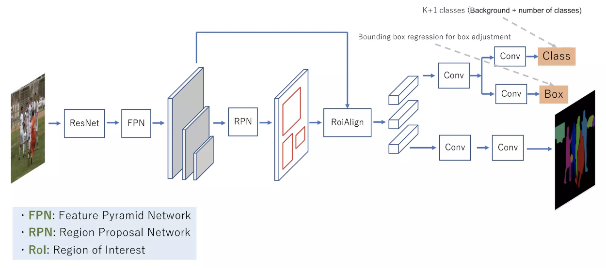

# MaskRCNN 源码解读（Paddle）

:::tip

代码主要结合 PaddleDetection 的源码进行解读

:::

## MaskRCNN 简介

MaskRCNN 是一种基于 FasterRCNN 的实例分割模型，其主要思想是在 FasterRCNN 的基础上增加一个分支用于预测目标的 mask，其网络结构如下图所示：

  

MaskRCNN 的核心组成部分有三个，分别是 RPN、RoIHead 和 MaskHead。RPN 层的主要作用是生成 RoI，RoIHead 层的主要作用是对 RoI 进行分类和回归，MaskHead 层的主要作用是对 RoI 进行 mask 预测。下面我们分别对这三个部分进行详细的介绍。

## MaskRCNN 配置文件

PaddleDetection是一个基于PaddlePaddle开发的产业级目标检测开发套件，其配置文件的格式与Detectron2的配置文件格式基本一致，下面我们以PaddleDetection的配置文件为例，介绍MaskRCNN的配置文件。

```yaml
# 模型配置

# 模型架构名称
architecture: MaskRCNN

# 预训练的骨干网络权重
# 从PaddleDet模型库中下载
pretrain_weights: https://paddledet.bj.bcebos.com/models/pretrained/ResNet50_cos_pretrained.pdparams 

# Mask R-CNN模型组件
MaskRCNN:

  # 骨干CNN网络
  backbone: ResNet
  # 区域提议网络头部
  rpn_head: RPNHead
  # 边界框回归头部
  bbox_head: BBoxHead
  # 掩码预测头部
  mask_head: MaskHead
  # 边界框后处理
  bbox_post_process: BBoxPostProcess
  # 掩码后处理
  mask_post_process: MaskPostProcess

# ResNet骨干网络配置
ResNet:

  # 使用ResNet-50
  depth: 50
  # 使用批规范化
  norm_type: bn
  # 冻结骨干网络到res2层
  freeze_at: 0
  # 返回从res2开始的特征图
  return_idx: [2]
  # 骨干网络中的层数
  num_stages: 3

# 区域提议网络头部
RPNHead:

  # 用于RPN的锚框生成器
  anchor_generator:
    # 锚框的长宽比
    aspect_ratios: [0.5, 1.0, 2.0]
    # 锚框尺寸 
    anchor_sizes: [32, 64, 128, 256, 512]
    # 锚框步长
    strides: [16]
  # RPN训练的锚框分配
  rpn_target_assign:
    # 每张图像的批量大小
    batch_size_per_im: 256
    # 正样本的比例
    fg_fraction: 0.5
    # 负样本的重合度阈值
    negative_overlap: 0.3
    # 正样本的重合度阈值
    positive_overlap: 0.7
    # 如果正样本过多则随机采样
    use_random: True

  # 训练时的提议框生成
  train_proposal:

    # 丢弃低于此大小的提议框
    min_size: 0.0
    # 非极大抑制阈值
    nms_thresh: 0.7
    # NMS前的topk个提议框
    pre_nms_top_n: 12000
    # NMS后的topk个提议框
    post_nms_top_n: 2000
    # 汇聚所有FPN层后的topk个提议框
    topk_after_collect: False

  # 测试时的提议框生成
  test_proposal:

    # 丢弃低于此大小的提议框
    min_size: 0.0
    # 非极大抑制阈值
    nms_thresh: 0.7
    # NMS前的topk个提议框
    pre_nms_top_n: 6000
    # NMS后的topk个提议框 
    post_nms_top_n: 1000

# 边界框回归头部
BBoxHead:

  # 使用Res5头部
  head: Res5Head
  # RoIAlign用于边界框特征提取
  roi_extractor:
    # 输出空间分辨率
    resolution: 14
    # RoIAlign的采样率
    sampling_ratio: 0
    # RoIAlign的输出对齐
    aligned: True

  # 训练时的边界框分配
  bbox_assigner: BBoxAssigner

  # 在全连接层前添加一个池化层
  with_pool: true

# 边界框分配配置
BBoxAssigner:

  # 每张图像的批量大小 
  batch_size_per_im: 512
  # 背景阈值
  bg_thresh: 0.5
  # 前景阈值
  fg_thresh: 0.5
  # 正样本的比例
  fg_fraction: 0.25
  # 如果正样本过多则随机采样
  use_random: True

# 边界框后处理
BBoxPostProcess:

  # 回归后解码边界框
  decode: RCNNBox
  # 多类非极大抑制
  nms:
    # NMS名称
    name: MultiClassNMS
    # NMS后保留的topk个数
    keep_top_k: 100
    # 置信度阈值
    score_threshold: 0.05
    # IOU阈值
    nms_threshold: 0.5

# 掩码预测头部
MaskHead:
  # 掩码特征层
  head: MaskFeat
  # RoIAlign用于掩码特征提取
  roi_extractor:
    # 输出空间分辨率
    resolution: 14
    # RoIAlign采样率
    sampling_ratio: 0
    # RoIAlign输出对齐
    aligned: True

  # 训练时的掩码分配
  mask_assigner: MaskAssigner

  # 与边界框头部共享卷积特征
  share_bbox_feat: true

# 掩码卷积层
MaskFeat:
  # 卷积层数
  num_convs: 0
  # 输出通道数
  out_channel: 256

# 掩码分配配置
MaskAssigner:
  # 掩码输出分辨率
  mask_resolution: 14

# 掩码后处理
MaskPostProcess:
  # 二值化掩码的阈值
  binary_thresh: 0.5
```


好的,这里详细介绍一下这个Mask R-CNN配置文件中每个模块的作用:

1. Backbone (骨干网络)：ResNet backbone用于从输入图像中提取特征图。这里使用ResNet-50,经过卷积和下采样提取了不同尺度的语义特征。

2. RPN (区域提议网络) ：RPN使用滑动窗口在backbone特征图上生成候选区域提议,提议可能包含潜在的物体。RPNHead产生anchor并对其进行refine。

3. RoI Align：将提议区域映射到backbone特征图上,采用RoI Align进行池化,获得固定长度的特征向量。

4. BBox Head：边界框回归分支,用于精炼提议框的坐标,使其更准确地预测物体边界框。

5. BBox Predictor：根据bbox head特征,预测物体类别和边界框坐标调整量。

6. BBox Assigner：训练时为提议框分配正负样本,用于训练BBox Predictor。

7. BBox Post Process：对预测的边界框执行解码和NMS,生成最后检测结果。

8. Mask Head：Mask分支,用于根据精炼后的提议框预测相应的物体掩码。

9. Mask Predictor：预测物体掩码图。

10. Mask Assigner：训练时为提议框分配真值掩码用于训练Mask Predictor。

11. Mask Post Process：对预测的掩码进行后处理,生成物体的二值掩码结果。

以上模块组合完成从RPN生成候选框,到精炼提议框和预测物体类别、边界框和掩码的整个流程。

下面我们会逐个模块进行详细介绍。

## MaskRCNN 主模型

在 `PaddleDetection/ppdet/modeling/architectures/mask_rcnn.py` 中定义了 MaskRCNN 的主模型，其的定义代码如下：

```python
@register
class MaskRCNN(BaseArch):
    """
    Mask R-CNN网络,参考论文https://arxiv.org/abs/1703.06870
    
    参数:
    backbone (object): 骨干网络实例
    rpn_head (object): RPN头部实例 
    bbox_head (object): 边界框回归头部实例
    mask_head (object): 掩码预测头部实例
    bbox_post_process (object): 边界框后处理实例
    mask_post_process (object): 掩码后处理实例
    neck (object): FPN网络实例
    """
    
    category = 'architecture' 
    inject = [
        'bbox_post_process',
        'mask_post_process',
    ]
    
    def __init__(self, 
                 backbone,
                 rpn_head,
                 bbox_head,
                 mask_head,
                 bbox_post_process,
                 mask_post_process,
                 neck=None):
                 
        # 初始化基类        
        super(MaskRCNN, self).__init__()  
        
        # 骨干网络 
        self.backbone = backbone  
        # FPN颈部网络
        self.neck = neck
        # RPN头部
        self.rpn_head = rpn_head
        # 边界框回归头部 
        self.bbox_head = bbox_head
        # 掩码预测头部
        self.mask_head = mask_head
        # 边界框后处理
        self.bbox_post_process = bbox_post_process
        # 掩码后处理
        self.mask_post_process = mask_post_process
```

当调用 `mask rcnn` 模型的时候会调用 `__init__` 函数，其会初始化骨干网络、FPN网络、RPN头部、边界框回归头部、掩码预测头部、边界框后处理和掩码后处理等模块。然后在 `forward` 函数中会调用这些模块进行前向计算，其代码如下：

```python
def _forward(self):

    # 获取骨干网络特征
    body_feats = self.backbone(self.inputs)  

    # 通过FPN获取多尺度特征 
    if self.neck is not None:
        with profiler.RecordEvent(name="MaskRCNN::neck"):
            body_feats = self.neck(body_feats)

    # 训练模式
    if self.training:
        
        # RPN头部生成提议框
        rois, rois_num, rpn_loss = self.rpn_head(body_feats, self.inputs)
        
        # 边界框回归头部损失和特征
        bbox_loss, bbox_feat = self.bbox_head(body_feats, rois, rois_num, self.inputs)
        
        # 获取精炼后的提议框
        rois, rois_num = self.bbox_head.get_assigned_rois()
        bbox_targets = self.bbox_head.get_assigned_targets()
        
        # 掩码头部损失
        # 掩码头部需要bbox_feat
        mask_loss = self.mask_head(body_feats, rois, rois_num, self.inputs,
                                    bbox_targets, bbox_feat)
        # 返回损失 
        return rpn_loss, bbox_loss, mask_loss

    # 测试模式
    else:
        rois, rois_num, _ = self.rpn_head(body_feats, self.inputs)
        # 边界框预测
        preds, feat_func = self.bbox_head(body_feats, rois, rois_num, None)
        
        # 获取图像信息
        im_shape = self.inputs['im_shape']
        scale_factor = self.inputs['scale_factor']
        
        # 边界框后处理
        bbox, bbox_num, nms_keep_idx = self.bbox_post_process(
            preds, (rois, rois_num), im_shape, scale_factor)
            
        # 掩码预测 
        mask_out = self.mask_head(
            body_feats, bbox, bbox_num, self.inputs, feat_func=feat_func)
        
        # 将预测结果映射回原图像
        bbox, bbox_pred, bbox_num = self.bbox_post_process.get_pred(
            bbox, bbox_num, im_shape, scale_factor)
        origin_shape = self.bbox_post_process.get_origin_shape()
        mask_pred = self.mask_post_process(mask_out, bbox_pred, bbox_num, origin_shape)

        # 记录附加输出数据
        if self.use_extra_data:
            extra_data = {} 
            extra_data['scores'] = preds[1] # 预测得分
            extra_data['nms_keep_idx'] = nms_keep_idx # NMS前的索引
            
        # 返回预测结果
        if self.use_extra_data:
            return bbox_pred, bbox_num, mask_pred, extra_data
        else:
            return bbox_pred, bbox_num, mask_pred
```

在训练模式下，会调用 RPN 头部生成提议框，然后调用边界框回归头部生成边界框，最后调用掩码预测头部生成掩码。在测试模式下，会调用 RPN 头部生成提议框，然后调用边界框回归头部生成边界框，最后调用掩码预测头部生成掩码。下面我们分别对这些模块进行详细的介绍。