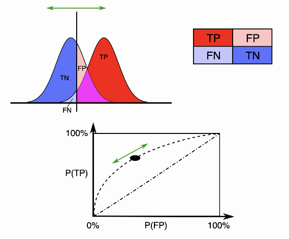

# 异常检测的评价指标

## AUROC

在机器学习的评估指标中，AUC是一个最常见也是最常用的指标之一。 AUC本身的定义是基于几何的，但是其意义十分重要，应用十分广泛。

在统计和机器学习中，常常用AUC来评估二分类模型的性能。AUC的全称是 area under the curve，即曲线下的面积。 通常这里的曲线指的是受试者操作曲线(Receiver operating characteristic, ROC)。 相比于准确率、召回率、F1值等依赖于判决阈值的评估指标，AUC则没有这个问题。

对于二分类问题，预测模型会对每一个样本预测一个得分s或者一个概率p。 然后，可以选取一个阈值t，让得分s>t的样本预测为正，而得分s<t的样本预测为负。这样一来，根据预测的结果和实际的标签可以把样本分为4类：

|  | 正样本 | 负样本 |
| :---: | :---: | :---: |
| 预测为正 | TP (真正例) | FP (假正例 ) |
| 预测为负 | FN (假负例 ) | TN (真负例) |

随着阈值t选取的不同，这四类样本的比例各不相同。定义真正例率TPR和假正例率FPR为：

$$
\begin{aligned}
&\mathrm{TPR}=\frac{\mathrm{TP}}{\mathrm{TP}+\mathrm{FN}} \\
&\mathrm{FPR}=\frac{\mathrm{FP}}{\mathrm{FP}+\mathrm{TN}}
\end{aligned}
$$

对于真正例率TPR, 分子是得分>t里面正样本的数目, 分母是总的正样本数目。而对于假正例率FPR, 分 子是得分 >t里面负样本的数目, 分母是总的负样本数目。因此, 如果定义 $N_{+}(t), N_{-}(t)$ 分别为得分大于 $\mathrm{t}$ 的样本中正负样本数目, $N_{+}, N_{-}$为总的正负样本数目, 那么TPR和FPR可以表达为阈值的函数

$$
\begin{aligned}
\operatorname{TPR}(t) &=\frac{N_{+}(t)}{N_{+}} \\
\operatorname{FPR}(t) &=\frac{N_{-}(t)}{N_{-}}
\end{aligned}
$$

随着阈值t的变化, TPR和FPR在坐标图上形成一条曲线, 这条曲线就是ROC曲线。显然, 如果模型是随 机的, 模型得分对正负样本没有区分性, 那么得分大于t的样本中, 正负样本比例和总体的正负样本比例 应该基本一致。也就是说

$$
\frac{N_{+}(t)}{N_{-}(t)}=\frac{N_{+}}{N_{-}}
$$

结合上面的式子可知TPR和FPR相等, 对应的ROC曲线是一条直线!

反之, 如果模型的区分性非常理想, 也就是说正负样本的得分可以完全分开, 所有的正样本都比负样本得 分高, 此时ROC曲线表现为「 字形。因为正例得分都比负例高, 所以要么TPR=0 要么 FPR=0。

  

实际的模型的ROC曲线则是一条上凸的曲线，介于随机和理想的ROC曲线之间。而ROC曲线下的面积，即为AUC。

## F1 Score

F1分数（F1 Score），是统计学中用来衡量二分类模型精确度的一种指标。它同时兼顾了分类模型的精确率和召回率。F1分数可以看作是模型精确率和召回率的一种加权平均，它的最大值是1，最小值是0。

### Precision 和 Recall 的计算

- Accuracy：表示预测结果的精确度，预测正确的样本数除以总样本数。
- Precision: 准确率，又称为查准率，表示预测结果中，预测为正样本的样本中，正确预测为正样本的概率；
- Recall: 召回率，又称为查全率，表示在原始样本的正样本中，最后被正确预测为正样本的概率；

$$
\begin{aligned}
&\text { Accuracy }=\frac{T P+T N}{T P+F T+T N+F N} \\
&\text { Precision }=\frac{T P}{T P+F P} \\
&\text { Recall }=\frac{T P}{T P+F N}
\end{aligned}
$$

### F分数(F-Score)

精确率(`Precision`)和召回率(`Recall`)评估指标,理想情况下做到两个指标都高当然最好，但一般情况下，`Precision`高，`Recall`就低，`Recall`高，`Precision`就低。

所以在实际中常常需要根据具体情况做出取舍，例如一般的搜索情况，在保证召回率的条件下，尽量提升精确率。而像癌症检测、地震检测、金融欺诈等，则在保证精确率的条件下，尽量提升召回率。引出了一个新的指标`F-score`,综合考虑`Precision``和Recall`的调和值.

$$
F_{ Score }=\left(1+\beta^2\right) * \frac{\text { Precision } * \text { Recall }}{\beta^2 \text { Precision }+\text { Recall }}
$$

当 $\beta$ 为 1 的时候这个值就叫做 `F1-Score` ，这时，精确率和召回率都很重要，权重相同。

