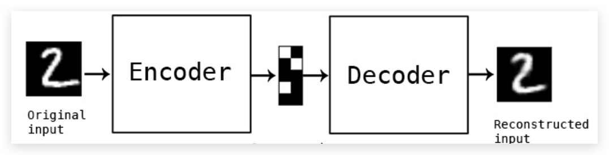
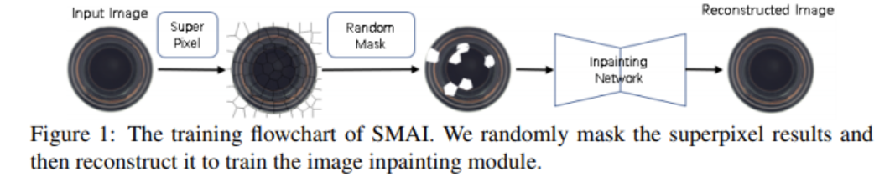
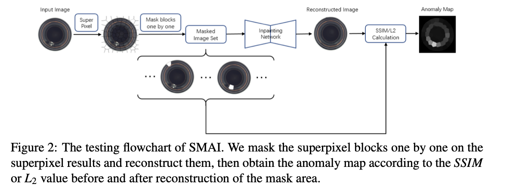
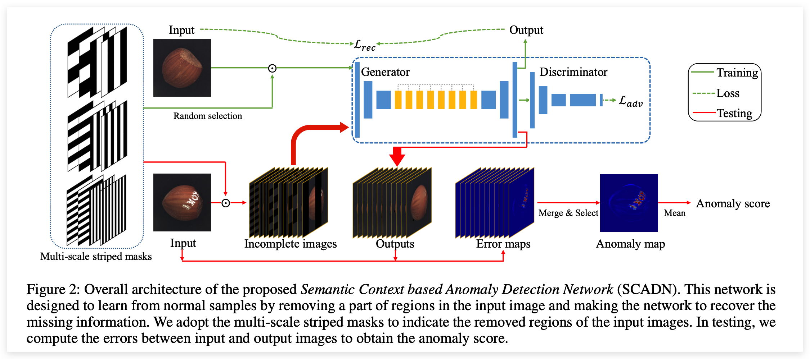
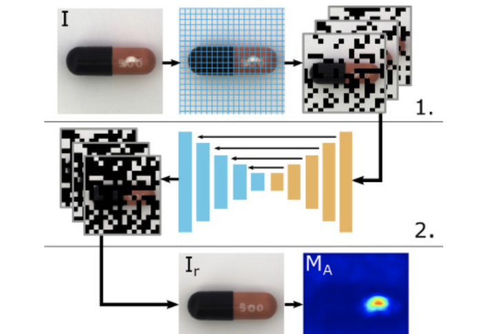
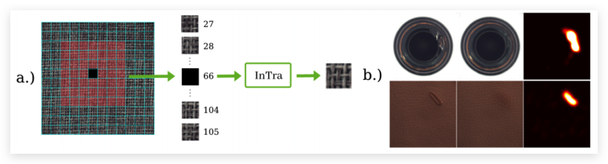
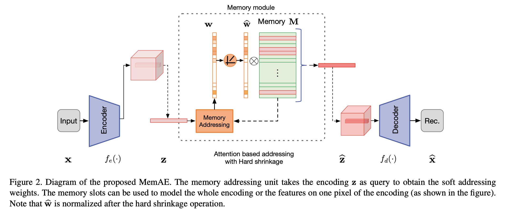

# 基于重构的异常检测

:::tip
搬运于：https://blog.csdn.net/qq_36560894/article/details/121509629?spm=1001.2014.3001.5501

写的太好了就搬运过来了，方便后续添加自己的笔记
:::

## 前言

在图像异常检测中，基于重构的方法是一种很自然的思想：构建一个Encoder-Decdoer结构的网络执行重构任务，目标是让模型能够重构好正常样本。那么在测试时，对于正常样本仍然能够正常重构，而异常样本由于分布的差异，导致重构效果较差，从而可以通过像素级的比较得到异常得分，判断一个样本是否为异常样本。

下面主要介绍近几年在图像异常检测中，一些基于重构思想的工作。

## 基线 AE/VAE

基于重构的思想最朴素的方法就是 AE ( AutoEncoder )和 VAE ( Variation AutoEncoder )，也就是自建编码器和变分自编码器。

AE的思想很简单，Encoder 提取输入图像的 latent code，可以理解为一个在低维空间中的高级语义编码，它与输入图像之间存在映射。而Decoder 负责根据 latent code 进行图像重构，使得重构后的图像与输入尽可能一致。整体过程如下所示：

  

训练过程中常用的损失函数为像素级的 `L2 Loss`，除此之外，也有工作引入了`SSIM这类结构性损失`。测试过程，只需要将测试样本输入AE，比较重构后的图像与输入图像之间的差异`L2 loss`，根据差异确定图像的异常得分。

而 VAE 本质就是一种生成式的模型，在 GAN 大火之前，在图像生成领域得到极大的发展，并且 VAE 也可以用于异常检测。与 AE 最大的不同是，除了考虑像素级的重构损失之外，VAE 还要额外考虑一个 `KL损失`(衡量分布间的差异)。这是因为VAE会引入一个正常样本在隐层空间的先验（通常是认为在隐层空间，数据分布为多维的标准正态分布），同时Encoder输出也不再是简单的latent code，而是会输出mean和std得到一个估计分布，而`KL损失`就是衡量估计分布和先验分布之间的差异。

### 优缺点分析

`优点：` AE和VAE作为重构方向的基本方法，奠定了未来发展的基础

`
缺点：` AE和VAE的核心思想是：通过训练过程中对正常样本进行重构学习，由于没见过这些图像异常形式，导致在测试时异常样本的重构效果较差，从而能达到异常检测的效果。但由于神经网络的泛化性较强，导致异常样本也能达到很好的重构效果，从而使得**异常检测准确率不高**。并且在一些特殊场景上(比如视频监控)，**由于正常样本的多样化，测试时也会有一些正常样本无法得到很好地重构，容易误判**。

## 基于图像修复思想

图像修复主要指的是在重构时，对输入图像的部分区域进行 mask 覆盖再送入网络中进行复原。完成inpainting这类任务比单纯的重构难度更高，这要求网络能对输入图像的上下文有更好的语义理解，并在一定程度上防止过拟合。

### SMAI (BMVC2020)

:::note
论文：Superpixel Masking and Inpainting for Self-Supervised Anomaly Detection （来自西安交大）

原文地址：https://www.bmvc2020-conference.com/assets/papers/0275.pdf
:::

这篇文章应该是最早将这种思想引入`Anomaly Localization`领域的，其训练过程如下所示：首先对输入图像进行超像素分割，随机选取一部分超像素块进行mask，将mask后的图像送入复原网络进行重构。训练loss采用l2或者SSIM。

  

测试流程如下所示：同样对输入图像进行超像素分割，然后逐一地进行mask，为每个测试图像都构造了一组`Masked Image Set`，比较网络重构后的块与输入块之间的差异，从而得到`Anomaly Map`用于异常区域定位(`pixel-level`)。

  

#### 优缺点分析：

优点：思想新颖，实现简单，相比基线提升了不少性能

缺点：像素块的分割会限制检测的性能以及定位的精度，并且这种逐块的测试**时间复杂度较高，不利于现实场景中的应用**。

### SCADN (AAAI2021)

:::note
论文：Learning Semantic Context from Normal Samples for Unsupervised Anomaly Detection （来自华南理工大学）

原文地址：https://www.aaai.org/AAAI21Papers/AAAI-4221.YanX.pdf
:::

这篇文章的思想和前一篇一致，**不太一样的是对输入图像的mask处理方式**。网络结构如下所示，训练时对于输入图像，随机采用不同宽度、**不同方向的条状mask进行覆盖，送入重构网络中**（与一般的网络结构不同，中间几层采用了空洞卷积）进行复原，除了计算像素级的重构损失，模型还引入了对抗学习的方式加了一个判别器损失（帮助网络重构地更好）。

测试时，同样需要对测试建议逐一地构造不同`mask`情况下的`Masked Image Set`，进行重构并计算重构损失，最后融合异常得分图作为最终的`Anomaly map`进行异常定位(pixel-level)，将`Anomaly map`的结果平均后得到`Anomaly Score`作为异常检测结果(image-level)。

  

#### 优缺点

优点： 引入了对抗学习的思想，在网络结构上下了一点功夫，mask的划分不依靠超像素方法。此外还提出了一个新的数据集

缺点：从性能来看还没有上一篇高，而且同样存在这类方法的固有问题，速度较慢。而且看了上一篇之后，显得创新性没那么够。

### RIAD (PR2021)

:::note
论文：Reconstruction by inpainting for visual anomaly detection (卢布尔雅那大学)

原文地址：https://www.sciencedirect.com/science/article/abs/pii/S0031320320305094
:::

网络结构如下，主要包含三个关键技术点：

  

1. 首先将输入图像划分为许多个大小为`k x k`的网格，将这些网络随机划分为n个不相交的集合 (每个集合包含的像素数量相等)；随后创建n个`ones mask`，每个`mask`对应一个集合`Si`，再将`Si`中对应的网格像素值置为0，对输入进行覆盖得到n个`mask image`。
2. 将处理后的n个输入图像送入网络中进行复原，除了标准的`encoder-decoder`结构，还引入了`skip connection`提升复原的精确度；值得注意的是，这里只保留了每个`masked image`复原后的区域。
3. 将不同`masked image`复原的结果组合起来，就可以得到最后重构结果。将重构结果与输入图像进行对比，即可得到`Anomaly Map`。值得注意的是这里，这里**不是通过计算l2距离来评估差异，而是采用基于梯度强度的多尺度衡量标准**(multi-scale gradient magnitude similarity, MSGMS)。

### InTra (2021)

:::note
论文： Inpainting Transformer for Anomaly Detection（富士通科技）

原文地址：https://arxiv.org/pdf/2104.13897.pdf
:::

这篇文章是第一篇把`Transformer`结构引入异常检测领域的工作，思路与RIAD不太一样。先将输入图像进行分块，但InTra是**从中选取一个大小为L x L的窗口，选取中心块进行覆盖，利用窗口内的其他块对其进行重构**。基本沿用了ViT的框架：未被Mask的块作为输入token，mask patch当作class token。

  

针对texture和object两种不同类别，采用了不同的编码形式。

#### 优
缺点：

优点：引入了Transformer架构，并且相比于RIAD性能提升了不少。

缺点：逐块的mask导致训练比较低效，测试时的时间复杂度也会非常高。

## 基于Memory Bank的方法

这类重构的方法不再是直接根据`latent code`去重构原图，而是会额外构造一个`memory bank`存储 `prototype`(原型元素)。训练的时候更新 `memory bank` 中的项，测试时查询这些项，组合后送入解码器进行重构。这类方法相当于**限制 CNN的泛化能力**，测试时只能通过查询和组合这些 prototype 元素进行重构，缓解了异常样本也能被重构得很好的问题。

### MemAE (ICCV2019)

:::note
论文：Memorizing Normality to Detect Anomaly: Memory-augmented Deep Autoencoder for Unsupervised Anomaly Detection (澳大利亚阿德莱德大学)

论文地址：https://arxiv.org/abs/1904.02639
:::

MemAE的大致做法如下：实现构造好一个有 N 项元素的`Memory bank`，这个模块加在 Encoder 和 Deocder 之间，编码器输出的`latent code`会进行寻址操作（*计算code与每个prototype之间的相似度，确定权重w*），找到对应的元素，经过加权融合得到一个新的code，再将这个code送入解码器进行重构。

  

训练除了重构损失，还加入了正则化项：对权重项w采用最小熵损失，如下所示，主要是促进权重系数的稀疏性，避免复杂的组合导致异常样本仍能被较好重构。

$$
E\left(\widehat{\mathbf{w}}^{t}\right)=\sum_{i=1}^{T}-\widehat{w}_{i} \cdot \log \left(\widehat{w}_{i}\right)
$$

### MNAD(CVPR2020)

:::note
论文：Learning Memory-guided Normality for Anomaly Detection (延世大学)

论文地址：https://arxiv.org/pdf/2003.13228.pdf
:::

这篇文章核心思想与`MemAE`基本一致，主要的不同在于一些细节上的差异。比如：除了**经过Memory bank寻址得到的code，还会concat上本身的latent code**，一起送入解码器；以及`Memory Module`中的更新方式存在不同，**不依靠网络自动学习，而是类似于K-Means的思想进行更新**；其次网络结构上采用`U-Net`，抛去了编码器最后一层的bn-relu层，训练时去掉`skip-connection`，测试时再恢复。

 