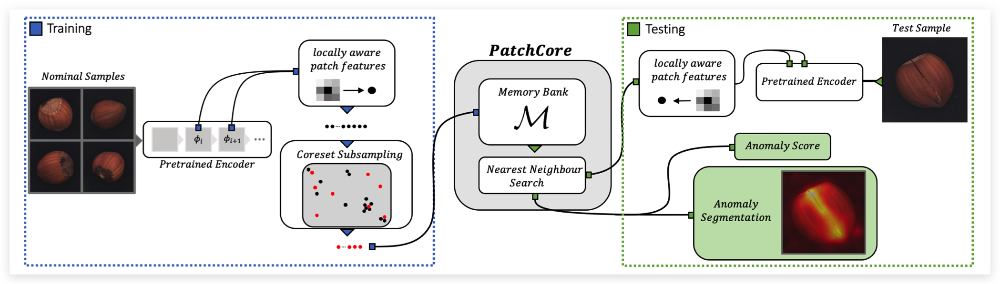
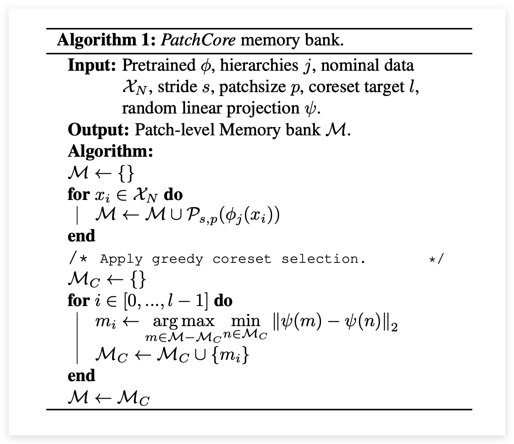
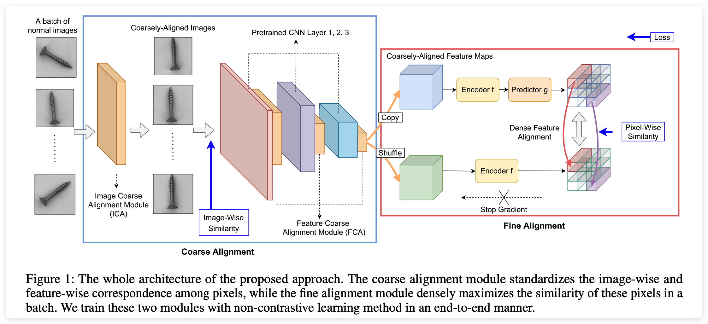
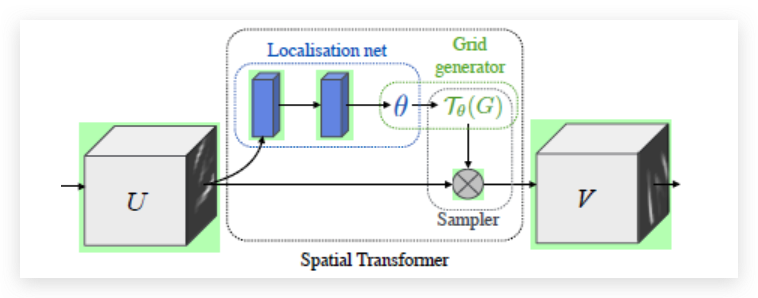
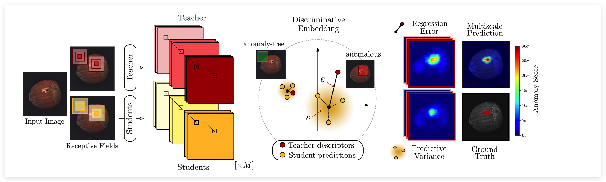
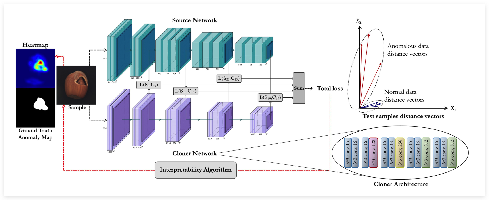

# 基于Embedding的异常检测

:::tip
搬运于：https://blog.csdn.net/qq_36560894/article/details/121589041?spm=1001.2014.3001.5502

写的太好了就搬运过来了，方便后续添加自己的笔记
:::

## 前言

异常检测领域中，基于Embedding的方法指的是：`将图像送入模型，提取特征，并在特征空间中构造分界面/评分规则`。与重构方法的主要不同在于，`其不在RGB图像空间而是在高维的特征空间中进行异常检测`；与自监督的方法不同，`其不过于依赖额外的负样本的构造 / 代理任务的设计，主要考虑的特征空间中的差异`。

## 基于预训练模型的

### SPADE (CVPR2021)

:::note
SPADE本身不是CVPR的工作，很早就挂在arxiv，但之后一直没有正式发表，最后与其他的创新点结合后在CVPR上发表:
论文：PANDA: Adapting Pretrained Features for Anomaly Detection and Segmentation (以色列,耶路撒冷希伯来大学)

但这篇文章其实跟SPADE方法本身关系不大了，要了解SPADE方法本身的话，最好参考下面这篇文章：

论文：Sub-Image Anomaly Detection with Deep Pyramid Correspondences

原文地址：https://arxiv.org/abs/2005.02357

代码地址：https://github.com/byungjae89/SPADE-pytorch?utm_source=catalyzex.com
:::

SPADE指的是`Semantic Pyramid Anomaly Detection`，方法本身非常简单，但对于异常定位的效果却异常的好。

SPADE首先在ImageNet预训练的网络对所有正常样本(训练集)都进行特征提取，并存储所有特征(特征池)。在测试时，用同样的网络提取到特征后，在特征池中检索到K个最近的模板特征，利用下式得到异常得分：

$$
d(y)=\frac{1}{K} \sum_{f \in N_{K}\left(f_{y}\right)}\left\|f-f_{y}\right\|^{2}
$$

对于异常定位任务，需要更精细的像素级特征，因此使用相同的网络(Wide ResNet50x2)得到多层级特征(前3个stage的特征图)，将对应位置的特征进行`concat`（编码局部特征和全局特征）作为像素级特征。同样，提取所有正常样本的像素级特征构造特征池。在测试时，**对测试样本的每个像素级特征进行KNN索引，计算每个像素点的异常得分，上采样到原图尺寸得到最终的anomaly map**：

$$
d(y, p)=\frac{1}{\kappa} \sum_{f \in N_{\kappa}(F(y, p))}\|f-F(y, p)\|^{2}
$$

#### 优缺点

优点：方法简单，效果好。只使用固定的预训练网络提取特征，无需训练。

缺点：测试时，时间复杂度与数据量称线性关系，训练采用的正常图像越多，存储的特征也就越多，测试时的KNN复杂度越高。

### PaDiM（ICPR2020）

:::note
论文：PaDiM: a Patch Distribution Modeling Framework for Anomaly Detection and Localization

论文地址：https://arxiv.org/pdf/2011.08785.pdf

代码地址：https://github.com/xiahaifeng1995/PaDiM-Anomaly-Detection-Localization-master
:::

基于SPADE之上，PaDiM主要的改进就是不再构造特征池，执行KNN进行异常检测。而是提取每个位置上的多层级特征（和SPADE一样，concat三个stage的特征），为每个位置上估计一个分布（多元高斯分布）。

:::tip
每个位置"指的是$(i,j) \in [H, W]$，HxW是网络提取的最大特征图的尺寸
:::

具体来说，训练集中有 N 张正常图像，那么每个位置上可以收集到 N 个特征，根据这 N 个特征可以估计一个协方差矩阵，构造多元高斯分布。测试时，**用同样的网络提取得到一个HxW的特征图，计算每个位置上的特征与对应分布之间的马氏距离**，作为该位置的异常得分，从而可以得到Anomaly map。对于图像级的异常得分，选取anomaly map中的最大值。

特征维度越高，估计分布所需的时间就会越长，因此作者也探讨了PCA和random reduce两种降维策略，维持性能的同时，降低了训练时间，最终的结果是两种降维策略得到的结果相似。

#### 优缺点

优点：引入了训练步骤(估计分布)，图像级的异常检测性能得到提升，并且大大减少了测试的复杂度。类似模板匹配的思想：为每个位置构造一个正常模板(分布)。

缺点：PaDiM为HxW个位置单独估计分布，但是每个位置上的像素并不是严格对齐的，比如screw这一类，每张训练图像的朝向都不一样。

### PatchCore（2021）

:::note
论文：Towards Total Recall in Industrial Anomaly Detection (图宾根大学，亚马逊)

论文地址：https://arxiv.org/pdf/2106.08265v1.pdf

代码地址：https://github.com/hcw-00/PatchCore_anomaly_detection
:::

PatchCore主要解决了SPADE测试速度太慢的问题，并且在特征提取部分做了一些探索。

  

如上图所示，**训练阶段只使用stage2、stage3的特征图**(SPADE使用了stage1,2,3)，但同样使用了多层级特征融合机制。如下图的消融实验所示，使用2+3的操作在检测和定位任务上表现最好。

此外，引入了`local neighborhood aggregation`操作，其实就是`average pooling`，实现采用一个窗口大小为3，步长为1，padding为1 的 AvgPool2d 实现，`不损失空间分辨率的同时增大感受野`。如下图的消融实验所示，引入`local neighborhood aggregation`操作后，两个任务上都提升了不少性能。（可以提取更深层的特征图来增大感受野，比如引入stage3/4/5的感受野，但这也会损失空间分辨率并且引入更多的ImageNet class bias）。

:::tip
实验说明，感受野对于异常检测任务来说是非常重要的，但ImagNet预训练的网络在深层会提取到一些高级语义特征，具有ImageNet class bias，不益于异常检测
:::

PatchCore在测试仍然采用`KNN`来衡量异常得分，为了提升检测效率，作者采用`greedy coreset subsampling`来选取最具代表性的特征点，缩减特征池的大小。算法流程大致如下，并证明只保留1%也能获得很好的检测性能，但大大缩减了测试时间。

  

还有一点改进是在计算`Image-Level`的异常得分时，采用了`re-weighting`策略，这比直接取max要更鲁棒。详见原文。

#### 优缺点

优点：简单高效，进行了一些结构上的探索，采用coreset selection优化测试速度

缺点：思想不够新颖，总体来说是一个较工程化的工作

### Focus Your Distribution（2021）

:::note
论文：Focus Your Distribution: Coarse-to-Fine Non-Contrastive Learning for Anomaly Detection and Localization (商汤)

论文地址：https://arxiv.org/pdf/2110.04538.pdf
:::

  

SPADE，PaDiM都是使用预训练模型提取特征，而这篇文章会根据异常定位的任务进行`fine-tuning`。针对`PaDiM`存在特征不对齐的问题，第一个改进点就是引入`STN模块`进行粗对齐，如上图所示：

:::tip
STN是一个空间转换模块，核心的思想是让网络去学习生成矩阵参数，从而学会空间转换

  

STN模块的整体结构如上图所示，其由`localisation net`、`Grid generator`和`Sampler`三部分组成，输入特征图U（也可以直接是RGB图像）经过空间变换模块得到输出特征图 V。

:::

图像级的粗对齐(ICA)，会额外引入一个L2 loss：

$$
\mathcal{L}_{I C A}\left(\mathcal{D} ; \theta_{h}, \mathcal{T}_{\theta}\right)=\sum_{A, B \in \mathcal{D}} \sum_{i=0}^{H-1} \sum_{j=0}^{W-1}\left\|h_{\mathcal{T}_{\theta}}\left(A_{i, j}\right)-h_{\mathcal{T}_{\theta}}\left(B_{i, j}\right)\right\|_{2}
$$

特征级的粗对齐(FCA)，在预训练网络中的每个stage引入一个`STN模块`，引导特征图对齐，但这里没有引入额外的损失(只受到Fine Alignment模块的监督)

#### 优缺点

优点：考虑到了特征对齐的问题，在PaDiM的基础上进一步提升了性能；

缺点：有些图像本身是无法对齐的，其次从可视化来看，检测效果其实并不是很好，主要得益于评价指标(pixel-level AUCROC，对于小区域的异常很宽容)

## 知识蒸馏(knowledge Distillation)

### Uninformed Students（CVPR20）

论文：Uninformed Students: Student–Teacher Anomaly Detection with Discriminative Latent Embeddings（MVTec Software GmbH - MVTec AD数据集作者团队）
论文地址：https://openaccess.thecvf.com/content_CVPR_2020/papers/Bergmann_Uninformed_Students_Student-Teacher_Anomaly_Detection_With_Discriminative_Latent_Embeddings_CVPR_2020_paper.pdf

主要的思想如上图所示，利用一个`Teacher`网络指导多个`Student`网络进行学习，在测试时，通过比较T网络与S网络之间输出的差异来判断是否异常。【注意：本文的T和S采用相同的网络结构】

  

**训练：** 训练阶段主要分为Teacher的预训练和Student的学习，训练T网络时需要三个监督：① 知识蒸馏：利用另一个预训练模型中进行蒸馏；② 度量学习：如果预训练模型不好获取，则使用自监督学习进行预训练【triplet loss】；③ 描述符紧凑性：最小化一个batch内的特征描述符相似度来增加紧凑度。

:::tip
上述的训练均不是在下游任务（异常检测数据集）上进行的，而是在一个大数据集上进行的，这里作者使用ImageNet
:::

经过上述的过程，就已经获取到了一个`富有知识`的T网络，可以以此来指导S网络更新。S网络的监督只有一项，如下式所示，计算描述符之间的l2 loss（进行归一化后的）。

$$
\mathcal{L}\left(S_{i}\right)=\frac{1}{w h} \sum_{(r, c)}\left\|\boldsymbol{\mu}_{(r, c)}^{S_{i}}-\left(\mathbf{y}_{(r, c)}^{T}-\boldsymbol{\mu}\right) \operatorname{diag}(\boldsymbol{\sigma})^{-1}\right\|_{2}^{2}
$$

此外，为了进行精确的定位，网络采用patch输入，并构造了多尺度的S网络。

**测试：** 测试时，用T和S网络去提取每个像素点对应的patch-level特征描述符，计算两个误差：回归误差（与T输出的差异）和不确定性误差（S之间的输出差异）。

#### 优缺点

优点： 引入了多种新技术：知识蒸馏、度量学习等等，并针对`Pixel AUC`存在的问题，提出了一个新的指标用于评价像素级异常定位任务；

缺点：方法整体上显得很笨重，而且效果也不算好，训练和测试都需要花费较多时间

### Multiresolution Knowledge Distillation for Anomaly Detection（CVPR21）

:::note
论文：Multiresolution Knowledge Distillation for Anomaly Detection（谢里夫科技大学）

原文地址：https://openaccess.thecvf.com/content/CVPR2021/papers/Salehi_Multiresolution_Knowledge_Distillation_for_Anomaly_Detection_CVPR_2021_paper.pdf
:::

  

该工作的核心思想同样是知识蒸馏，但相比于上一个工作显得额外清爽。整体框架如上所示，利用一个富有知识的预训练模型Source网络，构造一个轻量级的Cloner网络来模仿S网络的输出。与原始的知识蒸馏只学习最后logits的差异不同，这里会让C学习S中间层的输出，使得C更充分地汲取S的知识，并且有助于异常定位。

**训练过程**：输入同一个样本到S和C网络，让C去拟合S网络的中间层特征，**所谓的中间层就是不同stage输出的特征**（本文使用VGG不同pooling层后的输出）。网络**不止特征的value要接近，还控制其direction要一致**，因此采用了两个loss进行约束。第一个loss采用欧氏距离约束，使每个像素级特征都要足够接近：

$$
\mathcal{L}_{\text {val }}=\sum_{i=1}^{N_{C P}} \frac{1}{N_{i}} \sum_{j=1}^{N_{i}}\left(a_{s}^{C P_{i}}(j)-a_{c}^{C P_{i}}(j)\right)^{2}
$$

第二个loss采用余弦距离进行优化，注意这里考虑的是特征图级的余弦距离，其中vec(·)表示flatten操作：

$$
\begin{aligned}
&\mathcal{L}_{\text {dir }}=\sum_{i} 1-\frac{\operatorname{vec}\left(a_{s}^{C P_{i}}\right)^{T} \cdot \operatorname{vec}\left(a_{c}^{C P_{i}}\right)}{\left\|\operatorname{vec}\left(a_{s}^{C P_{i}}\right)\right\|\left\|\operatorname{vec}\left(a_{c}^{C P_{i}}\right)\right\|}, \\
&\mathcal{L}_{\text {total }}=\mathcal{L}_{\text {val }}+\lambda \mathcal{L}_{\text {dir }}
\end{aligned}
$$

需要注意的是，与`uniform-std`不同，这里C比S网络要更轻量，迫使网络去学习更主要的特征，这有助于检测细微的异常（比如MVTec中的screw类，通过实验证明，见原文3.3.2节）。

测试: 输入同一张测试图像, 通过衡量 $\mathrm{L}_{\mathrm{val}}$ 和 $\mathrm{L}_{\mathrm{val}}$ 之间的差异来得到 Anomaly Score 。为了进行像素级异常 定位, 利用梯度计算得到 attribution map, 如下所示：

$$
\Lambda=\frac{\partial \mathcal{L}_{\text {total }}}{\partial x} .
$$

此外, 为了消除自然噪声的影响, 使用高斯滤波 + opening 操作(先腐蚀再扩张)进行后处理。

$$
\begin{aligned}
M &=g_{\sigma}(\Lambda), \\
L_{\text {map }} &=(M \ominus B) \oplus B,
\end{aligned}
$$

此外, 作者还尝试了其他的一些基于梯度的可解释性算法进行实验.

#### 优缺点

优点：相比`uniform-stu`，方法显得更加简单。

缺点：并没有在MVTec AD数据集上与`uniform-stu`进行直接对比，并且效果也不算太好。

:::tip
效果不好的原因可能在于：S和T对于同一个异常区域的响应也非常像。
:::

