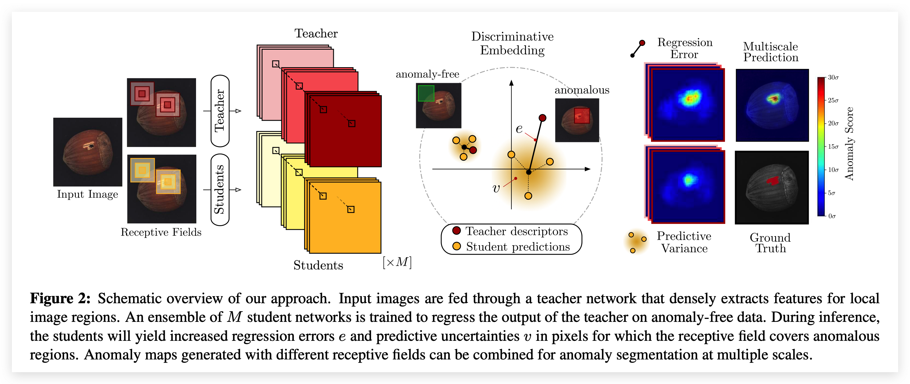
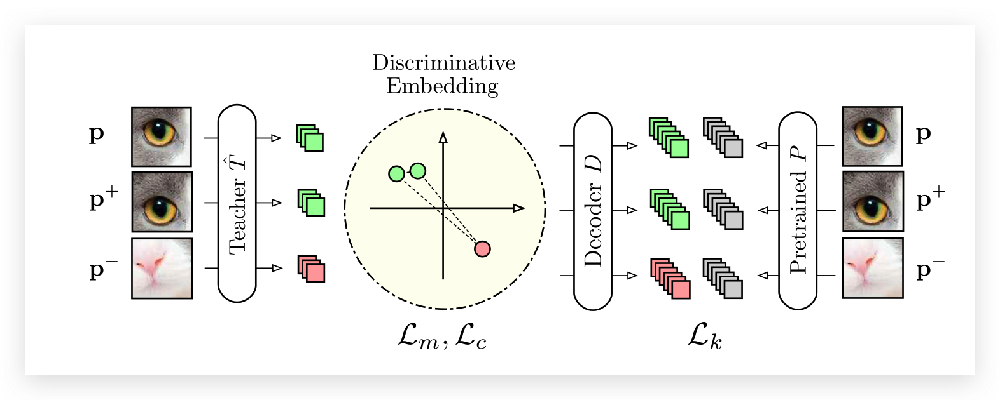
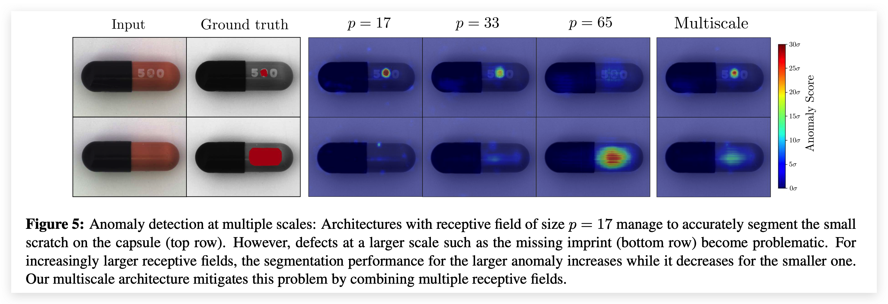

# U-Student: Student–Teacher Anomaly Detection

:::note
论文：Uninformed Students: Student–Teacher Anomaly Detection with Discriminative Latent Embeddings（MVTec Software GmbH - MVTec AD数据集作者团队）

论文地址：https://openaccess.thecvf.com/content_CVPR_2020/papers/Bergmann_Uninformed_Students_Student-Teacher_Anomaly_Detection_With_Discriminative_Latent_Embeddings_CVPR_2020_paper.pdf
:::

## 论文概述

  

本文提出了一个名为 “Student-Teacher Anomaly Detection” 的新框架，利用`Discriminative Embedding`：首先`Teacher`网络(T)在大量自然图像(ImageNet)中进行预训练，`Student`网络(S)在无缺陷数据集上进行训练 (以`Teacher`网络的输出作为监督)，比较S与T输出间的不同来判断该区域是否存在缺陷。 其中可以设置多个S，并且通过构造多尺度等方法构造ensemble。

## 关键技术

`Teacher`网络与`Student`网络具有相同架构，并且输入都是大小相等的图像块`Patch`，每个`Patch`在原图有着固定的感受野，利用 `Fast Dense Local Feature Extraction` 通过确定性转换应用于整幅图像(相比于将图片划分为一个个`Patch`来分别进行预测的方法，提升了速度，在后面的测试中也需要一次前向传播即可进行异常区域分割)。

### 训练Teacher Network 

​T完全基于自然图像进行预训练，并且训练后不再更新参数，T输出D维的特征，该特征具有强语义性(semantically strong descriptors)。

  

损失函数分为三个部分：

#### Knowledge Distillation

在这个阶段中，从预训练网络P汲取知识，**增加一个全连接层**，使T的输出维度与P一致，优化它们的L2 loss。

$$
\mathcal{L}_{k}(\hat{T})=\|D(\hat{T}(\mathbf{p}))-P(\mathbf{p})\|^{2}
$$

#### Metric Learning

当预训练网络不好获取时，使用自监督学习的方式学习局部描述符。​ 主要使用三元学习来获取Discriminative Embedding，构造三元组(p,p+,p-)，优化以下目标：

$$
\begin{gathered}
\mathcal{L}_{m}(\hat{T})=\max \left\{0, \delta+\delta^{+}-\delta^{-}\right\} \\
\delta^{+}=\left\|\hat{T}(\mathbf{p})-\hat{T}\left(\mathbf{p}^{+}\right)\right\|^{2} \\
\delta^{-}=\min \left\{\left\|\hat{T}(\mathbf{p})-\hat{T}\left(\mathbf{p}^{-}\right)\right\|^{2},\left\|\hat{T}\left(\mathbf{p}^{+}\right)-\hat{T}\left(\mathbf{p}^{-}\right)\right\|^{2}\right\}
\end{gathered}
$$

#### Descriptor Compactness

通过最小化一个batch内的描述符相似度来增加紧凑度(compactness)同时减少不必要的冗余，$c_{i,j}$表示相关矩阵的项：

$$
\mathcal{L}_{c}(\hat{T})=\sum_{i \neq j} c_{i j}
$$

​最后总的Loss为：

$$
\mathcal{L}(\hat{T})=\lambda_{k} \mathcal{L}_{k}(\hat{T})+\lambda_{m} \mathcal{L}_{m}(\hat{T})+\lambda_{c} \mathcal{L}_{c}(\hat{T})
$$

### 训练Student Network

1、利用T提取计算训练集中所有描述符的均值与标准差，用于数据标准化(作用于T的输出)
2、构建M个S网络，每个S都为输入图像I输出特征描述符

:::tip
具有限制感受野(大小为p)的网络S可以在一次前向传播过程中为I中每个像素点生成密集预测，而不需要切分为多个块P(r,c)
:::

3、将S的输出建模为高斯分布，优化以下目标，其中$S_i$表示对像素点(i,j)的预测，$y^T$为T对应Patch的输出，计算L2距离：

$$
\mathcal{L}\left(S_{i}\right)=\frac{1}{w h} \sum_{(r, c)}\left\|\mu_{(r, c)}^{S_{i}}-\left(\mathbf{y}_{(r, c)}^{T}-\boldsymbol{\mu}\right) \operatorname{diag}(\boldsymbol{\sigma})^{-1}\right\|_{2}^{2}
$$

### 预测异常

将M个S都训练到收敛，构建混合高斯分布，平等加权每个S的输出。**使用两种方法衡量一个像素点是否异常**：

① 回归误差 Regression Error (S与T之间的L2距离)

$$
\begin{aligned}
e_{(r, c)} &=\left\|\boldsymbol{\mu}_{(r, c)}-\left(\mathbf{y}_{(r, c)}^{T}-\boldsymbol{\mu}\right) \operatorname{diag}(\boldsymbol{\sigma})^{-1}\right\|_{2}^{2} \\
&=\left\|\frac{1}{M} \sum_{i=1}^{M} \boldsymbol{\mu}_{(r, c)}^{S_{i}}-\left(\mathbf{y}_{(r, c)}^{T}-\boldsymbol{\mu}\right) \operatorname{diag}(\boldsymbol{\sigma})^{-1}\right\|_{2}^{2}
\end{aligned}
$$

② 预测不确定性 Predictive Uncertainty (S中的标准差)

$$
v_{(r, c)}=\frac{1}{M} \sum_{i=1}^{M}\left\|\boldsymbol{\mu}_{(r, c)}^{S_{i}}\right\|_{2}^{2}-\left\|\boldsymbol{\mu}_{(r, c)}\right\|_{2}^{2}
$$

结合两种分数1和2，最后的异常分数为：

$$
\tilde{e}_{(r, c)}+\tilde{v}_{(r, c)}=\frac{e_{(r, c)}-e_{\mu}}{e_{\sigma}}+\frac{v_{(r, c)}-v_{\mu}}{v_{\sigma}}
$$

其中 $\mu$ 下标表示均值， $\sigma$ 下标表示方差。

### 多尺度异常分割

​由于网络架构中的感受野大小一定，如果感受野过大而异常区域过小，那么提取出来的特征基本为正常，无法对异常区域进行分割。因此，构建多个不同感受野的Student-Teacher网络对，将输出进行融合后作为最终的检测结果。

$$
\frac{1}{L} \sum_{l=1}^{L}\left(\tilde{e}_{(r, c)}^{(l)}+\tilde{v}_{(r, c)}^{(l)}\right)
$$

  

## 总结

这篇文章的作者团队就是CVPR19提出Mvtec AD这个数据集的那批人，文章的脉络很清楚。最主要的创新在于将Student-Teacher架构引入异常检测领域，此外，也将迁移学习中的Metric Learning和Knowledge Distillation应用了进来，思想很新颖。

文章提出了一个新的指标来做实验，所以缺乏与其他工作的对比，不过谁让人家是顶会呢，最后这个指标也难免要被大家follow。其次的话，就是**分块以及输入图像多尺度做法还是显得比较笨重，可以进一步优化**。 同时，S只模仿了T最后一层的输出，缺乏了对教师网络的充分利用，这也导致了它需要使用自监督等训练方式。

