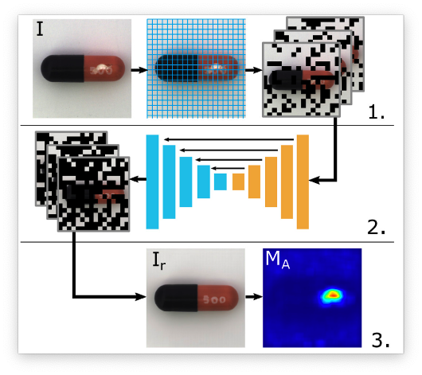
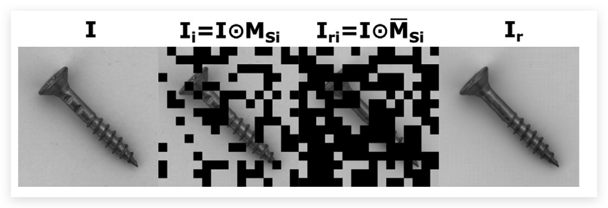
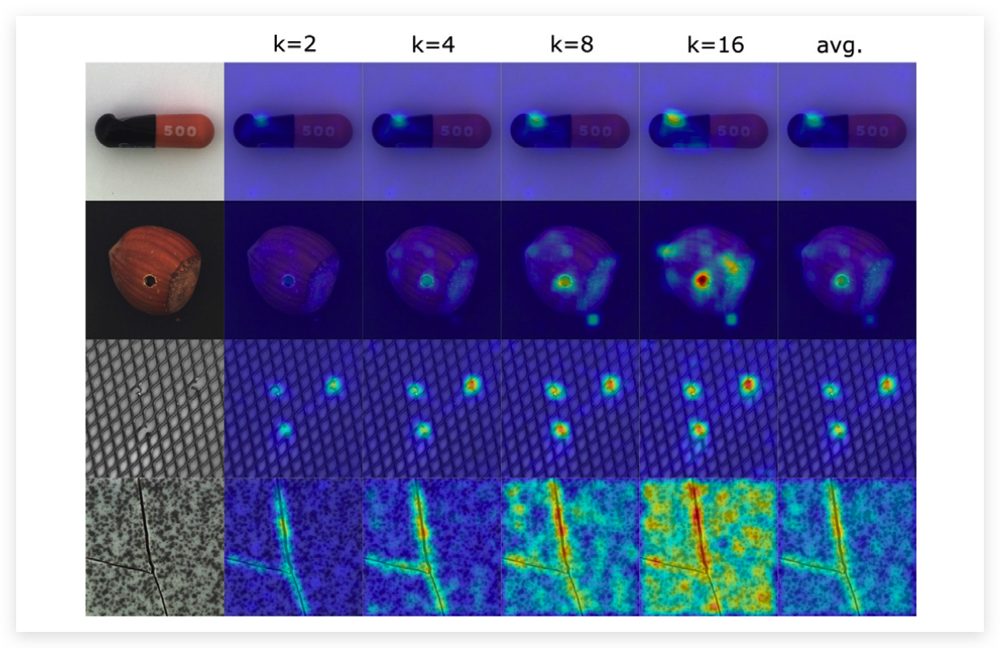

# RIAD: 基于重构的视觉异常检测

:::note
论文：Reconstruction by inpainting for visual anomaly detection (卢布尔雅那大学)

原文地址：https://www.sciencedirect.com/science/article/abs/pii/S0031320320305094
:::

## 论文概述

当下基于重构的视觉异常检测算法是一种主流的异常检测算法，但是当下基于AutoEncoder结构的异常检测算法有着精度低的问题（会将异常的图片也完整的重构出来）。 该篇论文将异常检测看做一个**自监督的图像修复问题**。具体来说就是将正常的图像遮挡然后让自编码器去预测被遮挡的位置。 同时这篇文章还提出了一个基于梯度的训练损失函数和异构评分估计函数。 主要流程如下图所示：

  

## 关键技术

### 重构网络的结构

重构的网络是一个U-net类型的网络，结构如下图所示：

  

#### 网络训练流程

在训练网络的时候，首先会对图片进行随机Mask（Mask的大小是一个超参数）得到 $\mathbf{I}_{\mathrm{i}}=\mathbf{I} \odot \mathbf{M}_{\mathbf{S i}}$。 $\mathbf{I}_{\mathrm{i}}$ 在经过了网络之后需要得到 $\mathbf{I}_{\mathrm{ri}}=\mathbf{I} \odot \overline{\mathbf{M}}_{\mathbf{S i}}$ 。 $\mathbf{I}_{\mathrm{i}}$ 和 $\mathbf{I}_{\mathrm{ri}}$ 相加即可得到原始的图像。

  

#### 损失函数

在训练这样的网络的时候经常会使用l2 loss，来让网络输出的结果与gt更加的接近。但是l2 loss 假设相邻像素之间是独立的，这通常是不正确的。所以使用**结果相似度（SSIM）**作为损失函数会更加合理一些，图像之间的梯度相似度是计算梯度幅度图的相似程度。图像 $\mathrm{I}$ 的梯度图的定义如下：

$$
g(\mathbf{I})=\sqrt{\left(\mathbf{I} * \mathbf{h}_{x}\right)^{2}+\left(\mathbf{I} * \mathbf{h}_{y}\right)^{2}}
$$

$h_x$ 和 $h_y$ 是普里威特滤波分别沿着x和y方向的梯度，* 表示卷积运算。梯度结构相似度的定义就如下所示：

$$
G M S\left(\mathbf{I}, \mathbf{I}_{r}\right)=\frac{2 g(\mathbf{I}) g\left(\mathbf{I}_{r}\right)+c}{g(\mathbf{I})^{2}+g\left(\mathbf{I}_{r}\right)^{2}+c}
$$

论文通过计算多个尺度的GMS，作为MSGMS损失项：

$$
L_{G}\left(\mathbf{I}, \mathbf{I}_{r}\right)=\frac{1}{4} \sum_{l=1}^{4} \frac{1}{N_{l}} \sum_{i=1}^{H_{l}} \sum_{j=1}^{W_{l}} 1-G M S\left(\mathbf{I}_{l}, \mathbf{I}_{r l}\right)_{(i, j)},
$$

除了MSGMS损失项，论文还使用了SSIM损失项和L2损失项：

$$
L=\lambda_{G} L_{G}+\lambda_{S} L_{S}+L_{2}
$$

#### 多尺度训练

为了增加鲁棒性，RIAD在训练的时候选择了多种 mask 的size进行训练，实验结果也表明使用 Multi-scale 的技术实验结果更好。

  

### 异常检测

有了可以重建图像的网络，下一步就是要利用这个网络做异常检测了。

异常检测的过程简单来说就是求解 Anomaly Score Map 的过程，Anomaly Score Map说白了就是求解 $G M S\left(\mathbf{I}_{rl}, \mathbf{I}_{l}\right)$ 的过程。 我们需要就是一个多尺度的GMS（$\operatorname{MSGMS}\left(\mathbf{I}, \mathbf{I}_{r}\right)$），具体来说就是求解每一个尺度的GMS后去平均。异常往往占据较大的空间连接区域，因此重建误差可以聚集在较大的区域以获得更精确的异常检测。通过均值滤波卷积对 MSGMS map进行后处理。这个过程可以公式化表示如下：

$$
G\left(\mathbf{I}, \mathbf{I}_{r}\right)=\mathbf{1}_{H \times W}-\left(\operatorname{MSGMS}\left(\mathbf{I}, \mathbf{I}_{r}\right) * \mathbf{f}_{s_{f} \times s_{f}}\right)
$$

对于每次推理的时候可能都会选取不同大小的Mask，所以论文对每种大小的Mask计算得到的G取了一个均值，作为最终的特征地图。

$$
G_{A}\left(\mathbf{I}, \mathbf{I}_{r}\right)=\frac{1}{N_{K}} \sum_{k \in K} G\left(\mathbf{I}, \mathbf{I}_{r}\right)_{k}
$$

## 总结

本篇论文将异常检测问题看做了一个图像修复问题，改善了传统自编码器容易将异常图像也正常重建的情况。同时使用了梯度上的SSIM loss优化了自编码器的效果。将输入和重建图像的梯度相似图作为anomaly score map, 实验结果也表明，即使RIAD没有考虑图像序列，但是它仍然能在视频异常图像检测中取得很好的效果。

