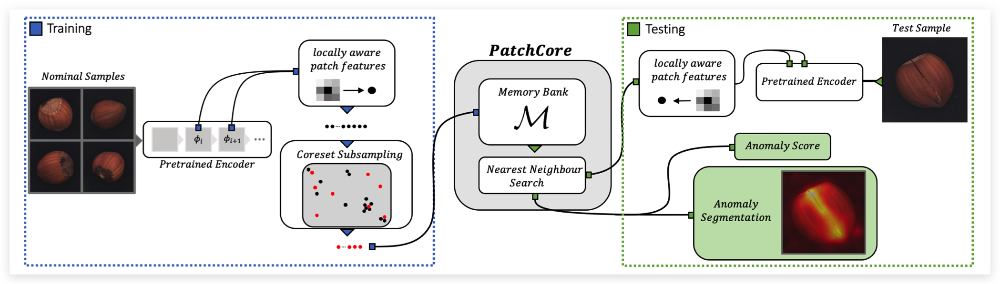
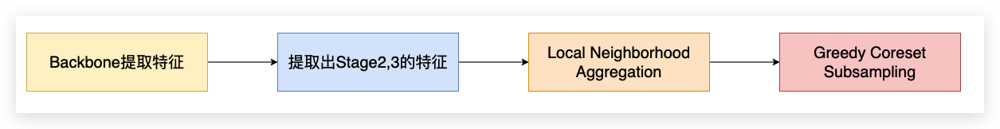

# PatchCore: 针对工业场景下的异常检测

:::note
论文：Towards Total Recall in Industrial Anomaly Detection (CVPR2022, 图宾根大学，亚马逊)

论文地址：https://arxiv.org/pdf/2106.08265v1.pdf

代码地址：https://github.com/hcw-00/PatchCore_anomaly_detection
:::

## 论文简介

PatchCore主要解决了SPADE测试速度太慢的问题，并且在特征提取部分做了一些探索。如下图所示，**训练阶段只使用stage2、stage3的特征图** (SPADE使用了stage1,2,3)，但同样使用了**多层级特征融合机制**。

  

此外，引入了`local neighborhood aggregation`操作，其实就是`average pooling`，实现采用一个窗口大小为3，步长为1，padding为1 的 AvgPool2d 实现，不损失空间分辨率的同时增大感受野。

PatchCore在测试仍然采用`KNN`来衡量异常得分，为了提升检测效率，作者采用`greedy coreset subsampling`来选取最具代表性的特征点，缩减特征池的大小，并证明只保留1%也能获得很好的检测性能，但大大缩减了测试时间。

## 关键技术

这一部分结合PatchCore的代码来说明一下其的实现细节：

### 制作Memory Bank 

PatchCore制作特征库的方式可以分为四步，如下图所示：

  

首先会使用在ImageNet上预训练好的ResNet进行特征提取。然后选择Stage2和Stage3的特征（两个Stage的特征是通过上采样之后concat在一起的）。 在获取了特征后PatchCore做了一个`local neighborhood aggregation`的操作，其实就是一个`average pooling`, 目的是在不损失空间分辨率的同时增加感受野。 然后会使用`greedy coreset subsampling`算法对特征筛选，以此来提升KNN的速度。在实现上是使用的`K-Center-Greedy`算法。 

### 用PatchCore进行异常检测

在进行异常检测的时候，PatchCore首先使用KNN算法从Memory Bank中找到前k个最近的特征。在实现的时候使用 `torch.cdist(embedding, memory_bank, p=2.0)` 计算的是 `Euclidean Norm`。 与前k个特征的距离记作`patch scores`。

将patch scores中距离最近的那个距离最近的那个patch，首先进行上采样之后reshape一下，再进行一个高斯模糊就得到了最终的`Anomaly map`。 具体实现的代码如下：

```python 
# 获取长度和宽度
width, height = feature_map_shape 
batch_size = len(patch_scores) // (width * height)

# 获取最大的patch score，之后reshape
anomaly_map = patch_scores[:, 0].reshape((batch_size, 1, width, height)) 
# 进行上采样
anomaly_map = F.interpolate(anomaly_map, size=(self.input_size[0], self.input_size[1])) 

kernel_size = 2 * int(4.0 * self.sigma + 0.5) + 1
# 进行高斯模糊
anomaly_map = gaussian_blur2d(anomaly_map, (kernel_size, kernel_size), sigma=(self.sigma, self.sigma))
```


对于异常分数的计算，PatchCore进行了一个重计算的过程，异常得分的计算代码如下：

```python 
max_scores = torch.argmax(patch_scores[:, 0])
confidence = torch.index_select(patch_scores, 0, max_scores)
weights = 1 - (torch.max(torch.exp(confidence)) / torch.sum(torch.exp(confidence)))
score = weights * torch.max(patch_scores[:, 0]) 
```

在代码当中，一般我们就取 torch.max 作为score，但是PatchCore为max之后的结果计算了一个weights，论文里面把这个叫做`re-weight`的过程。 其实这个过程也很好理解，因为一个patch中不止一个点，假如你这个patch里面只有一个点的score很大，其他点的score都很小。这个时候直接用最大值作为异常得分其实就很不合理了。仔细观察一下weights的计算方式，如果这个patch里面所有的score都很大，那么weight就比较接近1。这样一个`re-weight`的过程能够让异常分数的计算更加鲁棒。

## 总结

PatchCore在异常检测精度很高的前提下, 提高了异常检测的速度。 其本身的优化点都很直观且有效：引入了`local neighborhood aggregation`来增加feature的感受野、使用`greedy coreset subsampling`来对`Memory Bank`进行采样，减少KNN的计算速度、对异常分数进行`re-weight`让异常检测更加的鲁棒。 但是不得不吐槽一句，论文写的是真的有点晦涩难懂，相比于其他CVPR的文章易读性真的不太好。有些明明很简单的过程，论文里面非要写的那么复杂。


