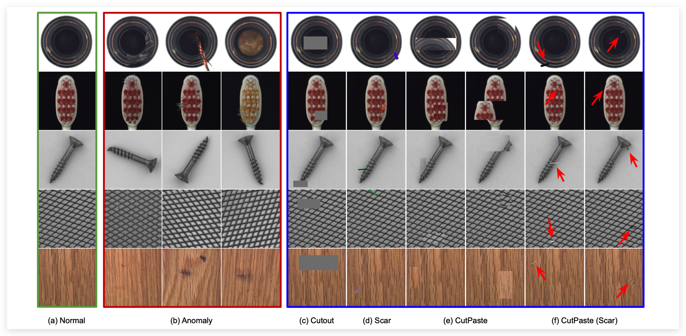
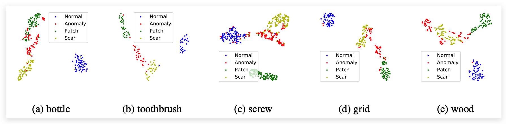

# CutPaste: 自监督异常识别与定位

:::note
论文： CutPaste:Self-Supervised Learning for Anomaly Detection and Localization（CVPR2021）

论文地址：http://openaccess.thecvf.com//content/CVPR2021/html/Li_CutPaste_Self-Supervised_Learning_for_Anomaly_Detection_and_Localization_CVPR_2021_paper.html

代码地址：https://github.com/Runinho/pytorch-cutpaste （非官方）
:::

## 论文简介

本文主要提出了一个新的增广方法“CutPaste”，并基于此方法提出了一个两阶段的无监督异常检测方法，① 构建分类器区分正常样本与异常样本，作为代理任务（proxy task）学习特征表示；② 根据训练好的网络提取特征，用于检测异常。此方法在MVTec数据集上表现达到新SOTA(检测任务96.6AUC，定位任务96AUC)。

## 关键技术

### 核心技术介绍

  

上图展示了正常样本、异常样本以及Cutout和CutPaste等增广方法。作者首先将Cutout应用到两阶段框架中，这看起来似乎是一个可以用简单滤波器就能解决的分类问题，但令人意外的是其竟然可以学习到一些判别性特征，用于异常检测。因此作者将任务变得更难，更改尺度以及变换颜色(Scar)，这进一步提升了性能，见下文的实验结果。

作者在此基础上进一步提出了CutPaste：1. 从原图中以某个面积比和长宽比剪切一小块矩形区域；2. 对这个图像块进行选择和颜色抖动；3. 粘贴回原图的某个位置。此外，也产生了scar变体，虽然这两个操作很相似，但产生的图像效果却很不一样，因此采用3分类，将Cutpaste和Cutpaste-scar视为两个类，效果又得到了进一步提升。

#### 计算异常分数

本文采用简单的带参数密度估计方法（无参数估计需要大量样本，计算复杂度较高）GDE（高斯核的密度估计器），如下所示：

$$
\log p_{\text {gde }}(x) \propto\left\{-\frac{1}{2}(f(x)-\mu)^{\top} \Sigma^{-1}(f(x)-\mu)\right\}
$$

#### 获取Annoly Map

为了精确的定位，该篇工作使用Patch-level的方式，使用patch级的图像块作为输入。训练前先从原始图像随机裁剪一个图像块作为输入，然后剩下的操作与之前一样。对于每个图像块，得到异常分数后，使用高斯平滑（Gaussian Smoothing）将分数传递到每个像素点上。

:::tip
具体实验为：将图像缩放至256x256，patch大小为64x64，测试时，步长为4密集预测，得到异常得分后，首先进行高斯模糊然后再上采样到原图。
:::

### 理论分析

CutPaste的成功可以从两方面分析，一是从异常曝光(outlier exposure)的角度，相比使用自然图像作为异常样本，CutPaste直接在训练时构建，并且任务更难，这进一步促使模型去学习这种不规律性。

另一方面，CutPaste可以看作是一种对于真实异常的模拟，从t-SNE图可以看出，构造的CutPaste虽然与真实异常样本没有重叠，但它却很好地拉远了正常样本和异常样本在特征空间上的距离。

  

## 总结

从整篇文章来看，方法确实简单有效，而且立意很高，实验也做得很完善。

不过也有一些值得改进的地方，比如object类随机的cutpaste有可能直接把背景区域又粘贴在背景上？这样强行把他们分成不同的类别是否会损害表征的学习呢？这种增广形式又是否能很好地适应于每个任务呢？

其实文章也告诉我们答案了，对于object的某些类，效果确实就是不好（甚至在fine-tuning的时候效果反而比pre-trained更差了）

## 参考文献

https://blog.csdn.net/qq_36560894/article/details/119608867?ops_request_misc=%257B%2522request%255Fid%2522%253A%2522165961780016782395351953%2522%252C%2522scm%2522%253A%252220140713.130102334..%2522%257D&request_id=165961780016782395351953&biz_id=0&utm_medium=distribute.pc_search_result.none-task-blog-2~all~baidu_landing_v2~default-3-119608867-null-null.142^v39^pc_rank_v37&utm_term=CutPaste&spm=1018.2226.3001.4187