# 什么是 Normalizing Flows

## Generator

Generator是一个网络，这个网络定义了一个概率分布 $p_G$。 给生成器一个输入（比如一个正态分布的输入$z$），生成器就会生成一个概率分布 $p_G(x),x=G(x)$。我们希望让生成的概率分布$p_G(x)$和数据的分布$p_{data}(x)$尽可能的相似。

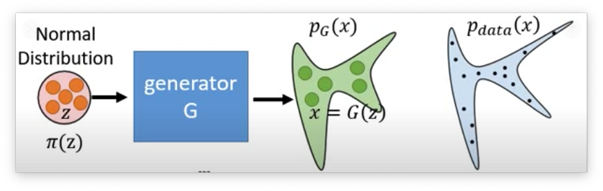  

假设现在我们有很多的样本 $\left\{x^{1}, x^{2}, \ldots, x^{m}\right\}$ from $P_{\text {data }}(x)$ ，那么Generator的优化目标就是：

$$
\begin{aligned}
G^{*} &=\arg \max _{G} \sum_{i=1}^{m} \log P_{G}\left(x^{i}\right) \\
& \approx \arg \min _{G} K L\left(P_{d a t a} \| P_{G}\right)
\end{aligned}
$$

**Flow-based model 非常厉害的地方就在于，它可以直接去优化这个目标函数。VAE和GAN都不能直接去优化这个函数。**

## 数学基础

### Jacobian矩阵

令 $z=\left[\begin{array}{l}z_{1} \\ z_{2}\end{array}\right]$， 现在我们有一个方程 $x=f(z)$, $x=\left[\begin{array}{l}x_{1} \\ x_{2}\end{array}\right]$ （x和z的维度可以不一样）。那么f这个函数的Jacobian矩阵就可以如下定义（注意是f这个函数的Jacobian矩阵）

$$
J_{f}=\left[\begin{array}{ll}
\partial x_{1} / \partial z_{1} & \partial x_{1} / \partial z_{2} \\
\partial x_{2} / \partial z_{1} & \partial x_{2} / \partial z_{2}
\end{array}\right]
$$

Jacobian矩阵还有一个性质就是 $J_f$ 和 $J_{f^{-1}}$ 互为 inverse。

### 行列式（Determinant）

行列式是一个标量，感觉类似于矩阵的大小信息。这个是线性代数的基础知识了。比如我们有一个矩阵 $A=\left[\begin{array}{ll}a & b \\ c & d\end{array}\right]$, 那么它的行列式就是 $det(A) = ad - cb$。同样的3x3的行列式也有对应的计算公式。 

还需要知道的一个比较重要的性质就是下面的公式：

$$
\begin{aligned}
&\operatorname{det}(\mathrm{A})=1 / \operatorname{det}\left(A^{-1}\right) \\
&\operatorname{det}\left(J_{f}\right)=1 / \operatorname{det}\left(J_{f^{-1}}\right)
\end{aligned}
$$

行列式的实际含义就是：行列式矩阵就是高维空间中体积的概念, 如下图所示：

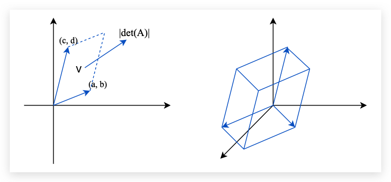  

### Change of Variable Theorem 

Change of Variable Theorem的主要思想就是求两个分布直接的变换关系。

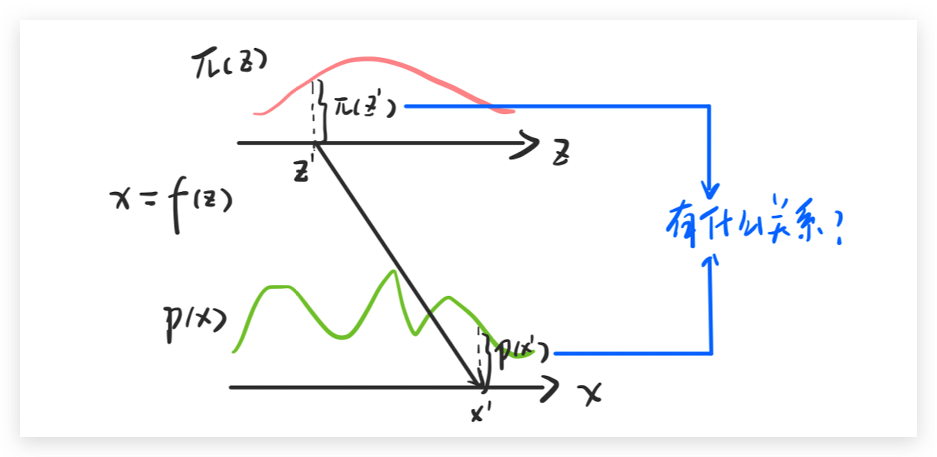  

我们先看一个简单的方程，先假设我们有一个分布 $\pi(z)$, 这个分布在0-1之间的值都是1，也就是说 $\int \pi(z) d z=1$ 。假设x和z之间的关系是 $x = f(z) = 2z + 1$。那么也就有 $p\left(x_{0}^{\prime}\right)=\frac{1}{2} \pi\left(z^{\prime}\right)$。

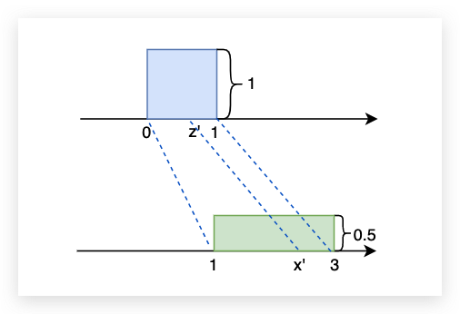  

下面我们看一个更加一般的例子，假设上面的z和x的分布都是无规律的。我们还可以写出z和x之间的变化规律吗？答案是可以的。这里用到了一个极限的概念，下面用李宏毅老师课上的PPT来进行解答（当$\Delta x$足够小的时候就可以将不规则曲线看做是面积，于是就有了PPT上的公式推导）。

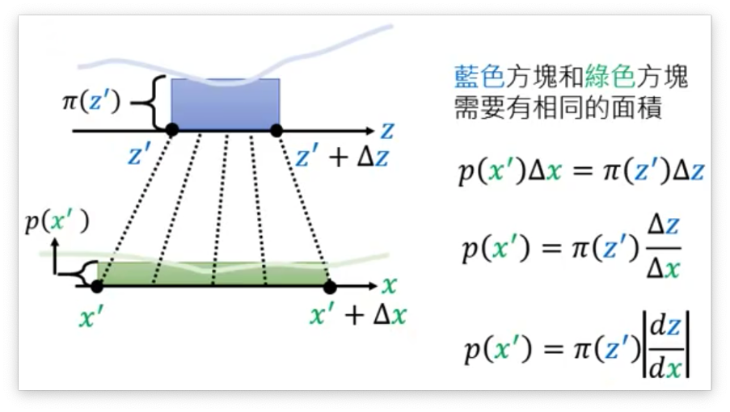  

上面说的是一维的情况，对于二维的情况我们也可以用类似的极限思想得到如下的公式：

$$
p\left(x^{\prime}\right)\left|\operatorname{det}\left[\begin{array}{ll}
\Delta x_{11} & \Delta x_{21} \\
\Delta x_{12} & \Delta x_{22}
\end{array}\right]\right|=\pi\left(z^{\prime}\right) \Delta z_{1} \Delta z_{2}
$$

下面我们对上式进行一定的推导，推导过程如下就可以得到最终的结果：

$$
\begin{aligned}
&p\left(x^{\prime}\right)\left|\operatorname{det}\left[\begin{array}{ll}
\Delta x_{11} & \Delta x_{21} \\
\Delta x_{12} & \Delta x_{22}
\end{array}\right]\right|=\pi\left(z^{\prime}\right) \Delta z_{1} \Delta z_{2} \quad \mathrm{x}=f(z) \\
&p\left(x^{\prime}\right)\left|\frac{1}{\Delta z_{1} \Delta z_{2}} \operatorname{det}\left[\begin{array}{ll}
\Delta x_{11} & \Delta x_{21} \\
\Delta x_{12} & \Delta x_{22}
\end{array}\right]\right|=\pi\left(z^{\prime}\right) \\
&p\left(x^{\prime}\right)\left|\operatorname{det}\left[\begin{array}{ll}
\Delta x_{11} / \Delta z_{1} & \Delta x_{21} / \Delta z_{1} \\
\Delta x_{12} / \Delta z_{2} & \Delta x_{22} / \Delta z_{2}
\end{array}\right]\right|=\pi\left(z^{\prime}\right) \\
&p\left(x^{\prime}\right)\left|\operatorname{det}\left[\begin{array}{ll}
\partial x_{1} / \partial z_{1} & \partial x_{2} / \partial z_{1} \\
\partial x_{1} / \partial z_{2} & \partial x_{2} / \partial z_{2}
\end{array}\right]\right|=\pi\left(z^{\prime}\right) \\
&p\left(x^{\prime}\right)\left|\operatorname{det}\left[\begin{array}{ll}
\partial x_{1} / \partial z_{1} & \partial x_{1} / \partial z_{2} \\
\partial x_{2} / \partial z_{1} & \partial x_{2} / \partial z_{2}
\end{array}\right]\right|=\pi\left(z^{\prime}\right) \\
&p\left(x^{\prime}\right)\left|\operatorname{det}\left(J_{f}\right)\right|=\pi\left(z^{\prime}\right) \quad p\left(x^{\prime}\right)=\pi\left(z^{\prime}\right)\left|\frac{1}{\operatorname{det}\left(J_{f}\right)}\right|
\end{aligned}
$$

所以最后我们就可以发现，$p(x)$ 可以有 $z(x)$ 除以 $f$ 的 Jacobian矩阵的行列式的绝对值得到。

## Flowed-based Model 

好的下面我们首先回头看Generator的优化目标：

$$
\begin{equation}
G^{*}=\arg \max _{G} \sum_{i=1}^{m} \log p_{G}\left(x^{i}\right)
\end{equation}
$$

现在我们知道了:

$$
\begin{array}{r}
p_{G}\left(x^{i}\right)=\pi\left(z^{i}\right)\left|\operatorname{det}_{\circ}\left(J_{G^{-1}}\right)\right| \\
Z^{i}=G^{-1}\left(x^{i}\right)
\end{array}
$$

带入到Generator的优化目标中可得：

$$
\log _{6}\left(x^{i}\right)=\log \pi\left(G^{-1}\left(x^{i}\right)\right)+\log \mid \operatorname{det}(J_{G^{-1}})|
$$

一切看起来很美好，但是计算上面的式子也是需要一定的条件的：

1. 你需要能够计算$J_G$
2. 你的 $G$ 必须是可逆的才行

上面的两个现在条件就决定了 $G$ 的结构一定不能很复杂，为了优化Flow-based 模型的表达能力。所以Flow-based的模型就是使用了很多 $G$ 组合起来，这样就是为什么要叫做Flow的原因。

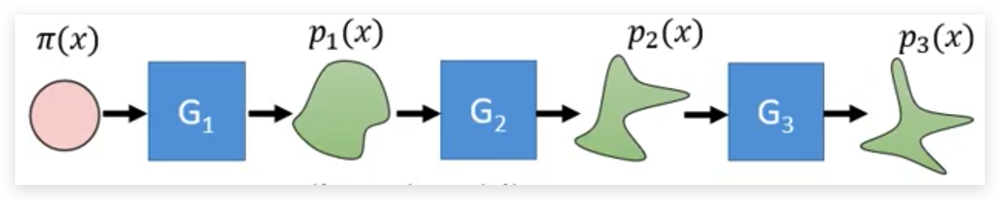  

### 如何训练

虽然我们有很多个$G_i$作为生成器，但是其实我们在进行训练的时候只需要把所有的$G_i$都看做一个大的$G$。 对于一个图像生成的任务来说，我们一般都是训练 $G^{-1}$ 把它训练好了之后反过来就可以用作图像生成了。 

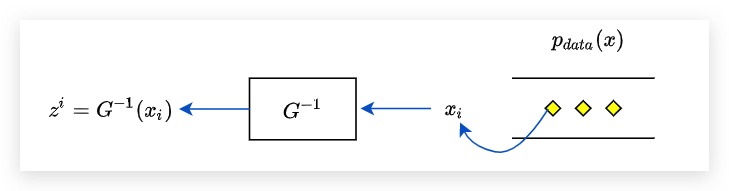  

### Coupling Layer 

前面已经说到了，我们的G需要有一定的限制，首先它要方便去计算Jacobian矩阵，然后它还需要是可逆的，Coupling Layer就是满足这样条件的Generator。它的结构就如下所示：

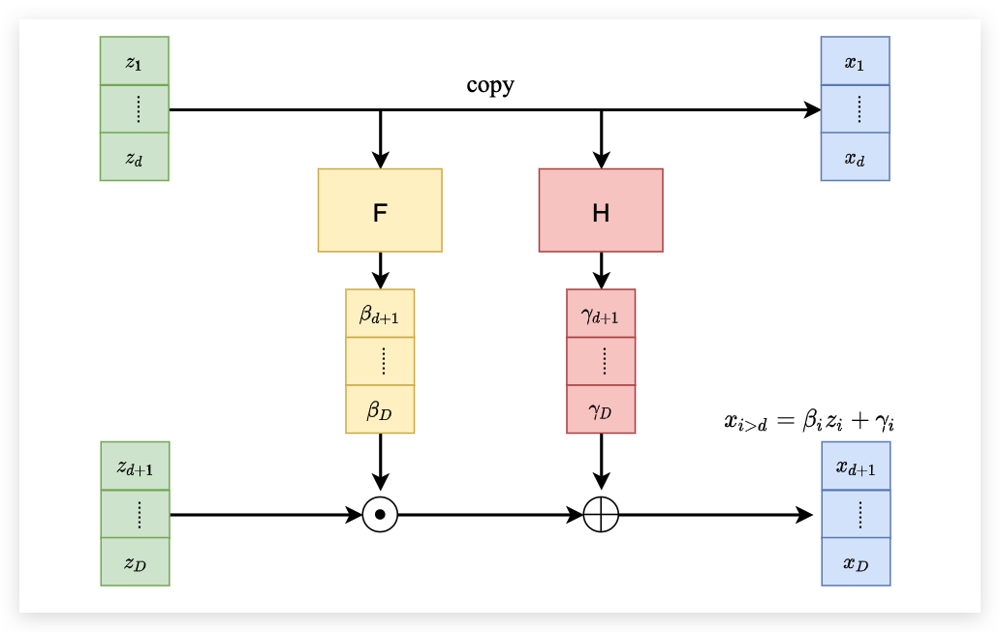  

首先将输入分为两个部分，第一个部分直接不动的移动到右边。同时上面的部分会经过一个F函数和一个H函数，分别和下面的部分进行点积和点加后作为下面右边的部分。 下面来看一看这个矩阵是如何计算Jacobian矩阵的和为什么可逆。

首先看一下为什么是可逆的，现在我们需要通过 $x$ 求解 $z$ 那么可以发现 $z_1$ 到 $z_d$ 的部分就等于 $x_1$ 到 $x_d$。有了 $z_1$ 到 $z_d$ 之后我们就可以直接计算出 $\beta$ 和 $\gamma$ 。 那么后面将 $x_{d+1}$ 到 $x_{D}$ 减去 $\gamma$ 之后再除以 $\gamma$ 就可以得到 $z_{d+1}$ 到 $z_D$ 了。 这样我们就完成了网络逆向的过程。

Coupling Layer的Jacobian计算可以用下面的一张图来说明：

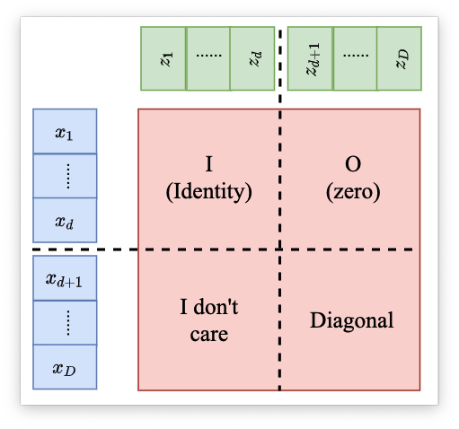  

可以发现 Jacobian 矩阵的行列式只与右下角的有关。右下角的 Jacobian矩阵 经过计算之后可以发现是一个对角矩阵。其他部分的导数都为0，所以是一个对角矩阵。那么这个矩阵的Jacobian的计算公式就如下：

$$
\begin{aligned}
&\operatorname{det}\left(J_{G}\right) 
&=\frac{\partial x_{d+1}}{\partial z_{d+1}} \frac{\partial x_{d+2}}{\partial z_{d+2}} \cdots \frac{\partial x_{\mathrm{D}}}{\partial z_{\mathrm{D}}}
\end{aligned}
$$

把 Coupling Layer 叠加起来就可以获得一个完整的Generator：

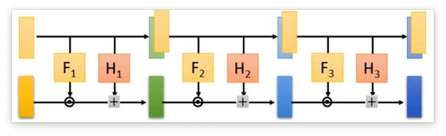  

但是在叠加的时候需要用一些手段，因为我们可以发现如果直接叠加的话，那么上面部分一直是不变的，从直觉上就感觉很不好。 所以在叠加的时候，就将Coupling Layer反向叠加起来。

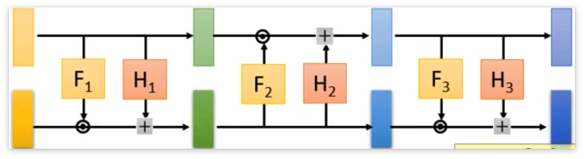  

到这里经典的flow思想就已经介绍完了，其他还有一些经典的flow模型看后面再去介绍

