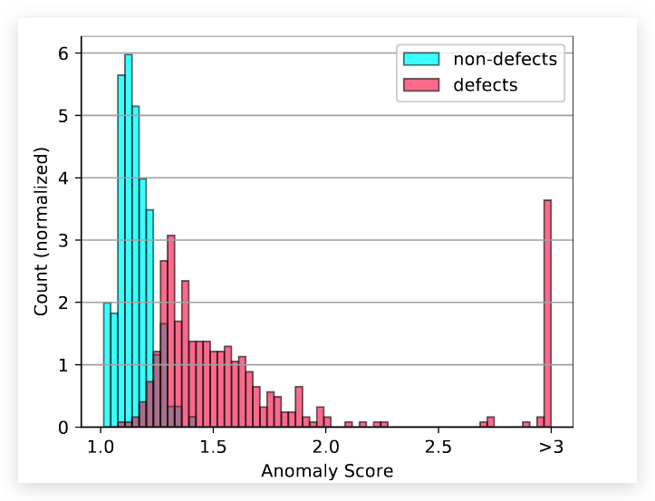

# DifferNet：基于标准流的半监督异常检测

## 论文简介


本篇论文提出了一种基于 normalize flow（标准流）的半监督异常检测算法。 Flow是一种效果类似 GAN 的算法，但是要比GAN更加好训练。DifferNet的主要思想是首先用CNN进行特征提取，然后再用 `Normalize Flow` 进行特征估计。他的核心思路如下图所示：

  

DifferNet会根据训练数据去估计出一个分布，正常数据会落入到分布数值较大，异常得分较低的区域，异常数据会落入到异常得分较高的区域。同时 Differnet 可以通过将`似然损失`反向传播后得到的`梯度映射`来识别缺陷区域。 **这篇文章主要还是聚焦于异常样本检测而不是异常样本定位。**

## 关键技术

  

上图展示了DiiferNet的基本流程，首先为了提取多尺度的特征和让模型训练出来更加的鲁棒，会先对图像进行缩放和旋转等变换，然后会送入到一个特征提取器当中。这个特征提取器选择的AlexNet，本个工作也尝试了其他更加复杂的网络比如Vgg和Resnet但是发现效果都差不多，所以就选择了更加简单的AlexNet（剃刀原则）。将三个不同大小的图像提取了特征之后将这些特征concat起来送入到 normalizeing flow (NF) 模块当中通过极大似然训练的方式得到图像的特征密度估计。

### Normalizing Flow 

Normalizing flow 通过仿射变换的方式完成图像从特征空间到隐空间的双向变换。特征会被转换为隐空间中的一个正态分布 $z$, 其中 $p_{Z}(z)$ 为 $z$ 的概率密度函数。

Different中使用的Normalizing flow结构是 Real-NVP 中梯度的coupling layer结构。这个结构 $f_{NF}$ 是由很多个block组成的，每个block的结构如下所示：

  

每一个block在开始之前首先会对特征进行一个预定义的随机化，这可以让每一个维度可以影响到其他的位置。为了应用scale和shift，$y_{in}$ 被分为了两个部分 $y_{in,1}$ 和 $y_{in,2}$。scale和shift的操作可以用如下公式表示：

$$
\begin{array}{r}
y_{\text {out }, 2}=y_{\text {in }, 2} \odot e^{s_{1}\left(y_{\text {in }, 1}\right)}+t_{1}\left(y_{\text {in }, 1}\right) \\
y_{\text {out }, 1}=y_{\text {in }, 1} \odot e^{s_{2}\left(y_{\text {out }, 2}\right)}+t_{2}\left(y_{\text {out }, 2}\right)
\end{array}
$$

为了保持非零的特性，在进行缩放之前会使用一个指数函数。 内部的函数 $s$ 和 $t$ 可以是任意的函数，在这篇论文里面 $s$ 和 $t$ 是一个全连接网络。 同时作者在这里还对s使用了`soft-clamping`去确保模型的稳定性。 `soft-clamping` 的定义如下：

$$
\sigma_{\alpha}(h)=\frac{2 \alpha}{\pi} \arctan \frac{h}{\alpha}
$$

对于最后一层的$s$, 为了防止组件的数字过大，$s(y)$ 会被限制到$(-\alpha, \alpha)$。

### 训练

训练的主要目的是让$f_{NF}$能够学习到参数，参照change of variables的公式，以及在介绍 flow-based 生成器的文章中可以比较自然的得出 DifferNet 的损失函数如下所示：

$$
\begin{array}{r}
\log p_{Y}(y)=\log p_{Z}(z)+\log \left|\operatorname{det} \frac{\partial z}{\partial y}\right| \\
\mathcal{L}(y)=\frac{\|z\|_{2}^{2}}{2}-\log \left|\operatorname{det} \frac{\partial z}{\partial y}\right|
\end{array}
$$

如果单看 $\mathcal{L}(y)$ 的话，我们可能会认为这个损失函数会让 $z$ 无限趋近于0。 但是因为后面还有一个 Jacobian 矩阵，如果 $||z||$ 趋近于0，那么 Jacobian 矩阵的行列式就会趋近于无穷。所以不需要担心这个损失函数会让模型输出的全为0。 但是 $||z||$ 的大小还是会被压制。

### 打分函数

异常检测中很重要的一件事情就是要得到该图像的异常得分。 DifferNet 的打分函数也是比较简单粗暴，就是对网络的输出取一个-log（其实是一个似然估计），然后取里面的平均值作为异常得分。如果异常得分大于某个阈值就认定为异常图像，如果小于某个阈值就认为是一个正常图像。打分函数的定义如下：

$$
\tau(x)=\mathbb{E}_{T_{i} \in \mathcal{T}}\left[-\log p_{Z}\left(f_{\mathrm{NF}}\left(f_{\mathrm{ex}}\left(T_{i}(x)\right)\right)\right)\right]
$$

  


### 定位

DifferNet 并没有针对图像的位置信息进行优化，但是却可以对异常的区域进行定位。 主要的思路就是将Loss反向传播后的在图像上的梯度作为 Anomaly map。其主要代码如下：

```python 
emb = model(inputs)
loss = get_loss(emb, model.nf.jacobian(run_forward=False))
loss.backward()

grad = inputs.grad.view(-1, c.n_transforms_test, *inputs.shape[-3:])
grad = grad[labels > 0]
```

## 总结

这篇论文中提出了DifferNet这个异常检测的框架，主要的思路是用 Normalizing flow 的方法来进行多尺度特征密度估计。 使用损失函数的似然估计作为异常得分，使用图像的梯度作为Anomaly map。这篇应该算是第一篇把 Normalizing flow 用在异常检测领域的文章。但是使用AlexNet作为特征提取器明显会让图像损失掉多尺度的信息，如果能保留多尺度的信息那么效果应该会更好，下一篇Cflow就对这个缺点进行了优化。


